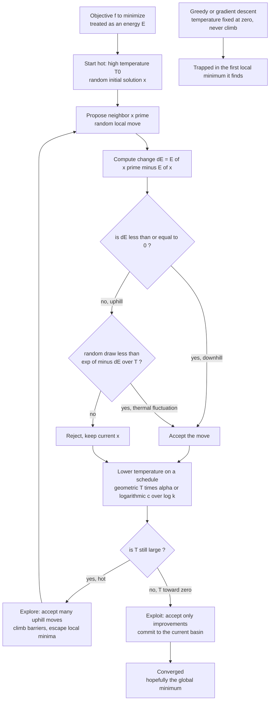

# 🧊 Simulated Annealing and Global Optimization

> [!abstract] TL;DR
> **Simulated annealing (SA)** turns the metallurgical craft of slowly cooling a metal into a general-purpose **global optimization** algorithm: treat the objective you want to minimize as an **energy**, run a **Metropolis** MCMC sampler on it, and lower a **temperature** $T$ on a schedule — accepting *uphill* moves with probability $e^{-\Delta E/T}$ while hot so the search escapes local minima, then committing to a deep basin as it cools. With a slow-enough (logarithmic) schedule it *provably* reaches the global optimum; in practice a cheap geometric schedule makes it a simple, gradient-free workhorse for rugged, combinatorial, and black-box problems (TSP, scheduling, VLSI layout, protein folding).

---

## Intuition

**Analogy:** To grow a flawless crystal, a metallurgist does not just cool a hot ingot as fast as possible. They **heat** the material until its atoms wander freely, then cool it *agonizingly slowly* — **annealing** it — so the atoms have time to settle into the perfect low-energy lattice. Rush the cooling (a **quench**) and you freeze in a mess of dislocations and internal stress: a high-energy, defective solid. Patience buys perfection.

Simulated annealing steals this recipe wholesale for hard optimization. Treat the quantity you want to minimize as an **energy**, start **hot** — accepting even *bad* moves so the search can roam the whole landscape and climb out of shallow traps — and gradually **cool** so the search becomes choosier and settles, *hopefully*, into the **global** minimum rather than the first ditch it stumbles into. It is a physics metaphor turned into one of the most versatile optimization algorithms ever written: it needs nothing but an objective and a way to propose a neighboring solution, yet it routinely cracks problems where greedy and gradient descent freeze solid.

---

## How It Works

### Core Mechanics

SA (Kirkpatrick, Gelatt & Vecchi 1983; independently Černý 1985) is **Metropolis MCMC run on the objective-as-energy while the temperature is lowered**. Everything follows from the Boltzmann rule $p(x) \propto e^{-E(x)/T}$: at temperature $T$, states differing in energy by more than about $T$ are effectively unreachable, while gaps smaller than $T$ are freely crossed.

The loop:

1. **Initialise** a solution $x$ (any random configuration) and a **high** temperature $T_0$.
2. **Propose** a random neighbour $x'$ — a small local perturbation (flip a bit, swap two elements, jitter a coordinate, reverse a tour segment).
3. **Score** the change $\Delta E = E(x') - E(x)$.
4. **Accept** by the **Metropolis rule**:
   - if $\Delta E \le 0$ (the move improves) — **always** accept it;
   - if $\Delta E > 0$ (the move worsens) — accept it *anyway* with probability $e^{-\Delta E / T}$.
5. **Cool**: lower $T$ according to a schedule, then go to step 2.

The single line that makes SA special is *"accept uphill moves with probability $e^{-\Delta E/T}$."* That is a **thermal fluctuation**: at high $T$ almost any worsening is tolerated, so the search behaves like a free random walk that can climb energy **barriers** and leave a local minimum. As $T$ falls the exponential punishes uphill moves ever more harshly; at $T \to 0$ the rule collapses to *"accept only improvements"* — i.e. **greedy descent**. So SA is a **continuum between free exploration and greedy exploitation**, dialled by temperature.

**Why it escapes local minima — the crux.** Greedy and gradient descent are strictly downhill: they halt at the *first* local minimum they reach, however shallow, because every escape route points uphill. SA's willingness to *temporarily* accept a worse solution is exactly what lets it climb out of a shallow basin, hop over the ridge, and discover a deeper one on the far side. **High $T$ = broad exploration** (barriers are cheap, traps are escapable); **low $T$ = fine local refinement** (barriers are prohibitive, so the search polishes whatever basin it is in). Cooling slowly makes the search *find the right basin before it commits to it* — the exploration-to-exploitation transition played out over a run.

**The cooling schedule is the critical design choice.** Three families:

- **Geometric / exponential:** $T_{k+1} = \alpha T_k$ with $\alpha \in (0.90, 0.999)$. Cheap, ubiquitous, no guarantee — the practitioner's default.
- **Logarithmic:** $T_k \ge c/\log(k+2)$. The Geman–Geman schedule for which SA **provably** converges (in probability) to the **global** optimum — but so slow it is essentially never run verbatim.
- **Adaptive / reheating:** cool faster when the chain looks equilibrated, slower when it is still moving; *reheat* if it stalls in a bad basin.

Too-fast cooling is **quenching** — the search freezes into whatever local minimum it happened to be near (the brittle steel). Too-slow cooling finds the right answer but wastes enormous compute. That tension **is** the theory-vs-practice gap: the logarithmic schedule is a rigorous guarantee no one can afford, and real annealing uses a fast geometric schedule that yields good-but-unguaranteed solutions.

**Global-convergence guarantee.** The formal result (Geman & Geman 1984; Hajek 1988) is that with $T_k \propto 1/\log k$ the inhomogeneous Markov chain SA induces has, as $k \to \infty$, all its probability mass on the set of global minima. It is a beautiful bridge from statistical physics to a *correctness proof* for an optimizer — and a cautionary tale, because the constant $c$ must exceed the deepest barrier and the run-time is astronomical. In practice SA is a **heuristic**: fast schedules, no guarantee, excellent empirical results.

**Strengths — why SA is a go-to.** It is **general**: it needs only (i) an objective to evaluate and (ii) a neighbour-proposal move — **no gradients**, so it works on **discrete/combinatorial** and **continuous** problems alike, on non-differentiable and black-box objectives, and on rugged landscapes riddled with local optima. It is trivial to implement, escapes local optima, and is the classic weapon for **combinatorial** optimization (traveling salesman, scheduling, VLSI placement/routing, graph problems — many of them [[Time_Complexity_Classes|NP-hard]]).

**Limitations and relatives.** SA is **slow** (it may need millions of objective evaluations), **sensitive** to the schedule and the neighbour definition, and **wasteful on smooth differentiable problems** where gradient methods like [[Gradient_Descent]] converge far faster. It sits in a whole family of physics-inspired global optimizers: **parallel tempering / replica exchange** (run several temperatures at once and swap configurations — usually beats a single SA chain), **genetic algorithms**, **basin-hopping**, and **quantum annealing** (D-Wave hardware, which exploits quantum *tunnelling* through barriers instead of thermal *hopping* over them).

**Ties to sampling and to ML.** SA is literally **Metropolis MCMC plus a cooling schedule**, so it connects directly to [[The_Metropolis_Algorithm_and_MCMC]] and, more broadly, to the sibling notes *Metropolis_Hastings_and_Detailed_Balance* and *MCMC_Sampling_in_Machine_Learning*. The same annealing idea powers **deterministic annealing** for clustering, **annealed importance sampling** for partition-function / free-energy estimation (see the sibling *Free_Energy_Estimation_and_Thermodynamic_Integration*), and the modern view that **SGD noise acts as an effective temperature** and **learning-rate decay is a form of annealing** — the through-line developed in the sibling [[Temperature_and_Annealing_in_Learning]] (this note is the specific *algorithm*; that note is the broad *temperature* principle). The rugged objective SA is built to conquer is the same **spin-glass** energy landscape studied for neural networks in the sibling *Spin_Glasses_and_the_Energy_Landscape_of_Networks*.

### Flow / Architecture



---

## Key Concepts

**Secondary (intuition-level):** A blacksmith heats metal and cools it *slowly* so it settles into a strong, clean structure; cool it too fast and it locks in cracks. Simulated annealing does the same to a math problem: it calls the thing you want to make small an "energy," starts "hot" so it will try wild moves and escape dead ends, and slowly "cools" so it settles into the *best* valley instead of the *nearest* one. That willingness to occasionally accept a worse move is the whole trick — it is how the search climbs out of traps.

**Undergraduate (mechanics-level):** The Metropolis acceptance rule $\min\!\big(1, e^{-\Delta E/T}\big)$; SA as Metropolis MCMC with a decreasing $T$; the neighbour/proposal move that defines the search graph (bit-flip, coordinate jitter, 2-opt swap); local vs global minima and **barrier crossing** driven by thermal fluctuations; the $T\to 0$ **greedy** limit that gets stuck; geometric schedules $T_{k+1}=\alpha T_k$ vs logarithmic; **quenching** (too fast) vs proper annealing; calibrating $T_0$ so the initial acceptance rate is high (near 0.8).

**Graduate (structure-level):** SA as an **inhomogeneous Markov chain** whose transition kernel satisfies detailed balance *at each fixed $T$* w.r.t. the Gibbs measure $\propto e^{-E/T}$; the Geman–Geman / Hajek **logarithmic-schedule convergence-in-probability** theorem and the barrier-depth condition on the constant $c$; the impracticality gap and its resolution by geometric schedules; **parallel tempering / replica exchange** as a way to fix single-chain SA's slow mixing; **quantum annealing** and the transverse-field / tunnelling escape mechanism vs thermal hopping; **deterministic annealing** as tracking the global free-energy minimum through phase transitions as $T$ falls (Rose); the **SDE / Langevin** view in which SGD samples $\propto e^{-L(\theta)/T}$ with $T \propto \eta/B$, making learning-rate decay a continuous anneal; **annealed importance sampling** as thermodynamic integration for intractable partition functions.

---

## Python Demo

```python
# Simulated annealing on a COMBINATORIAL problem: the Traveling Salesman Problem.
# We minimize total tour length ("energy") over city orderings by proposing 2-opt
# moves and accepting them with the Metropolis rule while COOLING the temperature.
# We show: (1) a random tour -> a near-optimal SA tour; (2) greedy 2-opt (T=0)
# getting STUCK in a worse local optimum; (3) the cooling-schedule effect:
# fast cooling quenches to a bad tour, slow cooling reaches near-optimal.
import numpy as np
import matplotlib.pyplot as plt

rng = np.random.default_rng(7)

# ---- A TSP instance: N cities on the unit square; energy = closed-loop length ----
N = 60
cities = rng.random((N, 2))

def tour_length(order):
    pts = cities[order]
    seg = pts - np.roll(pts, -1, axis=0)      # each city -> next, last wraps to first
    return np.sqrt((seg ** 2).sum(axis=1)).sum()

def two_opt(order, i, j):
    new = order.copy()
    new[i:j + 1] = order[i:j + 1][::-1]       # reverse the segment (a 2-opt move)
    return new

# ---- Simulated annealing with a geometric hot->cold schedule ----
def anneal_tsp(T0, T_end, n_steps, rng):
    order = rng.permutation(N)
    E = tour_length(order)
    best_order, best_E = order.copy(), E
    hist, temps = np.empty(n_steps), np.empty(n_steps)
    for k in range(n_steps):
        T = T0 * (T_end / T0) ** (k / max(n_steps - 1, 1))   # geometric cool
        i, j = np.sort(rng.integers(0, N, size=2))
        if i != j:
            cand = two_opt(order, i, j)
            dE = tour_length(cand) - E
            # accept downhill always; accept uphill with prob exp(-dE/T)
            if dE <= 0 or rng.random() < np.exp(-dE / T):
                order, E = cand, dE + E
                if E < best_E:
                    best_order, best_E = order.copy(), E
        hist[k], temps[k] = E, T
    return best_order, best_E, hist, temps

# ---- Greedy 2-opt == the T -> 0 limit: only accept improving moves -> STUCK ----
def greedy_tsp(n_steps, rng):
    order = rng.permutation(N)
    E = tour_length(order)
    hist = np.empty(n_steps)
    for k in range(n_steps):
        i, j = np.sort(rng.integers(0, N, size=2))
        if i != j:
            cand = two_opt(order, i, j)
            dE = tour_length(cand) - E
            if dE < 0:                          # never climb
                order, E = cand, E + dE
        hist[k] = E
    return order, E, hist

n_steps = 40_000
sa_order, sa_E, sa_hist, sa_temps = anneal_tsp(T0=1.0, T_end=1e-3, n_steps=n_steps, rng=rng)
init_order = rng.permutation(N)                 # a fresh random tour to display
gd_order, gd_E, gd_hist = greedy_tsp(n_steps, rng)

print(f"random tour length   : {tour_length(init_order):6.3f}")
print(f"greedy 2-opt (T=0)   : {gd_E:6.3f}   <- stuck in a local optimum")
print(f"simulated annealing  : {sa_E:6.3f}   <- near-global optimum")

# ---- Cooling-schedule effect: sweep schedule length (fast vs slow cooling) ----
lengths = [500, 2_000, 8_000, 20_000, 60_000]
final_by_schedule = []
for L in lengths:
    trials = [anneal_tsp(1.0, 1e-3, L, rng)[1] for _ in range(5)]
    final_by_schedule.append(np.mean(trials))

# ---- Plots ----
def draw_tour(ax, order, title, color):
    loop = np.append(order, order[0])
    ax.plot(cities[loop, 0], cities[loop, 1], "-o", color=color, ms=3, lw=1)
    ax.set_title(title); ax.set_xticks([]); ax.set_yticks([])

fig, ax = plt.subplots(2, 3, figsize=(16, 9))
draw_tour(ax[0, 0], init_order, f"Random tour  (len={tour_length(init_order):.2f})", "gray")
draw_tour(ax[0, 1], gd_order, f"Greedy T=0  (len={gd_E:.2f}, stuck)", "darkorange")
draw_tour(ax[0, 2], sa_order, f"Simulated annealing  (len={sa_E:.2f})", "seagreen")

ax[1, 0].plot(sa_hist, color="seagreen", lw=0.8, label="annealing")
ax[1, 0].axhline(gd_E, ls="--", color="darkorange", label="greedy final (stuck)")
ax[1, 0].set_title("Convergence: tour length vs iteration")
ax[1, 0].set_xlabel("iteration"); ax[1, 0].set_ylabel("tour length (energy)"); ax[1, 0].legend()

ax[1, 1].plot(sa_temps, color="firebrick", lw=2)
ax[1, 1].set_yscale("log")
ax[1, 1].set_title("Cooling schedule: hot (explore) -> cold (commit)")
ax[1, 1].set_xlabel("iteration"); ax[1, 1].set_ylabel("temperature T (log)")

ax[1, 2].plot(lengths, final_by_schedule, "o-", color="navy")
ax[1, 2].set_xscale("log")
ax[1, 2].set_title("Schedule effect: fast cooling -> worse, slow -> near-optimal")
ax[1, 2].set_xlabel("schedule length  (short = fast cooling)")
ax[1, 2].set_ylabel("final tour length")
plt.tight_layout()
plt.savefig("simulated_annealing_tsp.png", dpi=120)
```

The three tours across the top tell the whole story visually: a tangled random route, a greedy 2-opt route that has removed the obvious crossings but frozen into a clearly sub-optimal local optimum, and the SA route that is smooth and short. The convergence panel shows the annealer's tour length *rising and falling* early on (it accepts worse tours while hot) before descending well below where greedy stalls. The temperature panel shows the geometric hot-to-cold schedule, and the final panel makes the cooling-schedule trade-off quantitative — short schedules (fast cooling) **quench** into poor tours, long schedules (slow cooling) reach near-optimal — the algorithmic echo of a quenched-vs-annealed metal.

---

## Real-World Applications

- **VLSI placement and routing.** SA's original killer app: laying out and wiring millions of transistors is a brutal combinatorial optimization with a rugged cost landscape; annealing-based placers were an industry standard and remain a benchmark.
- **Traveling salesman, vehicle routing, scheduling.** SA is a classic, easy-to-code baseline for routing fleets, sequencing jobs on machines, timetabling exams/classes, and crew/shift assignment — problems that are [[Integer_Programming|integer/combinatorial]] and often [[Time_Complexity_Classes|NP-hard]].
- **Protein folding and molecular conformation.** Searching the astronomically rugged energy surface of a folded protein or a docked ligand for its low-energy structure is a natural fit; SA and its tempering variants are staples of structure prediction and computational chemistry.
- **Image processing (Geman–Geman MAP).** Maximum-a-posteriori restoration of noisy images via a Markov-random-field prior is minimized with a Gibbs sampler under an annealing schedule — the paper that supplied SA's convergence proof.
- **Continuous global optimization and hyperparameter search.** For non-convex, multimodal, or black-box objectives (including model [[Hyperparameter_Tuning]]) where gradients are unavailable or unreliable, SA and basin-hopping are common global-search tools (e.g. `scipy.optimize.dual_annealing`, `basinhopping`).
- **Operations research and finance.** Facility location, network design, portfolio construction under non-convex constraints, and other messy real-world objective landscapes where exact methods do not scale.

---

## Common Pitfalls

- **Quenching by cooling too fast.** The single most common failure: too aggressive an $\alpha$ or too few steps freezes the search in a poor local optimum. If results are inconsistent across seeds and each run is quick, *slow the schedule* or add reheating.
- **Mis-scaled initial temperature.** $T$ only matters relative to the scale of $\Delta E$. Guessing $T_0$ blindly gives near-100% acceptance (a pure random walk that never converges) or near-0% (greedy from the start). Calibrate $T_0$ from a batch of random moves so the initial acceptance rate is high, around 0.8.
- **A bad neighbour move.** The proposal defines the search graph. Moves that are too large make every step a big jump (nothing is local); too small make barriers uncrossable. For TSP, single-swap moves mix far worse than **2-opt** segment reversals — the move matters as much as the schedule.
- **Believing the logarithmic guarantee is usable.** $T_k \propto 1/\log k$ provably finds the global optimum but is astronomically slow; treat SA as a heuristic, not a solver with a runtime guarantee.
- **Recomputing the full objective every step.** Naively re-evaluating $E$ over the whole solution is wasteful; exploit **incremental $\Delta E$** (only the edges/terms a local move changes) for orders-of-magnitude speedups on large instances.
- **Numerical overflow in the accept test.** For small $T$, $e^{-\Delta E/T}$ underflows; guard the exponent or compute in log-space, and always accept downhill moves *before* evaluating the exponential.
- **Using SA where gradients are available and cheap.** On smooth, differentiable, (near-)convex objectives, [[Gradient_Descent]] and quasi-Newton methods crush SA; reserve annealing for rugged, combinatorial, or black-box landscapes.

---

## Related Concepts

- [[Temperature_and_Annealing_in_Learning]] — the broad *temperature* principle across ML; this note is the specific SA *algorithm* and its global-optimization theory.
- [[The_Metropolis_Algorithm_and_MCMC]] — the accept/reject sampler that SA runs while cooling; SA is Metropolis plus a schedule.
- [[The_Boltzmann_Distribution_in_Learning]] — the $p \propto e^{-E/T}$ law whose $\Delta E$ and $T$ define the acceptance rule.
- [[The_Ising_Model_and_Statistical_Physics]] — the archetypal Boltzmann energy landscape on which annealing schedules were first studied.
- [[Energy_Based_Models]] — the objective-as-energy viewpoint SA operationalizes for optimization.
- [[Hopfield_Networks_and_Associative_Memory]] — a discrete energy landscape whose spurious local minima motivate thermal escape.
- [[Partition_Functions_and_Free_Energy_in_ML]] — the $Z$ and free energy that annealing and annealed importance sampling estimate.
- [[Free_Energy_Minimization_and_Variational_Principles]] — the free-energy landscape that deterministic annealing tracks through phase transitions.
- [[Stochastic_Differential_Equations_and_Langevin]] — Langevin dynamics, the continuous-time cousin linking SGD noise to an effective temperature.
- [[Monte_Carlo_Integration]] — the Monte Carlo sampling family SA belongs to.
- [[Root_Finding_and_Optimization]] — where SA sits among global-optimization methods.
- [[Gradient_Descent]] — the greedy ($T=0$) baseline SA improves on by allowing uphill moves.
- [[SGD_and_Variants]] — stochastic-gradient noise as an implicit training temperature, with learning-rate decay as annealing.
- [[Integer_Programming]] — the combinatorial/discrete optimization problems SA is a classic heuristic for.
- [[Time_Complexity_Classes]] — the NP-hardness that makes exact methods intractable and heuristics like SA attractive.
- [[Hyperparameter_Tuning]] — black-box model search where annealing-style global optimizers are used.
- [[Classical_Statistical_Mechanics]] — the canonical ensemble and physical annealing the algorithm borrows from.

---

## Review Questions

1. **(Conceptual)** SA accepts a *worse* solution with probability $e^{-\Delta E/T}$. Explain precisely why this apparently self-defeating rule is exactly what lets SA find *better* optima than greedy descent, and describe what changes as $T$ falls from large to zero. What does the algorithm reduce to at $T = 0$?
2. **(Scenario)** You are annealing a chip-placement objective; solutions vary wildly across seeds, several are clearly poor, and each run finishes quickly. Diagnose the likely cause in schedule terms, name two concrete changes you would make, and state the compute cost you are trading for reliability. Separately, how would you set $T_0$ for a brand-new objective whose energy scale you do not know?
3. **(Trade-off)** Compare SA, gradient descent, and parallel tempering for (a) minimizing a smooth convex loss over $\mathbb{R}^{10^6}$ and (b) minimizing tour length for a 500-city TSP. For each problem say which you would pick and why, and explain the specific weakness of the wrong choices. Where does the logarithmic-schedule *global-convergence guarantee* fit into your reasoning, and why does it rarely change practice?

---

## Sources

- S. Kirkpatrick, C. D. Gelatt, M. P. Vecchi, "Optimization by Simulated Annealing," *Science* 220:671–680 (1983). [link](https://doi.org/10.1126/science.220.4598.671)
- V. Černý, "Thermodynamical Approach to the Traveling Salesman Problem: An Efficient Simulation Algorithm," *J. Optimization Theory and Applications* 45:41–51 (1985). [link](https://doi.org/10.1007/BF00940812)
- S. Geman, D. Geman, "Stochastic Relaxation, Gibbs Distributions, and the Bayesian Restoration of Images," *IEEE TPAMI* 6:721–741 (1984). [link](https://doi.org/10.1109/TPAMI.1984.4767596)
- B. Hajek, "Cooling Schedules for Optimal Annealing," *Mathematics of Operations Research* 13:311–329 (1988). [link](https://doi.org/10.1287/moor.13.2.311)
- N. Metropolis, A. Rosenbluth, M. Rosenbluth, A. Teller, E. Teller, "Equation of State Calculations by Fast Computing Machines," *J. Chemical Physics* 21:1087–1092 (1953). [link](https://doi.org/10.1063/1.1699114)

---

#statistical-mechanics #machine-learning #simulated-annealing #global-optimization #metaheuristics
