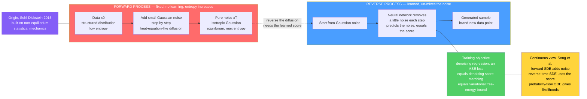

# 🌫️ Diffusion Models as Non-Equilibrium Thermodynamics

> [!abstract] TL;DR
> **Diffusion models** — the engines behind **Stable Diffusion, DALL·E 2, Imagen, Midjourney, and Sora** — generate data by learning to **reverse a gradual noising process**, and they were derived *directly* from **non-equilibrium statistical mechanics** (Sohl-Dickstein et al., 2015). A fixed **forward process** diffuses structured data into pure Gaussian noise — an entropy-increasing, heat-equation-like *approach to equilibrium* ("ink dispersing into water"). A learned **reverse process** denoises that noise back into data ("un-mixing the ink"), made possible by learning the **score** $\nabla_x\log p_t(x)$ — the gradient of the log-density — via **denoising score matching**, then running a **reverse-time Langevin / SDE**. The training loss is a simple, stable **denoising regression** that is simultaneously a **variational free-energy bound** on the data log-likelihood and equals weighted score matching. With state-of-the-art sample quality, easy text conditioning, and no adversarial instability, diffusion dominates image, video, audio, and molecular generation — making it the **deepest and most consequential modern embodiment of the statistical-mechanics ↔ machine-learning correspondence**.

---

## Intuition

**Analogy — FIRST: play the ink-in-water movie backward.** Drop a bead of ink into a glass of clear water and watch it bloom into a formless haze. It is a one-way trip from order to chaos — the concentrated drop spreads until it is uniformly, boringly grey, and the **second law of thermodynamics** insists this can *never* reverse on its own. Entropy only climbs. Now imagine you *filmed* the whole thing and learned to play the movie **backward**. To do that convincingly you would need to know, at every instant, exactly which way each ink molecule had to nudge in order to un-mix — to march back out of the haze and reassemble into the crisp original drop.

**Diffusion models do precisely this.** They **destroy** an image by gradually stirring in Gaussian noise (ink diffusing into water, an entropy-increasing march toward a featureless Gaussian "equilibrium"), and then they **train a neural network to reverse each tiny step** — to nudge noise a little bit closer to data. Run that learned reverse film starting from pure static and a photograph condenses out of the noise. It is **non-equilibrium thermodynamics run in reverse**: the forward diffusion is the irreversible-looking approach to equilibrium, and the reverse process is the (information-requiring) un-mixing that the network *learns* how to perform.

---

## How It Works

### Core Mechanics

**1. Two processes, one fixed and one learned.** A diffusion model is a pair of stochastic processes over $T$ steps (or continuous time). The **forward** process is *fixed* and needs no training; the **reverse** process is *learned*. All the intelligence lives in reversing what the forward process destroyed.

**2. The forward (diffusion) process — the destruction phase.** Start with a clean data point $x_0 \sim p_{\text{data}}$ and repeatedly add a small amount of **Gaussian noise**:
$$q(x_t \mid x_{t-1}) = \mathcal N\!\big(x_t;\; \sqrt{1-\beta_t}\,x_{t-1},\; \beta_t I\big),$$
with a small variance schedule $\beta_1<\dots<\beta_T$. Composing these steps (they are all Gaussian) gives a closed form that lets you jump straight to any level:
$$q(x_t \mid x_0) = \mathcal N\!\big(x_t;\; \sqrt{\bar\alpha_t}\,x_0,\; (1-\bar\alpha_t) I\big), \qquad \bar\alpha_t = \prod_{s\le t}(1-\beta_s).$$
As $t\to T$, $\bar\alpha_t\to 0$ and the data is scrubbed into an **isotropic Gaussian** $\mathcal N(0,I)$ — a simple, structureless "equilibrium." This is a **discrete diffusion / heat-equation-like process** that *increases entropy* and destroys correlations: the data → noise leg, the ink dispersing into the water. No learning is involved; it is just calibrated forgetting.

**3. The reverse (generative) process — the creation phase.** Sampling means running time **backward**. If we knew the true reverse conditionals $q(x_{t-1}\mid x_t)$ we could start from pure Gaussian noise $x_T\sim\mathcal N(0,I)$ and walk back to data. We do not know them — so we **learn** a parametric approximation
$$p_\theta(x_{t-1}\mid x_t) = \mathcal N\!\big(x_{t-1};\; \mu_\theta(x_t,t),\; \Sigma_\theta(x_t,t)\big),$$
where a neural network (typically a U-Net or transformer) predicts how to **remove a little noise** at each step. Running the chain $x_T\to x_{T-1}\to\dots\to x_0$ transforms noise → data, generating a *new* sample. Reversing a diffusion is the hard part, because it secretly requires the **score** (next point).

**4. The second law and why reversing is subtle.** The forward process is entropy-increasing and *looks* irreversible — that is exactly what the second law describes. Yet the reverse process is possible because the network **learns the conditional structure** needed to run it. Anderson's (1982) theorem makes this precise: a forward stochastic differential equation has an exact **reverse-time SDE**, and the extra ingredient that appears when you reverse time is the **score** $\nabla_x\log p_t(x)$. Information about "which way un-mixes" is not free — it must be paid for by learning the score of the noisy data at every level. The arrow of time is not violated; it is *purchased*.

**5. The score / denoising connection — the mathematical engine.** Training a diffusion model **is** learning the score. For the Gaussian corruption $x_t=\sqrt{\bar\alpha_t}\,x_0+\sqrt{1-\bar\alpha_t}\,\varepsilon$, the score of the noisy marginal is tied to the added noise by Tweedie's identity:
$$\nabla_{x_t}\log q(x_t) = -\frac{\varepsilon}{\sqrt{1-\bar\alpha_t}}.$$
So learning the score is *identical* to **predicting the noise $\varepsilon$** that was added — i.e. **denoising**. This is **denoising score matching** (see [[Score_Matching_and_Score_Based_Models]] and the sibling *Score_Matching_and_Score_Based_Models* companion), and the reverse process runs the learned score through a **reverse-time Langevin / SDE**. The noise schedule $\{\sigma_t\}$ acts as an **annealing / temperature ladder**: sample at high noise first to bridge modes, anneal down to sharpen. The whole apparatus — Langevin dynamics, Fokker–Planck evolution of $p_t$ — is physics; the not-yet-written siblings *Langevin_Dynamics_and_SGLD* and *The_Fokker_Planck_Equation_in_Generative_Modeling* trace those roots.

**6. The training objective — why it is stable and simple.** Ho et al.'s DDPM (2020) reduced the whole thing to a one-line loss: sample a random timestep $t$, corrupt a data point, and regress the network's noise prediction against the true noise,
$$\mathcal L_{\text{simple}} = \mathbb E_{x_0,\,t,\,\varepsilon}\Big[\big\|\varepsilon - \varepsilon_\theta(x_t,t)\big\|^2\Big].$$
This is a plain **MSE denoising regression** — no adversarial game, no discriminator, no mode collapse. Crucially it is not a hack: it is a reweighting of the **variational bound (ELBO)** on the data log-likelihood, which is a **variational free energy** in physics language (see [[Free_Energy_Minimization_and_Variational_Principles]]), and it equals **weighted denoising score matching**. A beautifully grounded objective that is also trivially stable to optimize.

**7. Why diffusion won — and the SDE unification.** Compared to GANs and VAEs, diffusion delivers **high-quality, diverse samples** with **stable training**, a principled likelihood/score framework, and **easy conditioning** (text-to-image via classifier-free guidance). Song et al. (2021) unified the field: the forward process is a **stochastic differential equation** adding noise, the reverse is the corresponding **reverse-time SDE** driven by the score, and a deterministic **probability-flow ODE** shares the same marginals while giving exact likelihoods — connecting DDPM, score matching, and continuous diffusion (foreshadowed by the siblings *The_Forward_and_Reverse_Diffusion_Process* and *Score_SDEs_and_Probability_Flow*). The physics runs even deeper: **fluctuation theorems** and the **Jarzynski equality** relate the work done along non-equilibrium trajectories to free-energy differences (the sibling *Fluctuation_Theorems_and_the_Jarzynski_Equality*), the same non-equilibrium ledger from which Sohl-Dickstein first drew the method.

### Flow / Architecture



---

## Key Concepts

### Secondary Level

- **Destroy, then learn to rebuild.** Diffusion models first *ruin* a picture by slowly mixing in random static until it is pure noise, then train a network to *undo* that ruin one small step at a time.
- **Ink in water, run backward.** The forward "add noise" step is like ink spreading in water — a one-way slide into mush. Generation is that movie played in reverse, which is why you can start from static and end with a photo.
- **New pictures out of static.** Once the network knows how to remove a little noise, you feed it fresh random static and let it denoise repeatedly; a brand-new, never-seen image emerges.
- **This is where AI images come from.** Stable Diffusion, DALL·E, Midjourney, and the Sora video model all work this way — the same denoise-the-static trick.

### Undergraduate Level

- **Forward marginal in closed form:** $q(x_t\mid x_0)=\mathcal N(\sqrt{\bar\alpha_t}\,x_0,\,(1-\bar\alpha_t)I)$ lets you jump to any noise level in one shot; as $t\to T$ the data becomes $\mathcal N(0,I)$.
- **Entropy increases forward.** Adding Gaussian noise smooths and spreads the distribution — a discrete analogue of the heat/diffusion equation, an entropy-increasing approach to a Gaussian "equilibrium" (see [[Entropy_and_Second_Law]]).
- **Noise prediction = denoising.** The DDPM network predicts the added noise $\varepsilon$; the loss is a simple MSE, $\|\varepsilon-\varepsilon_\theta(x_t,t)\|^2$ — stable, no adversary.
- **Score = noise, rescaled:** $\nabla_{x_t}\log q(x_t)=-\varepsilon/\sqrt{1-\bar\alpha_t}$, so predicting noise *is* estimating the score. Diffusion models are score-based models.
- **Sampling = annealed Langevin.** Generation runs Langevin-style steps using the score, from high noise (bridges modes) down to low noise (sharpens) — the temperature/annealing ladder.
- **Why it beats GANs/VAEs.** Stable training, high sample quality *and* diversity, a likelihood/score framework, and easy conditioning.

### Graduate Level

- **Variational bound / ELBO.** The negative log-likelihood is upper-bounded by a sum of KL terms $\sum_t D_{\mathrm{KL}}\!\big(q(x_{t-1}\mid x_t,x_0)\,\|\,p_\theta(x_{t-1}\mid x_t)\big)$ plus reconstruction; this **variational free energy** reduces (with a specific weighting) to $\mathcal L_{\text{simple}}$, tying likelihood, denoising, and score matching into one objective.
- **Reverse-time SDE (Anderson 1982).** A forward SDE $dx=f(x,t)\,dt+g(t)\,dW$ has reverse dynamics $dx=[\,f-g^2\nabla_x\log p_t(x)\,]\,dt+g\,d\bar W$; the score is the *only* learned quantity. VP-SDE recovers DDPM, VE-SDE recovers NCSN.
- **Probability-flow ODE.** The deterministic $\dot x = f-\tfrac12 g^2\nabla_x\log p_t(x)$ shares all marginals with the SDE, yielding a continuous normalizing flow with **exact log-likelihoods** and fast deterministic samplers.
- **Tweedie's formula.** The optimal denoiser satisfies $\mathbb E[x_0\mid x_t]=\big(x_t+(1-\bar\alpha_t)\nabla_{x_t}\log q(x_t)\big)/\sqrt{\bar\alpha_t}$ — the minimum-MSE denoiser *reveals* the score, the identity that makes DSM exact.
- **Fokker–Planck evolution.** The marginal $p_t$ obeys a Fokker–Planck equation; the forward process is diffusion increasing entropy, and the score is the drift that time-reversal requires — the physics beneath the generative model.
- **Non-equilibrium origin.** Sohl-Dickstein et al. (2015) built diffusion probabilistic models explicitly on non-equilibrium thermodynamics; **Jarzynski-type** work/free-energy relations connect the noising trajectory's dissipated work to log-likelihood ratios, the deepest layer of the correspondence.

---

## Python Demo

```python
# Diffusion as non-equilibrium thermodynamics, on 2D two-moons data.
#   (a) FORWARD process : progressively add Gaussian noise -> data DIFFUSES into an
#       isotropic Gaussian (order -> noise, the entropy-increasing forward leg).
#   (b) REVERSE process : using the KNOWN score of the noise-perturbed data at each
#       level, run annealed Langevin from pure noise -> RECONSTRUCT the two moons
#       (noise -> data, "un-mixing the ink").
# No training and no ML libraries: the score of the noise-perturbed data distribution
# (a Gaussian kernel density) is available in closed form, which is exactly the target
# a trained diffusion network learns via denoising score matching.
import numpy as np
import matplotlib.pyplot as plt

rng = np.random.default_rng(0)

# ---------- build a standardized two-moons dataset ----------
def two_moons(n, noise=0.06, seed=1):
    r = np.random.default_rng(seed)
    n1 = n // 2; n2 = n - n1
    t1 = np.linspace(0.0, np.pi, n1)
    outer = np.stack([np.cos(t1), np.sin(t1)], 1)                 # upper moon
    t2 = np.linspace(0.0, np.pi, n2)
    inner = np.stack([1.0 - np.cos(t2), 0.5 - np.sin(t2)], 1)     # lower moon
    X = np.concatenate([outer, inner], 0)
    X = X + noise * r.normal(size=X.shape)
    return (X - X.mean(0)) / X.std(0)                             # standardize: std ~ 1

data = two_moons(500)                                            # (N, 2) target distribution

# ---------- score of the NOISE-PERTURBED data (a Gaussian mixture / KDE) ----------
# q_sigma(x) = mean_i N(x; data_i, sigma^2 I)
# grad log q_sigma(x) = sum_i softmax_i(-||x-data_i||^2 / (2 sigma^2)) * (data_i - x)/sigma^2
def perturbed_score(x, data, sigma):
    diff = data[None, :, :] - x[:, None, :]                      # (M, N, 2)
    sq   = (diff ** 2).sum(-1)                                   # (M, N)
    logw = -sq / (2.0 * sigma ** 2)
    logw -= logw.max(axis=1, keepdims=True)                      # log-sum-exp stability
    w = np.exp(logw); w /= w.sum(axis=1, keepdims=True)          # (M, N) responsibilities
    return (w[:, :, None] * diff).sum(1) / sigma ** 2            # (M, 2)

# ---------- (a) FORWARD noising: snapshots at growing noise levels ----------
fwd_sigmas = [0.0, 0.25, 0.5, 1.0, 2.0]                          # 0 = clean data, 2 ~ Gaussian
forward_snaps = []
for s in fwd_sigmas:
    forward_snaps.append(data + s * rng.normal(size=data.shape)) # x_t = x_0 + sigma * noise

# ---------- (b) REVERSE generation: annealed Langevin down the noise ladder ----------
M          = 500                                                # number of generated samples
sigma_max  = 2.0
sigma_min  = 0.05
L          = 12                                                 # noise levels (high -> low)
T_steps    = 60                                                 # Langevin steps per level
c          = 0.25                                               # step-size coefficient
rev_sigmas = np.geomspace(sigma_max, sigma_min, L)

x = sigma_max * rng.normal(size=(M, 2))                         # start from pure Gaussian noise
reverse_snaps = [(sigma_max, x.copy())]
snap_at = {0, 3, 6, 9, L - 1}                                   # which levels to record
for i, sigma in enumerate(rev_sigmas):
    alpha = c * sigma ** 2                                      # NCSN-style step, scales with sigma^2
    for _ in range(T_steps):
        s = perturbed_score(x, data, sigma)
        x = x + 0.5 * alpha * s + np.sqrt(alpha) * rng.normal(size=x.shape)
    if i in snap_at:
        reverse_snaps.append((sigma, x.copy()))

# ---------- how well did we recover the data manifold? ----------
d_final = np.sqrt(((x[:, None, :] - data[None, :, :]) ** 2).sum(-1)).min(1)   # dist to nearest datum
print(f"forward: data std -> {np.std(forward_snaps[-1]):.2f} at sigma=2 (approaching N(0,1))")
print(f"reverse: mean distance of generated points to the two-moons manifold = {d_final.mean():.3f}")

# ---------- plots: top row forward (order -> noise), bottom row reverse (noise -> order) ----------
n_cols = max(len(forward_snaps), len(reverse_snaps))
fig, ax = plt.subplots(2, n_cols, figsize=(3.1 * n_cols, 6.4))

for j, (s, snap) in enumerate(zip(fwd_sigmas, forward_snaps)):
    ax[0, j].scatter(snap[:, 0], snap[:, 1], s=6, c="crimson", alpha=0.55)
    ax[0, j].set_title(f"forward  sigma={s}")
for j in range(len(forward_snaps), n_cols):
    ax[0, j].axis("off")
ax[0, 0].set_ylabel("FORWARD\norder -> noise", fontsize=11)

for j, (s, snap) in enumerate(reverse_snaps):
    ax[1, j].scatter(snap[:, 0], snap[:, 1], s=6, c="steelblue", alpha=0.55)
    ax[1, j].set_title(f"reverse  sigma={s:.2f}")
for j in range(len(reverse_snaps), n_cols):
    ax[1, j].axis("off")
ax[1, 0].set_ylabel("REVERSE\nnoise -> order", fontsize=11)

for a in ax.ravel():
    if a.has_data():
        a.set_xlim(-3.2, 3.2); a.set_ylim(-3.2, 3.2)
        a.set_xticks([]); a.set_yticks([]); a.set_aspect("equal")

plt.tight_layout()
plt.savefig("diffusion_nonequilibrium.png", dpi=110)
print("saved diffusion_nonequilibrium.png")
```

**What it shows.** The **top row** is the forward, entropy-increasing diffusion: at $\sigma=0$ the two crescent moons are crisp; as noise grows the structure blurs, spreads, and by $\sigma=2$ the points are an essentially featureless isotropic Gaussian blob — order dissolving into noise, the ink dispersing into water (the printed standard deviation confirms it has drifted toward $\mathcal N(0,1)$). The **bottom row** is the reverse, generative process: starting from **pure Gaussian noise** on the left, **annealed Langevin** follows the score of the noise-perturbed data from high noise down to low, and the cloud progressively **condenses back onto the two moons** — noise reassembling into structure, the movie played backward. The final samples sit close to the true data manifold (small printed nearest-neighbor distance), demonstrating that *reversing the diffusion regenerates the data distribution*. The only ingredient needed for the reverse leg is the **score** at each noise level — exactly what a real diffusion network learns by denoising.

---

## Real-World Applications

- **Text-to-image generation — the dominant paradigm.** **Stable Diffusion**, **DALL·E 2**, **Imagen**, and **Midjourney** are diffusion models: a U-Net (often in a compressed latent space) learns the noise-conditional score, and classifier-free guidance steers generation with a text prompt (see [[Stable_Diffusion]] and [[Diffusion_Models]]).
- **Video and audio.** **Sora** and related video generators extend the score-SDE framework to spatiotemporal data; WaveGrad and DiffWave synthesize speech and audio by denoising waveforms and spectrograms.
- **Molecule and protein design.** Diffusion over 3D coordinates generates molecular conformations and protein backbones (e.g. RFdiffusion) — a major tool in drug discovery and structural biology.
- **Inverse problems.** A learned score is a powerful data prior for **super-resolution, inpainting, deblurring, and medical-image reconstruction** (MRI/CT): condition the reverse process on measurements to sample plausible reconstructions without retraining per task.
- **Planning and robotics.** *Diffusion policies* generate action sequences by denoising, turning the same reverse process into a flexible controller for manipulation and planning.

---

## Common Pitfalls

- **Thinking the reverse process "beats" the second law.** It does not. The forward process genuinely increases entropy; the reverse is only possible because the network *pays for* the un-mixing by learning the score at every noise level. Framing reversal as free defies Anderson's reverse-time SDE, where the score is the essential extra term.
- **Confusing "predicting noise" with "removing all noise at once."** DDPM predicts the noise to take **one small reverse step**; sampling still needs many steps down the noise ladder. Too few steps or too coarse a schedule yields blurry, biased, or artifact-ridden samples.
- **Mis-scaling the Langevin step against the noise level.** The step size must scale with $\sigma^2$ (or the schedule's $\beta_t$); a mismatch changes the stationary distribution so the chain either freezes far from the data or explodes. This is the single most common reason a from-scratch sampler fails to converge.
- **Ignoring the low-density / manifold problem.** Real data lies on a thin manifold where a single-noise score is undefined off-manifold and mode-mixing stalls. The whole point of **many annealed noise levels** is to fatten support and bridge modes — dropping to one level breaks generation.
- **Treating the loss as a heuristic.** $\mathcal L_{\text{simple}}$ is a *reweighted variational free-energy bound*, not an arbitrary MSE. Ignoring the weighting when you need calibrated likelihoods (vs. best perceptual samples) leads to wrong likelihood estimates — use the probability-flow ODE for exact likelihoods.
- **Assuming equilibrium intuition applies.** Both training and sampling are **non-equilibrium** trajectories; reasoning as if $p_t$ were a static Boltzmann distribution misleads about mixing time, transients, and sampler bias.

---

## Related Concepts

- [[Diffusion_Models]] — the machine-learning framing of this same method; this note supplies its physics/non-equilibrium-thermodynamics foundation.
- [[Stable_Diffusion]] — a production latent-diffusion system for text-to-image generation built on exactly this machinery.
- [[Score_Matching_and_Score_Based_Models]] — the score $\nabla_x\log p$ and denoising score matching that *are* the diffusion training objective; the mathematical engine of the reverse process.
- [[DDPM_Paper]] — Ho et al.'s denoising-diffusion paper whose simple noise-prediction MSE is a reweighted variational bound.
- [[VAE]] — the other likelihood-based generative model; diffusion is (loosely) a deep hierarchical VAE with a fixed Gaussian encoder.
- [[GAN]] — the adversarial approach diffusion largely displaced (stable training, better mode coverage, no discriminator).
- [[Autoencoders]] — denoising score matching is literally a denoising-autoencoder objective across noise levels.
- [[Entropy_and_Second_Law]] — the entropy increase and arrow of time that the forward diffusion embodies and the reverse process must overcome.
- [[Classical_Statistical_Mechanics]] — the equilibrium ensemble whose *non-equilibrium* cousin gave birth to diffusion models.
- [[Thermodynamic_Potentials]] — free energy as the quantity minimized, mirrored by the diffusion ELBO / variational free-energy loss.
- [[The_Heat_and_Diffusion_Equation]] — the PDE the forward noising process discretely mimics; smoothing = entropy increase.
- [[Stochastic_Differential_Equations_and_Langevin]] — the forward SDE, reverse-time SDE, and Langevin sampler at the heart of the continuous view.
- [[The_Metropolis_Algorithm_and_MCMC]] — the broader family of physics-derived sampling algorithms that diffusion sampling belongs to.
- [[Stochastic_Calculus]] — the Itô / reverse-time SDE machinery formalizing forward and reverse diffusion.
- [[Free_Energy_Minimization_and_Variational_Principles]] — the variational free-energy view under which the diffusion loss is an ELBO.
- [[Temperature_and_Annealing_in_Learning]] — the noise schedule as an annealing/temperature ladder, from smooth (high noise) to sharp (low noise).
- [[MCMC_Sampling_in_Machine_Learning]] — annealed Langevin sampling as the generative step, connecting diffusion to MCMC.
- [[Maximum_Entropy_Principle]] — the isotropic Gaussian as the maximum-entropy "equilibrium" the forward process drives toward.
- [[Machine_Learning_in_Computational_Physics]] — diffusion generation as simulating a physical stochastic process, the reverse direction of the physics ↔ ML bridge.

---

## Review Questions

### Secondary
1. Using the ink-in-water picture, explain what the **forward** step of a diffusion model does and what the **reverse** step does. Which one requires *learning*, and why?
2. If diffusion models can turn pure static into a photograph, why can't you simply run the "add noise" process backward without training a network first?

### Undergraduate
3. Write the closed-form forward marginal $q(x_t\mid x_0)$ and explain, term by term, why $x_t$ approaches an isotropic Gaussian as $t\to T$. In what sense is this an *entropy-increasing* process?
4. DDPM's network predicts the added noise $\varepsilon$. Show, using $x_t=\sqrt{\bar\alpha_t}x_0+\sqrt{1-\bar\alpha_t}\,\varepsilon$, why predicting the noise is equivalent to estimating the score $\nabla_{x_t}\log q(x_t)$.
5. Explain why generation uses **annealed** Langevin (many noise levels, high to low) rather than a single noise level. What two failures does the annealing fix?

### Graduate
6. State Anderson's reverse-time SDE for a forward process $dx=f\,dt+g\,dW$. Identify precisely which term is *learned* and explain how this reconciles a generative reverse process with the second law's forward entropy increase.
7. Sketch how the DDPM variational bound (a sum of KL terms) reduces to the simple noise-prediction MSE, and state the weighting that makes it equal to weighted denoising score matching. Why is this objective more stable to optimize than a GAN's?
8. The probability-flow ODE shares all marginals with the reverse SDE yet is deterministic. Explain how this yields *exact* log-likelihoods, and contrast the ODE and SDE samplers in terms of the physics they simulate (Fokker–Planck transport vs. stochastic diffusion) — connecting DDPM, score matching, and continuous diffusion into one framework.

---

## Sources

- Sohl-Dickstein, J., Weiss, E. A., Maheswaranathan, N., & Ganguli, S. (2015). *Deep Unsupervised Learning using Nonequilibrium Thermodynamics.* ICML. [arxiv.org/abs/1503.03585](https://arxiv.org/abs/1503.03585)
- Ho, J., Jain, A., & Abbeel, P. (2020). *Denoising Diffusion Probabilistic Models.* NeurIPS 2020. [arxiv.org/abs/2006.11239](https://arxiv.org/abs/2006.11239)
- Song, Y., Sohl-Dickstein, J., Kingma, D. P., Kumar, A., Ermon, S., & Poole, B. (2021). *Score-Based Generative Modeling through Stochastic Differential Equations.* ICLR 2021. [arxiv.org/abs/2011.13456](https://arxiv.org/abs/2011.13456)
- Song, Y., & Ermon, S. (2019). *Generative Modeling by Estimating Gradients of the Data Distribution.* NeurIPS 2019. [arxiv.org/abs/1907.05600](https://arxiv.org/abs/1907.05600)
- Anderson, B. D. O. (1982). *Reverse-time diffusion equation models.* Stochastic Processes and their Applications, 12(3), 313–326. [doi.org/10.1016/0304-4149(82)90051-5](https://doi.org/10.1016/0304-4149%2882%2990051-5)

---

#statistical-mechanics #machine-learning #diffusion-models #non-equilibrium #generative-models
