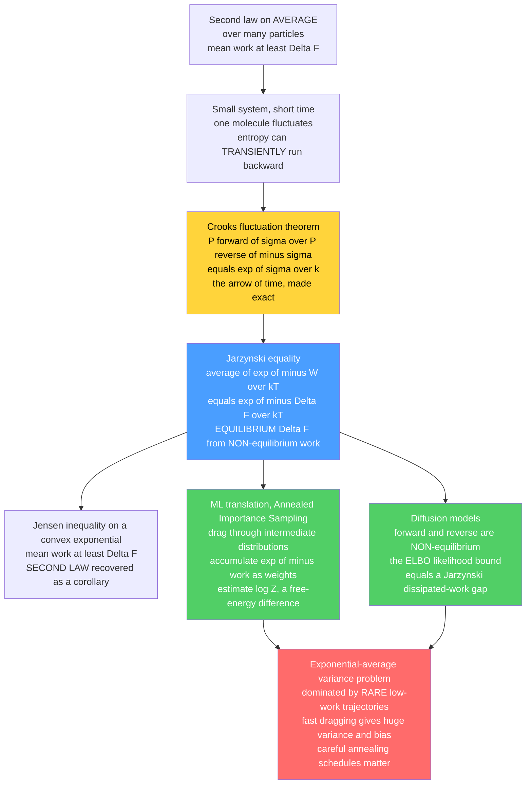

# 🔄 Fluctuation Theorems and the Jarzynski Equality

> [!abstract] TL;DR
> The **second law** — entropy increases, and the work you must do to change a system obeys $\langle W\rangle \ge \Delta F$ — is a statement about **averages over astronomically many particles**. Zoom into a *small* system over a *short* time (one protein, one dragged colloid) and individual trajectories **transiently run backward**, momentarily consuming rather than producing entropy, with *calculable* odds. **Fluctuation theorems** (1990s–2000s) put those odds on an exact footing: the **Crooks theorem** says a forward trajectory producing entropy $\sigma$ is $e^{\sigma/k}$ times more likely than its time-reverse producing $-\sigma$. From it drops a small miracle — the **Jarzynski equality** $\big\langle e^{-W/kT}\big\rangle = e^{-\Delta F/kT}$: an **equilibrium** free-energy difference $\Delta F$ is recovered by exponentially averaging the **work** done in *arbitrarily fast, irreversible, non-equilibrium* pulls. Jensen's inequality turns this identity straight back into the second law $\langle W\rangle \ge \Delta F$. The punchline for machine learning: the Jarzynski estimator **is** *annealed importance sampling* — dragging a distribution through intermediate temperatures while accumulating $e^{-\text{work}}$ weights to estimate an intractable $\log Z$ — and the same non-equilibrium thermodynamics grounds the **likelihood bounds of diffusion models**, whose forward/reverse processes are non-equilibrium and whose ELBO gap is a *dissipated-work* gap. Its Achilles heel — the exponential average is dominated by **rare low-work trajectories** — is exactly why fast annealing schedules give high-variance $\log Z$ estimates.

---

## Intuition

**Analogy — the cup that (almost) never un-shatters.** The second law of thermodynamics says a shattered coffee cup never spontaneously reassembles; disorder only grows, and the film of the world has an arrow. But that "never" is really an *overwhelming improbability* averaged over the trillions of molecules in the cup. Now shrink the scene until you can see a *single* fragment being jostled by air molecules. For a fleeting instant, the random kicks conspire and the fragment hops **upward** — entropy, locally and briefly, runs *backward*. It is not forbidden; it is merely *rare*, and fluctuation theorems tell you *exactly how rare*: entropy-producing paths outnumber entropy-consuming ones by a precise exponential factor.

From this precise bookkeeping of rare reversals comes something genuinely useful. Imagine measuring how much **work** it takes to stretch a folded protein. Do it slowly (reversibly) and the work equals the protein's **free-energy** change — but slow experiments are impractical and noisy. Do it *fast* and you waste extra work as heat, so any single fast pull *overshoots* the free energy. The Jarzynski equality says: pull fast, many times, record the messy fluctuating work of each pull, and combine them not with an ordinary average but with an **exponential** one, $\langle e^{-W/kT}\rangle$ — and out pops the **equilibrium** free-energy difference, exactly, no matter how violently you pulled. An equilibrium quantity, extracted from deliberately non-equilibrium chaos. Machine learning steals this exact trick to estimate the one number it can never compute directly — the partition function $Z$ — and to reason about the likelihoods of diffusion models.

---

## How It Works

### Core Mechanics

**1. Non-equilibrium is the frontier.** Equilibrium statistical mechanics describes systems that have *settled*: a fixed Boltzmann distribution $p(x)\propto e^{-E(x)/kT}$, no net flows, time-reversal symmetry. But real systems are constantly **driven** — dragged by optical tweezers, heated on one side, actively burning ATP. There is no general theory of such states the way there is for equilibrium. What makes fluctuation theorems remarkable is that they are **exact relations valid arbitrarily far from equilibrium** — a rare and precious thing in a field that usually only offers inequalities and linear-response approximations.

**2. The second law is a statement about averages.** The Clausius/Kelvin second law and its work form $\langle W\rangle \ge \Delta F$ (the work to drive a system from state $A$ to state $B$ is *at least* the free-energy difference) hold **on average** over many realizations. For a *macroscopic* system the fluctuations around that average are unmeasurably tiny (relative size $\sim 1/\sqrt{N}$ for $N\sim 10^{23}$), so the law looks absolute. For a **small system over short times** — a single biomolecule, a micron-sized bead, a bit in a nanoscale memory — the fluctuations are of the *same order* as the mean. Individual trajectories then "violate" the naive second law: entropy momentarily decreases, or the work comes in **below** $\Delta F$. Fluctuation theorems make this probabilistic statement *precise*.

**3. The Crooks fluctuation theorem (the master relation).** Drive the system from $A$ to $B$ with some protocol $\lambda(t)$ (the *forward* process), and consider the time-reversed protocol $B\to A$ (the *reverse* process). Let $\sigma$ be the total **entropy production** of a trajectory. Crooks (1999) proved

$$
\frac{P_{\text{forward}}(\sigma)}{P_{\text{reverse}}(-\sigma)} \;=\; e^{\,\sigma/k}.
$$

Read it slowly: a forward trajectory that produces entropy $\sigma$ is $e^{\sigma/k}$ times **more likely** than a reverse trajectory that produces $-\sigma$ (i.e. that *consumes* entropy). Entropy-producing paths dominate exponentially — *this is the arrow of time made quantitative* — but entropy-consuming paths are **not forbidden**; they occur with the small but nonzero probability the formula pins down. The **Evans–Searles** transient fluctuation theorem and the **Gallavotti–Cohen** steady-state theorem are close relatives, quantifying the same ratio for entropy-production rates.

**4. The Jarzynski equality (the landmark identity).** Written in terms of *work* $W$ for a system driven from equilibrium at $A$, Crooks' relation integrates to Jarzynski's 1997 result:

$$
\boxed{\;\big\langle e^{-W/kT}\big\rangle \;=\; e^{-\Delta F/kT}\;}
\qquad\Longleftrightarrow\qquad
\Delta F \;=\; -kT\,\log\big\langle e^{-W/kT}\big\rangle,
$$

where the average is over **many repetitions** of the *same* non-equilibrium protocol, each starting from equilibrium at $A$. The astonishment: $\Delta F = F_B - F_A$ is a pure **equilibrium** quantity (a ratio of partition functions, $\Delta F = -kT\log(Z_B/Z_A)$; see [[Partition_Functions_and_Free_Energy_in_ML]]), yet it is recovered from **arbitrarily fast, irreversible** pulls. You do **not** need to go slowly. You extract an equilibrium free energy from messy, dissipative, non-equilibrium work — provided you average the *exponential* of the work, not the work itself.

**5. The second law recovered as a corollary.** Because $e^{-W/kT}$ is a **convex** function of $W$, **Jensen's inequality** gives $\big\langle e^{-W/kT}\big\rangle \ge e^{-\langle W\rangle/kT}$. Combine with Jarzynski:

$$
e^{-\Delta F/kT} \;=\; \big\langle e^{-W/kT}\big\rangle \;\ge\; e^{-\langle W\rangle /kT}
\quad\Longrightarrow\quad
\langle W\rangle \;\ge\; \Delta F .
$$

The dissipated work $\langle W_{\text{diss}}\rangle = \langle W\rangle - \Delta F \ge 0$ is exactly the wasted heat, and it vanishes **only** for a reversible (quasi-static) process. So the fluctuation theorem does not *contradict* the second law — it **contains and refines** it: the *average* obeys thermodynamics while *individual* trajectories fluctuate above and below, and the identity holds precisely because the rare sub-$\Delta F$ trajectories carry outsized exponential weight.

**6. The ML translation — Jarzynski IS annealed importance sampling.** Estimating a ratio of partition functions $Z_B/Z_A = e^{-\Delta F/kT}$ is the central intractable problem of energy-based ML. **Annealed importance sampling** (AIS, Neal 2001) does it by "dragging" a sample through a chain of intermediate distributions $p_0\to p_1\to\cdots\to p_n$ (a temperature ladder) while accumulating **importance weights** $w = \prod_j \tilde p_j(x_j)/\tilde p_{j-1}(x_j)$, and reports $\widehat{Z_n/Z_0} = \langle w\rangle$. Take logs: $\log w = -\sum_j \Delta E_j / kT$ is *precisely the accumulated work* of a discrete non-equilibrium drive, and $\langle w\rangle = \langle e^{-W/kT}\rangle$ is *precisely the Jarzynski average*. **AIS is the Jarzynski equality repurposed to estimate $\log Z$.** Physics and ML are using the *identical* non-equilibrium tool; the note [[Free_Energy_Estimation_and_Thermodynamic_Integration]] develops the estimator family, and [[Partition_Functions_and_Free_Energy_in_ML]] frames why $\log Z$ is the shared villain.

**7. The diffusion-model connection.** The original diffusion generative model of Sohl-Dickstein et al. (2015) was titled *"Deep Unsupervised Learning using Nonequilibrium Thermodynamics"* — and meant it. A diffusion model's **forward** process gradually noises data (a non-equilibrium drive toward a simple Gaussian), and the **reverse** process denoises it back; the training **ELBO / variational bound** on the data likelihood is, term for term, a **Jarzynski-type relation**. The gap between the ELBO and the true log-likelihood is the **dissipated work** — the average entropy production of the forward process — so the model's likelihood is *bounded by how irreversibly it noises data*. This is the deep grounding beneath modern generators; the notes [[Diffusion_Models_as_Non_Equilibrium_Thermodynamics]] and [[Score_SDEs_and_Probability_Flow]] develop it, and [[Diffusion_Models]] and [[Score_Matching_and_Score_Based_Models]] are the ML-facing notes.

**8. The exponential-average variance problem (the practical catch).** The estimator $\langle e^{-W/kT}\rangle$ is **dominated by rare, low-work trajectories** — the very entropy-consuming events Crooks says are exponentially unlikely. The further from equilibrium (faster drive, larger $\langle W_{\text{diss}}\rangle$), the more the average depends on samples you almost never see, so its **variance explodes** and finite-sample estimates are *biased high* (they underestimate the crucial rare tail, so $-kT\log\widehat{\langle\cdot\rangle}$ overshoots $\Delta F$). This is the *same* pathology as importance sampling with a poorly overlapping proposal. The cure — in physics and in AIS alike — is **more intermediate steps / slower annealing**, so each stage stays near equilibrium and the work per step is small. This is exactly *why careful annealing schedules matter* for $\log Z$ estimation.

### Flow / Architecture



---

## Key Concepts

### Secondary Level

- **The second law is about crowds, not individuals.** "Entropy always increases" is a rule about huge numbers of particles. For a *single* tiny particle over a *short* time, disorder can briefly *decrease* — rarely, but really.
- **Fluctuation theorems give the odds.** They state *exactly* how much more likely a "forward, entropy-up" path is than a "backward, entropy-down" path: an exponential factor. The rare reversals are allowed, just improbable.
- **The Jarzynski miracle.** Stretch a molecule fast and messy many times, record the work each time, and a special *exponential* average of those works gives you the clean, slow-limit **free-energy difference** — no need to go slowly.
- **Why machine learning cares.** The same averaging trick estimates a number ML can never compute directly (the normalizer $Z$), and it explains how image-generating **diffusion models** are scored.

### Undergraduate Level

- **Work vs free energy.** For a driven process $A\to B$: $\langle W\rangle \ge \Delta F$, with equality only in the reversible limit; the excess $\langle W\rangle - \Delta F = \langle W_{\text{diss}}\rangle \ge 0$ is dissipated heat.
- **Crooks fluctuation theorem.** $P_F(\sigma)/P_R(-\sigma) = e^{\sigma/k}$; the forward and reverse work distributions cross at $W=\Delta F$, giving a graphical way to *read off* $\Delta F$ from experiments.
- **Jarzynski equality.** $\langle e^{-W/kT}\rangle = e^{-\Delta F/kT}$; equivalently $\Delta F = -kT\log\langle e^{-W/kT}\rangle$. Requires the initial state sampled from **equilibrium at $A$**.
- **Second law from Jensen.** $e^{-W/kT}$ is convex $\Rightarrow \langle e^{-W/kT}\rangle \ge e^{-\langle W\rangle/kT} \Rightarrow \langle W\rangle \ge \Delta F$.
- **Annealed importance sampling.** Walk a tractable $p_0$ to a target $p_n$ through intermediate distributions; the log importance weight *is* accumulated work; $\langle w\rangle = Z_n/Z_0$.
- **Exponential-average pitfall.** $\langle e^{-W/kT}\rangle$ is controlled by the low-work tail; far from equilibrium the estimator has enormous variance and finite-sample bias.

### Graduate Level

- **Trajectory (path-space) derivation.** For overdamped Langevin dynamics with protocol $\lambda(t)$, the ratio of forward to time-reversed path probabilities equals $e^{\Delta s_{\text{tot}}/k}$ (microscopic reversibility / local detailed balance). Integrating over paths at fixed $W$ yields Crooks; integrating over all $W$ yields Jarzynski. **Stochastic thermodynamics** (Sekimoto, Seifert) defines trajectory heat $\delta q = \dot x\cdot(-\partial_x U + \text{force})$ and work $\delta w = \partial_\lambda U\,\dot\lambda$ so the first law holds *per trajectory*.
- **Integral vs detailed theorems.** Jarzynski is the *integral* fluctuation theorem $\langle e^{-\Sigma/k}\rangle = 1$ for total entropy production $\Sigma$; Crooks is the corresponding *detailed* theorem. Seifert's $\langle e^{-\Delta s_{\text{tot}}/k}\rangle = 1$ generalizes to arbitrary Markov dynamics and reproduces $\langle\Delta s_{\text{tot}}\rangle \ge 0$.
- **Bennett acceptance ratio (BAR).** The statistically optimal way to combine *forward and reverse* work measurements to estimate $\Delta F$; it is the maximum-likelihood estimator given both Crooks distributions and strictly dominates one-directional Jarzynski. Its ML descendant is **bidirectional Monte Carlo** for bracketing $\log Z$.
- **Jarzynski $=$ AIS $=$ SMC.** AIS is a sequential-importance-sampling instance; adding resampling gives **sequential Monte Carlo (SMC) samplers**. The AIS/Jarzynski estimator of $\log Z$ is a *stochastic lower bound* (in expectation, by Jensen), and its reverse is an upper bound — the two together bracket $\log Z$ (Grosse et al., BDMC).
- **Diffusion ELBO as dissipated work.** The variational bound of a diffusion model equals $\log p_\theta(x) = \mathcal{L}_{\text{ELBO}} + \text{(dissipation gap)}$, where the gap is a KL between forward and reverse path measures — the average entropy production of the noising process. Minimizing it is minimizing dissipation; the connection to $\langle W\rangle - \Delta F$ is exact.
- **Variance and finite-sample bias.** $\operatorname{Var}[e^{-W/kT}]$ grows with $\langle W_{\text{diss}}\rangle$; the number of samples for a given accuracy scales like $e^{\langle W_{\text{diss}}\rangle/kT}$ in the worst case, motivating near-equilibrium (many-stage) schedules, escorted/targeted free-energy methods, and control-variate corrections.

---

## Python Demo

```python
# The Jarzynski equality in action: recover an EQUILIBRIUM free-energy difference
# from fast, IRREVERSIBLE, non-equilibrium work.
#
# System: an overdamped particle in a harmonic trap U(x, lam) = 0.5 * k(lam) * x^2,
# whose STIFFNESS is dragged from k_A -> k_B along lam: 0 -> 1 at finite speed.
# For this system the free energy is known EXACTLY:
#     F(lam) = -kT log Z(lam),  Z(lam) = sqrt(2*pi*kT / k(lam))
#     =>  Delta F = 0.5 * kT * log(k_B / k_A)
#
# We (a) simulate MANY non-equilibrium drags, recording the fluctuating work W;
#     (b) show <W> OVERESTIMATES Delta F (second law), yet the JARZYNSKI estimator
#         -kT log <exp(-W/kT)> recovers the exact Delta F;
#     (c) show FASTER dragging -> more dissipation -> higher-variance estimator,
#         dominated by RARE low-work trajectories.
import numpy as np
import matplotlib.pyplot as plt

rng = np.random.default_rng(0)

kT = 1.0                       # thermal energy (units)
kA, kB = 1.0, 4.0              # trap stiffness at A and B
dF_exact = 0.5 * kT * np.log(kB / kA)     # EXACT free-energy difference = 0.5*ln(4) ~ 0.693

def k_of(lam):                 # linear stiffness protocol
    return kA + (kB - kA) * lam

def logmeanexp(a):             # numerically stable log( mean( exp(a) ) )
    m = a.max()
    return m + np.log(np.mean(np.exp(a - m)))

def run_protocol(tau, n_real, dt=0.01):
    """Drag stiffness A->B over duration tau, vectorized over n_real realizations.
    Returns the array of work values W (one per realization)."""
    n_steps = max(1, int(round(tau / dt)))
    # start EACH realization from equilibrium at A:  x ~ N(0, kT/kA)
    x = rng.normal(0.0, np.sqrt(kT / kA), size=n_real)
    W = np.zeros(n_real)
    for i in range(n_steps):
        lam_old = i / n_steps
        lam_new = (i + 1) / n_steps
        k_old, k_new = k_of(lam_old), k_of(lam_new)
        # work = change of ENERGY due to changing the control parameter at fixed x
        W += 0.5 * (k_new - k_old) * x**2
        # then evolve x under the NEW potential (overdamped Langevin, Euler-Maruyama)
        x = x - k_new * x * dt + np.sqrt(2.0 * kT * dt) * rng.standard_normal(n_real)
    return W

# ------------------------------------------------------------------
# (a) work distributions: slow (near-reversible) vs fast (dissipative)
# ------------------------------------------------------------------
n_real = 8000
W_slow = run_protocol(tau=20.0, n_real=n_real)   # slow  -> near-reversible
W_fast = run_protocol(tau=0.2,  n_real=n_real)   # fast  -> strongly dissipative

for name, W in [("slow", W_slow), ("fast", W_fast)]:
    meanW = W.mean()
    dF_jar = -kT * logmeanexp(-W / kT)
    frac_below = np.mean(W < dF_exact)           # "second-law-violating" trajectories
    print(f"[{name}]  <W>={meanW:.3f}  Jarzynski dF={dF_jar:.3f}  "
          f"exact dF={dF_exact:.3f}  frac(W<dF)={frac_below:.2f}")

# ------------------------------------------------------------------
# (b) sweep the drag SPEED: <W> vs Jarzynski estimate vs exact Delta F
#     (bootstrap the Jarzynski estimator to get error bars)
# ------------------------------------------------------------------
taus = np.array([0.2, 0.5, 1.0, 2.0, 5.0, 10.0, 20.0])
meanW_sweep, jar_sweep, jar_err = [], [], []
for tau in taus:
    W = run_protocol(tau, n_real)
    meanW_sweep.append(W.mean())
    jar_sweep.append(-kT * logmeanexp(-W / kT))
    boots = [ -kT * logmeanexp(-W[rng.integers(0, n_real, n_real)] / kT)
              for _ in range(200) ]              # bootstrap resamples
    jar_err.append(np.std(boots))
meanW_sweep = np.array(meanW_sweep)
jar_sweep   = np.array(jar_sweep)
jar_err     = np.array(jar_err)

# ------------------------------------------------------------------
# (c) rare-event domination for the FAST protocol:
#     running Jarzynski estimate vs number of samples, and the weight per work-bin
# ------------------------------------------------------------------
Ns = np.unique(np.logspace(1, np.log10(n_real), 40).astype(int))
run_jar  = np.array([-kT * logmeanexp(-W_fast[:n] / kT) for n in Ns])
run_meanW = np.array([W_fast[:n].mean() for n in Ns])

# how much each work-bin CONTRIBUTES to <exp(-W/kT)>
bins = np.linspace(W_fast.min(), W_fast.max(), 60)
idx  = np.digitize(W_fast, bins)
weight = np.exp(-W_fast / kT)
bin_weight = np.array([weight[idx == b].sum() for b in range(1, len(bins))])
bin_weight /= bin_weight.sum()
bin_centers = 0.5 * (bins[:-1] + bins[1:])

# ------------------------------- plots -------------------------------
fig, ax = plt.subplots(2, 2, figsize=(13, 10))

# (a) work histograms with Delta F and <W> markers
for W, c, lab in [(W_slow, "steelblue", "slow (near-reversible)"),
                  (W_fast, "crimson",  "fast (dissipative)")]:
    ax[0, 0].hist(W, bins=60, density=True, alpha=0.5, color=c, label=lab)
    ax[0, 0].axvline(W.mean(), color=c, ls="--", lw=2)
ax[0, 0].axvline(dF_exact, color="black", lw=2.5, label="exact Delta F")
ax[0, 0].axvspan(W_fast.min(), dF_exact, color="gold", alpha=0.15)
ax[0, 0].text(dF_exact, ax[0, 0].get_ylim()[1]*0.8, "  W < Delta F\n  (2nd-law-defying)",
              fontsize=8, color="darkgoldenrod")
ax[0, 0].set(title="(a) Work distributions: dashed = mean work <W> (overshoots Delta F)",
             xlabel="work W", ylabel="density")
ax[0, 0].legend(fontsize=8)

# (b) speed sweep
ax[0, 1].errorbar(taus, jar_sweep, yerr=jar_err, fmt="o-", color="seagreen",
                  capsize=3, label="Jarzynski estimate  -kT log <exp(-W/kT)>")
ax[0, 1].plot(taus, meanW_sweep, "s--", color="crimson",
              label="mean work <W>  (2nd-law upper bound)")
ax[0, 1].axhline(dF_exact, color="black", lw=2, label="exact Delta F")
ax[0, 1].set(xscale="log", title="(b) Slower drag -> less dissipation; Jarzynski tracks Delta F",
             xlabel="protocol duration tau (log)", ylabel="free-energy estimate")
ax[0, 1].legend(fontsize=8)

# (c) convergence for the fast protocol
ax[1, 0].plot(Ns, run_jar, "-", color="seagreen", lw=2, label="running Jarzynski dF")
ax[1, 0].plot(Ns, run_meanW, "-", color="crimson", lw=2, label="running mean work <W>")
ax[1, 0].axhline(dF_exact, color="black", lw=2, label="exact Delta F")
ax[1, 0].set(xscale="log", title="(c) Fast protocol: Jarzynski converges NOISILY (rare-event limited)",
             xlabel="number of samples (log)", ylabel="free-energy estimate")
ax[1, 0].legend(fontsize=8)

# (d) which work values carry the exponential weight
ax[1, 1].bar(bin_centers, bin_weight, width=(bins[1]-bins[0]), color="mediumpurple",
             alpha=0.7, label="share of <exp(-W/kT)>")
axr = ax[1, 1].twinx()
axr.hist(W_fast, bins=60, density=True, histtype="step", color="crimson",
         lw=1.5, label="work histogram")
ax[1, 1].axvline(dF_exact, color="black", lw=2)
ax[1, 1].set(title="(d) The estimator is dominated by RARE low-work trajectories",
             xlabel="work W", ylabel="normalized weight share")
axr.set_ylabel("work density", color="crimson")
ax[1, 1].legend(loc="upper right", fontsize=8)

plt.tight_layout()
plt.savefig("jarzynski_equality.png", dpi=110)
print("saved jarzynski_equality.png")
```

**What it shows.** The harmonic trap is chosen because its free-energy difference is known *exactly*, $\Delta F = \tfrac12 kT\log(k_B/k_A)\approx 0.693$, giving a ground truth to check against. Panel **(a)**: the **mean work** $\langle W\rangle$ (dashed lines) always sits to the *right* of $\Delta F$ — the second law — and the fast (crimson) drag dissipates far more than the slow (blue) one; crucially, a fraction of trajectories fall in the shaded region $W<\Delta F$, individually "defying" the naive second law. Panel **(b)**: as the drag slows (larger $\tau$), the mean work relaxes toward $\Delta F$, but at *every* speed the **Jarzynski estimator** $-kT\log\langle e^{-W/kT}\rangle$ hugs the exact $\Delta F$ — recovering an equilibrium quantity from non-equilibrium work — with error bars that *blow up* for the fastest, most dissipative drives. Panel **(c)** exposes why: for the fast protocol the Jarzynski estimate converges *noisily* and only after many samples, whereas the mean work converges smoothly to the *wrong* (too-high) value. Panel **(d)** is the smoking gun: the far **left tail** of low-work trajectories — the rarest events — carries almost all of the exponential weight $e^{-W/kT}$, which is exactly the variance problem that AIS inherits when its annealing schedule is too coarse.

---

## Real-World Applications

- **Single-molecule pulling experiments (the experimental triumph).** Bustamante, Ritort, Tinoco and collaborators used **optical tweezers** to mechanically *unfold* RNA hairpins and proteins at finite speed, then applied the **Crooks/Jarzynski** relations to extract *equilibrium* folding **free-energy landscapes** from irreversible pulls — a landmark 2005 *Nature* validation. See [[Single_Molecule_Biophysics]] and [[Protein_Structure_and_Folding]].
- **Computational free-energy estimation in chemistry & biophysics.** **Nonequilibrium free-energy perturbation** and fast-switching molecular-dynamics protocols estimate ligand-binding affinities and solvation free energies via Jarzynski/BAR — cheaper than fully reversible thermodynamic integration when done with good schedules. See [[Molecular_Dynamics_Simulation]] and [[Free_Energy_Estimation_and_Thermodynamic_Integration]].
- **Partition-function estimation in machine learning.** **Annealed importance sampling** is the standard way to report test log-likelihoods of RBMs, deep Boltzmann machines, VAEs, and normalizing/diffusion models — it *is* the Jarzynski estimator for $\log Z$. See [[Partition_Functions_and_Free_Energy_in_ML]].
- **Understanding diffusion-model likelihoods.** The non-equilibrium-thermodynamics view (Sohl-Dickstein 2015; Song 2021) explains diffusion training objectives as bounds whose gap is dissipated work, tying generative modeling to fluctuation theorems. See [[Diffusion_Models_as_Non_Equilibrium_Thermodynamics]] and [[Diffusion_Models]].
- **Stochastic thermodynamics of small machines & the thermodynamics of computation.** Fluctuation theorems underpin the analysis of **molecular motors** (kinesin, ATP synthase), nanoscale heat engines, and the energetic cost of *erasing information* — the Landauer bound as a fluctuation-theorem corollary. See [[Molecular_Motors_and_Mechanochemistry]], [[Landauer_Principle_and_Thermodynamics_of_Computation]], and the sibling *Thermodynamics_of_Computation_and_the_Landauer_Principle*.

---

## Common Pitfalls

- **Not starting from equilibrium at $A$.** The Jarzynski equality *requires* the initial microstate be drawn from the equilibrium (Boltzmann) distribution of state $A$. Start from a non-equilibrium or single fixed configuration and the identity silently breaks — you recover neither $\Delta F$ nor a clean bound.
- **Averaging the work instead of its exponential.** $-kT\log\langle e^{-W/kT}\rangle$ is *not* $\langle W\rangle$. Using the ordinary mean gives the dissipation-inflated upper bound, systematically overestimating $\Delta F$ by $\langle W_{\text{diss}}\rangle$. The magic is in the *exponential* (and its rare-event tail).
- **Trusting a fast-protocol estimate with too few samples.** Because the exponential average is dominated by rarely-sampled low-work trajectories, finite samples are **biased high** and high-variance far from equilibrium. Slow the drive, add intermediate stages, or combine forward+reverse work with **Bennett acceptance ratio** — never quote a single one-directional far-from-equilibrium number without an uncertainty estimate.
- **Confusing a definition of work or sign convention.** Trajectory work is $\int \partial_\lambda U\,\dot\lambda\,dt$ (energy change from moving the *control parameter*), *not* $\int F\,dx$ (mechanical displacement work) — mixing them corrupts the balance. Likewise physics writes $e^{-\beta W}$ with $\beta=1/kT$; ML often sets $kT=1$. Keep one convention.
- **Reading Crooks as "the second law is wrong."** Individual entropy-consuming trajectories are *allowed and quantified*, not a loophole. The **average** entropy production is provably non-negative (Jensen), and macroscopic violations are suppressed by $e^{-\sigma/k}$ with $\sigma$ enormous — the second law is *recovered*, not refuted.
- **Ignoring the AIS schedule.** In ML, running AIS with too few / poorly spaced intermediate distributions is the exact analog of dragging too fast: the $\log Z$ estimate is a loose, high-variance lower bound. Add temperatures where the distributions change quickly (geometric or adaptive schedules).

---

## Related Concepts

- [[Partition_Functions_and_Free_Energy_in_ML]] — $\Delta F = -kT\log(Z_B/Z_A)$ is exactly the ratio of partition functions that Jarzynski/AIS estimates; the shared intractable object.
- [[Free_Energy_Estimation_and_Thermodynamic_Integration]] — the estimator family (AIS, thermodynamic integration, BAR) that operationalizes Jarzynski to compute $\log Z$.
- [[Diffusion_Models_as_Non_Equilibrium_Thermodynamics]] — the sibling that unpacks how a diffusion model's forward/reverse process and ELBO are a Jarzynski-type non-equilibrium relation.
- [[Score_SDEs_and_Probability_Flow]] — the reverse-time SDE view of the non-equilibrium generative process whose dissipation this note bounds.
- [[Langevin_Dynamics_and_SGLD]] — the overdamped driven dynamics used to *realize* the non-equilibrium pull and to run each AIS transition step.
- [[Stochastic_Differential_Equations_and_Langevin]] — the SDE/path-measure machinery from which the path-space derivation of Crooks and Jarzynski is built.
- [[Entropy_and_Second_Law]] — the macroscopic law that fluctuation theorems refine into an exact probabilistic statement.
- [[Thermodynamic_Potentials]] — the Helmholtz free energy $F=U-TS$ whose *difference* Jarzynski recovers from work.
- [[Classical_Statistical_Mechanics]] — the canonical ensemble and Boltzmann weights underlying $Z$ and the equilibrium starting condition.
- [[The_Metropolis_Algorithm_and_MCMC]] — supplies the equilibrating transition kernels inside each AIS intermediate stage.
- [[Metropolis_Hastings_and_Detailed_Balance]] — detailed balance (equilibrium) is exactly what a *driven* protocol breaks; the broken-balance case is where fluctuation theorems live.
- [[Simulated_Annealing_and_Global_Optimization]] — the annealing path is the same "temperature ladder" AIS drags a sample along.
- [[Temperature_and_Annealing_in_Learning]] — the schedule of intermediate temperatures that controls AIS/Jarzynski variance.
- [[Monte_Carlo_Integration]] — AIS/Jarzynski are importance-sampling estimators; the rare-event variance is the importance-sampling pathology.
- [[Diffusion_Models]] — a non-equilibrium generative process whose likelihood bound is a Jarzynski-type dissipated-work gap.
- [[Score_Matching_and_Score_Based_Models]] — the reverse-SDE denoiser; the ML face of the reverse non-equilibrium process.
- [[Single_Molecule_Biophysics]] — optical-tweezer pulling experiments that first *measured* the Jarzynski/Crooks relations.
- [[Protein_Structure_and_Folding]] — folding free-energy landscapes reconstructed from irreversible unfolding pulls.
- [[Molecular_Motors_and_Mechanochemistry]] — stochastic thermodynamics of small machines where trajectory fluctuations dominate.
- [[Statistical_Mechanics_of_Biomolecules]] — the small-system framework in which $kT$-scale fluctuations make fluctuation theorems observable.
- [[Molecular_Dynamics_Simulation]] — nonequilibrium free-energy perturbation applies Jarzynski to fast-switching MD.
- [[Brownian_Motion]] — the thermal noise driving the fluctuations that occasionally reverse entropy.
- [[Stochastic_Calculus]] — the Itô calculus behind trajectory work, heat, and the fluctuation-theorem path integrals.
- [[Probability_Theory]] — Jensen's inequality on the convex exponential is what turns Jarzynski into the second law.
- [[Landauer_Principle_and_Thermodynamics_of_Computation]] — the energetic cost of erasure, a fluctuation-theorem corollary bridging to information.
- [[Maxwell_Demon_and_the_Physics_of_Information]] — information-fueled apparent second-law "violations," resolved by the same trajectory bookkeeping.

---

## Review Questions

**Secondary.** Using the shattered-cup analogy, explain why the second law is a statement about *averages* rather than an absolute ban, and what changes when you look at a single tiny particle over a short time. In plain words, what does the Jarzynski equality let you get out of a *fast, messy* experiment that you would normally need a *slow, careful* one to measure?

**Undergraduate.** (a) State the Jarzynski equality and the condition on the initial state that makes it hold. (b) Using the convexity of $e^{-W/kT}$ and Jensen's inequality, derive $\langle W\rangle \ge \Delta F$ from it, and identify the dissipated work. (c) For a harmonic trap whose stiffness is changed from $k_A$ to $k_B$, the exact free-energy difference is $\Delta F = \tfrac12 kT\log(k_B/k_A)$ — explain why $\langle W\rangle$ from a *fast* drive exceeds this while $-kT\log\langle e^{-W/kT}\rangle$ still equals it.

**Graduate.** (a) Explain precisely the correspondence "Jarzynski equality $\equiv$ annealed importance sampling": map work, temperature ladder, and $\Delta F$ onto AIS's importance weights, intermediate distributions, and $\log(Z_n/Z_0)$. (b) Why is the finite-sample Jarzynski/AIS estimator of $\log Z$ a *biased lower bound* in expectation, and how do the forward and reverse estimators bracket the truth (BAR / bidirectional Monte Carlo)? (c) State the sense in which a diffusion model's ELBO is a Jarzynski-type relation, and what physical quantity the gap between the ELBO and the true log-likelihood corresponds to. (d) Explain, in terms of $\langle W_{\text{diss}}\rangle/kT$, why the number of samples needed for a fixed accuracy can grow *exponentially* far from equilibrium, and what practical remedy this dictates for both single-molecule experiments and AIS schedules.

---

## Sources

- Jarzynski, C. (1997). "Nonequilibrium Equality for Free Energy Differences." *Physical Review Letters*, 78(14), 2690–2693. [arXiv:cond-mat/9610209](https://arxiv.org/abs/cond-mat/9610209)
- Crooks, G. E. (1999). "Entropy Production Fluctuation Theorem and the Nonequilibrium Work Relation for Free Energy Differences." *Physical Review E*, 60(3), 2721–2726. [arXiv:cond-mat/9901352](https://arxiv.org/abs/cond-mat/9901352)
- Collin, D., Ritort, F., Jarzynski, C., Smith, S. B., Tinoco, I., & Bustamante, C. (2005). "Verification of the Crooks Fluctuation Theorem and Recovery of RNA Folding Free Energies." *Nature*, 437, 231–234. [nature.com](https://www.nature.com/articles/nature04061)
- Neal, R. M. (2001). "Annealed Importance Sampling." *Statistics and Computing*, 11(2), 125–139. [arXiv:physics/9803008](https://arxiv.org/abs/physics/9803008)
- Sohl-Dickstein, J., Weiss, E. A., Maheswaranathan, N., & Ganguli, S. (2015). "Deep Unsupervised Learning using Nonequilibrium Thermodynamics." *ICML*. [arXiv:1503.03585](https://arxiv.org/abs/1503.03585)
- Seifert, U. (2012). "Stochastic Thermodynamics, Fluctuation Theorems and Molecular Machines." *Reports on Progress in Physics*, 75(12), 126001. [arXiv:1205.4176](https://arxiv.org/abs/1205.4176)

---

#statistical-mechanics #machine-learning #fluctuation-theorems #jarzynski-equality #non-equilibrium
