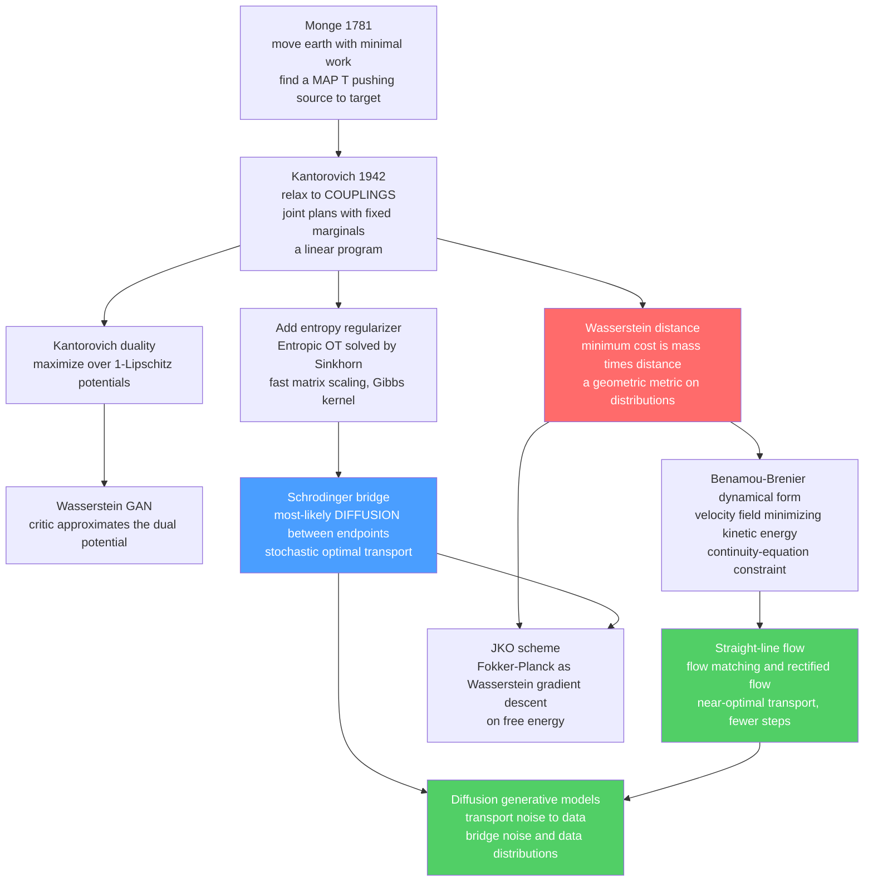

# 🚚 Optimal Transport and Schrödinger Bridges

> [!abstract] TL;DR
> **Optimal transport (OT)** is the mathematics of the *cheapest* way to reshape one probability distribution into another — Monge's 1781 problem of moving a pile of earth ("déblais et remblais") with minimal work, made computable by **Kantorovich's 1942** relaxation into linear-programming *transport plans* (couplings). It yields the **Wasserstein distance**, a geometrically meaningful metric between distributions (finite even for non-overlapping supports, unlike KL). Its **dynamical (Benamou–Brenier)** form recasts transport as finding the least-kinetic-energy *velocity field* that flows source to target — an optimal *flow*. Add diffusion and you get the **Schrödinger bridge**: the *most likely* stochastic trajectory a cloud of jittering particles could take between two observed distributions — exactly **entropy-regularized OT**, solvable in discrete form by the fast **Sinkhorn** algorithm. These century-old physics/math questions turn out to be *precisely* what a generative model does — **transport noise to data**. **Flow matching** and **rectified flow** learn straighter, near-optimal-transport paths that sample in *far fewer steps* than curved diffusion; **Wasserstein GANs** use the Kantorovich dual; **Schrödinger bridges** reconstruct single-cell developmental trajectories; and the **JKO scheme** reveals diffusion itself as *Wasserstein gradient descent on free energy* — making OT a unifying frontier of the statistical-mechanics ↔ ML bridge.

---

## Intuition

**Analogy — reshaping a sandpile into a cat, moving as little sand as possible.** You have a pile of sand shaped like a smooth Gaussian blob, and you want to reshape it into a detailed photograph of a cat, spread across a table as a landscape of little heaps. There are infinitely many ways to move the grains, but you are charged by *how far each grain travels*. **Optimal transport** asks for the single cheapest scheme: which spoonful of sand from *here* in the blob should be carried to *there* in the cat, so that the total (mass × distance) bill is as small as possible. The final bill — the minimum total cost — is the **Wasserstein distance** between "blob" and "cat": a real, geometric measure of how far apart the two shapes are, one that *knows about distance* and stays sensible even when the two piles do not overlap at all.

Now add a twist. Suppose the sand grains do not move in tidy straight lines but also **jitter randomly** as they go — they diffuse. You photograph the cloud at the start (the blob) and again at the end (the cat), but you never see the middle. Question: *of all the random, jittering ways the cloud could have flowed from blob to cat, which one is the most likely?* That most-probable diffusion bridging the two snapshots is the **Schrödinger bridge** — optimal transport *with noise built in*. And here is the punchline that reshaped modern AI: a generative model is nothing but a machine that transports a featureless noise distribution into the intricate distribution of real data. Diffusion models do it with a jittering, stochastic path (a Schrödinger-bridge-like process); flow-matching models learn the *straight*, sand-minimizing path — and straighter paths mean *fewer steps* and faster images. Two-hundred-year-old questions about moving dirt turn out to be the engine room of Stable Diffusion.

---

## How It Works

### Core Mechanics

**1. Monge's problem (1781) — an optimal map.**
Given a source distribution $\mu$ (the earth to be moved) and a target $\nu$ (where it must end up), and a cost $c(x,y)$ to carry a unit of mass from $x$ to $y$ (usually $c=\|x-y\|^2$), Monge sought a **transport map** $T$ that reassigns every point $x$ to a destination $T(x)$, pushing $\mu$ onto $\nu$ (written $T_\#\mu=\nu$), while minimizing total cost $\int c(x,T(x))\,d\mu(x)$. The catch: a *map* cannot split mass — one grain, one destination — so the problem is non-convex and can even be **infeasible** (you cannot map a single point mass onto two).

**2. Kantorovich's relaxation (1942) — transport plans / couplings.**
Kantorovich's decisive move (which earned him the 1975 Nobel in economics) was to allow mass to **split**: instead of a map, seek a **coupling** $\pi(x,y)$ — a joint distribution whose marginals are exactly $\mu$ and $\nu$. Minimize the *expected* cost over all such couplings:

$$W_c(\mu,\nu) \;=\; \min_{\pi \in \Pi(\mu,\nu)} \int c(x,y)\,d\pi(x,y), \qquad \Pi(\mu,\nu)=\{\pi:\ \pi(\cdot,y)\!\to\!\mu,\ \pi(x,\cdot)\!\to\!\nu\}.$$

This is a **linear program** (linear objective, linear marginal constraints) — convex, always feasible, and always attaining a minimum. In discrete form with histograms $a,b$ and a cost matrix $C$, it is: minimize $\langle P, C\rangle$ over doubly-constrained matrices $P\mathbf 1 = a$, $P^\top\mathbf 1 = b$, $P\ge 0$. The entry $P_{ij}$ literally says *how much mass moves from bin $i$ to bin $j$*.

**3. The Wasserstein distance — the "earth mover's" metric.**
With $c(x,y)=\|x-y\|^p$, the minimum cost (to the $1/p$ power) is the **$p$-Wasserstein distance** $W_p(\mu,\nu)$. It is a genuine metric on distributions and — crucially for ML — it is **finite and smooth even when supports do not overlap**, unlike the Kullback–Leibler divergence (see [[Relative_Entropy_and_Cross_Entropy]]), which blows up to $\infty$ for disjoint supports and ignores geometry. $W_p$ reflects the *underlying distance* between points, so moving a blob one meter costs a little and one kilometer costs a lot — exactly the geometric sensitivity KL lacks. This is why $W_p$ is often "the right distance" for comparing distributions.

**4. Kantorovich duality — the door to Wasserstein GANs.**
Every LP has a dual. For $W_1$, the dual is the elegant **Kantorovich–Rubinstein** form:

$$W_1(\mu,\nu) \;=\; \max_{\|f\|_{\mathrm{Lip}}\le 1}\ \Big(\mathbb E_{x\sim\mu}[f(x)] - \mathbb E_{y\sim\nu}[f(y)]\Big),$$

a maximization over **1-Lipschitz functions** $f$ (the "potential"). This is directly the objective of the **Wasserstein GAN** (see [[GAN]]): the *critic* is a neural network approximating the optimal dual potential $f$, and enforcing the Lipschitz constraint (weight clipping, or a gradient penalty) is what makes WGAN training so much more stable than the original Jensen–Shannon GAN. Duality is not decoration — it is the computational and algorithmic heart of OT in ML (compare classical LP duality in [[LP_Duality]] and [[Duality_Theory]]).

**5. The dynamical (Benamou–Brenier) formulation — transport as an optimal flow.**
Instead of a static plan, watch the mass *move over time*. Benamou and Brenier (2000) showed that squared-cost OT equals a **least-action fluid flow**: find a time-varying density $\rho_t$ and velocity field $v_t$ that carry $\mu$ at $t=0$ to $\nu$ at $t=1$ while minimizing total **kinetic energy**:

$$W_2^2(\mu,\nu) \;=\; \min_{\rho,\,v}\ \int_0^1\!\!\int \|v_t(x)\|^2\,\rho_t(x)\,dx\,dt \quad\text{s.t.}\quad \partial_t\rho_t + \nabla\!\cdot(\rho_t v_t)=0,\ \ \rho_0=\mu,\ \rho_1=\nu.$$

The constraint is the **continuity equation** (mass conservation). The optimal solution is *displacement interpolation* (McCann): each particle travels in a **straight line at constant velocity** to its destination — the shortest possible geodesic in the space of distributions. This dynamical picture connects OT directly to the **probability-flow / continuous-flow** view of generative models: an ODE $\dot x = v_t(x)$ that flows noise into data. This is the seed of flow matching (the sibling *Score_SDEs_and_Probability_Flow* develops the deterministic probability-flow ODE further).

**6. The Schrödinger bridge — optimal transport with diffusion.**
In 1932 Schrödinger asked a physics question: a cloud of Brownian particles is observed with distribution $\mu$ at time $0$ and, surprisingly, distribution $\nu$ at time $1$ — what is the **most likely** distribution over *trajectories* consistent with both endpoints? By large-deviations reasoning, the answer is the path measure $\hat P$ closest (in KL) to the reference Brownian motion $R$ while matching both marginals:

$$\hat P \;=\; \arg\min_{P:\ P_0=\mu,\,P_1=\nu}\ \mathrm{KL}(P\,\|\,R).$$

This is a **stochastic** optimal-transport problem, and its static projection is exactly **entropy-regularized OT**. The Schrödinger bridge is a *diffusion process* that interpolates the two distributions — "OT *with* built-in noise." As the noise level $\to 0$, the Schrödinger bridge **converges to the deterministic OT displacement interpolation**: the diffusion straightens into the sandpile geodesic. It is the physics of the most-likely fluctuation path (the sibling *Diffusion_Models_as_Non_Equilibrium_Thermodynamics* frames this as non-equilibrium thermodynamics).

**7. Entropic OT and the Sinkhorn algorithm — the computational workhorse.**
Solving the OT LP exactly costs $O(n^3\log n)$ — too slow at ML scale. Cuturi (2013) added an **entropy regularizer** $\varepsilon\,H(\pi)$ to the objective:

$$P^\star \;=\; \arg\min_{\pi\in\Pi(a,b)}\ \langle \pi, C\rangle \;-\; \varepsilon\, H(\pi), \qquad H(\pi)=-\sum_{ij}\pi_{ij}\log\pi_{ij}.$$

This makes the problem **strictly convex** with a closed-form structure: the optimal plan is $P^\star = \mathrm{diag}(u)\,K\,\mathrm{diag}(v)$ where $K = e^{-C/\varepsilon}$ is the Gibbs kernel — pure statistical mechanics, a Boltzmann weight over the cost. The scaling vectors $u,v$ are found by **Sinkhorn iterations** (alternating row/column normalization — iterative proportional fitting / matrix scaling), a handful of cheap matrix–vector products that run on GPUs. Small $\varepsilon$ → sharp, near-optimal plan; large $\varepsilon$ → a *blurred*, high-entropy plan (the entropic bias). **Entropic OT is a discretized Schrödinger bridge**, and Sinkhorn made OT scalable for machine learning.

**8. The generative-model connection — the ML payoff.**
Generative modeling **is** transporting a noise distribution $\mu=\mathcal N(0,I)$ to the data distribution $\nu$. Diffusion models (see [[Diffusion_Models]] and the sibling *The_Forward_and_Reverse_Diffusion_Process*) do this along a *curved*, stochastic path — a Schrödinger-bridge-like process built by adding then removing noise (the sibling *The_Fokker_Planck_Equation_in_Generative_Modeling* tracks the density's evolution). **Flow matching** (Lipman 2023), **rectified flow** (Liu 2023), and **stochastic interpolants** (Albergo & Vanden-Eijnden 2023) instead learn a velocity field for a **straighter, near-optimal-transport path**, which needs *dramatically fewer* integration steps to sample — straight geodesics beat curved detours. **Schrödinger-bridge generative models** (e.g. DSB, $I^2$SB) learn the optimal stochastic bridge between noise and data directly. Optimal transport is actively *reshaping and accelerating* diffusion.

**9. The statistical-mechanics reading.** Every piece is physics. The Sinkhorn kernel $e^{-C/\varepsilon}$ is a **Boltzmann weight**; the entropy regularizer is literally thermodynamic entropy; the Schrödinger bridge is the **large-deviations most-likely path** of a diffusion (non-equilibrium physics); and the **JKO scheme** (Jordan–Kinderlehrer–Otto 1998) shows that the **Fokker–Planck equation is Wasserstein gradient descent on free energy** — diffusion *is* steepest descent of $\mathcal F = \mathbb E[V] - \text{(temperature)}\cdot H$ measured in the Wasserstein geometry (see [[Free_Energy_Minimization_and_Variational_Principles]]). OT geometry turns the space of distributions into a Riemannian manifold on which learning and diffusion are gradient flows.

### Flow / Architecture



---

## Key Concepts

### Secondary Level

- **Optimal transport = cheapest reshaping.** Move a pile of sand into a new shape, paying for how far each grain travels; OT finds the plan with the smallest total bill.
- **Wasserstein distance = the minimum bill.** It measures how far apart two distributions are in a way that *knows about distance* — and it stays sensible even when the two piles do not overlap.
- **Schrödinger bridge = OT with jitter.** If the grains also move randomly, the Schrödinger bridge is the *most likely* way the jittering cloud flowed from start shape to end shape.
- **This is what generative AI does.** A generator turns random noise into realistic data — i.e. transports one distribution into another. Straighter transport paths mean faster image generation.

### Undergraduate Level

- **Kantorovich LP:** minimize $\sum_{ij}\pi_{ij}c_{ij}$ over couplings with fixed marginals $\pi\mathbf 1=a$, $\pi^\top\mathbf 1=b$, $\pi\ge 0$ — a linear program, always solvable.
- **Wasserstein vs KL:** $W_p$ is finite for disjoint supports and reflects geometry; KL is $\infty$ for disjoint supports and ignores how far apart points are — the reason WGANs replaced KL/JS objectives.
- **Kantorovich–Rubinstein dual:** $W_1=\max_{\|f\|_{\mathrm{Lip}}\le 1}\mathbb E_\mu[f]-\mathbb E_\nu[f]$; the Wasserstein-GAN critic is this dual potential $f$.
- **Benamou–Brenier:** $W_2^2=\min_{\rho,v}\int\!\!\int\|v\|^2\rho\,dx\,dt$ subject to $\partial_t\rho+\nabla\!\cdot(\rho v)=0$; the optimizer moves each particle in a straight line (displacement interpolation).
- **Entropic OT / Sinkhorn:** add $-\varepsilon H(\pi)$; the plan becomes $\mathrm{diag}(u)e^{-C/\varepsilon}\mathrm{diag}(v)$, found by alternating normalizations. Small $\varepsilon$ → sharp; large $\varepsilon$ → blurred.
- **Flow matching idea:** regress a velocity field so an ODE carries noise to data along near-straight paths — fewer sampling steps than curved diffusion.

### Graduate Level

- **Brenier's theorem:** for $c=\|x-y\|^2$ and absolutely continuous $\mu$, the optimal Kantorovich plan is induced by a *unique* deterministic map $T=\nabla\varphi$ that is the gradient of a **convex potential** — OT maps are gradients of convex functions (Monge–Ampère equation).
- **Schrödinger problem = static entropic OT:** $\min_{\pi}\langle\pi,C\rangle - \varepsilon H(\pi)$ is the projection of $\min_P \mathrm{KL}(P\|R)$ onto endpoint marginals; the bridge's drift solves a pair of coupled forward/backward PDEs (Schrödinger system), and Sinkhorn *is* iterative Bregman/KL projection onto the two marginal constraints.
- **Small-noise limit ($\Gamma$-convergence):** as $\varepsilon\to 0$ the Schrödinger bridge converges to the deterministic $W_2$ geodesic; entropic OT $\to$ unregularized OT, with an entropic bias of order $\varepsilon\log(1/\varepsilon)$ (motivating the debiased **Sinkhorn divergence**).
- **JKO / Otto calculus:** the Fokker–Planck equation $\partial_t\rho=\nabla\!\cdot(\rho\nabla V)+\Delta\rho$ is the **Wasserstein gradient flow** of the free energy $\mathcal F(\rho)=\int V\rho + \int\rho\log\rho$; the JKO minimizing-movement scheme $\rho_{k+1}=\arg\min_\rho \tfrac{1}{2\tau}W_2^2(\rho,\rho_k)+\mathcal F(\rho)$ discretizes it — diffusion as steepest descent of free energy in Wasserstein geometry (see [[Free_Energy_Minimization_and_Variational_Principles]]).
- **Stochastic optimal control view:** the Schrödinger bridge equals a control problem $\min \mathbb E\int\tfrac12\|u_t\|^2 dt$ over drifts $u$ steering the SDE between endpoints — linking OT to Hamilton–Jacobi–Bellman and the reverse-time SDE of score-based models (see [[Score_Matching_and_Score_Based_Models]]).
- **Rectified flow / reflow:** iteratively "straightening" a learned flow reduces transport curvature toward the OT geodesic, cutting the number of ODE steps toward one-step generation.

---

## Python Demo

```python
# Optimal transport between two 2D point clouds:
#   (a) DISCRETE OT via the SINKHORN algorithm (entropic-regularized OT / matrix scaling):
#       compute the transport plan (coupling), the transport cost (~ squared Wasserstein),
#       and show how entropy regularization SMOOTHS the plan (small eps sharp, large eps blurred).
#   (b) DYNAMICAL / flow view: displacement interpolation gives a STRAIGHT OT flow
#       (the flow-matching / rectified-flow idea) vs a CURVED diffusion-style detour.
import numpy as np
import matplotlib.pyplot as plt

rng = np.random.default_rng(1)

# ----- two small 2D point clouds (the discrete distributions to align) -----
n, m = 12, 12
Xs = rng.normal(loc=[-3.0, 0.0], scale=[0.7, 1.2], size=(n, 2))   # source: a Gaussian "noise" blob
theta = np.linspace(-0.6, 0.6, m)
Xt = np.stack([3.0 + 0.6 * np.cos(3 * theta), 2.5 * np.sin(theta)], axis=1)  # target: a curved "data" cloud
Xt += 0.15 * rng.normal(size=(m, 2))

a = np.ones(n) / n     # uniform mass on source points
b = np.ones(m) / m     # uniform mass on target points

# ----- squared-Euclidean cost matrix  C[i,j] = || xs_i - xt_j ||^2 -----
C = ((Xs[:, None, :] - Xt[None, :, :]) ** 2).sum(-1)

# ----- Sinkhorn: entropic-regularized OT (matrix scaling / iterative proportional fitting) -----
def sinkhorn(a, b, C, eps, n_iter=2000):
    K = np.exp(-C / eps)                       # Gibbs kernel: a Boltzmann weight over cost
    u = np.ones_like(a); v = np.ones_like(b)
    for _ in range(n_iter):
        u = a / (K @ v + 1e-300)               # normalize rows to source marginal
        v = b / (K.T @ u + 1e-300)             # normalize cols to target marginal
    return u[:, None] * K * v[None, :]         # transport plan (coupling)

P_sharp = sinkhorn(a, b, C, eps=0.05)          # small eps -> sharp, near-optimal assignment
P_blur  = sinkhorn(a, b, C, eps=1.00)          # large eps -> blurred, high-entropy plan

cost_sharp = float((P_sharp * C).sum())        # ~ squared 2-Wasserstein (entropic estimate)
cost_blur  = float((P_blur  * C).sum())
print(f"transport cost (eps=0.05, sharp): {cost_sharp:.3f}")
print(f"transport cost (eps=1.00, blur ): {cost_blur:.3f}  (entropy inflates the spread)")
print("row sums match source marginal a:", np.allclose(P_sharp.sum(1), a, atol=1e-3))

# ----- dynamical view: displacement interpolation (STRAIGHT OT flow) -----
T_map = (P_sharp @ Xt) / a[:, None]            # barycentric OT map:  xs_i -> T_map_i
ts = np.linspace(0.0, 1.0, 5)
straight = [(1 - t) * Xs + t * T_map for t in ts]   # McCann geodesic: straight lines

# ----- a CURVED diffusion-style path between the SAME endpoints (detours through noise) -----
def curved(t, bulge=1.8):
    base = (1 - t) * Xs + t * T_map
    direction = T_map - Xs
    perp = np.stack([-direction[:, 1], direction[:, 0]], axis=1)
    perp /= (np.linalg.norm(perp, axis=1, keepdims=True) + 1e-9)
    return base + bulge * np.sin(np.pi * t) * perp     # arced excursion, zero at both ends
curved_paths = np.array([curved(t) for t in np.linspace(0, 1, 40)])   # (40, n, 2)

# ================= plots =================
fig, ax = plt.subplots(2, 2, figsize=(13, 11))

im0 = ax[0, 0].imshow(P_sharp, cmap="viridis", aspect="auto")
ax[0, 0].set_title(f"(a) Sinkhorn plan, small eps=0.05\nnear-optimal assignment   cost={cost_sharp:.2f}")
ax[0, 0].set_xlabel("target point j"); ax[0, 0].set_ylabel("source point i")
fig.colorbar(im0, ax=ax[0, 0], fraction=0.046)

im1 = ax[0, 1].imshow(P_blur, cmap="viridis", aspect="auto")
ax[0, 1].set_title(f"(b) Sinkhorn plan, large eps=1.0\nentropy smooths the coupling   cost={cost_blur:.2f}")
ax[0, 1].set_xlabel("target point j"); ax[0, 1].set_ylabel("source point i")
fig.colorbar(im1, ax=ax[0, 1], fraction=0.046)

# (c) the coupling drawn as mass-weighted connections between the two clouds
ax[1, 0].scatter(Xs[:, 0], Xs[:, 1], c="crimson",   s=60, label="source (noise)", zorder=3)
ax[1, 0].scatter(Xt[:, 0], Xt[:, 1], c="royalblue", s=60, label="target (data)",  zorder=3)
Pmax = P_sharp.max()
for i in range(n):
    for j in range(m):
        w = P_sharp[i, j] / Pmax
        if w > 0.05:
            ax[1, 0].plot([Xs[i, 0], Xt[j, 0]], [Xs[i, 1], Xt[j, 1]],
                          color="gray", alpha=float(w), lw=1.5 * w + 0.3, zorder=1)
ax[1, 0].set_title("(c) Optimal coupling: which mass goes where")
ax[1, 0].legend(loc="upper center"); ax[1, 0].set_aspect("equal")

# (d) straight OT flow (green) vs curved diffusion path (orange)
for i in range(n):
    ax[1, 1].plot(curved_paths[:, i, 0], curved_paths[:, i, 1], color="orange", alpha=0.35, lw=1)
for k, snap in enumerate(straight):
    col = plt.cm.Greens(0.3 + 0.6 * k / len(straight))
    ax[1, 1].scatter(snap[:, 0], snap[:, 1], color=col, s=25, zorder=3)
for i in range(n):
    ax[1, 1].plot([Xs[i, 0], T_map[i, 0]], [Xs[i, 1], T_map[i, 1]], color="green", alpha=0.5, lw=1.2, zorder=2)
ax[1, 1].scatter(Xs[:, 0], Xs[:, 1], c="crimson",   s=60, zorder=4)
ax[1, 1].scatter(Xt[:, 0], Xt[:, 1], c="royalblue", s=60, zorder=4)
ax[1, 1].set_title("(d) Straight OT flow (green) vs curved diffusion path (orange)\n"
                   "OT geodesics are straight -> fewer sampling steps")
ax[1, 1].set_aspect("equal")

plt.tight_layout()
plt.savefig("optimal_transport.png", dpi=110)
print("saved optimal_transport.png")
```

**What it shows.** Panels (a) and (b) are the **entropic OT plan** from Sinkhorn: at small $\varepsilon$ the coupling is nearly a permutation — each source point sends almost all its mass to one target (a near-optimal *assignment*), and the printed transport cost is small; at large $\varepsilon$ the same plan **blurs out**, mass is spread across many targets, and the cost rises — the entropic bias made visible. The row-sum check confirms the plan respects the source marginal (that is exactly what the alternating normalizations enforce). Panel (c) draws the sharp coupling as gray connectors whose opacity is the transported mass — literally *which grain of sand goes where*. Panel (d) contrasts two ways to move source into target between the *same* endpoints: the **straight OT flow** (green displacement-interpolation snapshots, the flow-matching / rectified-flow ideal) travels each particle on a direct geodesic, while the **curved orange path** detours through a noisy excursion the way a diffusion sampler does — visually why straight, optimal-transport paths need *fewer integration steps* to generate a sample.

---

## Real-World Applications

- **Fast, principled generative models — the cutting edge.** **Flow matching** (the backbone of Stable Diffusion 3 and Meta's Movie Gen) and **rectified flow** learn near-optimal-transport velocity fields that sample high-quality images in a handful of ODE steps instead of hundreds; **Schrödinger-bridge diffusion** (DSB, $I^2$SB) learns the optimal stochastic bridge for image-to-image translation and restoration. See [[Diffusion_Models]] and the sibling *Score_SDEs_and_Probability_Flow*.
- **Wasserstein GANs and OT distances.** The **WGAN** uses the Kantorovich dual as a stable training objective (see [[GAN]]); Sinkhorn divergences and Wasserstein distances serve as loss functions and evaluation metrics for generative models and for comparing embeddings.
- **Single-cell biology — Waddington-OT and trajectory inference.** Cells are destroyed when measured, so you only get *snapshots* of a developing population at different times. **Schrödinger bridges / optimal transport** (Waddington-OT, Schiebinger et al.) reconstruct the most-likely *developmental trajectories* connecting the snapshots — inferring how stem cells differentiate.
- **Domain adaptation and distribution alignment.** OT aligns a labeled source domain to an unlabeled target domain by transporting features, transferring classifiers across distribution shift; the same machinery aligns word-embedding spaces across languages for unsupervised translation (compare [[Word_Embeddings]]) and aligns single-cell modalities.
- **Economics, logistics, and imaging.** The original resource-allocation / assignment problem (matching supply to demand at minimum transport cost) is pure OT (compare network-flow LPs in [[Network_Flow]]); OT also powers **color transfer, image morphing, shape interpolation, and histogram matching** in graphics, plus fairness-constrained repair and OT-based clustering (Wasserstein barycenters).

---

## Common Pitfalls

- **Using KL where you need geometry.** KL / Jensen–Shannon divergences are $\infty$ (or give zero gradient) when supports do not overlap — the exact regime of early GAN training, where generator and data are disjoint. Symptom: vanishing gradients, mode collapse. Fix: a Wasserstein / OT objective, which stays finite and informative because it *measures distance*.
- **Forgetting the entropic bias of Sinkhorn.** Entropic OT does **not** equal true OT: the regularizer inflates the cost and blurs the plan, and $W_\varepsilon(\mu,\mu)\neq 0$. Reporting the raw Sinkhorn cost as "the Wasserstein distance" is wrong. Fix: use the **debiased Sinkhorn divergence** $S_\varepsilon(\mu,\nu)=W_\varepsilon(\mu,\nu)-\tfrac12 W_\varepsilon(\mu,\mu)-\tfrac12 W_\varepsilon(\nu,\nu)$, or anneal $\varepsilon$ down.
- **Choosing $\varepsilon$ carelessly.** Too large → the plan is a smear and OT structure is lost; too small → the kernel $e^{-C/\varepsilon}$ underflows and Sinkhorn diverges or NaNs. Fix: normalize the cost matrix (e.g. divide by its median), and use **log-domain / stabilized** Sinkhorn for small $\varepsilon$.
- **Assuming a deterministic Monge map always exists.** With discrete/atomic distributions or mismatched masses, mass *must* split — there is no map, only a plan. Do not force a one-to-one assignment where the optimal solution is genuinely fractional.
- **Curse of dimensionality in the sample estimate.** The empirical $W_p$ between $n$ samples converges to the true value at rate $n^{-1/d}$ — dreadful in high dimensions. Comparing high-dimensional distributions by plug-in $W_p$ is statistically unreliable; use sliced-Wasserstein, entropic regularization, or the dual/critic formulation instead.
- **Enforcing the Lipschitz constraint incorrectly in WGAN.** The Kantorovich dual is valid *only* over 1-Lipschitz critics. Naive weight clipping distorts the critic (capacity underuse, pathological weights); prefer a **gradient penalty** or spectral normalization.
- **Confusing the Schrödinger bridge with plain OT.** The Schrödinger bridge is *stochastic* (it has diffusion); it reduces to deterministic OT only as noise $\to 0$. Modeling a noisy biological or generative process with zero-noise OT can miss the very fluctuations you care about.

---

## Related Concepts

- [[Langevin_Dynamics_and_SGLD]] — the diffusion whose most-likely bridged path *is* the Schrödinger bridge; Langevin sampling and OT are two faces of Fokker–Planck dynamics.
- [[Score_Matching_and_Score_Based_Models]] — score-based diffusion learns the reverse SDE; flow matching / OT paths are the straighter, near-optimal alternative that accelerates the same noise-to-data transport.
- [[Free_Energy_Minimization_and_Variational_Principles]] — the JKO scheme casts diffusion as Wasserstein gradient descent on free energy; OT geometry is where free-energy minimization lives.
- [[Diffusion_Models]] — generative diffusion *is* transporting noise to data; OT and Schrödinger bridges explain and speed up the process (flow matching, rectified flow).
- [[GAN]] — the Wasserstein GAN uses the Kantorovich–Rubinstein dual as its objective; OT gives the geometrically meaningful distance the original GAN lacked.
- [[VAE]] — an alternative likelihood-based generator; Wasserstein autoencoders replace the KL latent penalty with an OT one.
- [[MCMC_Sampling_in_Machine_Learning]] — MCMC and OT/Sinkhorn are competing routes to transport a simple distribution toward a complex target.
- [[Simulated_Annealing_and_Global_Optimization]] — the Sinkhorn kernel $e^{-C/\varepsilon}$ is a Boltzmann weight; lowering $\varepsilon$ is annealing the transport plan toward the sharp optimum.
- [[Maximum_Entropy_and_Exponential_Families]] — entropic OT is a maximum-entropy problem under marginal constraints; Sinkhorn is iterative projection onto them.
- [[Partition_Functions_and_Free_Energy_in_ML]] — the entropic-OT objective is a free energy, and its normalizer is a partition function over transport plans.
- [[LP_Duality]] — Kantorovich OT is a linear program; its dual (over potentials) underlies both WGANs and fast solvers.
- [[Duality_Theory]] — the convex-duality machinery that turns the primal transport plan into the Lipschitz-potential dual.
- [[Convex_Functions]] — Brenier's theorem: the optimal transport map is the gradient of a convex potential.
- [[Network_Flow]] — discrete OT is a min-cost flow / assignment problem, the classical LP form of moving mass at minimum cost.
- [[Probability_Theory]] — couplings, marginals, and pushforwards are the probability-theoretic backbone of OT.
- [[Measure_Theory]] — OT is fundamentally about maps and couplings of *measures*; Wasserstein spaces are metric spaces of probability measures.
- [[Relative_Entropy_and_Cross_Entropy]] — KL divergence, contrasted with Wasserstein: the Schrödinger bridge is a KL projection, and OT fixes KL's blindness to geometry and disjoint supports.
- [[Entropy_and_Second_Law]] — the thermodynamic entropy that regularizes OT and drives the diffusion whose bridge OT describes.
- [[Classical_Statistical_Mechanics]] — Boltzmann weights, entropy, and free energy are exactly the objects that appear in entropic OT and Schrödinger bridges.

---

## Review Questions

**Secondary.** Using the "reshaping a sandpile into a cat" picture, explain what *optimal* transport optimizes and what the resulting number (the Wasserstein distance) means. Then explain in one sentence why a generative AI model is doing essentially the same thing, and why a *straighter* transport path lets it generate images faster.

**Undergraduate.** (a) Write the Kantorovich linear program for discrete OT (objective and marginal constraints) and explain why Kantorovich's "allow mass to split" relaxation is always feasible while Monge's map formulation may not be. (b) Give one concrete situation where the KL divergence fails but the Wasserstein distance is well-behaved, and say why. (c) Describe one Sinkhorn iteration and explain what role the regularization strength $\varepsilon$ plays in how sharp or blurred the transport plan is.

**Graduate.** (a) State the Schrödinger bridge problem as a KL projection of a path measure and explain precisely how it relates to entropy-regularized OT and to deterministic OT in the small-noise limit. (b) Sketch the JKO minimizing-movement scheme and explain in what sense it shows the Fokker–Planck equation is a *Wasserstein gradient flow of free energy*. (c) Explain why flow matching / rectified flow can sample in far fewer steps than a standard diffusion model, connecting your answer to the Benamou–Brenier straight-line geodesic and the curvature of the learned probability-flow path.

---

## Sources

- Villani, C. (2009). *Optimal Transport: Old and New*. Grundlehren der mathematischen Wissenschaften, Springer. [link.springer.com](https://link.springer.com/book/10.1007/978-3-540-71050-9)
- Peyré, G., & Cuturi, M. (2019). "Computational Optimal Transport." *Foundations and Trends in Machine Learning*, 11(5–6). [arxiv.org/abs/1803.00567](https://arxiv.org/abs/1803.00567)
- Cuturi, M. (2013). "Sinkhorn Distances: Lightspeed Computation of Optimal Transport." *NeurIPS 2013*. [arxiv.org/abs/1306.0895](https://arxiv.org/abs/1306.0895)
- Arjovsky, M., Chintala, S., & Bottou, L. (2017). "Wasserstein GAN." *ICML 2017*. [arxiv.org/abs/1701.07875](https://arxiv.org/abs/1701.07875)
- Lipman, Y., Chen, R. T. Q., Ben-Hamu, H., Nickel, M., & Le, M. (2023). "Flow Matching for Generative Modeling." *ICLR 2023*. [arxiv.org/abs/2210.02747](https://arxiv.org/abs/2210.02747)
- Jordan, R., Kinderlehrer, D., & Otto, F. (1998). "The Variational Formulation of the Fokker–Planck Equation." *SIAM J. Math. Anal.*, 29(1). [epubs.siam.org](https://epubs.siam.org/doi/10.1137/S0036141096303359)

---

#statistical-mechanics #machine-learning #optimal-transport #schrodinger-bridge #flow-matching
