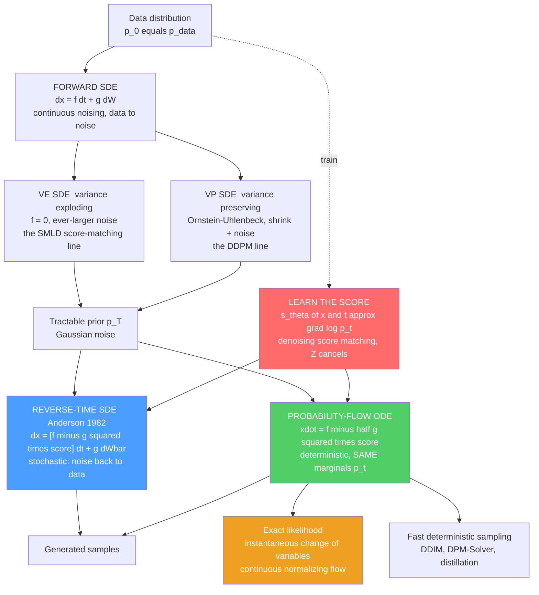

# 🌫️ Score SDEs and Probability Flow

> [!abstract] TL;DR
> Diffusion models arrived in a confusing pile of dialects — DDPM's "add noise then predict it," SMLD's "estimate the score at many noise levels and run Langevin," and various continuous variants. **Song et al. (2021)** showed they are *one thing*: a continuous-time **forward stochastic differential equation** $dx = f(x,t)\,dt + g(t)\,dW$ that smoothly noises data into a tractable prior. The magic is a theorem of physics — **Anderson (1982)**: every such forward SDE has an exact **reverse-time SDE** $dx = [f - g^2\nabla_x\log p_t(x)]\,dt + g\,d\bar W$ that carries the noise back to data, and the *only* thing it needs is the time-dependent **score** $\nabla_x\log p_t$ — which is exactly what denoising score matching learns, and which is blissfully independent of the intractable normalizer. Even better, there is a **deterministic twin**, the **probability-flow ODE** $\dot x = f - \tfrac12 g^2\nabla_x\log p_t$, whose trajectories have the *same marginal distributions* $p_t$ at every time as the SDE but carry **no noise**. That ODE is a **continuous normalizing flow**: it gives **exact likelihoods** (via the instantaneous change of variables), **fast deterministic sampling** with black-box ODE solvers (**DDIM** is a discretization of it), and smooth latent interpolation. VE $=$ SMLD, VP $=$ DDPM, DDIM $=$ probability-flow ODE — the SDE picture unifies diffusion models, normalizing flows, optimal transport, and the Fokker–Planck description of non-equilibrium physics into one elegant object, the mathematical backbone of modern generative AI.

---

## Intuition

**Analogy — the fog and its exact rewind.** Imagine every photograph in the world as a grain of colored sand arranged into a sharp picture. Now let a slow wind blow: each grain drifts and jitters a little every instant, and after long enough the picture dissolves into a featureless gray **fog** — pure noise, the same bland cloud no matter which photo you started from. All the different "recipes" for diffusion models are just different *winds*: one recipe keeps blowing in ever-stronger gusts of fresh sand (variance **exploding**), another gently pulls every grain toward the center while it jitters (variance **preserving**). Written as a smooth **stochastic differential equation** — a drift you can predict plus a jitter you cannot — they are dialects of one language.

Here is the beautiful fact of physics. That dissolving is not a one-way street. **Anderson's theorem** says every such fog-making process has an *exact time-reversed twin*: a wind that, run backward, carries the gray fog back into a crisp photograph. And to steer that rewind you need only one piece of local information at each moment — **which way is it currently getting denser?**, the **score** $\nabla_x\log p_t$, a field of arrows pointing toward where probability piles up. A network learns those arrows by practicing denoising; then generation is *literally simulating the rewound wind*.

Even more surprising: there is a **noiseless** version of the rewind. Strip out all the jitter and keep only a cleverly re-weighted drift, and you get a **deterministic flow** — the **probability-flow ODE** — that transports each speck of fog along a smooth, non-crossing streamline straight to a photograph. It visits the same statistical "weather" at every time as the noisy version, but because it is deterministic and invertible you can run it either direction, count exactly how the density stretches and squeezes along the way, and thereby read off an **exact likelihood**. Same physics, two faces: a stochastic river and its deterministic streamlines.

---

## How It Works

### The forward SDE — a continuous wind that noises data

Replace the discrete "add a bit of Gaussian noise $T$ times" of DDPM with its continuous-time limit, a **forward diffusion SDE**:

$$dx = \underbrace{f(x,t)}_{\text{drift}}\,dt \;+\; \underbrace{g(t)}_{\text{diffusion}}\,dW,$$

where $W$ is a Wiener process (Brownian motion; see [[Brownian_Motion]]). Running it from $t=0$ (data $p_0=p_\text{data}$) to $t=T$ produces a sequence of ever-noisier marginals $p_t$ that end at a **tractable prior** $p_T$ you can sample from directly. Two schedules dominate:

- **Variance-Exploding (VE) SDE** — the **SMLD / score-matching** line. Drift $f=0$, diffusion $g(t)=\sqrt{\tfrac{d[\sigma^2(t)]}{dt}}$ with $\sigma(t)$ growing large. It just keeps *piling on ever-bigger noise*; the signal is never shrunk, so the "variance explodes." The prior is a wide Gaussian $\mathcal N(0,\sigma_\text{max}^2 I)$.
- **Variance-Preserving (VP) SDE** — the **DDPM** line. An **Ornstein–Uhlenbeck**-type process $dx = -\tfrac12\beta(t)\,x\,dt + \sqrt{\beta(t)}\,dW$ that *shrinks the signal while it injects noise*, keeping total variance bounded. Its stationary and terminal distribution is the standard normal $\mathcal N(0,I)$.

Both have Gaussian transition kernels $p_{0t}(x_t\mid x_0)=\mathcal N(\alpha(t)x_0,\,\sigma^2(t)I)$, so a Gaussian-mixture data set stays a Gaussian mixture at every noise level — which is exactly what makes the analytic demo below possible.

### The reverse-time SDE — Anderson's theorem is the whole justification

The deep result (Anderson 1982) is that **every** forward diffusion SDE admits an exact **reverse-time SDE** whose marginals match $p_t$ run backward:

$$dx = \big[\,f(x,t) - g(t)^2\,\nabla_x\log p_t(x)\,\big]\,dt \;+\; g(t)\,d\bar W,$$

integrated from $t=T$ down to $t=0$ (here $dt<0$ and $\bar W$ is a reverse Brownian motion). Read it physically: the reverse dynamics take the forward drift, **correct it with the score**, and re-inject noise. Start from a sample of the easy prior $p_T$, simulate this backward, and you land on a sample of $p_\text{data}$. This is the precise mathematical reason diffusion generation works — it is the *time-reversal of a non-equilibrium stochastic process* (the deep dive *The_Forward_and_Reverse_Diffusion_Process* and *Diffusion_Models_as_Non_Equilibrium_Thermodynamics* develop this reading).

### The score is all you need

Notice what both the reverse SDE and its deterministic twin require: **only** the time-dependent score $\nabla_x\log p_t(x)$. Nothing else — not the density, not the intractable partition function $Z$, which cancels because $\nabla_x\log Z=0$ (the crux developed in [[Score_Matching_and_Score_Based_Models]]). A single network $s_\theta(x,t)\approx\nabla_x\log p_t(x)$ is trained by **denoising score matching** across all noise levels, and generation reduces to *plugging that network into the reverse SDE or ODE and solving it*. The whole field collapses onto one estimation problem: learn the score.

### The probability-flow ODE — the deterministic twin

Here is the remarkable object. For **every** diffusion SDE there is a deterministic **ordinary** differential equation whose trajectories reproduce the *same marginal densities* $p_t$ at every time — but with **no noise**:

$$\frac{dx}{dt} = f(x,t) - \tfrac12\,g(t)^2\,\nabla_x\log p_t(x).$$

(It follows by writing the Fokker–Planck equation for the SDE's density and re-expressing it as a continuity equation with this deterministic velocity field — the physics developed in *The_Fokker_Planck_Equation_in_Generative_Modeling*.) Running it backward deterministically transports the prior to data along smooth, non-crossing paths. Three payoffs:

1. **Exact likelihoods.** The probability-flow ODE *is* a **continuous normalizing flow** (the Neural-ODE connection). The **instantaneous change of variables** gives $\frac{d}{dt}\log p_t(x(t)) = -\nabla\!\cdot\! h(x,t)$ for drift $h$, so integrating the divergence along a trajectory yields an **exact** $\log p_0(x_0)$ — the very likelihood the intractable $Z$ once blocked for energy-based models.
2. **Fast deterministic sampling.** Because generation is now "solve an ODE," you can hand it to sophisticated black-box solvers. **DDIM** is precisely a discretization of this ODE.
3. **Smooth latent editing.** Deterministic, invertible trajectories give a clean latent space for interpolation, semantic editing, and encoding real images back to latents.

### Flow / Architecture



### What the SDE view unifies, and why it matters

- **DDPM** $=$ a discretization of the **VP SDE**; **SMLD / annealed Langevin** $=$ the **VE SDE**; **DDIM** $=$ the **probability-flow ODE**. One framework, many methods.
- It connects to **continuous normalizing flows / Neural ODEs** (the probability-flow ODE literally *is* one), to **optimal transport** and **flow-matching / rectified flow** (learning *straighter* probability-flow paths for faster sampling — foreshadowed in *Optimal_Transport_and_Schrodinger_Bridges*), and to **non-equilibrium statistical mechanics** through the **Fokker–Planck** and **Langevin** descriptions ([[Stochastic_Differential_Equations_and_Langevin]], and the sibling *Langevin_Dynamics_and_SGLD*).
- **The physics reading:** the forward SDE is a diffusion process whose density obeys the **Fokker–Planck equation** (a cousin of [[The_Heat_and_Diffusion_Equation]]); the reverse-time SDE is the **time-reversal** of that non-equilibrium process; the probability-flow ODE is the deterministic **streamline flow of the probability fluid**. *Diffusion generation is simulating physics.*
- **Practical payoff:** because sampling is "solve an ODE/SDE," modern **solvers** (DPM-Solver, higher-order integrators) and **distillation** (consistency models, progressive distillation) slash the step count from ~1000 to a handful — the efficiency research that made Stable Diffusion practical.

---

## Key Concepts

### Secondary Level

- **Noising is a smooth wind.** Instead of adding noise in discrete jumps, picture a continuous drift-plus-jitter that slowly turns a picture into gray fog.
- **The rewind exists.** Physics guarantees an *exact* backward wind that turns fog back into a picture; to steer it you only need to know which way things are getting denser — the **score**.
- **A noiseless version too.** Drop the jitter and follow smooth streamlines from fog to picture; this deterministic path lets you also *count* exactly how likely each picture is.
- **VE vs VP.** One recipe keeps piling on noise; the other also shrinks the signal toward the center. Both end in plain noise.

### Undergraduate Level

- **Forward SDE:** $dx=f(x,t)\,dt+g(t)\,dW$ with Gaussian kernel $p_{0t}(x_t\mid x_0)=\mathcal N(\alpha(t)x_0,\sigma^2(t)I)$.
- **VE:** $f=0$, $g=\sqrt{d\sigma^2/dt}$, prior $\mathcal N(0,\sigma_\text{max}^2 I)$ — SMLD. **VP:** $dx=-\tfrac12\beta(t)x\,dt+\sqrt{\beta(t)}\,dW$, prior $\mathcal N(0,I)$ — DDPM.
- **Reverse-time SDE (Anderson):** $dx=[f-g^2\nabla_x\log p_t]\,dt+g\,d\bar W$; needs only the score.
- **Probability-flow ODE:** $\dot x=f-\tfrac12 g^2\nabla_x\log p_t$; same marginals $p_t$ as the SDE, deterministic.
- **DDIM $=$ probability-flow ODE discretization; DDPM $=$ VP-SDE discretization.**
- **Likelihood:** integrate the ODE and accumulate $-\nabla\!\cdot\! h$ to get $\log p_0$ (change of variables).

### Graduate Level

- **Derivation of the probability-flow ODE:** the SDE's density satisfies the **Fokker–Planck** equation $\partial_t p_t=-\nabla\!\cdot\!(fp_t)+\tfrac12\nabla\!\cdot\!\nabla\!\cdot\!(g^2 p_t)$. Rewrite the diffusion term as $\tfrac12 g^2\nabla^2 p_t = \nabla\!\cdot\!(\tfrac12 g^2 p_t\,\nabla\log p_t)$ to cast it as a **continuity equation** $\partial_t p_t=-\nabla\!\cdot\!(\tilde f p_t)$ with velocity $\tilde f=f-\tfrac12 g^2\nabla\log p_t$; that velocity *is* the ODE, so it shares all marginals with the SDE.
- **Anderson time-reversal:** the reverse drift $f-g^2\nabla\log p_t$ follows from requiring the reversed process to have the same marginals; the extra $-g^2\nabla\log p_t$ term is the score-correction, and only $\tfrac12$ of it survives when noise is removed for the ODE.
- **Instantaneous change of variables (Chen et al. 2018):** for $\dot x=h(x,t)$, $\tfrac{d}{dt}\log p_t(x(t))=-\operatorname{tr}(\partial h/\partial x)$; unbiased **Hutchinson** trace estimation makes this scalable in high dimension.
- **Objective:** train $s_\theta(x,t)$ by weighted denoising score matching $\;\mathbb E_{t,x_0,x_t}\big[\lambda(t)\,\|s_\theta(x_t,t)-\nabla_{x_t}\log p_{0t}(x_t\mid x_0)\|^2\big]$; with $\lambda(t)=g(t)^2$ the objective upper-bounds the negative log-likelihood (a diffusion ELBO).
- **VE/VP as special cases:** substituting each schedule's $f,g$ into the reverse SDE recovers annealed Langevin (VE) and the DDPM ancestral sampler (VP), unifying the two lineages.
- **Solvers and distillation:** semi-linear structure of the VP ODE motivates **DPM-Solver** (exponential integrators); **consistency models** learn a direct map along ODE trajectories for single-step sampling; **rectified flow / flow-matching** re-learn straighter paths to cut solver steps.

---

## Python Demo

```python
# Score SDEs vs the probability-flow ODE on a 2D Gaussian mixture with a KNOWN score.
#   (1) forward VP-SDE noising:            data -> N(0, I)
#   (2) generate with the REVERSE-TIME SDE (stochastic: score drift + noise)
#   (3) generate with the PROBABILITY-FLOW ODE (deterministic: score drift, no noise)
#       -> both recover the target; ODE gives smooth paths AND an exact likelihood.
import numpy as np
import matplotlib.pyplot as plt

rng = np.random.default_rng(0)

# ---------------- target: 3-component 2D Gaussian mixture ----------------
means   = np.array([[-2.5, 2.5], [2.5, 2.5], [0.0, -2.5]])
weights = np.array([0.40, 0.35, 0.25])
s0sq    = 0.30                                  # base component variance (isotropic)
D       = 2

def sample_target(n):
    k = rng.choice(len(weights), size=n, p=weights)
    return means[k] + np.sqrt(s0sq) * rng.normal(size=(n, D))

# ---------------- VP-SDE schedule:  dx = -0.5 beta(t) x dt + sqrt(beta(t)) dW ----------
beta_min, beta_max, T = 0.1, 20.0, 1.0
def beta(t):  return beta_min + t * (beta_max - beta_min)
def Bint(t):  return beta_min * t + 0.5 * (beta_max - beta_min) * t**2   # integral of beta
def alpha(t): return np.exp(-0.5 * Bint(t))                              # signal scale
def sig2(t):  return 1.0 - np.exp(-Bint(t))                             # added variance
def marg_var(t): return alpha(t)**2 * s0sq + sig2(t)                    # p_t is a GMM w/ this var

def score(x, t):
    """analytic grad_x log p_t(x): p_t is a Gaussian mixture with means alpha*mu_k, var v(t)."""
    m = alpha(t) * means                         # (K, 2)  time-scaled means
    v = marg_var(t)                              # scalar variance at time t
    diff = x[:, None, :] - m[None, :, :]         # (N, K, 2)
    logN = -0.5 * (diff**2).sum(-1) / v - 0.5 * D * np.log(2 * np.pi * v)
    logw = np.log(weights)[None, :] + logN
    logw -= logw.max(1, keepdims=True)
    r = np.exp(logw); r /= r.sum(1, keepdims=True)   # responsibilities (normalizers cancel)
    return (r[:, :, None] * (-diff / v)).sum(1)      # (N, 2)

def logp_target(x):
    """true normalized log-density of the t=0 mixture (for the likelihood check)."""
    diff = x[:, None, :] - means[None, :, :]
    logN = -0.5 * (diff**2).sum(-1) / s0sq - 0.5 * D * np.log(2 * np.pi * s0sq)
    a = np.log(weights)[None, :] + logN
    mx = a.max(1, keepdims=True)
    return mx[:, 0] + np.log(np.exp(a - mx).sum(1))

Nsteps = 400
dt = T / Nsteps

# ---------------- (1) forward VP-SDE noising: data -> N(0, I) ----------------
def forward_sde(x):
    for i in range(Nsteps):
        t = i * dt
        x = x - 0.5 * beta(t) * x * dt + np.sqrt(beta(t) * dt) * rng.normal(size=x.shape)
    return x
xf = forward_sde(sample_target(4000))
print("forward SDE endpoint  mean:", xf.mean(0).round(2),
      " var:", xf.var(0).round(2), " (-> N(0, I))")

# ---------------- (2,3) generation: reverse SDE vs probability-flow ODE ----------------
def generate(n, mode, keep_traj=0):
    x = rng.normal(size=(n, D))                 # start from the prior p_T ~ N(0, I)
    traj = [x[:keep_traj].copy()] if keep_traj else None
    for i in range(Nsteps):
        t = T - i * dt                          # integrate backward: T -> 0
        s = score(x, t); f = -0.5 * beta(t) * x; g2 = beta(t)
        if mode == "sde":                       # reverse-time SDE (stochastic)
            x = x - (f - g2 * s) * dt + np.sqrt(g2 * dt) * rng.normal(size=x.shape)
        else:                                   # probability-flow ODE (deterministic)
            x = x - (f - 0.5 * g2 * s) * dt
        if keep_traj:
            traj.append(x[:keep_traj].copy())
    return (x, np.array(traj)) if keep_traj else x

x_sde            = generate(3000, "sde")
x_ode, traj_ode  = generate(3000, "ode", keep_traj=12)
_,     traj_sde  = generate(12,   "sde", keep_traj=12)

def mode_counts(pts):
    lab = ((pts[:, None, :] - means[None, :, :])**2).sum(-1).argmin(1)
    return [int((lab == k).sum()) for k in range(len(means))]
print("target proportions            :", (weights * 3000).round().astype(int).tolist())
print("reverse-SDE  -> mode counts    :", mode_counts(x_sde))
print("prob-flow-ODE -> mode counts   :", mode_counts(x_ode))

# ---------------- exact likelihood via the probability-flow ODE (change of variables) ----
def div_drift(x, t, h=1e-3):
    """divergence of the ODE drift f - 0.5 g^2 score; score-divergence by finite difference."""
    div_s = 0.0
    for d in range(D):
        e = np.zeros(D); e[d] = h
        div_s += (score(x + e, t)[:, d] - score(x - e, t)[:, d]) / (2 * h)
    return -0.5 * beta(t) * D - 0.5 * beta(t) * div_s     # div(f) - 0.5 g^2 div(score)

def ode_loglik(x0):
    """log p_0(x0) = log p_T(x_T) + integral_0^T div(drift) dt, integrating FORWARD."""
    x = x0.copy(); acc = np.zeros(len(x0))
    for i in range(Nsteps):
        t = i * dt
        acc += div_drift(x, t) * dt
        x = x + (-0.5 * beta(t) * x - 0.5 * beta(t) * score(x, t)) * dt   # forward prob-flow ODE
    logpT = -0.5 * (x**2).sum(1) - 0.5 * D * np.log(2 * np.pi)            # log N(x_T; 0, I)
    return logpT + acc

xt = sample_target(6)
ll_ode, ll_true = ode_loglik(xt), logp_target(xt)
print("ODE  log p:", ll_ode.round(2))
print("true log p:", ll_true.round(2))
print("mean |error|:", float(np.abs(ll_ode - ll_true).mean().round(3)),
      " (probability-flow ODE recovers the exact likelihood)")

# ---------------- plots ----------------
tgt = sample_target(3000)
fig, ax = plt.subplots(1, 3, figsize=(16.5, 5.4))

ax[0].scatter(tgt[:, 0],   tgt[:, 1],   s=6, c="0.6",        alpha=0.35, label="target")
ax[0].scatter(x_sde[:, 0], x_sde[:, 1], s=6, c="darkorange", alpha=0.35, label="reverse SDE")
ax[0].set_title("(a) Reverse-time SDE samples\nstochastic: score drift + noise")

ax[1].scatter(tgt[:, 0],   tgt[:, 1],   s=6, c="0.6",   alpha=0.35, label="target")
ax[1].scatter(x_ode[:, 0], x_ode[:, 1], s=6, c="green", alpha=0.35, label="prob-flow ODE")
ax[1].set_title("(b) Probability-flow ODE samples\ndeterministic: same marginals, no noise")

for k in range(traj_sde.shape[1]):
    ax[2].plot(traj_sde[:, k, 0], traj_sde[:, k, 1], c="darkorange", lw=0.7, alpha=0.7)
for k in range(traj_ode.shape[1]):
    ax[2].plot(traj_ode[:, k, 0], traj_ode[:, k, 1], c="green", lw=1.5, alpha=0.9)
ax[2].scatter(traj_ode[0, :, 0], traj_ode[0, :, 1], c="k", s=25, zorder=5, label="start: noise")
ax[2].set_title("(c) Trajectories noise -> data\nODE smooth (green), SDE noisy (orange)")

for a in ax:
    a.scatter(means[:, 0], means[:, 1], marker="x", c="red", s=80, zorder=6)
    a.set_xlim(-5, 5); a.set_ylim(-5, 5); a.set_aspect("equal")
    a.legend(loc="upper right", markerscale=2, framealpha=0.9)

plt.tight_layout()
plt.savefig("score_sde_vs_probability_flow.png", dpi=110)
print("saved score_sde_vs_probability_flow.png")
```

**What it shows.** With a Gaussian-mixture target the VP-perturbed marginal $p_t$ stays a Gaussian mixture, so the score $\nabla_x\log p_t$ is available **analytically at every noise level** — no network needed, isolating the SDE machinery itself. Step (1) simulates the **forward SDE** and confirms it drives data to $\mathcal N(0,I)$. Steps (2) and (3) start from that prior and integrate **backward**: the **reverse-time SDE** (score drift *plus* re-injected noise) and the **probability-flow ODE** (the *same* score drift, halved, with *no* noise). Both recover the $40/35/25$ mode proportions — the SDE and its deterministic twin share marginals. Panel (c) makes the contrast visible: the ODE paths are **smooth, non-crossing streamlines** from noise to data, while the SDE paths are **jagged**. Finally, integrating the ODE forward and accumulating the drift's divergence yields an **exact** $\log p_0$ that matches the analytic mixture density to within discretization error — the probability-flow ODE acting as a continuous normalizing flow, delivering the likelihood that the intractable normalizer once denied energy-based models.

---

## Real-World Applications

- **High-quality image generation with principled likelihoods.** The score-SDE framework underpins **Stable Diffusion**, DALL·E 2, and Imagen (see [[Stable_Diffusion]] and [[Diffusion_Models]]); the probability-flow ODE additionally lets you *evaluate* the model's likelihood for density estimation and anomaly detection.
- **Fast sampling that made diffusion practical.** Because generation is "solve an ODE," **DDIM**, **DPM-Solver**, and **consistency-model distillation** cut sampling from ~1000 steps to a few — the difference between a research toy and a product served at scale.
- **Inverse problems and controllable generation.** **Guided reverse SDEs** condition the score on measurements to solve **inpainting, super-resolution, deblurring, and medical-image reconstruction** (accelerated MRI, sparse-view CT) — one learned prior, many tasks, no per-task retraining.
- **Latent interpolation and editing.** The deterministic, invertible probability-flow ODE encodes real data to latents and back, giving smooth semantic interpolation and editing.
- **Scientific and multimodal generation.** The same SDE/ODE backbone powers 3D molecule and protein-structure generators (e.g. RFdiffusion), audio/video diffusion, and time-series models — anywhere a tractable prior can be steered back to data by a learned score.

---

## Common Pitfalls

- **Confusing the reverse SDE with the probability-flow ODE.** They share the *same marginals* but not the *same paths*. Use the **SDE** when sample diversity and stochastic correction matter; use the **ODE** when you need determinism, exact likelihoods, or fast few-step sampling. Mixing up the coefficient — $g^2$ for the SDE score term versus $\tfrac12 g^2$ for the ODE — silently biases the marginals.
- **Score blow-up near $t\to 0$.** At the smallest noise the true score $\nabla\log p_t$ can be enormous where data is sharp; naive uniform time steps overshoot. Fixes: log-spaced time grids, higher-order solvers (DPM-Solver), or stopping the reverse process at a small $t_\text{min}>0$.
- **Wrong loss weighting across noise levels.** Denoising score matching with the raw target $-\varepsilon/\sigma$ lets tiny-$\sigma$ levels dominate. Use $\lambda(t)=g(t)^2$ (or the "$v$/EDM" weightings) so every scale contributes and the loss bounds the likelihood.
- **Treating the probability-flow ODE likelihood as free.** The exact-likelihood formula needs the **divergence of the drift** along the trajectory; the exact trace is $O(D)$, so high-dimensional models use the **Hutchinson** stochastic trace estimator — which is *unbiased for likelihood-ratio comparisons but noisy per-sample*. Do not report a single noisy estimate as "the" likelihood.
- **VE vs VP prior mismatch.** Sampling must start from the *correct* prior — $\mathcal N(0,\sigma_\text{max}^2 I)$ for VE, $\mathcal N(0,I)$ for VP. Seeding the reverse process from the wrong-scale Gaussian corrupts the whole generation.
- **Assuming more solver steps always help.** Beyond a point, discretization error is dominated by the *learned score's* error, not the solver's; distillation and rectified/straightened flows attack that ceiling instead of adding steps.

---

## Related Concepts

- [[Score_Matching_and_Score_Based_Models]] — the score $\nabla_x\log p_t$ that *both* the reverse SDE and the probability-flow ODE depend on, and how denoising score matching learns it while $Z$ cancels.
- [[Diffusion_Models]] — the models this framework unifies; DDPM is a VP-SDE discretization and DDIM is the probability-flow ODE.
- [[DDPM_Paper]] — the discrete denoising-diffusion model that the VP SDE is the continuous limit of.
- [[Stable_Diffusion]] — a production text-to-image system whose fast samplers *are* probability-flow ODE solvers plus distillation.
- [[Stochastic_Differential_Equations_and_Langevin]] — the SDE/Langevin machinery; annealed Langevin is exactly the VE reverse process.
- [[Stochastic_Calculus]] — the Itô calculus and time-reversal theory behind Anderson's reverse-time SDE.
- [[Brownian_Motion]] — the Wiener process $W$ driving the forward and reverse SDEs.
- [[The_Heat_and_Diffusion_Equation]] — the deterministic cousin of the Fokker–Planck equation whose continuity re-writing yields the probability-flow ODE.
- [[MCMC_Sampling_in_Machine_Learning]] — sampling by simulating stochastic dynamics; the reverse SDE is a non-stationary, score-guided relative.
- [[Variational_Autoencoders]] — an alternative likelihood-based generative model; contrast its amortized ELBO with the ODE's exact change-of-variables likelihood.
- [[GAN]] — the adversarial approach diffusion/score models largely displaced, trading a discriminator for a learned score.
- [[Energy_Based_Models]] — the $p=e^{-E}/Z$ framework whose score is $-\nabla E$; the SDE view is how EBM-style scores become tractable generators.
- [[Partition_Functions_and_Free_Energy_in_ML]] — the intractable $Z$ the score sidesteps and that the probability-flow ODE finally lets you compute a likelihood without.

---

## Review Questions

**Secondary.** Using the "fog and its exact rewind" picture, explain (a) why the process that turns pictures into gray noise can be run backward at all, and (b) what single piece of local information you must know at each moment to steer the rewind. Then explain what changes if you *remove all the jitter* from the rewind.

**Undergraduate.** (a) Write the general forward SDE and give the drift/diffusion for the VE and VP schedules, stating which classic method each corresponds to and what prior each ends at. (b) State Anderson's reverse-time SDE and identify the score-correction term. (c) Write the probability-flow ODE and explain, in words, why it has the *same marginals* $p_t$ as the SDE but produces smooth deterministic paths. (d) Why does DDIM correspond to the ODE rather than the SDE?

**Graduate.** (a) Starting from the Fokker–Planck equation for $dx=f\,dt+g\,dW$, derive the probability-flow ODE by re-expressing the diffusion term as a continuity flux, and show the velocity field is $f-\tfrac12 g^2\nabla\log p_t$. (b) Using the instantaneous change of variables $\tfrac{d}{dt}\log p_t=-\operatorname{tr}(\partial h/\partial x)$, write the expression for $\log p_0(x_0)$ as an integral along the ODE trajectory, and explain the role of the Hutchinson trace estimator in high dimensions. (c) Explain precisely why *both* the reverse SDE and the ODE require only the score and are independent of the partition function, and how this unifies DDPM, SMLD, and continuous normalizing flows into one object.

---

## Sources

- Song, Y., Sohl-Dickstein, J., Kingma, D. P., Kumar, A., Ermon, S., & Poole, B. (2021). "Score-Based Generative Modeling through Stochastic Differential Equations." *ICLR 2021*. [arxiv.org/abs/2011.13456](https://arxiv.org/abs/2011.13456)
- Anderson, B. D. O. (1982). "Reverse-Time Diffusion Equation Models." *Stochastic Processes and their Applications*, 12(3), 313–326. [doi.org/10.1016/0304-4149(82)90051-5](https://doi.org/10.1016/0304-4149%2882%2990051-5)
- Chen, R. T. Q., Rubanova, Y., Bettencourt, J., & Duvenaud, D. (2018). "Neural Ordinary Differential Equations." *NeurIPS 2018*. [arxiv.org/abs/1806.07366](https://arxiv.org/abs/1806.07366)
- Song, J., Meng, C., & Ermon, S. (2021). "Denoising Diffusion Implicit Models (DDIM)." *ICLR 2021*. [arxiv.org/abs/2010.02502](https://arxiv.org/abs/2010.02502)
- Lu, C., Zhou, Y., Bao, F., Chen, J., Li, C., & Zhu, J. (2022). "DPM-Solver: A Fast ODE Solver for Diffusion Probabilistic Model Sampling." *NeurIPS 2022*. [arxiv.org/abs/2206.00927](https://arxiv.org/abs/2206.00927)

---

#statistical-mechanics #machine-learning #stochastic-differential-equations #probability-flow #diffusion
