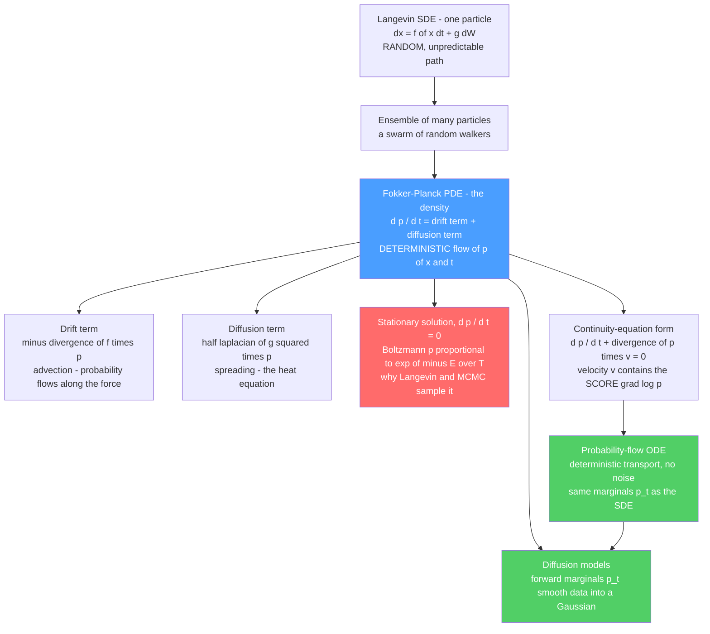

# 🌫️ The Fokker-Planck Equation in Generative Modeling

> [!abstract] TL;DR
> A single particle obeying the **Langevin SDE** $dx = f(x)\,dt + g\,dW$ is *unpredictable* — you can never say where it will be. But the **probability density** $p(x,t)$ of a whole *ensemble* of such particles evolves **deterministically**, governed by the **Fokker-Planck equation** (a.k.a. the Kolmogorov forward equation) $\partial_t p = -\nabla\!\cdot(f\,p) + \tfrac12\nabla^2(g^2 p)$: a **drift term** that transports probability along the force plus a **diffusion term** that spreads it out like heat. This is the bridge from *micro-randomness to macro-determinism*. Set $\partial_t p = 0$ and its **stationary solution is the Boltzmann distribution** $p\propto e^{-E/T}$ — the reason Langevin dynamics *samples* it (with the **fluctuation-dissipation** relation $D=kT/\gamma$ fixing the noise-friction balance). In generative modeling it governs how a **diffusion model's forward process** smooths data into Gaussian noise (the marginals $p_t$), and rewritten as a **continuity equation** $\partial_t p + \nabla\!\cdot(p\,v)=0$ it *is* the deterministic **probability-flow ODE** — with the **score** $\nabla\log p$ as the flow velocity. Fokker-Planck is the master equation of density flow linking Langevin dynamics, diffusion models, non-equilibrium physics, and even SGD training dynamics.

---

## Intuition

**Analogy — one dust mote versus a million.** Watch a single dust mote drifting in a sunbeam and you see pure chaos: an erratic, jittering random walk you could never forecast a second ahead. Now stop watching the one and watch **a million motes at once**. Something orderly appears — a smooth, spreading *cloud* whose density flows in a completely predictable way, exactly like a drop of cream unfurling into coffee. The individual is unknowable; the crowd is lawful.

The **Fokker-Planck equation is the law of that cloud.** It does not track any particle — it tracks the **probability of finding a particle somewhere**, and it says precisely how that probability sloshes and spreads over time. It converts a swarm of unpredictable random walkers into one deterministic river of density. That is the same hidden equation governing how a diffusion model's cloud of noise spreads outward when you corrupt an image, and — run **backward** — how that formless cloud condenses back into a picture. Learn to read this one equation and the forward and reverse of every diffusion model, the reason Markov-chain samplers converge, and a whole slab of non-equilibrium physics all snap into a single picture.

---

## How It Works

### Core Mechanics

**1. Two descriptions of one process.** A diffusion process lives at two levels simultaneously.

- **Microscopic (the SDE / Langevin equation).** One particle:
$$
dx = f(x)\,dt + g\,dW,
$$
where $f(x)$ is the **drift** (a deterministic force, e.g. $-\nabla U$), $g$ scales the **noise**, and $dW$ is a Wiener increment (Gaussian white noise). Every realization is a different random squiggle — *there is no predicting the path* (see [[Stochastic_Differential_Equations_and_Langevin]]).
- **Macroscopic (the Fokker-Planck PDE).** The density $p(x,t)$ of an *ensemble* of independent particles all obeying that SDE:
$$
\boxed{\;\frac{\partial p(x,t)}{\partial t} \;=\; -\,\nabla\!\cdot\!\big(f(x)\,p\big) \;+\; \tfrac12\,\nabla^2\!\big(g^2\,p\big)\;}
$$
This is **deterministic**: given $p$ now, $p$ a moment later is fixed. The randomness of the individual has been integrated away into the certainty of the crowd. Also called the **Kolmogorov forward equation** (probabilists) or the **Smoluchowski equation** (overdamped limit).

**Micro-randomness → macro-determinism.** This is the conceptual heart: you cannot integrate the SDE once and know the answer, but you can integrate the PDE once and know the *entire distribution* for all time. Fokker-Planck is the deterministic shadow cast by an infinity of random trajectories.

**2. The anatomy — drift term + diffusion term.** The right-hand side is two competing effects:

- **Drift / advection term** $-\nabla\!\cdot(f\,p)$. Probability is *transported* bodily along the force field $f$, exactly like a dye carried by a flowing current. In a potential $U$ with $f=-\nabla U$, this term slides density **downhill** toward the minima.
- **Diffusion / spreading term** $\tfrac12\nabla^2(g^2 p)$. Probability *spreads out* — this is literally the **heat equation** operator. It smears sharp peaks into broad bumps, always increasing spread, the density-level face of entropy production.

Their **balance** shapes everything. With **no drift** ($f=0$, constant $g$) Fokker-Planck collapses to the pure heat/diffusion equation $\partial_t p = D\,\nabla^2 p$ ($D=\tfrac12 g^2$), whose solution from a point source is a **Gaussian that spreads forever**, variance growing as $2Dt$ (see [[The_Heat_and_Diffusion_Equation]]). Add a confining drift and the spreading is *countered* by the pull toward minima — the two terms reach a truce, and the density stops changing.

**3. That truce is the Boltzmann distribution.** Set $\partial_t p = 0$ (a **stationary** state). For overdamped Langevin dynamics in a potential $E(x)$ at temperature $T$,
$$
dx = -\nabla E(x)\,dt + \sqrt{2T}\,dW \;\Longrightarrow\; \partial_t p = \nabla\!\cdot\!\big(\nabla E\,p + T\nabla p\big),
$$
the stationary solution is exactly the **Boltzmann / Gibbs distribution**
$$
p_{\text{stat}}(x) \;\propto\; e^{-E(x)/T}.
$$
You can verify it: plug $p\propto e^{-E/T}$ in and the bracket $\nabla E\,p + T\nabla p = \nabla E\,p - \nabla E\,p = 0$ vanishes, so $\partial_t p=0$. **This is the theorem behind sampling**: it is *why* Langevin dynamics, SGLD, and MCMC converge to the target $e^{-E/T}$ (see [[The_Boltzmann_Distribution_in_Learning]], [[MCMC_Sampling_in_Machine_Learning]], and the not-yet-written sibling *Langevin_Dynamics_and_SGLD*). Fokker-Planck is the guarantee that "run the noisy dynamics long enough and your histogram *is* the Boltzmann distribution."

**4. Fluctuation-dissipation — the constraint that makes it correct.** The magic of step 3 only works because the **noise strength and the friction are linked**. In physical (underdamped) form $\gamma\,\dot{x} = -\nabla E + \xi$ with noise correlation $\langle\xi\xi\rangle \propto \gamma T$, the **fluctuation-dissipation theorem** (Einstein relation) demands
$$
D = \frac{kT}{\gamma},
$$
tying the **diffusion coefficient** (fluctuation) to the **friction** (dissipation) through temperature. Get this balance right and equilibrium is Boltzmann; get it wrong (mismatched noise vs. drift, e.g. a step-size/noise mistake in a sampler) and the stationary distribution is silently *biased* — a subtly wrong target. The deep message: **noise and dissipation are two faces of one coin**, and their ratio *is* the temperature.

**5. The role in diffusion models.** A diffusion model's **forward noising process** is itself an SDE, e.g. the variance-preserving process $dx = -\tfrac12\beta(t)\,x\,dt + \sqrt{\beta(t)}\,dW$. Its **marginal densities** $p_t(x)$ — the distribution of a data point after $t$ seconds of corruption — evolve by exactly the **Fokker-Planck equation**. Understanding the forward process *is* understanding $p_t$: Fokker-Planck describes how the data density is **smoothed into a Gaussian** as $t$ grows, each mode broadening and drifting toward the origin until $p_T\approx\mathcal N(0,I)$. This is the theoretical backbone of the forward diffusion (the not-yet-written siblings *The_Forward_and_Reverse_Diffusion_Process* and *Diffusion_Models_as_Non_Equilibrium_Thermodynamics*, and [[Diffusion_Models]]).

**6. The continuity-equation reading — and the probability-flow ODE.** Here is the elegant twist. For constant $g$, use $\tfrac12 g^2\nabla^2 p = \nabla\!\cdot\!\big(\tfrac12 g^2 p\,\nabla\log p\big)$ to rewrite Fokker-Planck as a **continuity equation** — the same conservation law that governs an incompressible fluid:
$$
\frac{\partial p}{\partial t} + \nabla\!\cdot\!\big(p\,v\big) = 0,
\qquad
v(x,t) = f(x) - \tfrac12 g^2\,\underbrace{\nabla\log p_t(x)}_{\text{the score}}.
$$
Probability is *conserved* and *transported* by a velocity field $v$ that contains the **score** $\nabla\log p$. But a continuity equation with velocity $v$ is *exactly* what you get from the **ordinary** differential equation $\dot x = v(x,t)$ — a **deterministic** flow. This is the celebrated **probability-flow ODE** of diffusion models: it has the **same marginals $p_t$** as the stochastic SDE but moves each sample along smooth, noise-free streamlines. Density is carried like a fluid; the score is (part of) the flow velocity. This is what enables fast deterministic samplers (DDIM-style) and exact likelihoods (see the not-yet-written sibling *Score_SDEs_and_Probability_Flow* and [[Score_Matching_and_Score_Based_Models]]).

**7. A quantum aside — the Schrödinger connection.** Via the ground-state substitution $p = \psi_0\,\phi$, the Fokker-Planck operator can be turned into a **Hermitian** operator, mapping the equation onto an **imaginary-time Schrödinger equation** $\partial_t\phi = -H\phi$ with an effective potential $V_{\text{eff}} = \tfrac{(\nabla E)^2}{4T} - \tfrac{\nabla^2 E}{2}$. This "stochastic mechanics" similarity transform links diffusion, Fokker-Planck, and quantum mechanics (see [[Schrodinger_Equation]]) — a signpost that the *same* diffusion-type operator recurs across physics. Optional depth, but a beautiful one.

### Flow / Architecture



---

## Key Concepts

### Secondary Level

- **One particle is chaos; a million is a smooth cloud.** You cannot predict a single random walker, but the *density* of many of them flows predictably. Fokker-Planck is the rule for that flowing cloud.
- **Two forces on the cloud.** A **drift** that carries the cloud along the current (downhill toward valleys) and a **spreading** that smears it out like heat. Their tug-of-war shapes the picture.
- **The cloud can stop changing.** When spreading exactly balances the downhill pull, the cloud freezes into a fixed shape — the **Boltzmann** shape, piled up in the low-energy valleys. That is why "add noise and roll downhill" eventually samples the right distribution.
- **This is a diffusion model.** Forward: the cloud of a picture spreads into featureless noise. Backward: guided by the "which-way-is-denser" arrows (the score), the noise cloud condenses back into a picture.

### Undergraduate Level

- **Fokker-Planck (1D):** $\partial_t p = -\partial_x(f\,p) + \tfrac12\partial_x^2(g^2 p)$ — drift term $-\partial_x(fp)$ plus diffusion term $\tfrac12\partial_x^2(g^2 p)$; the deterministic evolution of the SDE $dx=f\,dt+g\,dW$.
- **Free diffusion = heat equation.** With $f=0$, constant $g$: $\partial_t p = D\,\partial_x^2 p$, $D=\tfrac12 g^2$; a point source spreads to a Gaussian of variance $2Dt$.
- **Stationary state:** $\partial_t p=0$ for $dx=-\nabla E\,dt+\sqrt{2T}\,dW$ gives $p_{\text{stat}}\propto e^{-E/T}$ (Boltzmann) — the reason Langevin dynamics samples $e^{-E/T}$.
- **Fluctuation-dissipation / Einstein relation:** $D = kT/\gamma$ ties noise to friction so equilibrium is Boltzmann; mismatched noise and drift bias the sampler.
- **Continuity form:** $\partial_t p + \partial_x(p\,v)=0$ with $v = f - \tfrac12 g^2\,\partial_x\log p$; the deterministic **probability-flow ODE** $\dot x = v$ shares the SDE's marginals.
- **Forward diffusion:** the marginals $p_t$ of a diffusion model's forward SDE obey Fokker-Planck; data smooths into $\mathcal N(0,I)$.

### Graduate Level

- **Kramers-Moyal / adjoint structure.** Fokker-Planck is the truncation of the Kramers-Moyal expansion at second order; it is the $L^\dagger$ **adjoint** of the backward Kolmogorov generator $L = f\partial_x + \tfrac12 g^2\partial_x^2$. Itô vs. Stratonovich changes the drift by $\tfrac12 g\,g'$ (spurious drift) — matters when $g$ is state-dependent.
- **Probability current and $H$-theorem.** Writing $\partial_t p = -\partial_x J$ with current $J = f p - \partial_x(\tfrac12 g^2 p)$, equilibrium is the *zero-current* (detailed-balance) state; the free energy $\mathcal F[p]=\int p\,E + T\int p\log p$ is a **Lyapunov functional** monotonically decreasing to Boltzmann — Fokker-Planck as gradient flow of $\mathcal F$ in the **Wasserstein-2** metric (Jordan-Kinderlehrer-Otto).
- **Reverse-time SDE vs. probability-flow ODE.** For $dx=f\,dt+g\,dW$, the reverse SDE (Anderson) is $dx=[f-g^2\nabla\log p_t]\,dt+g\,d\bar W$, while the PF ODE $\dot x = f - \tfrac12 g^2\nabla\log p_t$ has the *same* $p_t$; both need only the **score** $\nabla\log p_t$, which denoising score matching estimates — unifying "score-based" and "diffusion."
- **Similarity to Schrödinger.** The transform $p=\psi_0\phi$ symmetrizes the FP operator into $-H$, $H=-D\partial_x^2 + V_{\text{eff}}$ with $V_{\text{eff}}=(\nabla E)^2/(4T)-\nabla^2 E/2$; the FP spectral gap = relaxation rate = ground-state gap of a Schrödinger operator (SUSY QM structure).
- **Kramers' escape.** The mean first-passage time over a barrier $\Delta E$ scales as $\tau\sim e^{\Delta E/T}$ (Arrhenius), a Fokker-Planck result explaining slow mode-mixing of Langevin samplers across low-density gaps.
- **SGD as Fokker-Planck.** The distribution of stochastic-gradient iterates evolves (in the small-step limit) by a Fokker-Planck equation with an *anisotropic, loss-shaped* diffusion tensor; its stationary state is a non-equilibrium Gibbs-like measure that underlies the "SGD-as-sampling / implicit regularization" view of generalization.

---

## Python Demo

```python
# The Fokker-Planck equation as the deterministic law of a particle swarm.
#   (a) FREE DIFFUSION: simulate many Langevin particles dx = sqrt(2D) dW and show
#       their HISTOGRAM matches the analytic spreading Gaussian p(x,t)=N(0,2Dt)
#       -- i.e. the heat-equation solution of Fokker-Planck with no drift.
#   (b) HARMONIC POTENTIAL: particle histogram vs a FINITE-DIFFERENCE Fokker-Planck
#       PDE solve, converging to the STATIONARY BOLTZMANN distribution p ~ exp(-U/T).
#   (c) DIFFUSION MODEL: the forward-process marginals p_t (a data mixture smoothing
#       into a standard Gaussian) ARE Fokker-Planck evolution.
import numpy as np
import matplotlib.pyplot as plt

rng = np.random.default_rng(0)
D   = 0.5                      # diffusion coefficient (= T for the potential case below)
dt  = 0.01                     # SDE time step
N   = 20000                    # number of particles in the swarm

fig, ax = plt.subplots(1, 3, figsize=(17, 5.0))

# ============================================================
# (a) FREE DIFFUSION  ->  Fokker-Planck IS the heat equation
#     SDE: dx = sqrt(2D) dW ;   p(x,t) from a point source = N(0, 2 D t)
# ============================================================
def simulate_free(T_end):
    x = np.zeros(N)
    for _ in range(int(T_end / dt)):
        x += np.sqrt(2 * D * dt) * rng.standard_normal(N)   # pure Brownian step
    return x

xs = np.linspace(-6, 6, 400)
for T_end, col in zip([0.5, 2.0, 5.0], ["#1f77b4", "#2ca02c", "#d62728"]):
    x = simulate_free(T_end)
    ax[0].hist(x, bins=60, range=(-6, 6), density=True, histtype="stepfilled",
               alpha=0.30, color=col)
    var = 2 * D * T_end                                     # analytic FP variance
    p_analytic = np.exp(-xs**2 / (2 * var)) / np.sqrt(2 * np.pi * var)
    ax[0].plot(xs, p_analytic, color=col, lw=2.2, label=f"FP p(x,t), t={T_end}")
ax[0].set_title("(a) Free diffusion: particle swarm vs\nanalytic Fokker-Planck Gaussian N(0, 2Dt)")
ax[0].set_xlabel("x"); ax[0].set_ylabel("density"); ax[0].legend(fontsize=8)

# ============================================================
# (b) HARMONIC POTENTIAL  ->  convergence to the Boltzmann stationary state
#     U(x) = 0.5 k x^2,  f = -k x,  dx = -k x dt + sqrt(2D) dW
#     Stationary FP solution: p ~ exp(-U/D) = N(0, D/k)   (Boltzmann, T=D)
# ============================================================
k = 1.0
def simulate_ou(T_end, x_init):
    x = x_init.copy()
    for _ in range(int(T_end / dt)):
        x += -k * x * dt + np.sqrt(2 * D * dt) * rng.standard_normal(x.size)
    return x

# Finite-difference solve of the Fokker-Planck PDE (explicit Euler, central diffs):
xg = np.linspace(-5, 5, 401)
dx = xg[1] - xg[0]
dt_fp = 2e-4                                                # obeys dt < dx^2/(2D)
def fp_solve(p0, T_end):
    p = p0.copy()
    f = -k * xg                                             # drift field
    for _ in range(int(T_end / dt_fp)):
        J   = f * p                                         # drift flux  f*p
        dJ  = np.zeros_like(p); dJ[1:-1]  = (J[2:] - J[:-2]) / (2 * dx)
        d2p = np.zeros_like(p); d2p[1:-1] = (p[2:] - 2 * p[1:-1] + p[:-2]) / dx**2
        p[1:-1] += dt_fp * (-dJ[1:-1] + D * d2p[1:-1])      # dp/dt = -d(fp)/dx + D d2p/dx2
        p[0] = p[-1] = 0.0                                  # far-field boundaries
        p = np.clip(p, 0.0, None)
    return p / np.trapz(p, xg)                              # renormalize

# Both particles and PDE start as a narrow cloud OFF-CENTER at x = 2.5:
x_init = 2.5 + 0.15 * rng.standard_normal(N)
p_init = np.exp(-(xg - 2.5)**2 / (2 * 0.15**2)) / np.sqrt(2 * np.pi * 0.15**2)

for T_end, col in zip([0.3, 1.0, 3.0], ["#1f77b4", "#2ca02c", "#d62728"]):
    x = simulate_ou(T_end, x_init)
    ax[1].hist(x, bins=60, range=(-5, 5), density=True, histtype="stepfilled",
               alpha=0.28, color=col)
    p_fp = fp_solve(p_init, T_end)
    ax[1].plot(xg, p_fp, color=col, lw=2.2, label=f"FP PDE, t={T_end}")
var_stat = D / k
p_boltz = np.exp(-xg**2 / (2 * var_stat)) / np.sqrt(2 * np.pi * var_stat)
ax[1].plot(xg, p_boltz, "k--", lw=2.0, label="Boltzmann  p ~ exp(-U/T)")
ax[1].set_title("(b) Harmonic well: swarm histogram vs finite-diff\nFokker-Planck, converging to Boltzmann")
ax[1].set_xlabel("x"); ax[1].set_ylabel("density"); ax[1].legend(fontsize=8)

# ============================================================
# (c) DIFFUSION MODEL forward marginals p_t as Fokker-Planck evolution
#     VP forward SDE dx = -0.5 x dt + dW ;  marginal of x0: N(x0 e^{-t/2}, 1 - e^{-t})
#     Data = bimodal mixture; p_t smooths it into N(0,1) as t grows.
# ============================================================
data_mu, data_w, s = np.array([-2.2, 1.6]), np.array([0.5, 0.5]), 0.22
def p_t(x, t):
    a   = np.exp(-t / 2.0)                                  # mean-decay factor
    var = s**2 * np.exp(-t) + (1.0 - np.exp(-t))            # variance of the marginal
    p = np.zeros_like(x)
    for mu, w in zip(data_mu, data_w):
        p += w * np.exp(-(x - mu * a)**2 / (2 * var)) / np.sqrt(2 * np.pi * var)
    return p

xg2 = np.linspace(-5, 5, 500)
for t, col in zip([0.0, 0.4, 1.2, 4.0], ["#7b2cbf", "#1f77b4", "#2ca02c", "#d62728"]):
    ax[2].plot(xg2, p_t(xg2, t), color=col, lw=2.2, label=f"p_t, t={t}")
ax[2].plot(xg2, np.exp(-xg2**2 / 2) / np.sqrt(2 * np.pi), "k--", lw=2.0, label="N(0,1) prior")
ax[2].set_title("(c) Diffusion forward process: p_t marginals\n(Fokker-Planck) smoothing data into a Gaussian")
ax[2].set_xlabel("x"); ax[2].set_ylabel("density"); ax[2].legend(fontsize=8)

plt.tight_layout()
plt.savefig("fokker_planck_generative.png", dpi=110)
print("saved fokker_planck_generative.png")

# Quantitative check: swarm variance vs Fokker-Planck prediction (free diffusion)
for T_end in [0.5, 2.0, 5.0]:
    v_emp = simulate_free(T_end).var()
    print(f"t={T_end}:  empirical var={v_emp:6.3f}   FP prediction 2Dt={2*D*T_end:6.3f}")
```

**What it shows.** Panel **(a)** simulates thousands of *individual* Brownian particles and histograms them at three times; each histogram lands squarely on the **analytic Fokker-Planck Gaussian** $\mathcal N(0,2Dt)$ — the swarm of unpredictable walkers reproduces the deterministic spreading density, and the printed variances confirm $\mathrm{Var}\approx 2Dt$. Panel **(b)** adds a harmonic drift: the particle histogram is overlaid with an *independent* finite-difference solve of the Fokker-Planck **PDE** (never using the particles), and both march in lockstep from the off-center start toward the **Boltzmann** stationary distribution $\mathcal N(0,D/k)$ (dashed) — a direct demonstration that "add noise + roll downhill" samples $e^{-U/T}$. Panel **(c)** plots a diffusion model's **forward marginals** $p_t$: a bimodal data density is smoothed, mode by mode, into the standard Gaussian prior — this smoothing *is* Fokker-Planck evolution, the theoretical description of the forward diffusion whose score the reverse process learns.

---

## Real-World Applications

- **Diffusion generative models.** Fokker-Planck governs the **forward marginals** $p_t$ (data → noise), and its continuity-equation form yields the **probability-flow ODE** behind fast deterministic samplers (DDIM) and exact-likelihood evaluation in Stable Diffusion, DALL·E, and Imagen (see [[Diffusion_Models]], [[Score_Matching_and_Score_Based_Models]]).
- **Statistical physics and non-equilibrium thermodynamics.** The original home: **Brownian motion**, colloidal dynamics, and reaction-rate theory (**Kramers' escape**, $\tau\sim e^{\Delta E/T}$) are all Fokker-Planck problems; it is the master equation of near-equilibrium relaxation and connects to fluctuation theorems (the not-yet-written sibling *Fluctuation_Theorems_and_the_Jarzynski_Equality*).
- **Bayesian sampling and MCMC.** It is the theoretical certificate that **Langevin dynamics, SGLD, and unadjusted Langevin** converge to the posterior/Boltzmann target, and it quantifies the bias when the noise-drift balance (fluctuation-dissipation) is broken (see [[MCMC_Sampling_in_Machine_Learning]]).
- **Stochastic control and filtering.** The Fokker-Planck / forward Kolmogorov equation propagates state uncertainty in continuous-time estimation (the density in the Kushner-Stratonovich and Zakai filtering equations, and in path-integral control).
- **Quantitative finance.** The **forward Kolmogorov equation** propagates the risk-neutral density of an asset price forward in time; the Dupire local-volatility formula and option-price densities are Fokker-Planck consequences.
- **Population dynamics and stochastic biology.** Gene-expression noise, neural population activity, and evolutionary allele-frequency drift (the diffusion approximation of Wright-Fisher) are modeled by Fokker-Planck equations.
- **Analysis of SGD training dynamics.** The distribution of stochastic-gradient iterates evolves by a Fokker-Planck equation whose stationary state is a non-equilibrium Gibbs-like measure — the formal basis of the "SGD as approximate sampling / flat-minima generalization" view.

---

## Common Pitfalls

- **Confusing the equation for the density with an equation for the path.** Fokker-Planck does **not** predict where a particle goes — it predicts the *distribution*. Beginners try to "solve for $x(t)$"; there is no such deterministic solution, only $p(x,t)$.
- **Itô vs. Stratonovich when the noise is state-dependent.** For constant $g$ the drift term is unambiguous, but for $g=g(x)$ the two conventions differ by the **spurious drift** $\tfrac12 g\,g'$. Using the wrong FP drift gives the wrong stationary distribution. State the calculus you mean.
- **Breaking fluctuation-dissipation in samplers.** If the injected noise variance is not matched to the step size (e.g. $\sqrt{2\epsilon}$ vs. $\sqrt{\epsilon}$, or a mis-scaled temperature), the Langevin chain converges to a **biased** target, not $e^{-E/T}$. The correct balance *is* the Einstein relation $D=kT/\gamma$.
- **Unstable finite-difference solves.** Explicit schemes for the diffusion term require $\Delta t \le \Delta x^2/(2D)$; violate it and the PDE blows up. Also enforce non-negativity and renormalize (probability must stay $\ge 0$ and integrate to 1), and keep the domain wide enough that the far-field boundary truly holds $p\approx 0$.
- **Assuming a stationary state exists.** A non-confining drift (unbounded potential downhill, pure free diffusion) has **no** normalizable stationary density — the cloud spreads forever. Boltzmann is the steady state only for a *confining* potential.
- **Forgetting the score in the flow velocity.** The probability-flow ODE velocity is $f - \tfrac12 g^2\nabla\log p_t$, **not** just the drift $f$. Dropping the score term gives the wrong marginals; the score is what makes the ODE share the SDE's density.
- **Reading the diffusion term as "smoothing the data" only.** In the *forward* process it spreads data into noise; run in reverse (with the score) that same operator *sharpens* noise into data. The sign/direction of time flips its qualitative effect.

---

## Related Concepts

- [[Stochastic_Differential_Equations_and_Langevin]] — the microscopic SDE whose ensemble density Fokker-Planck describes; the two-level pair at the heart of this note.
- [[Score_Matching_and_Score_Based_Models]] — the score $\nabla\log p_t$ that appears as the velocity in Fokker-Planck's continuity form and in the reverse SDE.
- [[The_Boltzmann_Distribution_in_Learning]] — the stationary solution $p\propto e^{-E/T}$ of the Fokker-Planck equation, and why Langevin samples it.
- [[The_Heat_and_Diffusion_Equation]] — the driftless special case; the diffusion term *is* the heat operator, and free diffusion is exactly this PDE.
- [[Finite_Difference_Methods]] — the numerical scheme used in the demo to solve the Fokker-Planck PDE directly.
- [[Diffusion_Models]] — generative models whose forward marginals $p_t$ obey Fokker-Planck and whose fast samplers use the probability-flow ODE.
- [[DDPM_Paper]] — denoising diffusion, whose forward Markov chain is the discretized SDE with Fokker-Planck marginals.
- [[MCMC_Sampling_in_Machine_Learning]] — samplers whose convergence to the target is guaranteed by the Fokker-Planck stationary theorem.
- [[Metropolis_Hastings_and_Detailed_Balance]] — the zero-probability-current / detailed-balance condition that Fokker-Planck's stationary state realizes.
- [[Temperature_and_Annealing_in_Learning]] — the temperature $T$ that sets the diffusion strength and the shape of the Boltzmann stationary state.
- [[Energy_Based_Models]] — the energy $E$ whose Boltzmann density $e^{-E/T}$ is the Fokker-Planck fixed point.
- [[Partition_Functions_and_Free_Energy_in_ML]] — the free energy that decreases monotonically to equilibrium (Fokker-Planck as its gradient flow).
- [[Classical_Statistical_Mechanics]] — the canonical ensemble and Brownian-motion physics where Fokker-Planck originates.
- [[Entropy_and_Second_Law]] — the entropy production that the diffusion (spreading) term embodies at the density level.
- [[Partial_Differential_Equations]] — the parabolic-PDE machinery classifying and solving the Fokker-Planck equation.
- [[Introduction_to_PDEs]] — foundational PDE concepts (advection + diffusion) that the drift and diffusion terms instantiate.
- [[Schrodinger_Equation]] — the imaginary-time Schrödinger equation that Fokker-Planck maps to under a similarity transform.

---

## Review Questions

**Secondary.** Using the "one dust mote versus a million" picture, explain why the path of a single random particle is impossible to predict yet the *density* of a whole cloud of them evolves in a completely predictable way. Which two things act on that cloud — one that carries it and one that spreads it — and what fixed shape does it settle into when they balance?

**Undergraduate.** (a) Write the 1D Fokker-Planck equation for the SDE $dx = f(x)\,dt + g\,dW$ and identify the drift and diffusion terms. (b) For $f=0$ and constant $g$, show it reduces to the heat equation and that a point source spreads to a Gaussian of variance $2Dt$ with $D=\tfrac12 g^2$. (c) For $dx=-\nabla E\,dt+\sqrt{2T}\,dW$, verify by substitution that $p\propto e^{-E/T}$ makes $\partial_t p = 0$, and explain in one sentence why this is *the* reason Langevin dynamics samples the Boltzmann distribution.

**Graduate.** (a) Starting from the Fokker-Planck equation, derive its continuity-equation form $\partial_t p + \nabla\!\cdot(p\,v)=0$ and show that the velocity is $v = f - \tfrac12 g^2\nabla\log p$, identifying the score term. (b) Explain how this yields the deterministic probability-flow ODE and why it shares all marginals $p_t$ with the stochastic reverse-time SDE $dx=[f-g^2\nabla\log p_t]dt+g\,d\bar W$. (c) Discuss two consequences of the fluctuation-dissipation relation $D=kT/\gamma$: one for the *correctness* of a Langevin sampler and one for the *Arrhenius* $e^{\Delta E/T}$ scaling of Kramers escape times across a barrier (and hence slow mode-mixing).

---

## Sources

- H. Risken, *The Fokker-Planck Equation: Methods of Solution and Applications*, 2nd ed., Springer (1996). [link](https://link.springer.com/book/10.1007/978-3-642-61544-3)
- C. W. Gardiner, *Handbook of Stochastic Methods for Physics, Chemistry and the Natural Sciences*, Springer (2004). [link](https://link.springer.com/book/9783540208822)
- Y. Song, J. Sohl-Dickstein, D. P. Kingma, A. Kumar, S. Ermon, B. Poole, "Score-Based Generative Modeling through Stochastic Differential Equations," *ICLR* 2021. [arXiv:2011.13456](https://arxiv.org/abs/2011.13456)
- B. D. O. Anderson, "Reverse-Time Diffusion Equation Models," *Stochastic Processes and their Applications* 12(3):313–326 (1982). [link](https://doi.org/10.1016/0304-4149(82)90051-5)
- R. Jordan, D. Kinderlehrer, F. Otto, "The Variational Formulation of the Fokker-Planck Equation," *SIAM J. Math. Anal.* 29(1):1–17 (1998). [link](https://doi.org/10.1137/S0036141096303359)

---

#statistical-mechanics #machine-learning #fokker-planck #diffusion #stochastic-processes
