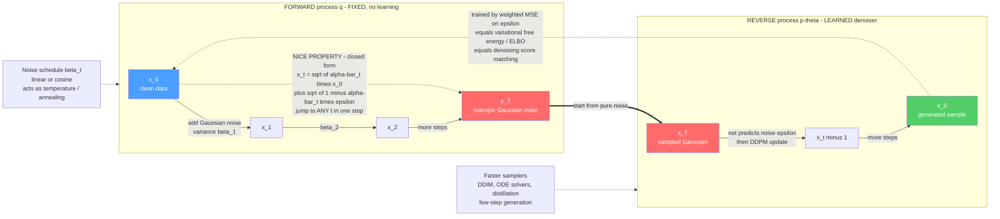

# 🌫️ The Forward and Reverse Diffusion Process

> [!abstract] TL;DR
> A diffusion model is a **matched pair of processes**. The **forward process** is a *fixed, un-learned recipe*: take a data point $x_0$ and, over $T$ tiny steps, sprinkle in a little **Gaussian noise** each time until nothing remains but isotropic static $x_T\sim\mathcal N(0,I)$ — a discrete Ornstein-Uhlenbeck chain relaxing to equilibrium. The magic is the **"nice property":** because every step is Gaussian and independent, the marginal $q(x_t\mid x_0)$ has a **closed form**, $x_t=\sqrt{\bar\alpha_t}\,x_0+\sqrt{1-\bar\alpha_t}\,\varepsilon$, so training can **jump straight to any noise level** without simulating the chain. The **reverse process** is the *learned* half: because the forward steps are so small, the reverse conditionals $p_\theta(x_{t-1}\mid x_t)$ are also approximately Gaussian, so a network need only **predict the noise $\varepsilon$** that was added. Ho, Jain & Abbeel (2020) showed the variational bound collapses to a plain **weighted mean-squared error** on that noise — a loss that is *simultaneously* an ELBO / variational free energy **and** denoising score matching. Run the reverse chain from pure noise back to $x_0$ and the machine paints a brand-new sample. **Noise schedules** (linear, cosine) act as a temperature/annealing knob; **faster samplers** (DDIM, distillation) fight the slow multi-step generation. This forward/reverse pair is the mechanical heart of Stable Diffusion, DALL·E, Sora, and modern generative AI.

---

## Intuition

**Analogy — to teach a machine to paint, first teach it to *destroy*.** Take a photograph and, over a few hundred tiny steps, sprinkle in noise: a dusting of fuzz, then a little more, then more, until the picture dissolves into the meaningless snow of an untuned television. This destruction needs **no intelligence at all** — it is a fixed recipe, "add a little more static," that a pocket calculator could follow. The whole trick of diffusion is that each destruction step is so **small** and so **Gaussian** that it can be **undone**. If someone showed you a *slightly* fuzzier version of a photo you know, you could make a decent guess at the slightly-cleaner version underneath. So we train a network to answer exactly that question at every noise level: *"what did the slightly-less-noisy image look like?"* — equivalently, *"what noise did I just add?"* Chain those guesses together **backward**, starting from pure static, and the network hallucinates a brand-new photograph that never existed, one denoising step at a time.

That is the entire subject: a **destroy-then-rebuild pair**. The forward "destroy" half is free and fixed; the reverse "rebuild" half is where all the learning lives. Because destruction is nothing but repeatedly adding Gaussian noise — the same physics that smears a drop of ink through water or lets a pollen grain jitter in Brownian motion — the reverse is nothing but repeatedly removing it. Master the mechanics of this pair and you have the mathematical core of every diffusion model.

---

## How It Works

### Core Mechanics

**1. The forward process — a fixed Markov chain of Gaussian corruption.**
Pick a variance schedule $\beta_1,\dots,\beta_T$ with $0<\beta_t\ll 1$. The forward ("diffusion") process is the Markov chain

$$q(x_t\mid x_{t-1}) = \mathcal N\!\big(x_t;\ \sqrt{1-\beta_t}\,x_{t-1},\ \beta_t I\big).$$

Each step **shrinks the signal** by $\sqrt{1-\beta_t}$ and **injects** fresh isotropic Gaussian noise of variance $\beta_t$. There is **nothing to learn here** — the whole chain is predefined. Iterating it for $T$ steps drives *any* data distribution toward an isotropic standard Gaussian $x_T\sim\mathcal N(0,I)$: this is a discrete **Ornstein-Uhlenbeck** process, a mean-reverting random walk relaxing to its equilibrium (see [[Brownian_Motion]] and [[Stochastic_Differential_Equations_and_Langevin]]). In statistical-mechanics language the forward process **carries structured data to the featureless high-entropy equilibrium** of the standard normal — the non-equilibrium "destruction" of order into thermal noise.

**2. The "nice property" — a closed form for any timestep.**
Simulating the chain step-by-step to reach a random $t$ during training would be hopelessly slow. But because a sum of independent Gaussians is Gaussian, the marginal from clean data to *any* level admits a **closed form**. Define $\alpha_t=1-\beta_t$ and the **cumulative product** $\bar\alpha_t=\prod_{s=1}^{t}\alpha_s$. Then

$$\boxed{\,q(x_t\mid x_0)=\mathcal N\!\big(x_t;\ \sqrt{\bar\alpha_t}\,x_0,\ (1-\bar\alpha_t)I\big)\quad\Longleftrightarrow\quad x_t=\sqrt{\bar\alpha_t}\,x_0+\sqrt{1-\bar\alpha_t}\,\varepsilon,\ \ \varepsilon\sim\mathcal N(0,I).\,}$$

This single reparameterization is the reason diffusion is *trainable*. To make a training example you **sample one random timestep $t$**, draw one Gaussian $\varepsilon$, and **jump directly** to $x_t$ in one line of code — no chain simulation. As $t\to T$, $\bar\alpha_t\to 0$ and $x_t\to\varepsilon$: pure noise. As $t\to 0$, $\bar\alpha_t\to 1$ and $x_t\to x_0$: clean data. The ratio $\mathrm{SNR}(t)=\bar\alpha_t/(1-\bar\alpha_t)$ is the **signal-to-noise ratio** that decays monotonically along the chain.

**3. The reverse process — a learned Gaussian denoiser.**
Generation runs the chain **backward**: start at $x_T\sim\mathcal N(0,I)$ and peel off noise until $x_0$. The true reverse conditional $q(x_{t-1}\mid x_t)$ is intractable (it needs the whole data distribution), but a deep fact rescues us: **if each forward step $\beta_t$ is small enough, the reverse conditional is itself approximately Gaussian** (Feller/Sohl-Dickstein). So we only need a model of its **mean** and **variance**:

$$p_\theta(x_{t-1}\mid x_t)=\mathcal N\!\big(x_{t-1};\ \mu_\theta(x_t,t),\ \Sigma_\theta(x_t,t)\big).$$

The network does all the hard denoising work — learning where the clean data was hiding under the static at every noise level. Running this learned Markov chain from $x_T$ down to $x_0$ **generates a sample**.

**4. The denoising objective — predict the noise, get a simple MSE.**
Rather than parameterizing $\mu_\theta$ directly, Ho et al. use the closed form of step 2 to reparameterize the mean in terms of a **noise-prediction network** $\varepsilon_\theta(x_t,t)$ that guesses the $\varepsilon$ used to make $x_t$. The DDPM posterior mean becomes

$$\mu_\theta(x_t,t)=\frac{1}{\sqrt{\alpha_t}}\!\left(x_t-\frac{\beta_t}{\sqrt{1-\bar\alpha_t}}\,\varepsilon_\theta(x_t,t)\right).$$

With this, the intimidating variational bound (step 5) **collapses to a plain weighted mean-squared error** — the "simple loss":

$$\boxed{\,\mathcal L_{\text{simple}}=\mathbb E_{x_0,\,t,\,\varepsilon}\Big[\big\|\varepsilon-\varepsilon_\theta\big(\sqrt{\bar\alpha_t}\,x_0+\sqrt{1-\bar\alpha_t}\,\varepsilon,\ t\big)\big\|^2\Big].\,}$$

This is a **stable regression** — no adversarial game, no partition function, no MCMC inner loop. You sample a datapoint, a timestep, and a noise vector; corrupt with the closed form; and ask the net to name the noise. That stability is exactly why diffusion overtook GANs.

**5. The variational / free-energy grounding.**
The loss is not a heuristic — it is a **variational bound on the negative log-likelihood**. A diffusion model is a **hierarchical latent-variable model**: a deep VAE whose encoder is the *fixed* noising chain and whose decoder is the *learned* reverse chain. The ELBO on $-\log p_\theta(x_0)$ decomposes into a sum of KL terms,

$$-\log p_\theta(x_0)\ \le\ \underbrace{D_{\mathrm{KL}}\!\big(q(x_T\mid x_0)\,\|\,p(x_T)\big)}_{\text{prior match}}+\sum_{t>1}\underbrace{D_{\mathrm{KL}}\!\big(q(x_{t-1}\mid x_t,x_0)\,\|\,p_\theta(x_{t-1}\mid x_t)\big)}_{\text{per-step denoising}}-\underbrace{\log p_\theta(x_0\mid x_1)}_{\text{reconstruction}},$$

and because the true posterior $q(x_{t-1}\mid x_t,x_0)$ is a Gaussian with a closed-form mean, each KL term reduces to a squared difference of means — i.e. the $\varepsilon$-MSE above (up to a per-$t$ weight $\lambda_t$ that Ho et al. drop for better samples). This is the **variational free energy** of [[Free_Energy_Minimization_and_Variational_Principles]] made concrete: minimizing the diffusion loss *is* free-energy minimization on a hierarchical model, connecting it directly to the ELBO of [[Variational_Inference_the_ELBO_and_VAEs]].

**6. Two readings of the same loss — free energy *and* score matching.**
The very same objective is **denoising score matching** at each noise level. Because $x_t=\sqrt{\bar\alpha_t}x_0+\sqrt{1-\bar\alpha_t}\,\varepsilon$, the score of the noised marginal satisfies

$$\nabla_{x_t}\log q(x_t)=-\frac{\varepsilon_\theta(x_t,t)}{\sqrt{1-\bar\alpha_t}},$$

so **predicting the noise is estimating the score** (up to the fixed scale $\sqrt{1-\bar\alpha_t}$). DDPM's $\varepsilon$-prediction and the noise-conditional score networks of [[Score_Matching_and_Score_Based_Models]] are two names for one object — a duality developed further in the sibling *Score_Matching_and_Score_Based_Models* view and the not-yet-written *Score_SDEs_and_Probability_Flow*.

**7. Noise schedules — the annealing/temperature knob.**
The schedule $\{\beta_t\}$ controls *how fast* signal is destroyed and strongly affects sample quality. The original **linear** schedule ($\beta_t$ from $10^{-4}$ to $0.02$) destroys information too abruptly at high resolution; Nichol & Dhariwal's **cosine** schedule keeps more signal in the middle of the chain and improves likelihood and samples. Functionally the schedule is a **temperature/annealing schedule** (see [[Temperature_and_Annealing_in_Learning]]): early reverse steps operate at "high temperature" (broad, exploratory, global structure) and late steps at "low temperature" (sharp, local detail). In continuous time the whole design reduces to choosing how the **log-SNR** decays.

**8. Sampling and speed — the practical bottleneck.**
Ancestral DDPM sampling runs *every* reverse step: $x_{t-1}=\mu_\theta(x_t,t)+\sigma_t z$ with $z\sim\mathcal N(0,I)$, which for $T=1000$ means **1000 network evaluations per image** — slow. The push for **few-step generation** gave us **DDIM** (a *deterministic*, non-Markovian sampler that skips steps and needs no added noise), **higher-order ODE solvers** (DPM-Solver), and **distillation / consistency models** that compress the trajectory to a handful of steps. Text-to-image quality is steered by **classifier-free guidance**, which extrapolates between conditional and unconditional $\varepsilon$-predictions to sharpen adherence to a prompt. These tricks are what make the forward/reverse engine practical at product scale.

**9. The score/SDE bridge — the deeper unification.**
The discrete forward and reverse chains are **discretizations of continuous stochastic differential equations**. The forward SDE $dx=f(x,t)\,dt+g(t)\,dW$ (VP-SDE for DDPM) has an exact **reverse-time SDE** whose drift contains the **score** $\nabla_x\log p_t(x)$ — precisely what $\varepsilon_\theta$ learns — and a deterministic **probability-flow ODE** sharing the same marginals. Predicting noise = estimating the score = simulating a reverse diffusion. This is the unified picture foreshadowed by the siblings *Diffusion_Models_as_Non_Equilibrium_Thermodynamics*, *The_Fokker_Planck_Equation_in_Generative_Modeling*, *Score_SDEs_and_Probability_Flow*, and *Langevin_Dynamics_and_SGLD*.

### Flow / Architecture



---

## Key Concepts

### Secondary Level

- **Two processes, one model.** A *forward* recipe destroys data into static by adding a pinch of noise over and over; a *learned* reverse process rebuilds data from static by removing noise step by step.
- **Destruction is free.** The forward half needs no intelligence — it is a fixed rule. All the learning is in the reverse half.
- **Undo one small step at a time.** Because each step of noise is tiny, a network can guess the slightly-cleaner version — and chaining those guesses backward paints a new picture from pure static.
- **The training game is "name the noise."** Show the network a fuzzed image and ask which noise was added; getting good at that *is* learning to generate.

### Undergraduate Level

- **Forward Markov chain:** $q(x_t\mid x_{t-1})=\mathcal N(\sqrt{1-\beta_t}\,x_{t-1},\ \beta_t I)$ — signal scaled by $\sqrt{1-\beta_t}$, noise of variance $\beta_t$ added; fully fixed.
- **Nice property (closed form):** $x_t=\sqrt{\bar\alpha_t}\,x_0+\sqrt{1-\bar\alpha_t}\,\varepsilon$ with $\bar\alpha_t=\prod_s(1-\beta_s)$ — sample any timestep in one shot.
- **Reverse conditional is approximately Gaussian** when $\beta_t$ is small, so learn its mean via a **noise predictor** $\varepsilon_\theta(x_t,t)$.
- **Simple loss:** $\mathcal L=\mathbb E\|\varepsilon-\varepsilon_\theta(x_t,t)\|^2$ — a stable MSE regression, no adversary.
- **DDPM update:** $x_{t-1}=\frac{1}{\sqrt{\alpha_t}}\big(x_t-\frac{\beta_t}{\sqrt{1-\bar\alpha_t}}\varepsilon_\theta\big)+\sigma_t z$; drop the $z$ term for the deterministic DDIM path.
- **Schedule matters:** linear vs cosine $\beta_t$ changes how fast noise is added and the final sample quality; it is an annealing/temperature schedule.

### Graduate Level

- **Variational bound:** $-\log p_\theta(x_0)\le \mathbb E_q\big[D_{\mathrm{KL}}(q(x_T\mid x_0)\|p(x_T))+\sum_{t>1}D_{\mathrm{KL}}(q(x_{t-1}\mid x_t,x_0)\|p_\theta)-\log p_\theta(x_0\mid x_1)\big]$; each KL is Gaussian-vs-Gaussian and reduces to a mean-squared error in $\varepsilon$.
- **Tractable posterior:** $q(x_{t-1}\mid x_t,x_0)=\mathcal N(\tilde\mu_t(x_t,x_0),\tilde\beta_t I)$ with $\tilde\beta_t=\frac{1-\bar\alpha_{t-1}}{1-\bar\alpha_t}\beta_t$ — the target the reverse mean is trained to match.
- **Loss weighting:** the ELBO carries per-$t$ weights $\lambda_t=\frac{\beta_t^2}{2\sigma_t^2\alpha_t(1-\bar\alpha_t)}$; setting $\lambda_t\equiv 1$ (the "simple" loss) upweights larger $t$ and empirically improves sample quality.
- **Score identity:** $\nabla_{x_t}\log q(x_t)=-\varepsilon_\theta(x_t,t)/\sqrt{1-\bar\alpha_t}$, so $\varepsilon$-prediction *is* denoising score matching; Tweedie's formula gives the optimal denoiser $\mathbb E[x_0\mid x_t]=(x_t-\sqrt{1-\bar\alpha_t}\,\varepsilon_\theta)/\sqrt{\bar\alpha_t}$.
- **Continuous-time (VP-SDE):** forward $dx=-\tfrac12\beta(t)x\,dt+\sqrt{\beta(t)}\,dW$; reverse $dx=[-\tfrac12\beta x-\beta\nabla_x\log p_t]\,dt+\sqrt{\beta}\,d\bar W$; the probability-flow ODE drops the noise and halves the score term, giving exact likelihoods.
- **Parameterization choices:** $\varepsilon$-prediction vs $x_0$-prediction vs **$v$-prediction** ($v=\sqrt{\bar\alpha_t}\varepsilon-\sqrt{1-\bar\alpha_t}x_0$); $v$-prediction stabilizes distillation and high-guidance regimes.

---

## Python Demo

```python
# The forward and reverse diffusion process on 2D data, from scratch (numpy + matplotlib).
#
# (a) FORWARD: build a beta schedule, then use the CLOSED FORM
#         x_t = sqrt(alpha_bar_t) * x_0 + sqrt(1 - alpha_bar_t) * eps
#     to jump a "two moons" dataset directly to any timestep -> clean ... to ... Gaussian static.
#
# (b) REVERSE: instead of training a net, use the EXACT (analytic) optimal noise-predictor.
#     Treating the data as an equal-weight Gaussian-mixture prior, the noised marginal q(x_t)
#     is a mixture of Gaussians whose score is available in closed form; the optimal
#     epsilon-prediction is  eps* = -sqrt(1 - alpha_bar_t) * score.  We plug that into the
#     DDPM ancestral update and sample from pure noise back to data -- the exact mechanics
#     a trained network approximates.  We also show that FEWER reverse steps => worse samples.
import numpy as np
import matplotlib.pyplot as plt

rng = np.random.default_rng(0)

# ---------- target dataset: two interleaving half-moons ----------
def two_moons(n, noise=0.06):
    n1 = n // 2; n2 = n - n1
    t1 = np.pi * rng.uniform(0, 1, n1)                 # upper moon
    m1 = np.stack([np.cos(t1), np.sin(t1)], 1)
    t2 = np.pi * rng.uniform(0, 1, n2)                 # lower moon, shifted
    m2 = np.stack([1 - np.cos(t2), 0.5 - np.sin(t2)], 1)
    X = np.concatenate([m1, m2], 0)
    X = (X - X.mean(0)) / X.std(0)                     # standardize to ~unit scale
    return X + noise * rng.normal(size=X.shape)

X0_full = two_moons(4000)
centers = X0_full[rng.choice(len(X0_full), 500, replace=False)]  # mixture-prior support

# ---------- (a) forward: variance schedule + closed-form marginals ----------
def make_schedule(T, b0=1e-4, b1=0.02):
    betas = np.linspace(b0, b1, T)                     # linear beta schedule
    alphas = 1.0 - betas
    alpha_bar = np.cumprod(alphas)                     # the "nice" cumulative product
    return betas, alphas, alpha_bar

T = 200
betas, alphas, alpha_bar = make_schedule(T)

def q_sample(x0, t_idx):
    """Closed form: jump straight to timestep t_idx (0-based) in ONE step."""
    ab = alpha_bar[t_idx]
    eps = rng.normal(size=x0.shape)
    return np.sqrt(ab) * x0 + np.sqrt(1 - ab) * eps

fwd_ts = [0, T // 8, T // 4, T // 2, T - 1]            # snapshots clean -> static
fwd_snaps = [q_sample(X0_full, t) for t in fwd_ts]

# ---------- exact optimal noise predictor via the mixture score ----------
def mixture_score(x, mu, var):
    """grad_x log p(x) for an equal-weight isotropic Gaussian mixture.
    x: (N,2), mu (centers): (M,2), var: scalar.  Returns (N,2)."""
    diff = x[:, None, :] - mu[None, :, :]              # (N, M, 2)
    sq = (diff ** 2).sum(-1)                           # (N, M)
    logw = -0.5 * sq / var
    logw -= logw.max(1, keepdims=True)                 # stabilize softmax
    w = np.exp(logw); w /= w.sum(1, keepdims=True)     # responsibilities (N, M)
    return (w[:, :, None] * (-diff)).sum(1) / var      # sum_i w_i (mu_i - x)/var

def eps_star(x, t_idx):
    """Exact optimal epsilon-prediction = -sqrt(1-alpha_bar) * score of q(x_t)."""
    ab = alpha_bar[t_idx]
    mu_t = np.sqrt(ab) * centers                       # noised centers
    var_t = (1 - ab)                                   # noised variance
    score = mixture_score(x, mu_t, var_t)
    return -np.sqrt(1 - ab) * score

# ---------- (b) reverse: DDPM ancestral sampling from pure noise ----------
def ddpm_sample(n, sched, record_ts=None):
    betas, alphas, alpha_bar = sched
    Tn = len(betas)
    x = rng.normal(size=(n, 2))                        # x_T ~ N(0, I)
    snaps = {}
    for t in range(Tn - 1, -1, -1):
        e = eps_star(x, t)
        mean = (x - betas[t] / np.sqrt(1 - alpha_bar[t]) * e) / np.sqrt(alphas[t])
        if t > 0:
            x = mean + np.sqrt(betas[t]) * rng.normal(size=x.shape)
        else:
            x = mean                                   # last step: no noise
        if record_ts is not None and t in record_ts:
            snaps[t] = x.copy()
    return x, snaps

rev_ts = [T - 1, T // 2, T // 4, T // 8, 0]
gen_full, rev_snaps = ddpm_sample(2500, (betas, alphas, alpha_bar), record_ts=set(rev_ts))

# ---------- effect of the NUMBER of reverse steps ----------
sched_few = make_schedule(15)                          # coarse chain -> fewer, bigger steps
gen_few, _ = ddpm_sample(2500, sched_few)

def moon_mse(pts):
    """Rough fidelity: mean squared distance of each sample to nearest dataset point."""
    d = ((pts[:, None, :] - centers[None, :, :]) ** 2).sum(-1)
    return d.min(1).mean()

print(f"forward: alpha_bar[0]={alpha_bar[0]:.4f} (clean)  "
      f"alpha_bar[T-1]={alpha_bar[-1]:.4f} (approx pure noise)")
print(f"reverse fidelity (nearest-neighbour MSE, lower is better):")
print(f"   {T:3d} steps -> {moon_mse(gen_full):.4f}   (matches the moons)")
print(f"    15 steps -> {moon_mse(gen_few):.4f}   (coarser, blurrier)")

# ---------- plots ----------
fig, ax = plt.subplots(3, 5, figsize=(18, 10.5))

# row 0: FORWARD noising (clean -> static)
for j, (t, snap) in enumerate(zip(fwd_ts, fwd_snaps)):
    ax[0, j].scatter(snap[:, 0], snap[:, 1], s=3, c="#1f6feb", alpha=0.45)
    ax[0, j].set_title(f"forward  t={t}\nalpha_bar={alpha_bar[t]:.3f}", fontsize=10)

# row 1: REVERSE generation (static -> data)
for j, t in enumerate(rev_ts):
    s = rev_snaps[t]
    ax[1, j].scatter(s[:, 0], s[:, 1], s=3, c="#d1440a", alpha=0.45)
    ax[1, j].set_title(f"reverse  t={t}", fontsize=10)

# row 2: target vs many-step vs few-step generation
ax[2, 0].scatter(X0_full[:, 0], X0_full[:, 1], s=3, c="k", alpha=0.4)
ax[2, 0].set_title("target data (two moons)", fontsize=10)
ax[2, 1].scatter(gen_full[:, 0], gen_full[:, 1], s=3, c="#2ca02c", alpha=0.45)
ax[2, 1].set_title(f"generated: {T} reverse steps", fontsize=10)
ax[2, 2].scatter(gen_few[:, 0], gen_few[:, 1], s=3, c="#8c564b", alpha=0.45)
ax[2, 2].set_title("generated: 15 reverse steps", fontsize=10)
ax[2, 3].axis("off"); ax[2, 4].axis("off")

lim = 3.2
for a in ax.ravel():
    if a.get_title():
        a.set_xlim(-lim, lim); a.set_ylim(-lim, lim); a.set_aspect("equal")
        a.set_xticks([]); a.set_yticks([])

fig.suptitle("Forward (blue) destroys data into Gaussian static; "
             "reverse (orange) rebuilds data from static", fontsize=13)
plt.tight_layout()
plt.savefig("forward_reverse_diffusion.png", dpi=110)
print("saved forward_reverse_diffusion.png")
```

**What it shows.** The **top row** runs the forward process using *only* the closed form: as $\bar\alpha_t$ falls from $\approx1$ to $\approx0$, the two crisp moons dissolve into an isotropic Gaussian blob of static — and crucially each panel was produced by a **single-line jump** to timestep $t$, never by simulating the chain, exactly the "nice property" that makes training efficient. The **middle row** runs DDPM ancestral sampling from pure noise using the **exact optimal noise-predictor** (the analytic mixture score standing in for a trained $\varepsilon_\theta$): the cloud sharpens, splits, and curls until it reproduces the two moons — the reverse chain literally undoing the forward one, step by step. The **bottom row** contrasts the target with a full $200$-step generation (a clean match) and a coarse $15$-step generation (blurrier, with points stranded between the moons); the printed nearest-neighbour MSE quantifies the quality-vs-speed trade-off that motivates DDIM and distillation. The whole destroy-then-rebuild pair is on one page with no training loop.

---

## Real-World Applications

- **Text-to-image generation — the dominant paradigm.** **Stable Diffusion** (latent diffusion), **DALL·E 2**, **Imagen**, and **Midjourney** all learn a noise-predictor and run the reverse chain, steered by **classifier-free guidance** on a text embedding (see [[Stable_Diffusion]] and [[Diffusion_Models]]).
- **Video and audio.** **Sora** and video-diffusion models extend the forward/reverse chain to spatiotemporal latents; **WaveGrad**, **DiffWave**, and diffusion TTS synthesize speech and audio by denoising waveforms or spectrograms.
- **Image editing, inpainting, and super-resolution.** Conditioning the *reverse* process on a masked or low-resolution observation turns diffusion into a plug-and-play solver for inpainting, uncropping, deblurring, and upscaling (SR3, Palette) without retraining per task.
- **Molecular and protein generation.** RFdiffusion and related models diffuse over 3D structure space to design protein backbones and small-molecule conformations, sampling from a learned score over geometry.
- **Inverse problems in science and medicine.** A learned diffusion prior reconstructs under-sampled MRI/CT and solves general inverse problems by guiding the reverse chain with a measurement likelihood — a strong, reusable prior where classical regularizers fail.

---

## Common Pitfalls

- **Simulating the forward chain during training.** Beginners loop $q(x_t\mid x_{t-1})$ step by step to reach timestep $t$. Use the **closed form** $x_t=\sqrt{\bar\alpha_t}x_0+\sqrt{1-\bar\alpha_t}\varepsilon$ and sample a *random* $t$ per example — the entire point of the nice property.
- **Confusing $\alpha_t$ with $\bar\alpha_t$.** The per-step $\alpha_t=1-\beta_t$ and the cumulative $\bar\alpha_t=\prod_s\alpha_s$ appear in different formulas; mixing them (e.g. using $\alpha_t$ in the marginal) silently breaks noising and sampling. Keep separate arrays.
- **A schedule that destroys signal too fast.** A linear $\beta_t$ tuned for $32\times32$ wipes out structure almost immediately at high resolution, starving the mid-chain of learnable signal. Prefer a **cosine** schedule (Nichol-Dhariwal) or reason in terms of the log-SNR.
- **Too few sampling steps with the stochastic sampler.** Ancestral DDPM needs many steps; slashing them yields blurry, off-manifold samples (as the demo's 15-step run shows). For few-step generation switch to **DDIM / ODE solvers / distillation**, not just a coarser $\beta$ schedule.
- **Sign and scale errors in the DDPM update.** The mean is $\frac{1}{\sqrt{\alpha_t}}(x_t-\frac{\beta_t}{\sqrt{1-\bar\alpha_t}}\varepsilon_\theta)$ and the added noise is $\sqrt{\beta_t}\,z$ (or the posterior variance $\tilde\beta_t$) — and the **final step ($t=1$) adds no noise**. Getting any factor wrong changes the stationary distribution and produces static or over-smoothing.
- **Treating $\varepsilon$-prediction and score as unrelated.** They differ only by the fixed scale $\sqrt{1-\bar\alpha_t}$: $\text{score}=-\varepsilon_\theta/\sqrt{1-\bar\alpha_t}$. Forgetting this makes the DDPM ↔ score-based ↔ SDE connections look like three unrelated methods instead of one.

---

## Related Concepts

- [[Score_Matching_and_Score_Based_Models]] — the *same* engine seen through the score: $\varepsilon$-prediction is denoising score matching and DDPM sampling is annealed Langevin / a reverse SDE.
- [[Diffusion_Models]] — the applied ML overview of the systems this note gives the mechanical core of.
- [[Stable_Diffusion]] — a production latent-diffusion text-to-image model built on exactly this forward/reverse pair plus guidance.
- [[DDPM_Paper]] — Ho, Jain & Abbeel (2020), the paper that derived the simple $\varepsilon$-MSE loss summarized here.
- [[Free_Energy_Minimization_and_Variational_Principles]] — the ELBO / variational free energy that the diffusion loss is a special case of; the "why it is well-founded."
- [[Variational_Inference_the_ELBO_and_VAEs]] — the general ELBO machinery; a diffusion model is a deep VAE with a fixed noising encoder.
- [[Variational_Autoencoders]] — the latent-variable model diffusion generalizes into a hierarchy of noising steps.
- [[VAE]] — the generative-modeling view of the same ELBO objective.
- [[Temperature_and_Annealing_in_Learning]] — the annealing/temperature reading of the noise schedule (high-to-low noise = hot-to-cold).
- [[Brownian_Motion]] — the continuous Gaussian random walk the forward process discretizes; its mean-reverting (OU) form relaxes to the standard normal.
- [[Stochastic_Differential_Equations_and_Langevin]] — the forward/reverse SDEs and Langevin sampling underlying the continuous-time view.
- [[Markov_Chains]] — both processes are Markov chains; the forward one is fixed, the reverse one is learned.
- [[The_Heat_and_Diffusion_Equation]] — the diffusion/Fokker-Planck PDE whose stochastic realization the forward process is.
- [[Energy_Based_Models]] — the $p=e^{-E}/Z$ family whose score $-\nabla E$ diffusion learns without ever touching $Z$.
- [[Entropy_and_Second_Law]] — the forward process as monotone entropy increase carrying data to high-entropy equilibrium.
- [[MCMC_Sampling_in_Machine_Learning]] — reverse diffusion as a learned, non-equilibrium alternative to equilibrium MCMC sampling.

---

## Review Questions

**Secondary.** Using the "destroy-then-rebuild" picture, explain why the *forward* (noising) half of a diffusion model needs no learning at all, while the *reverse* (denoising) half needs a trained network. What single question is the network taught to answer at every noise level?

**Undergraduate.** (a) Starting from the per-step chain $q(x_t\mid x_{t-1})=\mathcal N(\sqrt{1-\beta_t}x_{t-1},\beta_t I)$, explain why the marginal $q(x_t\mid x_0)$ is Gaussian and write the closed form in terms of $\bar\alpha_t=\prod_s(1-\beta_s)$. (b) Why is this "nice property" essential for *efficient training* — what does it let you skip? (c) Write the DDPM reverse update in terms of the predicted noise $\varepsilon_\theta(x_t,t)$ and state what happens to the added-noise term at the final step.

**Graduate.** (a) Show that the variational bound on $-\log p_\theta(x_0)$ decomposes into a sum of Gaussian-vs-Gaussian KL terms and reduces to a weighted MSE in $\varepsilon$; identify the per-$t$ weight $\lambda_t$ and explain why dropping it ("simple" loss) helps samples. (b) Derive the identity $\nabla_{x_t}\log q(x_t)=-\varepsilon_\theta/\sqrt{1-\bar\alpha_t}$ and use it to argue that DDPM training is denoising score matching. (c) Given the VP-SDE forward process, write its reverse-time SDE and the probability-flow ODE, and explain in one sentence how DDIM's determinism relates to the ODE.

---

## Sources

- Ho, J., Jain, A., & Abbeel, P. (2020). "Denoising Diffusion Probabilistic Models." *NeurIPS 2020*. [arxiv.org/abs/2006.11239](https://arxiv.org/abs/2006.11239)
- Sohl-Dickstein, J., Weiss, E., Maheswaranathan, N., & Ganguli, S. (2015). "Deep Unsupervised Learning using Nonequilibrium Thermodynamics." *ICML 2015*. [arxiv.org/abs/1503.03585](https://arxiv.org/abs/1503.03585)
- Nichol, A., & Dhariwal, P. (2021). "Improved Denoising Diffusion Probabilistic Models." *ICML 2021*. [arxiv.org/abs/2102.09672](https://arxiv.org/abs/2102.09672)
- Song, J., Meng, C., & Ermon, S. (2021). "Denoising Diffusion Implicit Models" (DDIM). *ICLR 2021*. [arxiv.org/abs/2010.02502](https://arxiv.org/abs/2010.02502)
- Song, Y., Sohl-Dickstein, J., Kingma, D. P., Kumar, A., Ermon, S., & Poole, B. (2021). "Score-Based Generative Modeling through Stochastic Differential Equations." *ICLR 2021*. [arxiv.org/abs/2011.13456](https://arxiv.org/abs/2011.13456)

---

#statistical-mechanics #machine-learning #diffusion-models #DDPM #denoising
