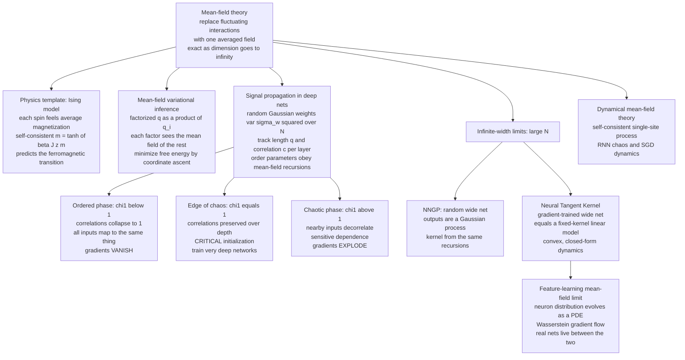

# 🌐 Mean Field Theory of Neural Networks

> [!abstract] TL;DR
> **Mean-field theory** is statistical mechanics' oldest trick: replace the complicated, fluctuating **interactions** felt by one unit with a single **averaged field** — the mean effect of everything else — turning an intractable many-body problem into a self-consistent single-body one. Weiss used it in 1907 to predict when iron spontaneously magnetizes ($m = \tanh(\beta J z\, m)$); it becomes **exact in high dimensions / infinite connectivity**, which is exactly the regime a large neural network lives in. Three payoffs follow. **(1) Mean-field variational inference** approximates an intractable posterior by a factorized $q(x)=\prod_i q_i(x_i)$, each factor updated against the mean field of the others. **(2) Mean-field signal propagation** tracks how the *length* (variance) and *correlation* of activations evolve layer by layer in a deep random net; there is an **order-to-chaos transition** whose critical boundary — the **edge of chaos** — sets the weight-initialization variance that lets you train networks thousands of layers deep. **(3) Infinite-width limits**: a randomly-initialized wide net is a **Gaussian process** (the NNGP), and one *trained by gradient descent* behaves like a fixed-kernel linear model (the **Neural Tangent Kernel**), making deep learning exactly analyzable — while the alternative **feature-learning mean-field limit** and **dynamical mean-field theory** push the frontier of how real networks actually learn.

---

## Intuition

**Analogy — polling an election of millions.** To predict how one voter behaves, you do *not* trace every individual conversation they have with every neighbour, coworker, and relative — that many-body bookkeeping is hopeless. Instead you assume each person responds to the **average mood of the crowd**: the "national sentiment" is a single field that everyone feels and everyone contributes to. That assumption is **self-consistent** — the average mood is built out of individual responses, which in turn depend on the average mood — so you solve one equation (the crowd affects the person, the person feeds back into the crowd) instead of a billion coupled ones. This is **mean-field theory**: swap all the tangled pairwise interactions for one averaged field.

Physicists invented this to explain magnets — each atomic spin feels not its neighbours individually but their **average magnetization**, giving the self-consistent equation $m=\tanh(\beta J z\,m)$ that predicts the sudden onset of ferromagnetism below a critical temperature. The astonishing thing is how far the same idea reaches into deep learning. Because a wide neural network is **high-dimensional** — thousands of units per layer, each summing thousands of inputs — the mean-field approximation is not a crude hack but becomes essentially *exact*. It predicts whether a signal will **explode or vanish** as it passes through a hundred layers, tells you precisely how to scale the initial weights so training even gets off the ground, and — in the **infinite-width limit** — reveals that the whole network collapses into a beautifully simple, exactly-solvable **Gaussian process**. Intuition first, jargon second: *average the crowd, then make the average consistent with itself.*

---

## How It Works

### Core mechanics

**1. Mean-field in physics — the template.** Take the [[The_Ising_Model_and_Statistical_Physics|Ising model]]: spins $s_i = \pm 1$ on a lattice, each coupled to its $z$ neighbours with energy $E = -J\sum_{\langle ij\rangle} s_i s_j$. The exact problem is intractable because every spin's fate is entangled with its neighbours'. Mean-field theory declares that each spin feels only the **average magnetization** $m = \langle s\rangle$ of its neighbours — an effective field $h_\text{eff} = Jz\,m$. A single spin in a field aligns as $\langle s\rangle = \tanh(\beta h_\text{eff})$, giving the **self-consistency equation**

$$\boxed{\,m = \tanh(\beta J z\, m)\,}$$

For $\beta J z < 1$ the only solution is $m=0$ (paramagnet, disordered). For $\beta J z > 1$ two nonzero solutions appear — **spontaneous magnetization** — a **phase transition** at $T_c = Jz$ (with $k_B=1$). The method is *approximate in low dimensions* (it ignores fluctuations and gets $T_c$ and critical exponents wrong for a 1D or 2D lattice) but **exact as dimension / connectivity $\to\infty$**, because then each spin really does average over infinitely many neighbours and fluctuations wash out. That "exact in high dimension" clause is precisely why the template transfers to large neural networks. See [[Phase_Transitions_and_Critical_Phenomena]] for the physics and [[Criticality_and_Phase_Transitions]] for the systems view.

**2. Mean-field variational inference — the inference incarnation.** The same factorization is the workhorse of approximate Bayesian inference. To approximate an intractable posterior $p(x)$, restrict the trial distribution to a **factorized (independent)** form $q(x)=\prod_i q_i(x_i)$ and minimize the **variational free energy** $F[q]=\langle E\rangle_q - T\,H[q]$ (equivalently maximize the ELBO). The stationarity condition makes each factor a Boltzmann distribution in the **mean field** of the others,

$$\log q_i(x_i) \;=\; \big\langle \log p(x)\big\rangle_{\prod_{j\ne i} q_j} + \text{const},$$

solved by **coordinate ascent** (CAVI) — update one factor holding the rest fixed, sweep to convergence. It is fast and general but, being factorized, **underestimates variance and cannot capture correlations** between coordinates. This is the same Gibbs-Bogoliubov-Feynman machinery derived in [[Free_Energy_Minimization_and_Variational_Principles]]; the SM-vault sibling *Variational_Inference_as_Free_Energy_Minimization* develops it in full.

**3. Mean-field signal propagation — order parameters through depth.** Now the modern application (Poole, Lee, Schoenholz, Sohl-Dickstein, Ganguli, 2016). Take a deep random network with $L$ layers of width $N$, i.i.d. Gaussian weights $W^l_{ij}\sim\mathcal N(0,\sigma_w^2/N)$ and biases $b^l_i\sim\mathcal N(0,\sigma_b^2)$, pre-activations $h^l = W^l\phi(h^{l-1}) + b^l$. As $N\to\infty$ the sum $\sum_j W^l_{ij}\phi(h^{l-1}_j)$ is a sum of many weakly-dependent terms, so by a **central-limit / mean-field** argument each $h^l_i$ is **Gaussian**, and the whole layer is described by just two **order parameters**:

- the **length** $q^l = \frac{1}{N}\sum_i (h^l_i)^2$ — the variance of activations;
- the **correlation** $c^l = q^l_{ab}/\sqrt{q^l_{aa}q^l_{bb}}$ between two different inputs $a,b$.

These obey deterministic **mean-field recursions** (with $\mathcal Dz$ the standard-Gaussian measure):

$$q^l = \sigma_w^2\!\int\! \mathcal Dz\;\phi\!\big(\sqrt{q^{l-1}}\,z\big)^2 + \sigma_b^2, \qquad
q^l_{ab} = \sigma_w^2\!\iint\! \mathcal Dz_1\mathcal Dz_2\;\phi(u_1)\phi(u_2) + \sigma_b^2,$$

where $u_1=\sqrt{q^\ast}\,z_1$ and $u_2=\sqrt{q^\ast}\big(c\,z_1+\sqrt{1-c^2}\,z_2\big)$ at the length fixed point $q^\ast$. This is exactly the Ising mean-field logic — replace the coupled units with self-consistent order-parameter maps.

**4. The order-to-chaos transition and the edge of chaos.** The length map has a stable fixed point $q^\ast$; the interesting physics is in the **correlation map** $c^l = f(c^{l-1})$. The point $c=1$ (two identical inputs stay identical) is always a fixed point; its stability is governed by the slope

$$\chi_1 \;=\; \left.\frac{\partial c^l}{\partial c^{l-1}}\right|_{c=1} \;=\; \sigma_w^2\!\int\! \mathcal Dz\;\big[\phi'(\sqrt{q^\ast}\,z)\big]^2 .$$

This single number splits the network into two **phases**:

- **Ordered phase ($\chi_1<1$):** $c=1$ is *attracting* — any two inputs converge to correlation $1$. Deep down, **all inputs map to the same representation**, the network cannot distinguish them, and gradients **vanish** exponentially. (Signals collapse.)
- **Chaotic phase ($\chi_1>1$):** $c=1$ is *repelling* — nearby inputs **decorrelate** exponentially toward a fixed point $c^\ast<1$. Tiny input differences blow up, and gradients **explode**. (Signals diverge — sensitive dependence, the deep-net cousin of [[Chaos_Theory_and_Sensitive_Dependence|chaos]].)
- **Edge of chaos ($\chi_1=1$):** the *critical* boundary — correlations and gradient norms are **preserved** through arbitrarily many layers (they change only polynomially, not exponentially). This is the **critical initialization**.

$\chi_1$ is also (essentially) the per-layer multiplier for backpropagated gradients, so $\chi_1=1$ is simultaneously the condition for **stable forward signals and stable backward gradients** — the mean-field explanation for why carefully-scaled **He / Xavier** initialization matters, and why picking $\sigma_w^2$ at the edge of chaos lets you train networks *thousands of layers deep*. See [[Weight_Initialization]] and [[Backpropagation]].

**5. Infinite-width limits — where nets become exactly solvable.** Send the width $N\to\infty$ and two clean pictures emerge.

- **NNGP (Neal 1996; Lee, Matthews et al. 2018):** a *randomly-initialized* infinitely-wide net is, over the distribution of its weights, a **Gaussian process**. For any finite set of inputs the outputs are jointly Gaussian with a covariance **kernel** $K$ computed by exactly the mean-field length/correlation recursions above. Untrained wide nets *are* GPs.
- **Neural Tangent Kernel (Jacot, Gabriel, Hongler 2018):** a net *trained by gradient descent* in this limit behaves like a **linear (kernel) model** with a **fixed** kernel $\Theta$ (the NTK), because the parameters barely move ("lazy training"). Training becomes a **convex** problem with **closed-form** dynamics — kernel regression — making generalization and optimization exactly analyzable.

Both are **large-$N$ mean-field** results: the many-body network reduces to a single averaged kernel. This is developed further in the not-yet-written siblings *Phase_Transitions_in_Learning_and_Inference* and *The_Loss_Landscape_and_Generalization*.

**6. NTK vs feature learning — the important nuance.** The NTK / lazy limit is analytically gorgeous but **does not learn features**: the kernel is *fixed*, so internal representations never change — a real limitation, since feature learning is what makes deep learning powerful. The **alternative "mean-field" / maximal-update ($\mu$P) parameterization** (Chizat-Bach, Mei-Montanari-Nguyen, Rotskoff-Vanden-Eijnden, Yang-Hu) keeps feature learning alive at infinite width: the **distribution of neurons** evolves during training, described by a **PDE / Wasserstein gradient flow** on the space of parameters. Real finite networks live **between** the fixed-kernel NTK limit and the feature-learning mean-field limit — this gap is a live frontier of deep-learning theory, tied to the capacity results of the sibling *The_Replica_Method_and_Neural_Network_Capacity* and the geometry of *Spin_Glasses_and_the_Energy_Landscape_of_Networks*.

**7. Dynamical mean-field theory (DMFT) — mean-field for dynamics, not just equilibrium.** Imported from disordered-systems physics, DMFT analyzes **trajectories** rather than equilibria: the transition to chaos in **recurrent networks** (Sompolinsky-Crisanti-Sommers 1988 — random RNNs go chaotic when the recurrent gain crosses a critical value, the basis of reservoir computing at the [[Chaos_Theory_and_Sensitive_Dependence|edge of chaos]]), the **high-dimensional dynamics of SGD**, and generalization dynamics of wide nets. It closes the coupled-unit dynamics into a **self-consistent single-site stochastic process** driven by a Gaussian "mean field" with a self-consistently-determined correlation function — the dynamical analogue of $m=\tanh(\beta Jz\,m)$.

### Flow / architecture



---

## Key Concepts

**Secondary (build the picture).**
- **Mean field = the average crowd.** Replace every messy pairwise interaction on a unit with one averaged field that everyone feels and feeds back into. Self-consistency: the crowd shapes the unit, the unit shapes the crowd.
- **Signals can explode or vanish with depth.** Pass a signal through many layers of a random network and it either shrinks to nothing (order) or blows up (chaos) — unless the weights are scaled *just right*.
- **The edge of chaos** is that "just right" scaling — the critical initialization where signals and gradients survive many layers, so deep networks can actually be trained.

**Undergraduate (make it precise).**
- **Ising mean-field self-consistency** $m=\tanh(\beta Jz\,m)$: paramagnet for $\beta Jz<1$, spontaneous magnetization for $\beta Jz>1$; exact only as connectivity $\to\infty$.
- **Order parameters of signal propagation**: length $q^l$ (activation variance) and correlation $c^l$, obeying deterministic mean-field recursions with Gaussian pre-activations.
- **The critical slope** $\chi_1 = \sigma_w^2\!\int \mathcal Dz\,[\phi'(\sqrt{q^\ast}z)]^2$: $\chi_1<1$ ordered (gradients vanish), $\chi_1>1$ chaotic (gradients explode), $\chi_1=1$ edge of chaos. Same number controls forward correlation decay and backward gradient growth.
- **Mean-field variational inference**: factorized $q=\prod_i q_i$, CAVI updates, systematic underestimation of variance.

**Graduate (the machinery and its reach).**
- **NNGP correspondence**: infinitely-wide random net $\Rightarrow$ Gaussian process with kernel from the recursion; depthwise kernel evolution has ordered/chaotic fixed points mirroring $\chi_1$.
- **Neural Tangent Kernel**: gradient-flow training of an infinitely-wide net linearizes around initialization; constant NTK $\Theta$; convex kernel regression; "lazy training" and its failure to learn features.
- **Feature-learning / $\mu$P mean-field limit**: parameterization under which the empirical neuron distribution evolves by a Wasserstein gradient flow (a PDE); recovers feature learning that the NTK limit misses.
- **Dynamical mean-field theory (DMFT)**: closes many-body dynamics into a self-consistent single-site stochastic process; Sompolinsky-Crisanti-Sommers transition to chaos in random RNNs; high-dimensional SGD.
- **Depth-scales and trainability**: the correlation and gradient **depth scales** $\xi$ diverge at the edge of chaos, quantifying how many layers can be trained; residual connections and normalization ([[Batch_Normalization]]) reshape the recursion to widen the trainable regime.

---

## Python Demo

```python
# Mean-field theory of neural networks: signal propagation, the order-to-chaos
# transition / edge of chaos, and the infinite-width (NNGP) Gaussian behavior.
#
# (a) SIGNAL PROPAGATION in a deep random net with weights ~ N(0, sigma_w^2 / N)
#     and biases ~ N(0, sigma_b^2), activation phi = tanh:
#       - iterate the LENGTH map q^l to its fixed point q*
#       - iterate the CORRELATION map c^l for three regimes and show the
#         ORDER-to-CHAOS transition (ordered: c -> 1, all inputs collapse,
#         gradients vanish;  chaotic: c decorrelates, gradients explode;
#         EDGE OF CHAOS: correlations preserved through many layers)
#       - the phase diagram via chi1 = slope of the correlation map at c=1
# (b) INFINITE-WIDTH / NNGP: outputs of a wide random net over random inits are
#     Gaussian, with variance -> the NNGP kernel value.
#
# Runnable with only numpy + matplotlib.
import numpy as np
import matplotlib.pyplot as plt

rng = np.random.default_rng(0)

# ---- Gauss-Hermite quadrature for expectations over a standard normal --------
# hermegauss uses weight exp(-x^2/2); E_z[f] = (1/sqrt(2pi)) sum w_i f(x_i).
gh_x, gh_w = np.polynomial.hermite_e.hermegauss(80)
W1 = gh_w / np.sqrt(2 * np.pi)                 # 1D normalized weights, sum ~ 1
X1, X2 = np.meshgrid(gh_x, gh_x)
WW = np.outer(W1, W1)                          # 2D product weights

def E1(f):                                     # E over one standard normal
    return np.sum(W1 * f(gh_x))

def E2(f):                                     # E over two independent normals
    return np.sum(WW * f(X1, X2))

phi  = np.tanh
dphi = lambda h: 1.0 - np.tanh(h) ** 2         # tanh'

# ---- (a) length map: q^l = sw2 * E[phi(sqrt(q) z)^2] + sb2 -------------------
def length_fixed_point(sw2, sb2, n_iter=200):
    q = 1.0
    traj = [q]
    for _ in range(n_iter):
        q = sw2 * E1(lambda z: phi(np.sqrt(q) * z) ** 2) + sb2
        traj.append(q)
    return q, np.array(traj)

# ---- correlation map at the length fixed point q* ---------------------------
def corr_map(c, qstar, sw2, sb2):
    def integrand(z1, z2):
        u1 = np.sqrt(qstar) * z1
        u2 = np.sqrt(qstar) * (c * z1 + np.sqrt(max(1 - c * c, 0.0)) * z2)
        return phi(u1) * phi(u2)
    q_ab = sw2 * E2(integrand) + sb2
    return q_ab / qstar

# ---- chi1 = slope of correlation map at c=1 (order parameter) ----------------
def chi1_of(sw2, sb2):
    qstar, _ = length_fixed_point(sw2, sb2)
    return sw2 * E1(lambda z: dphi(np.sqrt(qstar) * z) ** 2), qstar

sb2 = 0.05
# scan sigma_w^2 and locate the edge of chaos (chi1 = 1)
sw2_grid = np.linspace(0.4, 3.0, 60)
chi1_grid = np.array([chi1_of(s, sb2)[0] for s in sw2_grid])
sw2_crit = np.interp(1.0, chi1_grid, sw2_grid)   # sigma_w^2 where chi1 = 1

regimes = {
    "ordered  (chi1<1)":  sw2_crit * 0.55,
    "critical (chi1=1)":  sw2_crit,
    "chaotic  (chi1>1)":  sw2_crit * 1.9,
}
print(f"(a) edge of chaos at sigma_w^2 ~ {sw2_crit:.3f}  (sigma_b^2 = {sb2})")
for name, sw2 in regimes.items():
    chi1, qstar = chi1_of(sw2, sb2)
    print(f"    {name:20s} sigma_w^2={sw2:.3f}  q*={qstar:.3f}  chi1={chi1:.3f}")

# iterate correlation through depth for each regime, starting from c0 = 0.6
depth = 40
c0 = 0.6
corr_curves, qstars = {}, {}
for name, sw2 in regimes.items():
    qstar, _ = length_fixed_point(sw2, sb2)
    qstars[name] = qstar
    c = c0
    traj = [c]
    for _ in range(depth):
        c = np.clip(corr_map(c, qstar, sw2, sb2), -1.0, 1.0)
        traj.append(c)
    corr_curves[name] = np.array(traj)

# ---- (b) infinite-width / NNGP: wide random net outputs are Gaussian ---------
sw2_in, sb2_in   = 2.0, 0.05          # input -> hidden layer
sw2_out, sb2_out = 2.0, 0.05          # hidden -> output layer
x = np.array([1.0])                   # fixed scalar input (din = 1)
din = x.size
widths = [2, 8, 64, 1024]
M = 6000                              # number of independent random nets

# theoretical NNGP output variance (kernel value K(x,x))
qin = sw2_in * (x @ x) + sb2_in
K_nngp = sb2_out + sw2_out * E1(lambda z: phi(np.sqrt(qin) * z) ** 2)

emp_var, y_big = {}, None
for N in widths:
    Wh = rng.normal(0, np.sqrt(sw2_in / din), size=(M, N, din))
    bh = rng.normal(0, np.sqrt(sb2_in),        size=(M, N))
    a  = phi(Wh @ x + bh)                                # hidden activations (M,N)
    Wo = rng.normal(0, np.sqrt(sw2_out / N),   size=(M, N))
    bo = rng.normal(0, np.sqrt(sb2_out),       size=M)
    y  = np.sum(Wo * a, axis=1) + bo                     # outputs (M,)
    emp_var[N] = y.var()
    if N == widths[-1]:
        y_big = y
print(f"(b) NNGP kernel K(x,x) = {K_nngp:.4f}   "
      f"empirical var at width {widths[-1]} = {emp_var[widths[-1]]:.4f}")

# ---- plots ------------------------------------------------------------------
fig, ax = plt.subplots(2, 3, figsize=(16, 9))
colors = {"ordered  (chi1<1)": "#2171b5",
          "critical (chi1=1)": "black",
          "chaotic  (chi1>1)": "#cb181d"}

# (a1) length map converging to q*
for name, sw2 in regimes.items():
    _, traj = length_fixed_point(sw2, sb2, n_iter=25)
    ax[0, 0].plot(traj, color=colors[name], label=name)
ax[0, 0].set_title("(a) Length map q^l -> fixed point q*")
ax[0, 0].set_xlabel("layer l"); ax[0, 0].set_ylabel("length q^l"); ax[0, 0].legend(fontsize=8)

# (a2) correlation vs depth -- the edge-of-chaos picture
for name in regimes:
    ax[0, 1].plot(corr_curves[name], color=colors[name], lw=2, label=name)
ax[0, 1].axhline(1.0, ls=":", color="gray")
ax[0, 1].set_title("(a) Correlation vs depth: order collapses, chaos decorrelates,\n"
                   "edge of chaos preserves signal")
ax[0, 1].set_xlabel("layer l"); ax[0, 1].set_ylabel("correlation c^l")
ax[0, 1].set_ylim(0, 1.02); ax[0, 1].legend(fontsize=8)

# (a3) phase diagram: chi1 vs sigma_w^2, edge of chaos at chi1 = 1
ax[0, 2].plot(sw2_grid, chi1_grid, color="purple", lw=2)
ax[0, 2].axhline(1.0, ls="--", color="black", label="chi1 = 1 (edge of chaos)")
ax[0, 2].axvline(sw2_crit, ls=":", color="green", label=f"sigma_w^2 ~ {sw2_crit:.2f}")
ax[0, 2].fill_between(sw2_grid, 0, chi1_grid, where=chi1_grid < 1,
                      color="#2171b5", alpha=.15, label="ordered")
ax[0, 2].fill_between(sw2_grid, 1, chi1_grid, where=chi1_grid > 1,
                      color="#cb181d", alpha=.15, label="chaotic")
ax[0, 2].set_title("(a) Phase diagram: chi1(sigma_w^2)  at sigma_b^2 = 0.05")
ax[0, 2].set_xlabel("sigma_w^2"); ax[0, 2].set_ylabel("chi1 (gradient multiplier)")
ax[0, 2].legend(fontsize=8)

# (b1) correlation map c^l = f(c^{l-1}) with the diagonal -> fixed points
cc = np.linspace(0, 1, 60)
for name, sw2 in regimes.items():
    fmap = np.array([corr_map(c, qstars[name], sw2, sb2) for c in cc])
    ax[1, 0].plot(cc, fmap, color=colors[name], lw=2, label=name)
ax[1, 0].plot(cc, cc, "k:", label="diagonal")
ax[1, 0].set_title("(b) Correlation map: slope at c=1 decides order vs chaos")
ax[1, 0].set_xlabel("c^{l-1}"); ax[1, 0].set_ylabel("c^l = f(c^{l-1})"); ax[1, 0].legend(fontsize=8)

# (b2) NNGP: wide-net output histogram vs Gaussian
ax[1, 1].hist(y_big, bins=60, density=True, color="#6baed6",
              edgecolor="white", alpha=.9, label=f"width {widths[-1]} outputs")
grid = np.linspace(y_big.min(), y_big.max(), 300)
gauss = np.exp(-grid ** 2 / (2 * K_nngp)) / np.sqrt(2 * np.pi * K_nngp)
ax[1, 1].plot(grid, gauss, "r-", lw=2, label="NNGP Gaussian N(0, K)")
ax[1, 1].set_title("(b) Infinite width -> outputs are Gaussian (NNGP)")
ax[1, 1].set_xlabel("network output y"); ax[1, 1].set_ylabel("density"); ax[1, 1].legend(fontsize=8)

# (b3) output variance -> NNGP kernel as width grows
ax[1, 2].plot(widths, [emp_var[N] for N in widths], "o-", color="darkorange",
              label="empirical Var[y]")
ax[1, 2].axhline(K_nngp, ls="--", color="black", label=f"NNGP kernel K = {K_nngp:.3f}")
ax[1, 2].set_xscale("log", base=2)
ax[1, 2].set_title("(b) Output variance converges to the NNGP kernel")
ax[1, 2].set_xlabel("width N (log2)"); ax[1, 2].set_ylabel("Var[y]"); ax[1, 2].legend(fontsize=8)

plt.tight_layout()
plt.savefig("mean_field_neural_networks.png", dpi=110)
print("\nSaved: mean_field_neural_networks.png")
```

**What the output shows.** Panel (a1) confirms the **length map** drives activation variance to a fixed point $q^\ast$ regardless of regime. Panel (a2) is the headline result — starting from correlation $0.6$, the **ordered** net drives $c\to1$ (all inputs collapse to one representation, gradients vanish), the **chaotic** net decorrelates inputs (gradients explode), and only at the **edge of chaos** is the correlation preserved across many layers. Panel (a3) is the **phase diagram**: $\chi_1(\sigma_w^2)$ crosses $1$ at the critical weight variance separating ordered (blue) from chaotic (red) — the *critical initialization*. Panel (b1) exposes the mechanism: the correlation map's **slope at $c=1$** is $\chi_1$, and whether it exceeds $1$ decides which phase you are in. Panels (b2)-(b3) demonstrate the **infinite-width / NNGP** limit: as width grows, a random net's output over random initializations becomes **Gaussian**, with variance converging to the analytically-computed **NNGP kernel** — an untrained wide net is literally a Gaussian process.

---

## Real-World Applications

- **Critical / edge-of-chaos initialization.** Mean-field signal propagation is *why* [[Weight_Initialization|He and Xavier/Glorot initialization]] work: they scale $\sigma_w^2$ so that $\chi_1\approx1$, keeping forward signals and backward gradients from exploding or vanishing. Dynamical-isometry variants (orthogonal init) let vanilla nets train **10,000 layers deep**.
- **Architecture design.** Residual connections and normalization ([[Batch_Normalization]]) are understood through their effect on the signal-propagation recursion — they flatten the depth dependence of $\chi_1$, widening the trainable regime and explaining why very deep ResNets and Transformers train stably.
- **NNGP / NTK theory of deep learning.** Infinite-width kernels give **exact, closed-form** predictions for training and generalization of wide nets, and are used as strong Bayesian baselines and analysis tools; the NTK made convergence and generalization of over-parameterized nets provable.
- **Recurrent networks and reservoir computing.** The Sompolinsky-Crisanti-Sommers transition to chaos in random RNNs (a DMFT result) underpins **echo-state networks / reservoir computing**, which operate best *at the edge of chaos* where memory and expressivity are maximal.
- **Mean-field variational inference.** Factorized approximations power variational Bayes, topic models, and scalable approximate inference across probabilistic ML — the practical descendant of the Ising mean-field solution.
- **Scaling and parameterization.** The feature-learning ($\mu$P) mean-field limit yields **hyperparameter transfer** across width, letting practitioners tune a small model and reuse settings on a huge one — connecting to empirical [[Scaling_Laws]].

---

## Common Pitfalls

- **Treating mean-field as exact in low dimension.** Mean-field ignores fluctuations; it gets the 1D/2D Ising transition and critical exponents wrong. It is trustworthy precisely because neural nets are **high-dimensional (wide)** — do not import mean-field intuition into a narrow network or a low-connectivity graph uncritically.
- **Confusing the two infinite-width limits.** The **NTK/lazy** limit has a *fixed* kernel and **no feature learning**; the **mean-field/$\mu$P** limit *does* learn features via a PDE on the neuron distribution. They are different parameterizations with different physics — quoting NTK results about a feature-learning regime (or vice versa) is a category error.
- **Assuming NTK explains real, finite networks.** Finite-width nets sit *between* the limits and *do* learn features that the NTK cannot represent; the NTK often **underperforms** the trained finite net it approximates. Use it as an analyzable idealization, not a faithful model.
- **Ignoring the bias variance $\sigma_b^2$.** The edge-of-chaos location depends on **both** $\sigma_w^2$ and $\sigma_b^2$; tuning weight variance while forgetting biases lands you off the critical line and reintroduces vanishing/exploding signals.
- **Forgetting that $\chi_1$ governs gradients too.** The same slope controlling forward correlation decay controls backward gradient growth. "Fixing" only the forward pass (e.g. matching activation variance) without checking $\chi_1$ can still leave gradients exploding or vanishing.
- **Over-trusting mean-field variance estimates.** Factorized mean-field VI systematically **underestimates posterior variance and ignores correlations** — a direct consequence of the independence assumption, the same blind spot mean-field has for fluctuations in physics.

---

## Related Concepts

- [[Free_Energy_Minimization_and_Variational_Principles]] — the Gibbs-Bogoliubov-Feynman bound and factorized $q$ that *is* mean-field variational inference; the free-energy backbone of this note.
- [[The_Ising_Model_and_Statistical_Physics]] — the canonical system whose self-consistent $m=\tanh(\beta Jz\,m)$ is the template mean-field solution transferred to networks.
- [[Phase_Transitions_and_Critical_Phenomena]] — the physics of order/disorder transitions and criticality that the order-to-chaos transition mirrors.
- [[Classical_Statistical_Mechanics]] — Boltzmann distribution and the high-dimensional averaging that makes mean-field exact.
- [[Criticality_and_Phase_Transitions]] — the systems-thinking view of critical points and self-organized criticality; the edge of chaos as a critical boundary.
- [[Chaos_Theory_and_Sensitive_Dependence]] — the chaotic phase and RNN transition to chaos are literal sensitive dependence on initial conditions.
- [[Weight_Initialization]] — He/Xavier scaling is critical (edge-of-chaos) initialization; this note is its statistical-mechanics justification.
- [[Neural_Network_Basics]] — the feedforward architecture whose deep random limit the mean-field recursions describe.
- [[Activation_Functions]] — $\phi$ and $\phi'$ enter the length map and $\chi_1$; the nonlinearity sets where the edge of chaos sits.
- [[Backpropagation]] — the backward pass whose gradient norms are governed by the same $\chi_1$ that controls forward correlations.
- [[RNN_and_LSTM]] — recurrent nets whose transition to chaos (SCS/DMFT) underlies reservoir computing.
- [[Batch_Normalization]] — reshapes the signal-propagation recursion, widening the trainable-depth regime.
- [[Scaling_Laws]] — empirical width/depth scaling that the feature-learning ($\mu$P) mean-field limit helps rationalize (hyperparameter transfer).
- [[Hopfield_Networks_and_Associative_Memory]] — a spin-glass network whose capacity is classically analyzed with the same statistical-mechanics toolkit.
- [[Boltzmann_Machines_and_RBMs]] — energy-based models trained with mean-field / variational approximations.
- [[Bayesian_Statistics]] — the posteriors that mean-field variational inference approximates.

---

## Review Questions

1. **(Secondary)** Using the election-polling analogy, explain what "mean field" means and why replacing all the individual interactions with one averaged field is a *self-consistent* approximation rather than just an average. Then say, in plain words, what "signals vanish" versus "signals explode" means for a deep network.
2. **(Undergraduate)** Write the Ising mean-field self-consistency equation $m=\tanh(\beta Jz\,m)$ and explain why it predicts a phase transition. Then state the analogous role of $\chi_1=\sigma_w^2\!\int\mathcal Dz\,[\phi'(\sqrt{q^\ast}z)]^2$ in a deep network: what do $\chi_1<1$, $\chi_1>1$, and $\chi_1=1$ mean for correlations and gradients?
3. **(Undergraduate)** Why is mean-field theory *approximate* for a 2D magnet but *essentially exact* for a wide neural network? Which feature of the network makes the difference, and what breaks down if the network is narrow?
4. **(Graduate)** Contrast the two infinite-width limits. In the NTK/lazy limit, what stays fixed and why does training become convex? In the feature-learning ($\mu$P) mean-field limit, what object evolves and by what kind of equation? Where do real finite networks fall, and why does this matter for whether the NTK is a good model of practice?
5. **(Graduate, scenario)** You must train a 200-layer feedforward network (tanh activations) and it will not learn — loss is flat from the start. Diagnose the likely signal-propagation failure, describe how you would estimate $\chi_1$ from $(\sigma_w^2,\sigma_b^2)$, and specify how to re-initialize (and what architectural change) to put the network at the edge of chaos so gradients survive to the first layer.

---

## Sources

- Poole, B., Lahiri, S., Raghu, M., Sohl-Dickstein, J., & Ganguli, S. (2016). *Exponential expressivity in deep neural networks through transient chaos.* NeurIPS. [arXiv:1606.05340](https://arxiv.org/abs/1606.05340)
- Schoenholz, S. S., Gilmer, J., Ganguli, S., & Sohl-Dickstein, J. (2017). *Deep Information Propagation.* ICLR. [arXiv:1611.01232](https://arxiv.org/abs/1611.01232)
- Jacot, A., Gabriel, F., & Hongler, C. (2018). *Neural Tangent Kernel: Convergence and Generalization in Neural Networks.* NeurIPS. [arXiv:1806.07572](https://arxiv.org/abs/1806.07572)
- Lee, J., Bahri, Y., Novak, R., Schoenholz, S. S., Pennington, J., & Sohl-Dickstein, J. (2018). *Deep Neural Networks as Gaussian Processes.* ICLR. [arXiv:1711.00165](https://arxiv.org/abs/1711.00165)
- Mei, S., Montanari, A., & Nguyen, P.-M. (2018). *A Mean Field View of the Landscape of Two-Layer Neural Networks.* PNAS, 115(33), E7665-E7671. [arXiv:1804.06561](https://arxiv.org/abs/1804.06561)
- Sompolinsky, H., Crisanti, A., & Sommers, H. J. (1988). *Chaos in Random Neural Networks.* Physical Review Letters, 61(3), 259-262.

---

#statistical-mechanics #machine-learning #mean-field-theory #neural-tangent-kernel #edge-of-chaos
