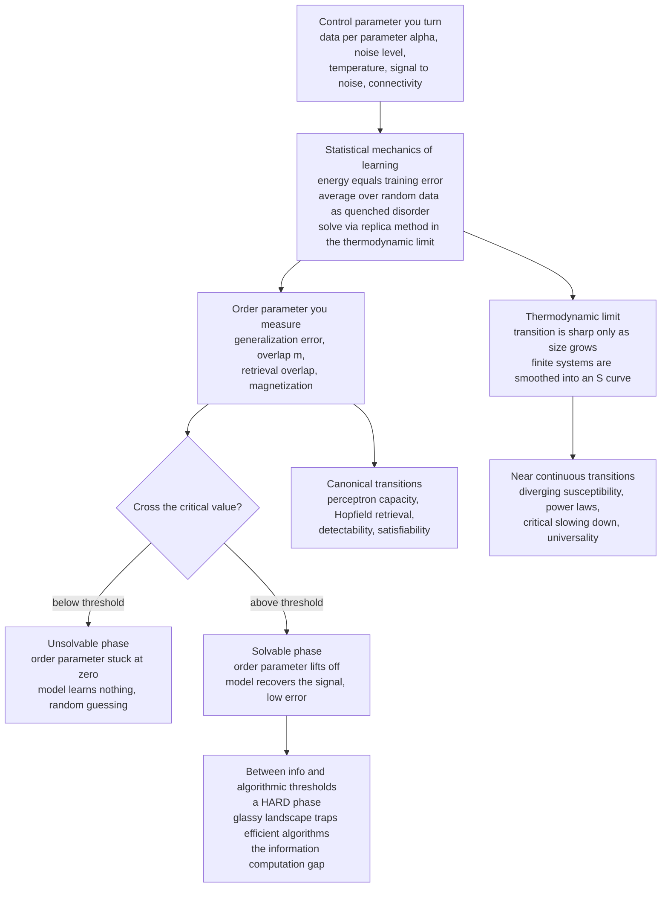

# 🧊 Phase Transitions in Learning and Inference

> [!abstract] TL;DR
> Water does not warm gradually into steam — it stays liquid until, at exactly 100 °C, it *snaps* into vapour. Learning does the same thing: as a **control parameter** (data-per-parameter, noise, temperature, signal-to-noise) crosses a **critical value**, a model can jump from total failure to sudden success — from random guessing to "getting it," from an unrecoverable signal to a recoverable one, from an unsolvable problem to a solvable one. **Statistical mechanics — the physics that invented the theory of phase transitions — predicts exactly where these thresholds sit** (the perceptron's storage capacity, the Hopfield retrieval transition, detectability thresholds, satisfiability transitions), computed in the **thermodynamic limit** where the transitions become genuinely sharp. Beyond the *information-theoretic* threshold often lies a computationally **hard phase** (a glassy landscape that traps efficient algorithms — the "information-computation gap"), and this same lens now illuminates deep learning's surprises: emergence, grokking, double descent, and scaling laws.

---

## Intuition

**Analogy — FIRST.** Put a pot of water on the stove and watch a thermometer. The temperature climbs — 60, 80, 95, 99 — and the water stays stubbornly, boringly liquid. Then at **exactly 100 °C** something violent happens: the liquid does not "become a bit steamy," it *abruptly, dramatically* transforms into vapour. Cross a single critical value of one control knob (temperature) and the substance is qualitatively, discontinuously different. This knife-edge change — a **phase transition** — is one of physics' most striking phenomena.

Now swap "temperature" for "amount of training data" and "water/steam" for "a model that fails / a model that works." Feed a learner too little data and it learns **nothing** — its predictions are pure coin-flips. Add more, and for a long stretch it *still* learns nothing useful. Then, as the data crosses a **critical threshold**, the model suddenly **"gets it"** — snapping from ignorance to understanding, from an error of 50 % to near-zero. The same knife-edge governs whether you can pull a faint signal out of noise, whether a scrambled memory can be recovered, whether a random puzzle is solvable at all. Learning and inference are *riddled* with these transitions — and statistical mechanics, the science that first explained why ice becomes water, is the tool that predicts precisely where each one happens.

---

## How It Works

### Core Mechanics

**1. Treat learning as a statistical-mechanical system.** The **statistical mechanics of learning** (Gardner 1988; Seung, Sompolinsky & Tishby 1992; Engel & Van den Broeck; Mézard, Zdeborová) makes one bold identification: a learning problem *is* a physical system. The **"energy"** is the training error (how badly the current weights fit the data), the **"temperature"** controls how much stochasticity is tolerated, and the **partition function** sums over all candidate weight settings (see `[[Partition_Functions_and_Free_Energy_in_ML]]`, `[[The_Boltzmann_Distribution_in_Learning]]`). One then asks not "what happens for *this* dataset?" but **"what happens *typically*, averaged over random datasets, when the system is enormous?"** — the **thermodynamic limit** of infinitely many neurons and examples. Random data plays the role of frozen-in disorder (**quenched disorder**), and averaging over it is done with the **replica method** (developed in the sibling *The_Replica_Method_and_Neural_Network_Capacity*). The payoff is *exact* predictions for generalization error and for the transitions that punctuate it — a typical-case theory that sees structure worst-case bounds miss.

**2. Control parameters versus order parameters — the physics vocabulary.** A phase transition is a story about two kinds of quantity:

- **Control parameters** are the knobs you *turn*: the load $\alpha = P/N$ (number of examples per weight), the noise level, the temperature, the signal-to-noise ratio, or network connectivity. In physics these are temperature and pressure.
- **Order parameters** are what you *measure* to name the phase: the generalization error, the **overlap** $m$ between the learned weights and the true (teacher) weights, the retrieval overlap of a stored memory, the magnetization. In physics this is the fraction of magnetized spins.

A **phase transition** is a point where an order parameter changes **non-analytically** — a sudden jump or a kink — as a control parameter crosses its critical value. Below threshold the order parameter is stuck at its "ignorant" value (overlap $= 0$, error $= $ chance); above it, the order parameter lifts off and the model works.

**3. Why transitions are genuinely sharp — the thermodynamic limit.** A true discontinuity can only exist for an **infinite** system. The partition function of any *finite* system is a smooth (analytic) function of its parameters, so a finite model's "transition" is always **rounded** — a smooth S-curve, not a step. Sharpness emerges only as the system size $N \to \infty$: the finite-size rounding shrinks, and the S-curve collapses onto a genuine step at the critical value. This is why **large models and large datasets** exhibit ever-crisper thresholds, and why statistical mechanics — a science built for the limit of $10^{23}$ particles — is the natural language for modern over-parameterized networks. It is also why the analysis is **typical-case** (what happens for *almost every* large instance) rather than worst-case.

**4. Below threshold vs above threshold — and the hard phase in between.** The simplest picture has two phases: *unsolvable* (no method can succeed — the signal is drowned) and *solvable* (recovery is possible). But a deep modern refinement splits "solvable" in two. The **information-theoretic threshold** marks where recovery is possible *in principle* (with unlimited compute). A separate, higher **algorithmic threshold** marks where an *efficient* algorithm actually succeeds. Between them lies a **hard phase**: the answer exists and is information-theoretically recoverable, yet the optimization landscape is **glassy** — riddled with exponentially many spurious minima that trap every known polynomial-time algorithm (the physics of **spin glasses**, see the sibling *Spin_Glasses_and_the_Energy_Landscape_of_Networks*). This **information–computation gap** is statistical physics *predicting computational hardness* — a frontier where physics, statistics, and complexity theory meet.

**5. The zoo of canonical transitions.** Statistical mechanics has computed the exact location of a whole menagerie of learning transitions:

- **Perceptron storage capacity (Gardner 1988).** A perceptron can store at most $\alpha_c = 2$ random patterns per weight. Below $\alpha_c$ solutions are abundant; at $\alpha_c$ the space of solutions shrinks to a point and then **vanishes** — a sharp storage transition.
- **The generalization transition (Seung–Sompolinsky–Tishby).** As examples accumulate, generalization error falls — sometimes smoothly, but in some models with a **first-order jump** where the learner discontinuously "discovers" the rule.
- **The Hopfield retrieval transition.** An associative memory recalls patterns reliably only below $\alpha_c \approx 0.138$ patterns per neuron; push past it and recall **collapses catastrophically** into a spin-glass jumble (see `[[Hopfield_Networks_and_Associative_Memory]]`).
- **Detectability thresholds.** You can recover a planted community, a low-rank spike, or a hidden signal **only above a critical signal-to-noise ratio** — the community-detection and spiked-matrix transitions (Decelle et al. 2011; the BBP transition). Below it, *no* algorithm beats a coin flip.
- **Satisfiability / CSP transitions.** Random constraint-satisfaction problems flip from almost-always-solvable to almost-always-unsolvable as clause density crosses a critical value, with the hardest instances — and a glassy "clustering" of solutions — concentrated right at the threshold.

**6. Critical phenomena and universality (the deeper physics).** Near a *continuous* transition, systems show **critical phenomena**: correlations and susceptibility **diverge**, quantities follow **power laws** with universal **critical exponents**, and dynamics suffer **critical slowing down** — which is exactly why MCMC samplers mix terribly and optimizers crawl near a threshold (see `[[The_Metropolis_Algorithm_and_MCMC]]`). Remarkably, wildly different systems near their transitions share the *same* exponents — **universality** — and the **renormalization group** explains why (see `[[Renormalization_and_RG]]`; the sibling *Renormalization_and_Deep_Learning* pushes this into representation learning). These ideas govern how algorithms behave right at the edge of learnability.

**7. Why it matters now — deep learning's surprises.** Phase-transition thinking reframes several headline phenomena of large models. **Emergence** and **grokking** (sudden capability jumps as scale or training crosses a threshold) look like transitions. **Double descent** (test error rising, then falling again as model size grows past the interpolation point) is a transition in the generalization curve tied to the loss landscape (see `[[Bias_Variance_Tradeoff]]`; the sibling *The_Loss_Landscape_and_Generalization*). **Neural scaling laws** raise a live debate — are capabilities *smooth* power laws or *sharp* emergences? Statistical mechanics supplies the toolkit to tell the difference (the sibling *Statistical_Mechanics_of_Generalization_and_Scaling_Laws*, and `[[Scaling_Laws]]`). Underpinning all of it is the **mean-field** description of wide networks (the sibling *Mean_Field_Theory_of_Neural_Networks*).

### Flow / Architecture



---

## Key Concepts

**Secondary (intuition-level).** Learning can happen *suddenly*, like water flashing to steam at 100 °C. Turn one knob — usually "how much data" or "how strong the signal is" — and below a magic value the model is useless (pure guessing), while above it the model *snaps* into working. These sudden switches are called **phase transitions**, and physicists, who first explained why ice melts, can predict exactly which value of the knob triggers the switch. The switch is only perfectly sharp when the system is huge; small systems change more gradually.

**Undergraduate (mechanics-level).** A learning problem is cast as a statistical-mechanical system: energy $=$ training error, temperature $=$ stochasticity, partition function $=$ sum over weight configurations. **Control parameters** (the load $\alpha = P/N$, noise, temperature, signal-to-noise) drive **order parameters** (generalization error $\varepsilon_g$, teacher–student overlap $m$, retrieval overlap, magnetization). A phase transition is a **non-analytic** jump or kink in an order parameter at a critical control value $\alpha_c$. Transitions are sharp only in the **thermodynamic limit** $N \to \infty$; finite $N$ gives a rounded S-curve whose width scales as a power of $1/N$ (**finite-size scaling**). Canonical examples: the perceptron capacity $\alpha_c = 2$, the Hopfield retrieval limit $\alpha_c \approx 0.138$, the spiked-matrix / detectability threshold, and the random-SAT transition.

**Graduate (structure-level).** The **quenched free energy** $-\beta f = \lim_{N\to\infty} \frac{1}{N}\,\mathbb{E}_{\text{data}} \log Z$ is computed by the **replica method** ($\mathbb{E}\log Z = \lim_{n\to 0}\frac{\mathbb{E} Z^n - 1}{n}$), whose saddle-point equations for the overlap order parameters yield the phase diagram; **replica-symmetry breaking** (Parisi) signals the onset of a **glassy** phase with a hierarchy of pure states. **First-order** transitions show a discontinuous order-parameter jump and metastability/hysteresis (spinodals), while **continuous** ones show diverging susceptibility and universal critical exponents governed by the **renormalization group**. The **information-theoretic** threshold (Bayes-optimal recoverability, often given by a mutual-information / free-energy comparison) and the **algorithmic** threshold (e.g. the Kesten–Stigum / AMP / spectral bound) can differ, opening the **hard phase** and the **information–computation gap**. Rigorous corroboration comes from **Approximate Message Passing** and the proof of the replica-predicted formulas in high-dimensional inference (compressed sensing, low-rank estimation, community detection).

---

## Python Demo

```python
# A LEARNING/INFERENCE PHASE TRANSITION made visible: the "spiked matrix" (BBP) DETECTABILITY threshold.
#
# Problem: a faint rank-1 PLANTED SIGNAL u (a hidden pattern) is buried in a large noisy
# matrix.  We observe  M = lambda * u u^T  +  W,  where W is symmetric Gaussian (GOE) noise
# with semicircle spectral radius 2.  The control parameter is the signal strength lambda.
#   ORDER PARAMETER: overlap = |<v, u>| between the TOP EIGENVECTOR v of M and the true u.
#
# Theory (Baik-Ben Arous-Peche, and Decelle et al. for community detection):
#   - lambda <= 1  : the signal is UNDETECTABLE. The top eigenvector is pure noise -> overlap -> 0.
#   - lambda  > 1  : a SHARP transition; overlap -> sqrt(1 - 1/lambda^2), rising from 0.
# We (a) reveal the sharp transition at lambda_c = 1, and (b) show it SHARPENS as N grows
# (finite N is a smooth S-curve; the thermodynamic limit N -> infinity is a hard step).
import numpy as np
import matplotlib.pyplot as plt

rng = np.random.default_rng(0)

def mean_overlap(N, lam, trials):
    """Average |<top eigenvector, planted signal>| over random instances."""
    vals = []
    for _ in range(trials):
        # planted signal: unit vector with +/-1 entries  (||u|| = 1)
        u = rng.choice([-1.0, 1.0], size=N) / np.sqrt(N)
        # GOE noise: symmetric, off-diagonal variance 1/N  => spectral radius 2
        G = rng.standard_normal((N, N)) / np.sqrt(N)
        W = (G + G.T) / np.sqrt(2.0)
        M = lam * np.outer(u, u) + W
        # top eigenpair of the symmetric matrix
        w, V = np.linalg.eigh(M)                 # ascending eigenvalues
        v = V[:, -1]                             # eigenvector of the LARGEST eigenvalue
        vals.append(abs(v @ u))                  # sign of an eigenvector is arbitrary -> abs
    return float(np.mean(vals))

lams  = np.linspace(0.0, 2.5, 26)               # sweep the control parameter
sizes = [40, 160, 640]                          # growing system size -> thermodynamic limit
trials_for = {40: 12, 160: 8, 640: 4}           # fewer trials for the big (slow) matrices

curves = {N: np.array([mean_overlap(N, l, trials_for[N]) for l in lams]) for N in sizes}

# theoretical N -> infinity limit: a sharp transition at lambda_c = 1
theory = np.where(lams > 1.0, np.sqrt(np.clip(1.0 - 1.0/np.maximum(lams, 1e-9)**2, 0, 1)), 0.0)

# --- report the transition numerically ---
for N in sizes:
    below = curves[N][np.argmin(np.abs(lams - 0.6))]
    above = curves[N][np.argmin(np.abs(lams - 1.8))]
    print(f"N={N:4d}:  overlap at lambda=0.6 (below) = {below:.3f}   "
          f"overlap at lambda=1.8 (above) = {above:.3f}")

# ------------------------------------------------------------------ plots
fig, (axL, axR) = plt.subplots(1, 2, figsize=(12, 4.6))

colors = {40: "#9ecae1", 160: "#4292c6", 640: "#084594"}
for N in sizes:
    axL.plot(lams, curves[N], "o-", ms=4, color=colors[N], label=f"N = {N}")
axL.plot(lams, theory, "k--", lw=2, label="N -> infinity (theory)")
axL.axvline(1.0, color="crimson", ls=":", lw=1.5)
axL.text(1.03, 0.05, "lambda_c = 1", color="crimson")
axL.set_xlabel("control parameter: signal strength lambda")
axL.set_ylabel("order parameter: overlap |<v, u>|")
axL.set_title("Detectability phase transition\n(undetectable below lambda_c, recoverable above)")
axL.legend(loc="upper left"); axL.set_ylim(-0.02, 1.02)

# zoom near the threshold to expose the SHARPENING with system size
for N in sizes:
    axR.plot(lams, curves[N], "o-", ms=4, color=colors[N], label=f"N = {N}")
axR.plot(lams, theory, "k--", lw=2, label="N -> infinity (step)")
axR.axvline(1.0, color="crimson", ls=":", lw=1.5)
axR.set_xlim(0.6, 1.5); axR.set_ylim(-0.02, 0.75)
axR.set_xlabel("signal strength lambda (zoom near threshold)")
axR.set_ylabel("overlap |<v, u>|")
axR.set_title("Finite-size smoothing -> sharp step\n(larger N = crisper transition)")
axR.legend(loc="upper left")

plt.tight_layout()
plt.savefig("learning_phase_transition.png", dpi=120, bbox_inches="tight")
print("saved learning_phase_transition.png")
```

Running it: the **left panel** shows the order parameter (overlap) pinned near **zero** for $\lambda \lesssim 1$ — the planted signal is *literally undetectable*, the best eigenvector is indistinguishable from noise — and then **lifting off sharply** past $\lambda_c = 1$, tracking the theoretical $\sqrt{1 - 1/\lambda^2}$ curve. The **right panel** zooms in on the threshold to expose the headline of the whole note: for small $N = 40$ the transition is a gentle, rounded S-curve, but as $N$ grows to $640$ the curve **sharpens toward a hard step** — the finite-size smoothing shrinking away as we approach the thermodynamic limit, exactly as statistical mechanics predicts.

---

## Real-World Applications

- **Learning theory and capacity.** Exact *typical-case* results — the perceptron's $\alpha_c = 2$ capacity, generalization curves, sample complexity — that go beyond (and often sharpen) worst-case VC/PAC bounds. This is the physics contribution to understanding *how much data is enough*.
- **High-dimensional statistics and compressed sensing.** Recovery **phase diagrams** — the exact sparsity/undersampling boundary below which sparse recovery fails and above which it succeeds — were first predicted by the replica method and later proven rigorously (via Approximate Message Passing), a landmark of the physics-to-statistics pipeline.
- **Inference on networks.** Community detection has a **hard detectability threshold** (Decelle et al.): below the critical signal-to-noise ratio, recovering the planted communities is provably impossible for *any* algorithm — directly relevant to social-network, biological-network, and recommendation-graph clustering (see `[[Centrality_and_Community_Structure]]`).
- **Constraint satisfaction and optimization.** The random-SAT / CSP **satisfiability transition** and the clustering of solutions near it explain where hard instances live and why local search stalls — feeding practical solver design and the theory of average-case complexity.
- **Associative memory and error correction.** The Hopfield retrieval transition sets the usable capacity of attractor memories and de-noisers; modern dense Hopfield / attention inherits the same energy-landscape story (see `[[Hopfield_Networks_and_Associative_Memory]]`).
- **Understanding deep learning.** The framework offers a principled lens on **emergence**, **grokking**, **double descent**, and **scaling laws** — reframing "surprising" capability jumps as phase transitions and helping distinguish smooth power-law improvement from genuinely sharp onsets (see `[[Scaling_Laws]]`, `[[Bias_Variance_Tradeoff]]`).

---

## Common Pitfalls

- **Confusing a finite-size crossover with a true transition.** In any *finite* model the "transition" is a smooth S-curve, not a discontinuity. Claiming a sharp threshold requires **finite-size scaling** — showing the curve steepens toward a step as $N$ grows. A single system size can look like a transition when it is only a gentle crossover (and vice versa).
- **Ignoring the information–computation gap.** "Recovery is possible" (information-theoretic) is *not* "recovery is easy" (algorithmic). In the **hard phase** the answer exists yet no efficient algorithm finds it; benchmarking one heuristic and declaring the problem unsolvable — or solvable — misreads which threshold you actually hit.
- **Trusting worst-case bounds to predict typical behaviour.** VC/PAC bounds describe adversarial worst cases and are often loose by orders of magnitude. The statistical-mechanics *typical-case* prediction is what you actually observe on random data — but it is an average, silent about rare atypical instances.
- **Forgetting critical slowing down.** Right at a continuous transition, correlations diverge and samplers/optimizers mix agonizingly slowly. Estimating an order parameter *near* the critical point with a fixed MCMC budget gives badly biased, high-variance numbers — the failure is physical, not a bug (see `[[The_Metropolis_Algorithm_and_MCMC]]`).
- **Assuming all transitions are continuous.** **First-order** learning transitions jump discontinuously and exhibit **metastability and hysteresis** — the learner can get stuck in a "wrong" phase depending on initialization and annealing schedule. Treating a first-order jump as a smooth curve misestimates both the threshold and the training dynamics.
- **Over-reading "emergence" in LLMs.** Apparent sharp emergence can be an artifact of a discontinuous *metric* (e.g. exact-match accuracy) applied to a smoothly improving model. Distinguishing a real phase transition from a measurement threshold is exactly the analysis this framework demands.

---

## Related Concepts

- [[Phase_Transitions_and_Critical_Phenomena]] — the physics of phase transitions, order parameters, and universality that this note re-frames for learning; the parent phenomenon.
- [[Criticality_and_Phase_Transitions]] — the systems-thinking view of tipping points and criticality across complex systems.
- [[Bifurcations_and_Tipping_Points]] — the dynamical-systems language for abrupt qualitative change, the cousin of a phase transition.
- [[Hopfield_Networks_and_Associative_Memory]] — the retrieval / spin-glass transition and the famous $\alpha_c \approx 0.138$ capacity threshold, a canonical learning transition.
- [[Statistical_Mechanics_of_Machine_Learning_Overview]] — the section's entry point tying energy, temperature, and free energy to learning.
- [[The_Boltzmann_Distribution_in_Learning]] — the Gibbs measure over weight configurations underlying the free-energy calculation.
- [[Partition_Functions_and_Free_Energy_in_ML]] — the free energy whose non-analyticities *are* the phase transitions.
- [[The_Ising_Model_and_Statistical_Physics]] — the prototypical model whose ferromagnetic transition seeds all of this intuition.
- [[The_Metropolis_Algorithm_and_MCMC]] — why sampling suffers critical slowing down near a transition.
- [[Percolation_and_Random_Processes]] — the geometric phase transition in random graphs, close kin to SAT/detectability thresholds.
- [[Renormalization_and_RG]] — the machinery behind universality and critical exponents; foreshadows deep-learning renormalization.
- [[Classical_Statistical_Mechanics]] — the canonical-ensemble toolkit used to solve these models.
- [[Simulated_Annealing_and_Global_Optimization]] — traversing a glassy landscape by lowering temperature past its transitions.
- [[Centrality_and_Community_Structure]] — network community detection, home of the detectability threshold demonstrated above.
- [[Hypothesis_Testing_and_Information]] — the inference-theoretic view of when a signal is distinguishable from noise.
- [[Scaling_Laws]] — the smooth-power-law-vs-sharp-emergence debate this framework speaks to.
- [[Bias_Variance_Tradeoff]] — the classical picture that double descent (a generalization transition) complicates.

---

## Review Questions

1. **(Secondary)** Water stays liquid up to 100 °C and then abruptly boils. Explain, in that language, what it means to say a machine-learning model has a "phase transition" as you add training data — and why a *small* model shows a gentle change while a *huge* model shows a sharp one.
2. **(Undergraduate)** Define **control parameter** and **order parameter**, then identify each for (a) the perceptron storage transition and (b) the detectability transition in the demo above. Why can a genuine non-analytic transition exist only in the thermodynamic limit, and what does "finite-size scaling" let you measure on real, finite systems?
3. **(Graduate)** Distinguish the **information-theoretic** threshold from the **algorithmic** threshold, and explain what the intervening **hard phase** has to do with a glassy energy landscape and replica-symmetry breaking. Give one concrete inference problem where such an **information–computation gap** is believed to exist, and describe how you would empirically argue that an observed "sharp emergence" in a large model is a *real* transition rather than an artifact of a discontinuous evaluation metric.

---

## Sources

- Engel, A., & Van den Broeck, C. (2001). *Statistical Mechanics of Learning.* Cambridge University Press.
- Seung, H. S., Sompolinsky, H., & Tishby, N. (1992). "Statistical mechanics of learning from examples." *Physical Review A*, 45(8), 6056–6091. [link](https://doi.org/10.1103/PhysRevA.45.6056)
- Gardner, E. (1988). "The space of interactions in neural network models." *Journal of Physics A*, 21(1), 257–270. [link](https://doi.org/10.1088/0305-4470/21/1/030)
- Zdeborová, L., & Krzakala, F. (2016). "Statistical physics of inference: thresholds and algorithms." *Advances in Physics*, 65(5), 453–552. [arXiv:1511.02476](https://arxiv.org/abs/1511.02476)
- Decelle, A., Krzakala, F., Moore, C., & Zdeborová, L. (2011). "Asymptotic analysis of the stochastic block model for modular networks and its algorithmic applications." *Physical Review E*, 84(6), 066106. [arXiv:1109.3041](https://arxiv.org/abs/1109.3041)
- Bahri, Y., Kadmon, J., Pennington, J., Schoenholz, S., Sohl-Dickstein, J., & Ganguli, S. (2020). "Statistical mechanics of deep learning." *Annual Review of Condensed Matter Physics*, 11, 501–528. [link](https://doi.org/10.1146/annurev-conmatphys-031119-050745)

---

#statistical-mechanics #machine-learning #phase-transitions #critical-phenomena #learning-theory
