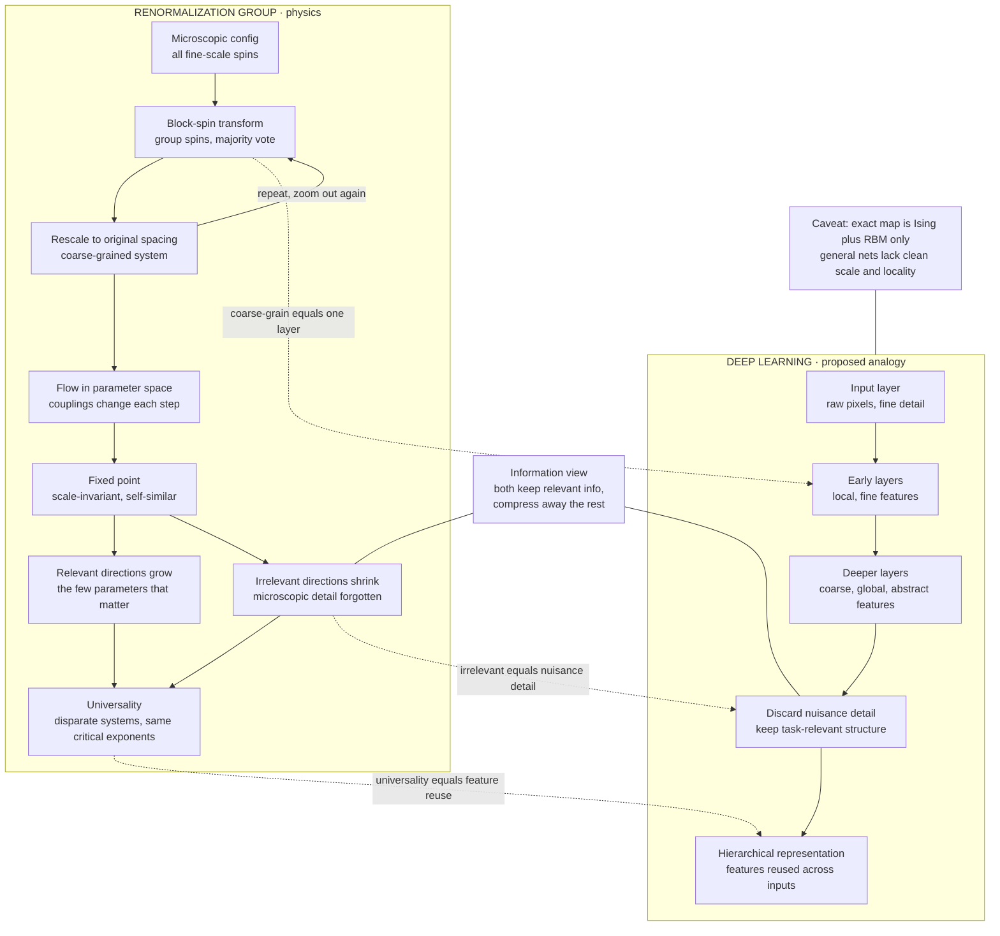

# 🔬 Renormalization and Deep Learning

> [!abstract] TL;DR
> The **renormalization group (RG)** — Wilson and Kadanoff's framework of iterative **coarse-graining** that zooms out, integrates out fine-scale detail, and *flows* a system's parameters toward **fixed points** — explains critical phenomena and **universality**: why the *few relevant* features (not the microscopic mess) govern large-scale behavior, and why wildly different materials share identical critical exponents. A **deep neural network** appears to do something eerily parallel: each layer coarse-grains its input, discarding nuisance detail and keeping task-relevant, hierarchical features. **Mehta & Schwab (2014)** even built an *exact* mapping between variational (block-spin) RG and stacked **restricted Boltzmann machines** for the Ising model. Framed information-theoretically, both perform **relevance-preserving compression**, and ML now reciprocally *discovers* RG transformations (**Koch-Janusz & Ringel**). The strong claim "deep learning *is* renormalization" is contested and *specific* rather than universal — but as a heuristic it powerfully explains why hierarchical nets succeed on the multi-scale, compositional structure of natural data.

---

## Intuition

**Analogy — FIRST.** Squint at a detailed photograph. The fine texture — individual hairs, skin pores, fabric threads — blurs away, and only the big shapes survive: a face, a body, a horizon. Squint harder and even those dissolve, leaving only the coarsest structure, light versus dark. Physicists turned this squinting into a *precise* tool. The **renormalization group** systematically throws away irrelevant fine detail, one scale at a time, to reveal the essential large-scale physics — and in doing so it explains one of nature's deepest puzzles: why a magnet, a boiling fluid, and a mixture separating into oil and water all behave *identically* near their critical points, despite having nothing microscopically in common.

A deep neural network seems to squint in exactly this way. Feed it raw pixels; the early layers respond to fine, local detail (edges, textures); deeper layers assemble coarse, global, abstract features (a wheel, a face, "cat"). Layer by layer the network discards nuisance variation — lighting, exact pixel values, background — and keeps only what is **relevant** for the task. Is deep learning secretly performing renormalization? The analogy is deep, illuminating, and hotly debated. This note takes it seriously and honestly: it maps the genuine correspondence, the exact-but-narrow theorems behind it, the information-theoretic common ground, the two-way traffic between ML and physics — and precisely where the metaphor stops being an identity.

---

## How It Works

### The renormalization group: coarse-grain, rescale, flow

The RG is a *procedure*, repeated until a pattern emerges:

1. **Coarse-grain (Kadanoff's block-spin transformation).** Partition the lattice into blocks. Replace each block of spins with a *single* effective spin — for instance by **majority vote**. This integrates out the short-distance degrees of freedom, discarding fine detail while trying to preserve large-scale behavior. It is the "squint" made concrete.
2. **Rescale.** Shrink lengths so the coarser lattice looks like the original (same spacing, fewer sites over a larger physical area). Now compare like with like.
3. **Find the effective parameters.** Ask what couplings (temperature, interaction strength) the coarse-grained system *appears* to have. Coarse-graining changes them: the transformation induces a map $\theta \mapsto \mathcal{R}(\theta)$ on the space of parameters.
4. **Repeat.** Iterating defines a **flow** in parameter space — a trajectory of theories, each a zoomed-out version of the last.

### Fixed points, relevant directions, and universality — the payoff

The flow's structure is where the magic lives:

- **Fixed points** $\theta^\*=\mathcal{R}(\theta^\*)$ are theories that look the *same* at every scale — **scale-invariant**, self-similar. A critical system (at its phase-transition temperature $T_c$) sits at such a fixed point; its snapshots are statistically identical whether you look at fine or coarse resolution.
- **Relevant directions** grow under the flow: the *few* parameters that push the system *away* from criticality (like the distance $T-T_c$). Near a fixed point only a handful of relevant directions exist — these are the parameters that *matter*.
- **Irrelevant directions** shrink under the flow: the vast space of microscopic details (lattice shape, third-neighbor couplings, atomic specifics) that *wash out* as you zoom. This is why macroscopic physics is simple despite microscopic complexity.
- **Universality** follows immediately: any two systems whose flows converge to the *same* fixed point share the same large-scale physics — the *same critical exponents* — no matter how different their microscopics. The relevant directions define a **universality class**; everything irrelevant is forgotten. This is the profound explanation of why only a few features govern emergent behavior.

### The deep-learning analogy

Read the RG story again with a neural network in mind, and the parallel is striking:

- **Layers as coarse-graining.** Each layer maps a finer representation to a coarser one, much like one block-spin step. Depth is *scale*.
- **Discarding the irrelevant.** Early layers keep local/fine features; deeper layers keep global/abstract ones and progressively integrate out task-irrelevant nuisance variation — the neural analog of irrelevant directions shrinking.
- **Keeping the relevant.** The features that survive to the top layers are those that matter for the label — the analog of relevant operators surviving the RG flow.
- **Universality as feature reuse.** The same low-level features (edges, phonemes) recur across countless inputs, echoing how one fixed point governs many microscopically different systems.

**Mehta & Schwab (2014)** made this concrete for the Ising model: they constructed an *exact* mathematical mapping between **variational (block-spin) RG** and a **stacked restricted Boltzmann machine** ([[Boltzmann_Machines_and_RBMs]]). Each RG coarse-graining step corresponds to one RBM layer; the hidden units play the role of the block (coarse) spins. Deep learning, in this specific setting, *is* variational renormalization.

### The information-theoretic view

A complementary framing unifies both as **relevance-preserving compression**. RG discards information *irrelevant for long-distance prediction*, keeping what controls large-scale correlations. This is the spirit of Tishby's **information bottleneck** ([[Information_Bottleneck_and_Sufficient_Statistics]]): compress the input $X$ into a representation $T$ that throws away everything except what predicts the target $Y$. **Koch-Janusz & Ringel (2018)** turned this into an algorithm — a *real-space mutual-information RG* — training a neural network to build the coarse-graining that **maximizes the mutual information** between the retained coarse variables and the environment (the long-distance degrees of freedom). The network *discovers* the RG transformation by keeping what matters and discarding noise. RG and deep learning become two faces of the same principle: keep the relevant bits, compress away the rest.

### ML for renormalization — the reverse direction

The bridge runs both ways. Machine learning is now a *tool* for doing RG in physics: neural nets that **learn optimal coarse-grainings**, identify **relevant operators** and order parameters, **discover phase transitions and critical exponents from raw data**, and accelerate otherwise intractable RG calculations for field theories and lattice models (see [[Machine_Learning_in_Computational_Physics]]). Renormalization inspires deep learning; deep learning automates and extends renormalization.

### The caveats — an honest assessment

The "deep learning *is* RG" claim is **inspiring but contested**:

- The exact Mehta-Schwab mapping is **specific** (Ising / RBMs) and does not straightforwardly generalize to arbitrary architectures and tasks.
- Real deep nets have **no clean scale or locality structure** for general problems — there is no lattice, no obvious length to rescale, no translation-invariant blocking.
- **Lin, Tegmark & Rolnick (2017)** argue the connection is *subtler*: cheap, deep learning works so well not because nets literally renormalize, but because the physical processes generating natural data are themselves **local, hierarchical, and low-order** — so a hierarchical, compositional model class matches the data's generative structure.

The analogy is a **productive heuristic and partial mapping**, not a proven identity. The discipline is to distinguish a suggestive metaphor from a rigorous result — while still harvesting the metaphor's real predictive and design value.

### Why the analogy is compelling anyway

Even short of an equivalence, deep resonances remain: both RG and deep learning extract **hierarchical, multi-scale features**; both exploit that natural data and physics have **hierarchical, compositional** structure (the universe is built by local, hierarchical processes); both perform **relevance-based compression**; and both explain a kind of **universality** (feature reuse across inputs). The shared spirit — *finding what matters across scales* — is a unifying perspective on the statistical-mechanics/ML bridge, whether or not the two are ever proven identical.



---

## Key Concepts

### Secondary Level

- **Coarse-graining is squinting.** Replace a block of details with one summary value (majority vote). Fine detail disappears; big shapes remain. Do it again and again.
- **Some things matter, most do not.** As you zoom out, most microscopic details wash away and only a *few* features control the big picture. RG names which few.
- **Same behavior from different stuff.** A magnet and a boiling liquid behave identically near their "tipping point" because zooming out erases their differences — that is **universality**.
- **Deep nets seem to squint too.** Early layers see edges and textures; deeper layers see objects. Each layer throws away detail that does not matter for the answer, much like coarse-graining.

### Undergraduate Level

- **Block-spin transformation.** Partition an Ising lattice into $b\times b$ blocks; assign each block one spin by majority vote; rescale lengths by $b$. This defines a map on couplings $\theta\mapsto\mathcal{R}(\theta)$.
- **RG flow and fixed points.** Iterating $\mathcal{R}$ generates a trajectory in coupling space. **Fixed points** are scale-invariant; the critical point $T_c$ is an *unstable* fixed point separating the flow to order ($T<T_c$, magnetization $\to 1$) from the flow to disorder ($T>T_c$, correlations $\to 0$).
- **Relevant vs irrelevant.** Linearize $\mathcal{R}$ at a fixed point; eigenvalues $>1$ are **relevant** (grow, e.g. $T-T_c$), $<1$ are **irrelevant** (shrink, microscopic detail). Critical exponents come from the relevant eigenvalues.
- **Universality.** Systems sharing the same relevant directions flow to the same fixed point and have identical critical exponents, independent of microscopic couplings.
- **Layers as scale.** Depth in a network plays the role of RG "time": deeper equals coarser. Successive representations resemble successive coarse-grainings of the input.

### Graduate Level

- **Variational / real-space RG and RBMs.** Mehta-Schwab exhibit an exact correspondence between a variational block-spin RG (a set of coarse variables coupled to the physical spins by an energy $E(\{v\},\{h\})$) and a stacked RBM whose hidden units are the coarse spins; maximizing the RBM likelihood implements the RG coarse-graining, so a deep Boltzmann network *is* an RG transformation on the Ising Gibbs measure.
- **Relevant-information RG (Koch-Janusz–Ringel).** Define coarse variables $\mathcal{H}$ from a block by *maximizing* $I(\mathcal{H};\mathcal{E})$, the mutual information with the environment $\mathcal{E}$ (the surrounding long-distance region), subject to a compression constraint — an information-bottleneck objective whose optimum recovers the physically correct RG and its relevant operators. ML thereby *learns* the coarse-graining rather than positing it.
- **Information-bottleneck / DPI framing.** RG is a sequence of coarse-grainings each subject to the data-processing inequality: information about long-distance observables can only be preserved or lost. The "relevant" information is what survives; irrelevant microscopic information is monotonically discarded — a compression cascade paralleling a deep net's layer-wise loss of nuisance information.
- **Why deep-and-cheap learning works (Lin-Tegmark-Rolnick).** Natural data is generated by *hierarchical Markov* processes with local, low-order interactions; the corresponding negative-log-probability is a polynomial with few terms, exactly the function class deep nets represent cheaply. The RG analogy is then a *consequence* of the data's compositional locality, not proof that nets renormalize — a crucial distinction between mechanism and metaphor.
- **Open questions.** Does a general-purpose classifier possess an emergent RG-like scale structure? Is there a well-defined "RG time" for transformers? Can universality classes formalize *feature universality* (why independently trained nets learn similar early features)? These remain active and unresolved.

---

## Python Demo

We make the correspondence *visible* on the 2D Ising model. We equilibrate the lattice at three temperatures — below, at, and above the critical point $T_c\approx 2.269$ — then repeatedly apply **block-spin renormalization**: replace each $2\times2$ block by a single **majority-vote** spin, coarse-graining and rescaling, over and over.

The payoff is scale invariance at criticality. **Off-critical**, coarse-graining *flows*: below $T_c$ the minority islands are erased and the lattice marches toward all-aligned (**order**); above $T_c$ it stays a structureless salt-and-pepper (**disorder**). **At $T_c$**, the coarse-grained pattern looks *statistically the same at every scale* — a **fixed point**, self-similar under the RG. Panel A shows the coarse-graining sequence; Panel B tracks an **effective parameter** (the nearest-neighbor correlation) *flowing* toward the ordered fixed point (correlation $\to 1$) or the disordered fixed point (correlation $\to 0$), while staying nearly *constant* at criticality — the RG flow made quantitative. The same picture is the deep-learning message: coarse-graining discards fine detail while preserving large-scale structure, exactly what feature-extraction layers do.

```python
# Block-spin renormalization of the 2D Ising model:
#   coarse-grain by 2x2 MAJORITY VOTE, repeatedly, and watch the RG FLOW.
#   At T_c the pattern is SCALE-INVARIANT (a fixed point); off-critical it
#   flows to order (all-aligned) or disorder (random). This is the same
#   "discard fine detail, keep large-scale structure" that deep-net layers do.
import numpy as np
import matplotlib.pyplot as plt

rng = np.random.default_rng(7)

# ---------------------------------------------------------------
# 1) Equilibrate an Ising lattice at temperature T (vectorized
#    checkerboard Metropolis, periodic boundaries).
# ---------------------------------------------------------------
def ising_equilibrate(L, T, sweeps=600):
    s = rng.choice([-1.0, 1.0], size=(L, L))
    ii, jj = np.indices((L, L))
    even = ((ii + jj) % 2 == 0)                 # checkerboard sublattices
    for _ in range(sweeps):
        for color in (even, ~even):
            nb = (np.roll(s, 1, 0) + np.roll(s, -1, 0)
                  + np.roll(s, 1, 1) + np.roll(s, -1, 1))
            dE = 2.0 * s * nb                    # energy cost of a flip
            accept = color & (rng.random((L, L)) < np.exp(-dE / T))
            s[accept] *= -1.0
    return s

# ---------------------------------------------------------------
# 2) One block-spin RG step: 2x2 majority vote (random tie-break),
#    then implicitly rescale (the returned lattice is L/2 x L/2).
# ---------------------------------------------------------------
def block_spin(s, b=2):
    L = s.shape[0]
    Lc = L // b
    block_sum = s[:Lc*b, :Lc*b].reshape(Lc, b, Lc, b).sum(axis=(1, 3))
    coarse = np.sign(block_sum)                  # majority vote
    ties = (coarse == 0)                         # even block can tie -> coin flip
    coarse[ties] = rng.choice([-1.0, 1.0], size=int(ties.sum()))
    return coarse

# Effective parameter that FLOWS under RG: nearest-neighbor correlation.
# -> 1 at the ordered fixed point, -> 0 at the disordered fixed point,
#    ~constant at the CRITICAL fixed point (scale invariance).
def nn_correlation(s):
    c = (s * np.roll(s, 1, 0) + s * np.roll(s, -1, 0)
         + s * np.roll(s, 1, 1) + s * np.roll(s, -1, 1))
    return float(c.mean() / 4.0)

# ---------------------------------------------------------------
# 3) Run three temperatures across the critical point T_c ~ 2.269
# ---------------------------------------------------------------
L = 128
regimes = [("ordered  T=1.8", 1.8), ("critical T=2.27", 2.269), ("disordered T=3.5", 3.5)]
n_show = 4          # show levels 0,1,2,3  (128, 64, 32, 16)
n_flow = 5          # measure correlation across 5 coarse-grainings

configs, flows = {}, {}
for name, T in regimes:
    s = ising_equilibrate(L, T)
    seq, corr = [s], [nn_correlation(s)]
    cur = s
    for _ in range(n_flow):
        cur = block_spin(cur)
        seq.append(cur)
        corr.append(nn_correlation(cur))
    configs[name] = seq
    flows[name] = corr

# ---------------------------------------------------------------
# 4a) Plot the block-spin coarse-graining sequence (self-similarity at T_c)
# ---------------------------------------------------------------
fig, axes = plt.subplots(len(regimes), n_show, figsize=(11, 8.2))
for r, (name, _) in enumerate(regimes):
    for c in range(n_show):
        ax = axes[r, c]
        ax.imshow(configs[name][c], cmap="binary", interpolation="nearest")
        ax.set_xticks([]); ax.set_yticks([])
        if r == 0:
            ax.set_title(f"level {c}\n{configs[name][c].shape[0]}x{configs[name][c].shape[0]}",
                         fontsize=9)
    axes[r, 0].set_ylabel(name, fontsize=10)
fig.suptitle("Block-spin RG: coarse-grain by 2x2 majority vote (each column zooms out)\n"
             "critical row looks statistically the SAME at every scale = a fixed point",
             fontsize=11)
plt.tight_layout()
plt.savefig("rg_block_spin_sequence.png", dpi=120)

# ---------------------------------------------------------------
# 4b) Plot the RG FLOW of the effective parameter
# ---------------------------------------------------------------
plt.figure(figsize=(7, 4.6))
levels = np.arange(n_flow + 1)
styles = {"ordered  T=1.8": "o-", "critical T=2.27": "s-", "disordered T=3.5": "^-"}
for name, _ in regimes:
    plt.plot(levels, flows[name], styles[name], lw=2, ms=6, label=name)
plt.axhline(1.0, color="green", ls=":", lw=1, label="ordered fixed point")
plt.axhline(0.0, color="red",   ls=":", lw=1, label="disordered fixed point")
plt.xlabel("RG step  (number of coarse-grainings)")
plt.ylabel("effective parameter:  nearest-neighbor correlation")
plt.title("RG flow: correlation flows to a fixed point off-criticality,\n"
          "stays ~constant (scale-invariant) at criticality")
plt.legend(fontsize=8, loc="center right")
plt.tight_layout()
plt.savefig("rg_flow_effective_parameter.png", dpi=120)

for name, _ in regimes:
    print(f"{name:18s} correlation flow:", [round(x, 3) for x in flows[name]])
```

Running it: the **critical** row is the star — its coarse-grained snapshots are statistically indistinguishable across scales, the hallmark of a scale-invariant fixed point (the coarse pattern is a self-similar copy of the fine one). The **ordered** row's small islands vanish under successive majority votes and the correlation climbs toward $1$; the **disordered** row stays a featureless jumble with correlation near $0$. The flow plot shows two *stable* fixed points (correlation $0$ and $1$) with the critical point balanced *unstably* between them — the essence of RG flow and universality, and a concrete picture of coarse-graining as relevance-preserving compression.

---

## Real-World Applications

- **Explaining why deep nets work on natural data.** The RG lens (and its Lin-Tegmark-Rolnick refinement) is a leading account of *why* deep hierarchical models succeed: natural images, audio, and language are generated by local, multi-scale, compositional processes, so hierarchical feature extraction matches the data's structure.
- **Multi-scale architecture design.** Multigrid, wavelet, and hierarchical networks — most visibly **U-Nets** with their coarsen-then-refine encoder/decoder — are explicit engineering embodiments of coarse-graining and its inverse; the same skip-and-scale structure underlies modern diffusion-model backbones.
- **Machine learning for physics (learning the RG).** Neural real-space RG (Koch-Janusz–Ringel and successors) discovers coarse-grainings and relevant operators; neural-network **renormalization for field theory and lattice models** (e.g. neural-RG / flow-based samplers) accelerates otherwise intractable computations. See [[Machine_Learning_in_Computational_Physics]].
- **Discovering phases and critical exponents from data.** Trained networks classify phases of matter and locate transitions directly from Monte Carlo configurations — extracting order parameters the RG says are the relevant variables.
- **Theory of representation learning.** The information-bottleneck view of RG informs how we think about *what* a good representation keeps and discards — relevant-information extraction as the objective of both compression and learning ([[Mutual_Information_and_Representation_Learning]]).

---

## Common Pitfalls

- **Treating the analogy as a proven identity.** "Deep learning *is* RG" is an *exact* theorem only in the narrow Mehta-Schwab (Ising/RBM) setting. For a general classifier there is no lattice, no length scale, and no rescaling — do not assert equivalence you cannot exhibit.
- **Assuming every deep net has an RG scale structure.** Depth is not automatically "scale." Fully-connected or attention layers need not coarse-grain anything geometric; the correspondence needs locality and a notion of scale to even be posed.
- **Conflating "hierarchical" with "renormalizing."** Data being hierarchical (Lin-Tegmark-Rolnick) explains cheap learning *without* requiring the network to perform RG. Hierarchy is the cause; RG is one possible description, not the mechanism.
- **Even-block ties in block-spin coarse-graining.** A $2\times2$ majority vote can tie (sum $=0$); an unprincipled tie-break biases the flow. Use odd blocks ($3\times3$) or an explicit random/deterministic tie rule, and be aware majority-rule RG is itself only an *approximate* transformation.
- **Reading a learning-curve kink as a critical fixed point.** Genuine scale invariance and universality require a non-analytic thermodynamic limit; a bend in a training curve is not evidence of an RG fixed point without a scaling analysis.
- **Forgetting the reverse arrow.** The bridge is bidirectional. Ignoring "ML *for* RG" misses half the payoff — neural networks that *do* renormalization for physics, not just borrow its metaphors.

---

## Related Concepts

**Physics of renormalization and criticality:**
- [[Renormalization_and_RG]] — the physics parent: Wilsonian RG, coarse-graining, fixed points, and the running of couplings in field theory (this note is the deep-learning framing of that machinery).
- [[Phase_Transitions_and_Critical_Phenomena]] — the critical points, order parameters, and critical exponents that RG explains via universality.
- [[The_Ising_Model_and_Statistical_Physics]] — the spin system used in the demo and in the Mehta-Schwab exact mapping.

**Complexity and scale:**
- [[Criticality_and_Phase_Transitions]] — criticality and scale invariance as a systems-level, emergent phenomenon.
- [[Fractals_and_Self_Similarity]] — self-similarity across scales is exactly what a critical (fixed-point) configuration exhibits.
- [[Emergence_and_Self_Organization]] — how simple large-scale laws emerge from complex microscopics, the philosophical core of RG.

**Information and representation:**
- [[Information_Bottleneck_and_Sufficient_Statistics]] — the relevance-preserving compression objective that unifies RG and deep representation learning.
- [[Mutual_Information_and_Representation_Learning]] — maximizing relevant mutual information, the principle Koch-Janusz–Ringel used to *discover* RG.

**Statistical-mechanics/ML bridge (this vault):**
- [[Boltzmann_Machines_and_RBMs]] — the stacked RBM that Mehta-Schwab exactly map to variational block-spin RG.
- [[Energy_Based_Models]] — the energy/Gibbs formulation shared by the Ising model and the networks being coarse-grained.
- [[The_Boltzmann_Distribution_in_Learning]] — the $p\propto e^{-E}$ measure that RG coarse-grains.
- [[Statistical_Mechanics_of_Machine_Learning_Overview]] — the map of the physics-ML correspondence this note sits inside.

**Deep-learning side:**
- [[CNN_Fundamentals]] — convolutional hierarchies as the archetypal local, multi-scale feature extractor the analogy points to.
- [[Neural_Network_Basics]] — the layered function class whose depth plays the role of RG scale.
- [[Machine_Learning_in_Computational_Physics]] — the ML-for-RG reverse direction: nets that learn coarse-grainings and find transitions.
- [[Scaling_Laws]] — the empirical multi-scale regularities of large models, a natural companion to the universality/scaling theme.

This note anticipates several not-yet-written siblings in section 05: **Phase_Transitions_in_Learning_and_Inference** (the ML face of critical phenomena), **Mean_Field_Theory_of_Neural_Networks** (the complementary large-width limit), **Statistical_Mechanics_of_Generalization_and_Scaling_Laws** (universality of learning curves), and **The_Free_Energy_Principle_and_the_Bayesian_Brain** (relevance and free energy in perception).

---

## Review Questions

### Secondary
1. Explain, using the "squinting at a photograph" idea, what coarse-graining does and why zooming out keeps big shapes but loses fine texture. How is a deep network's journey from pixels to "cat" similar?
2. Why can a magnet and a boiling liquid behave *identically* right at their tipping point even though they are made of completely different stuff?

### Undergraduate
3. Describe the block-spin transformation for the 2D Ising model. Why does the critical configuration look "the same at every scale," and what is that scale-invariant state called in RG language?
4. Distinguish **relevant** from **irrelevant** directions in an RG flow. Which one corresponds to "microscopic details that do not matter," and how does this produce **universality**?
5. State the deep-learning analogy precisely: what in a neural network plays the role of (a) one coarse-graining step, (b) irrelevant directions, and (c) universality? Give one way the analogy breaks down for a general classifier.

### Graduate
6. Summarize the Mehta-Schwab exact mapping between variational block-spin RG and stacked RBMs. What is mapped to what, why is it *exact* here, and why does it fail to establish that arbitrary deep nets renormalize?
7. Frame RG as an information bottleneck: what is being compressed, what "relevance" is preserved, and how did Koch-Janusz & Ringel operationalize this to *learn* an RG transformation from data via mutual-information maximization?
8. Lin, Tegmark & Rolnick argue deep learning works because of the *data's* structure rather than because nets literally perform RG. Explain their argument (hierarchical, local, low-order generative processes) and articulate the precise distinction between "hierarchy explains cheap learning" and "networks implement renormalization."

---

## Sources

- P. Mehta, D. J. Schwab, "An exact mapping between the Variational Renormalization Group and Deep Learning," *arXiv:1410.3831* (2014). [link](https://arxiv.org/abs/1410.3831)
- H. W. Lin, M. Tegmark, D. Rolnick, "Why does deep and cheap learning work so well?" *Journal of Statistical Physics* 168:1223–1247 (2017). [arXiv:1608.08225](https://arxiv.org/abs/1608.08225)
- M. Koch-Janusz, Z. Ringel, "Mutual information, neural networks and the renormalization group," *Nature Physics* 14:578–582 (2018). [arXiv:1704.06279](https://arxiv.org/abs/1704.06279)
- K. G. Wilson, "The renormalization group: Critical phenomena and the Kondo problem," *Reviews of Modern Physics* 47:773–840 (1975). [link](https://doi.org/10.1103/RevModPhys.47.773)
- L. P. Kadanoff, "Scaling laws for Ising models near $T_c$," *Physics Physique Fizika* 2:263–272 (1966). [link](https://doi.org/10.1103/PhysicsPhysiqueFizika.2.263)
- C. Bény, "Deep learning and the renormalization group," *arXiv:1301.3124* (2013). [link](https://arxiv.org/abs/1301.3124)

---

#statistical-mechanics #machine-learning #renormalization-group #coarse-graining #deep-learning
