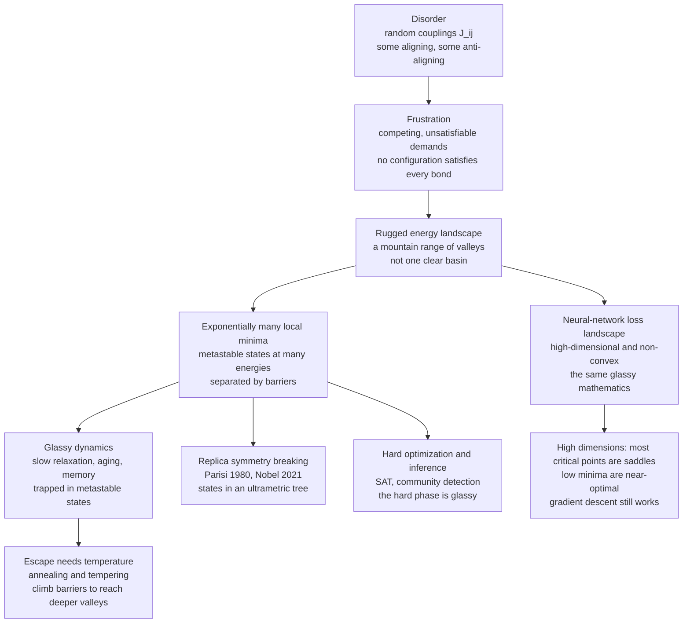

# 🪨 Spin Glasses and the Energy Landscape of Networks

> [!abstract] TL;DR
> A **spin glass** is a disordered magnet whose couplings are **random in sign** — some pairs want to align, some want to anti-align — so the system can never satisfy every demand at once. This **frustration** shatters the simple single-valley picture of an ordinary magnet into a **rugged energy landscape** with *exponentially many* local minima (metastable states) separated by barriers, organized (Parisi's Nobel-winning **replica symmetry breaking**) into a hierarchical, ultrametric tree. The stunning payoff for machine learning: a **Hopfield network is a spin glass**, and a deep network's high-dimensional non-convex **loss landscape has the same glassy geometry** — so spin-glass theory both *computes* network capacity and *explains why gradient descent works despite non-convexity* (in high dimensions most critical points are benign saddles, and the low minima are nearly as good as the global one). The very same physics governs the computationally **hard (glassy) phases** of SAT, community detection, and inference.

---

## Intuition

**Analogy — FIRST.** Imagine a room full of people, and each person has been handed a secret rule about their neighbours: *"disagree with Alice, agree with Bob, disagree with Carol."* Some pairs are told to agree, some to disagree, at random. Now everyone tries to obey. For any small clique it quickly becomes impossible: three people each told to *disagree* with the other two can never all be happy — someone must break a rule. The room settles into a tense, patchy standoff, and there are **countless equally-uncomfortable arrangements**, none clearly the best, each a compromise where a *different* set of rules is broken. Worse, if you nudge the room to fix one unhappy pair, you upset another somewhere else.

That deadlock of **conflicting, unsatisfiable demands is frustration**, and it is the entire essence of a spin glass — a strange magnetic material whose atomic spins are wired together by couplings that are *random in sign*. Because frustration forbids any single tidy ordered state, the material's energy landscape is not one clean valley but a **chaotic mountain range of countless valleys**, all at similar depths, riddled with ridges and traps. Here is the astonishing part: **this messy physics is the same mathematics as a neural network's loss landscape** — a high-dimensional terrain pocked with local minima that training must navigate. The tools physicists built across four decades to tame glassy magnets (culminating in Giorgio Parisi's 2021 Nobel Prize) turned out to be the very tools that explain *how and why neural networks learn*.

---

## How It Works

### Core Mechanics

A spin glass is defined by an **Ising-type energy** over spins $s_i \in \{-1,+1\}$,
$$ E(\mathbf{s}) = -\tfrac{1}{2}\sum_{i,j} J_{ij}\, s_i s_j , $$
identical in form to a ferromagnet — **except the couplings $J_{ij}$ are random**, drawn with both signs. A bond is *satisfied* when $J_{ij} s_i s_j > 0$ (aligned spins for a positive/ferromagnetic bond, anti-aligned for a negative/antiferromagnetic bond) and *unsatisfied* otherwise. Everything glassy flows from four ideas.

1. **Disorder — the couplings are quenched randomness.** Unlike a clean magnet where every bond wants alignment, a spin glass's $J_{ij}$ are frozen ("quenched") random numbers of mixed sign. Two canonical models make this concrete: the **Edwards–Anderson (EA) model** puts random nearest-neighbour couplings on a lattice; the **Sherrington–Kirkpatrick (SK) model** is the *fully-connected, mean-field* version where every pair of spins is coupled by an independent random $J_{ij}$ (exactly solvable). The related **p-spin models** couple $p$ spins at a time and describe structural glasses and some learning landscapes.

2. **Frustration — the core obstruction.** Consider three spins in a triangle, all coupled antiferromagnetically ($J<0$, each pair wants to *disagree*). Spin 1 disagrees with 2, spin 2 disagrees with 3 — but then 1 and 3 are *forced to agree*, violating *their* bond. **No configuration satisfies all three.** The clean diagnostic (Toulouse): a loop is **frustrated** when the *product of couplings around it is negative*. Frustration is why a spin glass has no simple ordered ground state — instead it has **many competing, near-degenerate configurations**, each an unavoidable compromise. This is exactly the structure of an unsatisfiable clause in constraint satisfaction: frustration *is* the physics of "you can't have everything."

3. **The rugged energy landscape — the signature.** Disorder + frustration produce an energy surface with **exponentially many local minima** (metastable states) at a *range* of energies, separated by barriers, rather than one dominant basin. Physicists picture it as a *mountain range of valleys*. Because escaping any valley requires climbing a barrier, the **dynamics get trapped**: relaxation is glacially **slow**, the system exhibits **aging** (its behaviour depends on how long it has been sitting) and **memory** — the dynamical fingerprints of glassiness. This is the landscape that maps directly onto ML loss surfaces and onto hard optimization.

4. **Replica symmetry breaking — Parisi's solution.** The SK model is solved with the **replica method**: analyze $n$ identical copies ("replicas") of the disordered system, average over the randomness, then take $n \to 0$ (foreshadowed by the sibling `The_Replica_Method_and_Neural_Network_Capacity`). The naive *replica-symmetric* answer — assuming all replicas are equivalent — is **wrong**: it predicts a *negative entropy*, a physical absurdity. Parisi's profound fix, **replica symmetry breaking (RSB)**, posits that the many pure states are organized in a **hierarchical, ultrametric tree**: states cluster into families, families into super-families, distances obeying the ultrametric inequality $d(A,C) \le \max\{d(A,B), d(B,C)\}$. RSB gives the correct free energy and is one of the deepest results in statistical physics — honored by the **2021 Nobel Prize** — with reach into optimization, biology, and machine learning.

**The bridge to neural networks — the historic link.** John Hopfield's 1982 associative-memory model *is* a spin glass: its Hebbian couplings $J_{ij}=\frac1N\sum_\mu \xi_i^\mu \xi_j^\mu$ carve a valley at each stored pattern, but the same disorder also breeds **spurious spin-glass states** — false-memory minima that correspond to no stored pattern (see [[Hopfield_Networks_and_Associative_Memory]]). Amit, Gutfreund & Sompolinsky (1985) used spin-glass theory and the replica method to compute the exact **storage capacity** $\alpha_c \approx 0.138$ and the full retrieval / spin-glass / paramagnetic phase diagram — launching the statistical mechanics of neural networks.

**The modern relevance — loss landscapes of deep nets.** Training a neural network *is* descending a high-dimensional, **non-convex loss landscape** — structurally a spin glass. Choromanska et al. (2015) mapped deep-net loss surfaces onto a **spherical spin-glass Hamiltonian**, and spin-glass theory then *predicts the geometry of critical points*: in **high dimensions**, the overwhelming majority of critical points are **saddle points**, not bad local minima, and the local minima that do exist are **tightly banded just above the global optimum**. Dauphin et al. (2014) drew the same conclusion — the real obstacle to optimization is saddle-point *plateaus*, not a thicket of terrible minima. This is a large part of *why* [[Gradient_Descent]] succeeds so reliably on wildly non-convex objectives: the landscape, though glassy, is *benign* where it matters (developed further in the sibling `The_Loss_Landscape_and_Generalization` and `Mean_Field_Theory_of_Neural_Networks`).

**Glassy dynamics and algorithmic hardness.** The same rugged geometry that traps a magnet traps *algorithms*. Near a **hard phase**, the landscape fragments into exponentially many metastable states and MCMC / local search suffer **critical slowing down** — they get stuck. This is the physics origin of **information–computation gaps**: regimes where a signal is statistically recoverable in principle but no efficient algorithm can find it because the landscape is glassy (the theme of the sibling `Phase_Transitions_in_Learning_and_Inference`). Combinatorial problems — **SAT, TSP, error-correcting codes, community detection** — all carry spin-glass structure, and their hard instances live in the glassy phase. Escaping requires thermal tricks: temperature, **[[Simulated_Annealing_and_Global_Optimization|simulated annealing]]**, and parallel tempering.

### Flow / Architecture



---

## Key Concepts

**Secondary (intuition-level).** A normal magnet is like a crowd that all wants to face the same way — one obvious best arrangement. A **spin glass** is a crowd where everyone was told to agree with some neighbours and disagree with others *at random*, so nobody can be fully happy: this is **frustration**. The result is not one best answer but a **huge landscape of roughly-equal, awkward compromises** — a mountain range with countless valleys instead of a single deep bowl. Roll a ball in and it gets stuck in whichever nearby dip it finds. Remarkably, a neural network learning from data faces *the same kind of bumpy landscape*, which is why the maths of glassy magnets became the maths of machine learning.

**Undergraduate (mechanics-level).** The Hamiltonian $E=-\tfrac12\sum_{ij}J_{ij}s_is_j$ with **random-sign** couplings; a bond is satisfied when $J_{ij}s_is_j>0$; **frustration** = a loop whose coupling product is negative (odd number of antiferromagnetic bonds) so it cannot be fully satisfied. The **Edwards–Anderson** (lattice) vs **Sherrington–Kirkpatrick** (fully-connected mean-field) vs **p-spin** models. Local minima under single-spin-flip dynamics: a state is metastable when $s_i h_i \ge 0$ for all $i$, where $h_i=\sum_j J_{ij}s_j$ is the local field; the single-flip energy change is $\Delta E_i = 2 s_i h_i$. Spin glasses have **exponentially many** such minima (contrast: a ferromagnet has just two — all-up and all-down). Greedy descent from random starts lands in *different* minima; temperature / **annealing** lets the state hop barriers to find deeper ones.

**Graduate (structure-level).** The SK free energy via the **replica trick** $\overline{\ln Z}=\lim_{n\to0}\frac{\overline{Z^n}-1}{n}$; the **overlap** order parameter $q_{ab}=\frac1N\sum_i s_i^a s_i^b$ and its *distribution* $P(q)$ as the true order parameter of the glassy phase; the failure of the **replica-symmetric** ansatz (negative entropy, the de Almeida–Thouless instability line) and **Parisi's full RSB** with a hierarchical, **ultrametric** organization of pure states; the **Thouless–Anderson–Palmer (TAP)** free energy and its exponentially many solutions (the **complexity** / configurational entropy); **1-step RSB** for p-spin and structural glasses vs full RSB for SK. In ML: the **Amit–Gutfreund–Sompolinsky** replica solution of Hopfield capacity ($\alpha_c\approx0.138$); the **spherical spin-glass** analysis of deep-net loss surfaces (Choromanska et al.) predicting a *band* of low minima and a saddle-dominated spectrum (Bray–Dean / random-matrix Hessian signatures); the **hard phase** of inference as an RSB / clustering transition producing information–computation gaps.

---

## Python Demo

```python
# Spin-glass ENERGY LANDSCAPE, four experiments in one script (numpy + matplotlib):
#   (a) build a small Sherrington-Kirkpatrick spin glass (random +/-J couplings) and,
#       by BRUTE FORCE, find ALL its local minima -> show there are MANY, at many
#       energies (a rugged landscape), versus a FERROMAGNET with exactly ONE ground
#       state (two, by symmetry).
#   (b) FRUSTRATION: an antiferromagnetic triangle whose 3 bonds cannot all be satisfied.
#   (c) greedy descent from many RANDOM starts lands in DIFFERENT minima (ruggedness).
#   (d) TEMPERATURE / annealing lets the search cross barriers and reach lower energies.
import numpy as np
import matplotlib.pyplot as plt

rng = np.random.default_rng(1)

# ---------- energy, local field, single-flip helpers ----------
def energy(J, s):
    return -0.5 * s @ J @ s                      # Ising / spin-glass Hamiltonian

def sk_couplings(N, rng):
    J = rng.standard_normal((N, N))              # random-SIGN couplings
    J = (J + J.T) / np.sqrt(2 * N)               # symmetric, mean-field scaling
    np.fill_diagonal(J, 0.0)                     # no self-coupling
    return J

def ferro_couplings(N):
    J = np.ones((N, N)); np.fill_diagonal(J, 0.0)  # all bonds want to ALIGN
    return J

# ======================================================================
# (a) BRUTE-FORCE the landscape of a small system: enumerate all 2^N states,
#     mark local minima  (a state is a local min iff s_i * h_i >= 0 for all i).
# ======================================================================
def all_states(N):
    idx = np.arange(2 ** N)
    bits = (idx[:, None] >> np.arange(N)) & 1
    return (2 * bits - 1).astype(float)          # shape (2^N, N), entries +/-1

def landscape(J):
    N = J.shape[0]
    S = all_states(N)
    E = -0.5 * np.einsum("bi,ij,bj->b", S, J, S) # energy of every configuration
    H = S @ J                                     # local fields for every state
    is_min = np.all(S * H >= 0.0, axis=1)         # no single flip lowers the energy
    return E, is_min

N = 16
J_sg = sk_couplings(N, rng)
J_fm = ferro_couplings(N)
E_sg, min_sg = landscape(J_sg)
E_fm, min_fm = landscape(J_fm)
print(f"(a) spin glass : {min_sg.sum():4d} local minima "
      f"(ground E/N = {E_sg[min_sg].min()/N:+.3f})")
print(f"(a) ferromagnet: {min_fm.sum():4d} local minima "
      f"(ground E/N = {E_fm[min_fm].min()/N:+.3f})")

# ======================================================================
# (b) FRUSTRATION: triangle with all-antiferromagnetic bonds (J = -1).
#     Bond energy = -J*s_i*s_j = +s_i*s_j ; you can satisfy at most 2 of 3 bonds.
# ======================================================================
tri = np.array([[0.0, -1, -1], [-1, 0, -1], [-1, -1, 0]])
tri_states = all_states(3)
tri_E = np.array([energy(tri, s) for s in tri_states])
loop_product = (-1) * (-1) * (-1)                # product of couplings around the loop
print(f"(b) triangle loop coupling product = {loop_product:+d}  "
      f"(negative => FRUSTRATED); min energy = {tri_E.min():+.0f} "
      f"(not -3: one bond is always broken), degeneracy = {(tri_E == tri_E.min()).sum()}")

# ======================================================================
# (c)+(d) descent lands in DIFFERENT minima; annealing reaches LOWER energy.
#     Use a larger SK model (no brute force) with many random restarts.
# ======================================================================
def greedy_descent(J, s):
    s = s.copy()
    while True:
        dE = 2.0 * s * (J @ s)                    # energy change to flip each spin
        k = int(np.argmin(dE))
        if dE[k] >= 0:                            # no improving flip -> local minimum
            break
        s[k] = -s[k]
    return s

def anneal(J, s, T0, T1, steps, rng):
    s = s.copy(); N = len(s)
    for t in range(steps):
        T = T0 * (T1 / T0) ** (t / steps)         # geometric cooling, hot -> cold
        k = int(rng.integers(N))
        dE = 2.0 * s[k] * (J[k] @ s)              # local move
        if dE <= 0 or rng.random() < np.exp(-dE / T):
            s[k] = -s[k]                          # Metropolis: sometimes climb uphill
    return greedy_descent(J, s)                   # quench into the nearest minimum

Nbig = 60
Jbig = sk_couplings(Nbig, rng)
restarts = 400
greedy_E = np.array([energy(Jbig, greedy_descent(Jbig, rng.choice([-1.0, 1.0], Nbig)))
                     for _ in range(restarts)]) / Nbig
anneal_E = np.array([energy(Jbig, anneal(Jbig, rng.choice([-1.0, 1.0], Nbig),
                                         T0=2.0, T1=1e-2, steps=4000, rng=rng))
                     for _ in range(restarts)]) / Nbig
print(f"(c) greedy from {restarts} random starts -> {len(np.unique(np.round(greedy_E,4)))} "
      f"distinct energies; mean E/N = {greedy_E.mean():+.3f}")
print(f"(d) annealed                              mean E/N = {anneal_E.mean():+.3f} (lower)")

# ---------------------------- plots ----------------------------
fig, ax = plt.subplots(2, 2, figsize=(13, 9))

ax[0, 0].hist(E_sg[min_sg] / N, bins=20, color="firebrick", alpha=0.85,
              label=f"spin glass: {min_sg.sum()} minima")
ax[0, 0].hist(E_fm[min_fm] / N, bins=20, color="steelblue", alpha=0.9,
              label=f"ferromagnet: {min_fm.sum()} minima")
ax[0, 0].set_title("(a) Density of LOCAL MINIMA: rugged glass vs single-valley ferromagnet")
ax[0, 0].set_xlabel("energy per spin  E/N"); ax[0, 0].set_ylabel("count of local minima")
ax[0, 0].legend()

colors = ["seagreen" if e > tri_E.min() + 1e-9 else "firebrick" for e in tri_E]
ax[0, 1].bar(range(8), tri_E, color=colors)
ax[0, 1].axhline(-3, ls="--", color="gray", label="if all 3 bonds satisfied (impossible)")
ax[0, 1].set_title("(b) FRUSTRATION: antiferromagnetic triangle, min energy = -1 not -3")
ax[0, 1].set_xlabel("configuration index (of 8)"); ax[0, 1].set_ylabel("energy")
ax[0, 1].legend()

bins = np.linspace(min(greedy_E.min(), anneal_E.min()) - 0.02,
                   max(greedy_E.max(), anneal_E.max()) + 0.02, 30)
ax[1, 0].hist(greedy_E, bins=bins, color="darkorange", alpha=0.85)
ax[1, 0].set_title("(c) Greedy descent lands in MANY DIFFERENT minima (rugged landscape)")
ax[1, 0].set_xlabel("final energy per spin  E/N"); ax[1, 0].set_ylabel("count of restarts")

ax[1, 1].hist(greedy_E, bins=bins, color="darkorange", alpha=0.7, label="greedy descent")
ax[1, 1].hist(anneal_E, bins=bins, color="seagreen", alpha=0.7, label="annealed")
ax[1, 1].axvline(greedy_E.mean(), color="darkorange", ls="--")
ax[1, 1].axvline(anneal_E.mean(), color="seagreen", ls="--")
ax[1, 1].set_title("(d) TEMPERATURE / annealing crosses barriers -> lower minima")
ax[1, 1].set_xlabel("final energy per spin  E/N"); ax[1, 1].set_ylabel("count of restarts")
ax[1, 1].legend()

plt.tight_layout()
plt.savefig("spin_glass_landscape.png", dpi=120)
```

What you see. **(a)** The ferromagnet's local minima collapse to a *single* deep energy (its two symmetric ground states) — one clean valley — while the spin glass sprays **dozens of local minima across a wide band of energies**: a rugged landscape. **(b)** The antiferromagnetic triangle can never reach energy $-3$ (all bonds satisfied); its best is $-1$, with a **6-fold-degenerate** ground state — the visual proof of frustration and its degeneracy. **(c)** Four hundred greedy descents from random starts scatter into **many distinct final energies** — the same optimizer, run again, lands somewhere else, exactly because the landscape is glassy. **(d)** Adding **temperature** (annealing) lets the search climb barriers and settle into systematically **deeper** minima — the whole distribution shifts left. Read the loss landscape of a neural network for the spin glass, and you have the picture behind why gradient descent needs momentum, noise, and restarts, yet still finds good solutions.

---

## Real-World Applications

- **Neural-network capacity and loss landscapes.** Spin-glass theory computes the storage capacity of [[Hopfield_Networks_and_Associative_Memory|Hopfield networks]] ($\alpha_c\approx0.138$) and, via the spherical-spin-glass mapping, explains the *geometry* of deep-network loss surfaces — saddle-dominated, with low minima clustered near the global optimum — the modern rationale for why non-convex training works.
- **Combinatorial optimization and constraint satisfaction.** SAT, graph colouring, max-cut, the travelling salesman problem, and vertex cover all have spin-glass Hamiltonians; their *hard* instances sit in the glassy phase. The physics predicts solvable/hard/unsolvable phase boundaries and inspired algorithms like **survey propagation** for random k-SAT.
- **Error-correcting codes.** Decoding LDPC and other codes is inference on a disordered system; the decoding threshold is a phase transition, and the "error floor" reflects glassy metastable states that trap belief-propagation decoders.
- **Computational hardness and information–computation gaps.** In sparse PCA, community detection (the stochastic block model), and tensor estimation, a **glassy hard phase** separates "statistically recoverable" from "efficiently recoverable" — a spin-glass explanation for why some inference is intractable.
- **Protein folding and structural glasses.** The **rugged energy landscape** and **funnel** picture of folding, and the mode-coupling / random-first-order (p-spin) theory of the glass transition in supercooled liquids, are direct spin-glass descendants.
- **Biology, ecology, and economics.** Random-interaction models of gene-regulatory and neural networks, ecosystems with random species interactions (May's stability, disordered Lotka–Volterra), and disordered-agent models in economics all inherit spin-glass multistability and slow dynamics.

---

## Common Pitfalls

- **Confusing a spin glass with a ferromagnet.** Same Hamiltonian *form*, utterly different physics. The signature is the **sign randomness** of $J_{ij}$ and the resulting frustration — that is what turns one valley into a mountain range. If your couplings are all one sign, you do **not** have a glass.
- **Thinking frustration means "disorder."** Frustration is specifically the **inability to satisfy all bonds simultaneously** (a *negative loop product*), not mere randomness. You can have disorder with little frustration (weakly glassy) or frustration without quenched disorder (e.g. antiferromagnets on a triangular lattice). Diagnose with the loop-product test, not by eyeballing the couplings.
- **Trusting a single greedy descent.** On a rugged landscape, one run of greedy or gradient descent lands in *whatever* minimum is nearest — likely shallow, and different every seed. Use **multiple restarts**, **temperature/annealing**, or momentum; a converged low-energy state is not evidence of the global minimum (the demo's panel (c) is the cautionary picture).
- **Over-reading "deep nets have no bad local minima."** The spin-glass result is *asymptotic and model-specific*: in **high dimensions** most critical points are saddles and low minima are *close* in loss — it is **not** a theorem that every trained network reaches the global optimum, and small or highly-structured networks can genuinely get stuck. Don't quote it as a universal guarantee.
- **Applying replica-symmetric formulas in the glassy phase.** The naive replica-symmetric ansatz gives *negative entropy* and wrong thresholds below the de Almeida–Thouless line. If you are in the glassy phase you need **RSB** (or at least 1-RSB); using RS answers there silently corrupts capacity and hardness predictions.
- **Ignoring critical slowing down when sampling.** Near or inside a glassy phase, MCMC and local search **mix exponentially slowly** and *look* converged while being trapped. Diagnose with multiple chains / replica exchange; a flat energy trace can be metastability, not equilibrium.

---

## Related Concepts

- [[Hopfield_Networks_and_Associative_Memory]] — the canonical neural network that *is* a spin glass; its Hebbian couplings create memory valleys plus spurious spin-glass states.
- [[Simulated_Annealing_and_Global_Optimization]] — the algorithm for escaping a rugged landscape's traps by thermal barrier-crossing; the demo's panel (d) in note form.
- [[The_Ising_Model_and_Statistical_Physics]] — the ordered magnet whose Hamiltonian a spin glass shares but whose single-valley landscape it destroys via random couplings.
- [[Phase_Transitions_and_Critical_Phenomena]] — the spin-glass / paramagnetic transition and the RSB transition as instances of critical phenomena.
- [[Criticality_and_Phase_Transitions]] — the complex-systems view of the same glassy / hard-phase transitions and their algorithmic consequences.
- [[Evolutionary_Dynamics_and_Fitness_Landscapes]] — rugged fitness landscapes (NK model, evolution) are the biological twin of the spin-glass energy landscape.
- [[The_Boltzmann_Distribution_in_Learning]] — the $p\propto e^{-E/T}$ law that turns the glassy energy landscape into a probability distribution to sample and anneal.
- [[Energy_Based_Models]] — the "define probability by an energy" framework whose landscapes inherit glassy structure.
- [[Temperature_and_Annealing_in_Learning]] — temperature as the dial that determines whether dynamics are trapped (cold, glassy) or exploratory (hot).
- [[Free_Energy_Minimization_and_Variational_Principles]] — the free-energy landscape whose exponentially many TAP minima *are* the metastable states of the glass.
- [[The_Metropolis_Algorithm_and_MCMC]] — the sampler that suffers critical slowing down inside the glassy phase and that annealing accelerates.
- [[Langevin_Dynamics_and_SGLD]] — noisy gradient dynamics on a rugged loss surface; SGD noise as an effective temperature exploring the landscape.
- [[Gradient_Descent]] — the greedy ($T=0$) optimizer whose success on non-convex glassy loss surfaces the theory explains.
- [[SGD_and_Variants]] — stochastic training whose noise, momentum, and restarts are precisely the tools a rugged landscape demands.
- [[Neural_Network_Basics]] — the models whose high-dimensional loss landscapes carry spin-glass geometry.
- [[Classical_Statistical_Mechanics]] — the canonical-ensemble toolkit (partition function, free energy) used to solve disordered systems.
- [[Optimization_Theory]] — the non-convex, multi-minima optimization backdrop that spin-glass geometry describes.
- [[Integer_Programming]] — the NP-hard combinatorial problems (SAT, max-cut) whose hard instances live in a glassy phase.

---

## Review Questions

1. **(Conceptual)** Two Ising systems share the identical Hamiltonian $E=-\tfrac12\sum_{ij}J_{ij}s_is_j$; one is a ferromagnet, one is a spin glass. Explain precisely what differs, define **frustration** using the loop-coupling-product criterion, and explain how frustration turns a single-valley landscape into one with exponentially many local minima. Why does the antiferromagnetic triangle have a ground-state energy of $-1$ rather than $-3$?
2. **(Scenario)** You train a large neural network and, worried by its non-convexity, run gradient descent from many random seeds. You find the *final training losses are all similar and low, yet the weight vectors are all different.* Interpret this through the spin-glass picture of loss landscapes: what does it say about the structure of low minima and about saddle points in high dimensions, and why is it *not* a proof that you reached the global optimum? What does the same experiment on a tiny 3-neuron network likely reveal instead?
3. **(Trade-off / depth)** The replica-symmetric solution of the SK model predicts a *negative entropy* — a physical impossibility. Explain what this failure signals, what **replica symmetry breaking** (Parisi) replaces it with, and what the **ultrametric** organization of states means. Then connect this to computation: why does the emergence of an RSB / clustered phase make certain inference problems (e.g. community detection) *algorithmically* hard even when they remain *statistically* solvable, and what does annealing buy you against it?

---

## Sources

- D. Sherrington, S. Kirkpatrick, "Solvable Model of a Spin-Glass," *Physical Review Letters* 35, 1792 (1975). [link](https://doi.org/10.1103/PhysRevLett.35.1792)
- G. Parisi, "Infinite Number of Order Parameters for Spin-Glasses," *Physical Review Letters* 43, 1754 (1979); and "A sequence of approximated solutions to the S-K model for spin glasses," *J. Phys. A* 13, L115 (1980). [link](https://doi.org/10.1103/PhysRevLett.43.1754) — foundation of the 2021 Nobel Prize.
- M. Mézard, G. Parisi, M. A. Virasoro, *Spin Glass Theory and Beyond*, World Scientific (1987).
- A. Choromanska, M. Henaff, M. Mathieu, G. Ben Arous, Y. LeCun, "The Loss Surfaces of Multilayer Networks," *AISTATS* (2015). [arXiv:1412.0233](https://arxiv.org/abs/1412.0233)
- Y. Dauphin et al., "Identifying and attacking the saddle point problem in high-dimensional non-convex optimization," *NeurIPS* (2014). [arXiv:1406.2572](https://arxiv.org/abs/1406.2572)
- M. Mézard, A. Montanari, *Information, Physics, and Computation*, Oxford University Press (2009).

---

#statistical-mechanics #machine-learning #spin-glasses #energy-landscape #frustration
