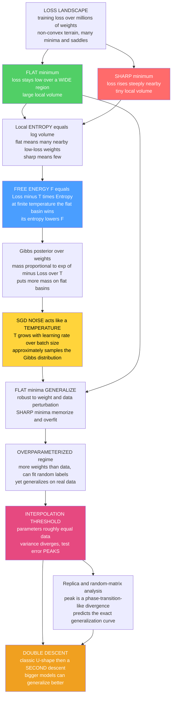

# 🏔️ The Loss Landscape and Generalization

> [!abstract] TL;DR
> Training a neural network is a descent over a **loss landscape** — a wildly non-convex surface of the training loss plotted against the network's millions of weights. The surprise is that **most minima are not created equal**: among the many weight settings that drive the training loss to (near) zero, some are **FLAT** — the loss stays low over a broad region — and these **generalize** to unseen data, while **SHARP** ones, where the loss spikes the moment you nudge the weights, **memorize and overfit** (Hochreiter–Schmidhuber; Keskar et al.). Statistical mechanics explains *why*: a flat minimum has enormous **local volume**, i.e. high local **entropy** (many nearby low-loss configurations), so in the **free energy** $F = \text{Loss} - T\!\cdot\!S$ its entropy lowers $F$ and the **Gibbs posterior** $p(w)\propto e^{-\text{Loss}(w)/T}$ concentrates its mass on flat basins. Because the **noise of stochastic gradient descent behaves like a temperature** ($T_\text{eff}\propto$ learning-rate/batch-size — see [[Langevin_Dynamics_and_SGLD]]), SGD *approximately samples* that Gibbs distribution and is therefore **implicitly biased toward flat, generalizing minima**. This same lens dissolves the central puzzle of deep learning — that hugely **overparameterized** nets can fit *random* labels (infinite classical capacity, Zhang et al.) yet still generalize on real data — and predicts the striking **DOUBLE DESCENT** curve: as capacity grows, test error follows the classical U-shape up to the **interpolation threshold** (parameters $\approx$ data), where it **peaks** in a phase-transition-like divergence, and then **descends again** in the overparameterized regime (Belkin et al.). Replica and random-matrix analyses (Advani–Saxe, Mei–Montanari) compute these curves exactly, making the statistical mechanics of loss landscapes a *predictive* theory of modern deep learning's most counterintuitive behaviour.

---

## Intuition

**Analogy — two hikers who both reach sea level.** Two hikers descend into a foggy mountain range and each stops when the altimeter reads exactly zero — both have "solved the problem" of getting to the bottom. But they stopped in very different places. One is wedged in a **narrow, steep crevasse**: the walls shoot up on every side, and the tiniest nudge flings her back uphill. The other stands on a **broad, flat plain** stretching for miles at the same low altitude; shove him a few steps in any direction and he barely notices — he is still at sea level. Now imagine the ground is a slightly imperfect map of the *real* terrain (the test data differs a little from the training data): the map wobbles by a few metres everywhere. On the flat plain the wobble is harmless — you are still low. In the crevasse, the same wobble can leave you halfway up a cliff. **Wide, flat valleys are forgiving; narrow, sharp ones are not.**

Neural networks are exactly this. Training finds *many* different "valleys" of near-zero training error, but the **WIDE, FLAT** ones generalize to new data while the **SHARP, narrow** ones memorize the training set and fail on anything new. And here is the physics: the "width" of a valley is literally its **entropy** — the log of how many weight configurations sit inside it — and **temperature biases a physical system toward high-entropy regions** (that is why ice melts and gases fill their container). The endless random jostling of **stochastic gradient descent** is a temperature. So SGD does not just roll to *some* bottom; its thermal noise naturally seeks out the *roomy, high-entropy, flat* valleys — the good, generalizing ones. Generalization, in this telling, is thermodynamics.

---

## How It Works

### The loss landscape and its geometry

A network with $N$ weights $w\in\mathbb R^N$ has a scalar **training loss** $\mathcal L(w)$. As $N$ runs into the millions or billions, $\mathcal L$ is a fantastically high-dimensional, **non-convex** surface — a terrain of **minima, saddles, ridges, and valleys**. Deep learning "works" by descending this terrain, and understanding its *geometry* — how many minima there are, how they connect, how wide they are — is central to explaining why. Crucially, in high dimensions the picture is not "one global minimum surrounded by bad local minima": critical points are overwhelmingly **saddles**, not traps (Dauphin et al.), and the many near-global minima form vast connected structures. This is precisely the physics of a **spin glass** — a disordered energy landscape with exponentially many low-lying states — which is why the tools of statistical mechanics apply (developed in the sibling *Spin_Glasses_and_the_Energy_Landscape_of_Networks*, whose replica/energy-landscape machinery underlies everything here; see also [[Phase_Transitions_and_Critical_Phenomena]]).

### Flat vs sharp minima — the key idea for generalization

Different minima of the **training** loss generalize **differently**. A **flat (wide)** minimum is one where the loss stays low over a broad neighbourhood of $w$; a **sharp (narrow)** minimum is one where the loss rises steeply as you move away. The empirical and theoretical link, going back to **Hochreiter and Schmidhuber (1997)** and sharpened by **Keskar et al. (2017)**:

- **Flat minima generalize well.** Test data induces a slightly different loss surface; a flat solution barely moves its loss under that shift, so training and test loss agree. Flatness also means the model is describable with *fewer bits* (a minimum-description-length argument) — a low-complexity solution.
- **Sharp minima overfit.** They exploit fragile, high-curvature coincidences of the training set that do not transfer.

Keskar et al. showed the practical consequence: **large-batch** training drifts into **sharper** minima and generalizes worse, while **small-batch** training (more gradient noise) finds **flatter** ones. Sharpness is often quantified by the **Hessian** $\nabla^2\mathcal L$ at the minimum — its top eigenvalues or trace measure curvature.

**The caveat (Dinh et al. 2017):** naive flatness is *not reparameterization-invariant*. You can rescale a ReLU network's weights layer-by-layer to make any minimum look arbitrarily "sharp" or "flat" in raw coordinates without changing the function. So flatness must be measured in a scale-aware way (e.g. Fisher/Hessian-based, or PAC-Bayes normalized). The *correlation* between (properly measured) flatness and generalization is real and one of the most robust empirical findings in deep learning, but the metric matters.

### The entropy / free-energy view of flatness

This is where statistical mechanics makes "flat = good" precise. Consider the **Gibbs / Bayesian posterior** over weights at temperature $T$,

$$p(w) \;=\; \frac{1}{Z}\,e^{-\mathcal L(w)/T},\qquad Z=\int e^{-\mathcal L(w)/T}\,dw .$$

The **weight of a whole basin**, not a single point, is what matters. Near a minimum $w^\star$ with Hessian $H$, a Laplace (Gaussian) integral gives the basin's contribution to $Z$:

$$Z_\text{basin} \;\approx\; e^{-\mathcal L(w^\star)/T}\,\underbrace{(2\pi T)^{N/2}\,(\det H)^{-1/2}}_{\text{local volume}} .$$

Read it as a **free energy** $F=\mathcal L - T S$: the two competing minima at the *same depth* $\mathcal L(w^\star)$ are separated only by the **local entropy** $S = \tfrac12\log\det(H^{-1}) + \text{const}$ (the log-volume of the basin). A **flat** minimum has small $\det H$, hence **large volume, high entropy, and lower free energy** — so at any finite temperature the Gibbs posterior puts *exponentially more mass* on it than on an equally-deep sharp minimum. Flatness *is* entropy; entropy lowers free energy; low free energy is where the system lives. This is exactly the "**local entropy**" objective made explicit by **Baldassi et al.** and operationalized as **Entropy-SGD** by **Chaudhari et al.**, which deliberately biases training toward wide, high-local-entropy basins — a physics idea turned into an optimizer. See [[Partition_Functions_and_Free_Energy_in_ML]], [[Free_Energy_Minimization_and_Variational_Principles]], and the thermodynamic origin in [[The_Boltzmann_Distribution_in_Learning]] and [[Entropy_and_Second_Law]].

### SGD as a sampler of flat minima

Why should *training* end up in high-entropy basins? Because **the noise in stochastic gradient descent acts like a temperature.** Subsampling minibatches makes each gradient a noisy estimate, so the SGD update is a discretized **Langevin dynamics** whose stationary distribution is approximately the Gibbs posterior $e^{-\mathcal L/T_\text{eff}}$ with an **effective temperature**

$$T_\text{eff}\;\propto\;\frac{\eta}{B}\qquad(\eta=\text{learning rate},\;B=\text{batch size}).$$

SGD therefore does not seek the *sharpest* deepest point; it approximately **samples** the posterior and is thereby **biased toward flat, high-entropy, generalizing minima** — the celebrated **implicit regularization** of SGD (full derivation in [[Langevin_Dynamics_and_SGLD]]; the temperature-and-cooling picture in [[Temperature_and_Annealing_in_Learning]]). This immediately explains a wall of empirical folklore: **small batches / larger learning rates generalize better** because they raise $T_\text{eff}$, injecting more "temperature" that escapes narrow crevasses and settles on broad plains. (The approximation is imperfect — minibatch noise is anisotropic and state-dependent, not the isotropic noise of ideal Langevin — but the qualitative thermodynamics holds.) The mean-field limit that makes this analysis exact for wide networks is the subject of the sibling *Mean_Field_Theory_of_Neural_Networks*.

### The generalization puzzle of deep learning

Classical learning theory says a model with more parameters than data should **overfit**: it has enough capacity to memorize noise, so worst-case bounds (VC dimension, Rademacher complexity) go vacuous. **Zhang et al. (2017)** made the paradox vivid — standard networks can fit **random labels** to zero training error (their effective capacity is essentially unbounded) — *yet the same architectures trained on real labels generalize beautifully*. Classical **bias–variance** intuition ([[Bias_Variance_Tradeoff]]) and worst-case theory simply **fail** to predict this. What is needed is a **typical-case** theory — one that asks what happens for the *actual* data and the *actual* optimizer, not the adversarial worst case. That is exactly the native language of statistical mechanics, which has always computed *typical* (quenched-average) behaviour of disordered systems. The resolution has two pillars, below: SGD's bias toward flat/simple solutions, and the double-descent behaviour of test error with capacity.

### Double descent — the landmark modern phenomenon

Plot **test error against model capacity** and you do *not* get the textbook U-curve. You get **double descent** (**Belkin et al. 2019**):

1. **Underparameterized (classical) regime.** As capacity grows, test error falls (less bias), reaches a sweet spot, then **rises** (more variance) — the classical U.
2. **Interpolation threshold.** At capacity $\approx$ number of training points, the model *just barely* fits the data (train error hits zero). Here test error **peaks**, often diverging — the single interpolating solution is forced to contort wildly through every noisy point.
3. **Overparameterized regime.** Push capacity *past* the threshold and test error **descends again**, often below the classical sweet spot. With many interpolating solutions available, the optimizer picks a *smooth, low-norm* one — "bigger is better."

The same shape appears **epoch-wise** (test error rises then falls again as you train longer) and **sample-wise** (more data can transiently *hurt* near the threshold). Double descent overturns the "bigger $=$ overfit" dogma and is the empirical engine behind scaling up models (see [[Scaling_Laws]]).

### The statistical-mechanics account of double descent

Physics does not just *describe* double descent — it **predicts it exactly**. For high-dimensional **linear and random-feature regression** (the analytically tractable proxy for a network), the **replica method** and **random-matrix theory** compute the exact generalization error as a function of the parameters-to-data ratio (**Advani & Saxe 2017; Mei & Montanari 2019; Bahri et al. 2021**). The **peak at the interpolation threshold is a phase-transition-like divergence**: the least-squares variance blows up because the feature Gram matrix becomes singular (its smallest eigenvalue $\to 0$, condition number $\to\infty$) — a critical point in the sense of [[Phase_Transitions_and_Critical_Phenomena]]. Add the tiniest **ridge regularization** and the divergence is tamed into a finite bump, exactly as a small field rounds off a critical singularity. The connection to **local entropy** and **replica** capacity calculations for networks is developed in the siblings *Phase_Transitions_in_Learning_and_Inference*, *Statistical_Mechanics_of_Generalization_and_Scaling_Laws*, and *The_Replica_Method_and_Neural_Network_Capacity* — the same replica machinery Gardner used to compute a perceptron's storage capacity now yields the whole generalization curve.

### Implicit regularization and benign overfitting

Why does the overparameterized model *choose* a good interpolator among the infinitely many that fit? Because **how you fit matters as much as what you fit.** Gradient descent / gradient flow on overparameterized least squares converges to the **minimum-$\ell_2$-norm** interpolating solution; SGD adds the flat-minimum bias above. These **implicit biases** favour *simple, low-complexity* solutions, so the model interpolates the noisy training data **without** letting the noise wreck predictions elsewhere — **"benign overfitting"** (**Bartlett et al. 2020**), where a model fits every point (including noise) yet still generalizes because the fitted noise is spread harmlessly across many directions. The interplay of **landscape geometry + optimizer + data** — not capacity alone — governs generalization.

### Connections to grokking, emergence, and mode connectivity

The frontier is full of landscape/dynamics phenomena awaiting full statistical-mechanical explanation: **grokking** (sudden, *delayed* generalization long after the training loss has bottomed out — the optimizer slowly drifts from a memorizing region to a generalizing one), **emergent** capabilities that appear abruptly with scale, and **mode connectivity** — the discovery (**Garipov et al.; Draxler et al.**) that independently-found minima are joined by **near-constant-loss paths** through weight space, meaning the "many valleys" are really one giant connected low-loss manifold. Each is a geometry-and-temperature story, and each is an active target for the physics-of-deep-learning program.

### Flow / Architecture



---

## Key Concepts

### Secondary Level

- **Many bottoms, not all equal.** Training can reach zero error in many different weight settings; **wide/flat** ones work on new data, **narrow/sharp** ones just memorize.
- **Width is forgiveness.** New data slightly shifts the landscape; on a broad plain you stay low, in a crevasse the same shift flings you uphill.
- **Noise finds the good valleys.** The random jostling of SGD (from using small random batches) behaves like *heat*, which naturally seeks out roomy, wide valleys — the ones that generalize.
- **Bigger can be better.** Contrary to old intuition, making a model *much* larger than the data often makes it generalize *better*, after a rough patch right where it *just barely* fits the data.

### Undergraduate Level

- **Loss landscape** $\mathcal L(w)$: a non-convex surface over the weights; training is descent on it. Most critical points are **saddles**, not bad traps.
- **Flat vs sharp:** curvature at a minimum = **Hessian** $\nabla^2\mathcal L$; small eigenvalues $\Rightarrow$ flat $\Rightarrow$ generalizes; large $\Rightarrow$ sharp $\Rightarrow$ overfits (Keskar et al.). **Large batch $\to$ sharp; small batch $\to$ flat.**
- **Reparameterization caveat (Dinh et al.):** raw flatness can be gamed by rescaling weights; measure it scale-invariantly.
- **Gibbs posterior** $p(w)\propto e^{-\mathcal L(w)/T}$; the **basin weight** (Laplace) $\propto e^{-\mathcal L^\star/T}(\det H)^{-1/2}$ — flat basins carry more mass.
- **SGD effective temperature** $T_\text{eff}\propto \eta/B$ (learning rate / batch size); SGD $\approx$ Langevin sampling $\Rightarrow$ implicit bias to flat minima.
- **Double descent:** test error vs capacity = classical U up to the **interpolation threshold** (params $\approx$ data, error **peaks**), then a **second descent** in the overparameterized regime (Belkin et al.).
- **Benign overfitting:** min-norm interpolation fits noise yet generalizes (Bartlett et al.); the *optimizer's implicit bias* picks the good interpolant.

### Graduate Level

- **Free-energy decomposition.** $F=\mathcal L - TS$ with local entropy $S=\tfrac12\log\det(2\pi T\,H^{-1})$; equal-depth minima are ranked by $-\tfrac12\log\det H$. This is the **local-entropy** / **Entropy-SGD** objective (Baldassi, Chaudhari–Soatto): replace $\mathcal L$ with a smoothed $-T\log\int e^{-\mathcal L(w')/T}\,\Phi(w'-w)\,dw'$ that rewards wide basins.
- **PAC-Bayes bridge.** The Gibbs posterior is the KL-optimal posterior in a PAC-Bayes bound; flatness $\Leftrightarrow$ small KL to a broad prior $\Leftrightarrow$ tighter generalization bound — a *non-vacuous*, typical-case guarantee (Dziugaite–Roy).
- **Random-feature / linear double descent.** For ridge(less) regression with $P$ features and $n$ samples, the test error is computed exactly via the **Stieltjes transform** of the feature covariance (Marchenko–Pastur); the variance $\propto 1/\lambda_{\min}(\hat\Sigma)$ diverges as $P/n\to 1^-$, giving the peak; the **effective ridge** induced by overparameterization gives the second descent (Advani–Saxe; Mei–Montanari; Hastie et al.). The peak is a genuine **critical divergence**; ridge regularization is a symmetry-breaking field that rounds it.
- **Implicit bias of GD.** Gradient flow on separable logistic loss converges in direction to the **max-margin** solution (Soudry et al.); on least squares it converges to the **min-$\ell_2$-norm** interpolant — "how you fit" selects among interpolators.
- **Landscape geometry.** In high $N$, the index (fraction of negative Hessian eigenvalues) of critical points is tied to their loss (spin-glass complexity, Choromanska et al.; Auffinger–Ben Arous); low-loss critical points are almost surely minima or low-index saddles. **Mode connectivity** (Garipov; Draxler) shows minima lie on a connected low-loss manifold; **linear mode connectivity** after accounting for permutation symmetry (Entezari; Ainsworth) hints the loss basin is essentially convex modulo symmetry.
- **Grokking** as a slow drift along a flat valley from a memorizing to a generalizing region under weight decay / SGD noise — a landscape-dynamics phenomenon still being formalized.

---

## Python Demo

```python
# The loss landscape and generalization, two experiments.
#   (a) FLAT vs SHARP MINIMA. Build a 1D loss with a WIDE (flat) well and a NARROW
#       (sharp) well at the SAME depth. Show that (i) the finite-temperature Gibbs
#       weight exp(-L/T) puts far MORE MASS on the flat well (higher local volume =
#       higher entropy = lower free energy), and (ii) the flat well is far more
#       ROBUST to parameter perturbation -- a proxy for generalization.
#   (b) DOUBLE DESCENT. Fit random-feature regression of increasing capacity P to
#       fixed noisy data. Plot TEST error vs P: the classical U-turn, the PEAK at the
#       interpolation threshold (P ~= n), and the SECOND DESCENT as P grows. A small
#       ridge tames the peak -- the divergence is a phase-transition-like critical point.
import numpy as np
import matplotlib.pyplot as plt

rng = np.random.default_rng(0)

# ================================================================
# (a) FLAT vs SHARP: two wells of EQUAL DEPTH, different width
# ================================================================
c_flat, w_flat  = -2.5, 1.10      # flat/wide well:  small curvature
c_sharp, w_sharp = 2.5, 0.35      # sharp/narrow well: large curvature
depth = 1.0

def L(x):  # equal minimum (~0) at each center; wells well-separated
    return depth - depth * (np.exp(-(x - c_flat)**2  / (2 * w_flat**2))
                          + np.exp(-(x - c_sharp)**2 / (2 * w_sharp**2)))

grid = np.linspace(-6, 6, 4000)
dx   = grid[1] - grid[0]
Lg   = L(grid)

# --- Gibbs weight exp(-L/T): occupancy (probability mass) of each well vs T ---
def well_fractions(T):
    p = np.exp(-(Lg - Lg.min()) / T); p /= p.sum()
    flat = p[grid < 0.0].sum()        # split at the midpoint between the wells
    return flat, 1.0 - flat

Ts = np.linspace(0.03, 1.2, 60)
flat_frac = np.array([well_fractions(T)[0] for T in Ts])
print(f"(a) Gibbs occupancy of the FLAT well:  T=0.05 -> {well_fractions(0.05)[0]:.2f}"
      f",  T=0.5 -> {well_fractions(0.5)[0]:.2f}   (flat always wins; entropy lowers F)")

# --- Robustness: mean loss INCREASE under a random parameter perturbation ---
sig = np.linspace(0.0, 1.2, 40)
def robustness(center):
    z = rng.standard_normal(4000)
    return np.array([np.mean(L(center + s * z) - L(center)) for s in sig])
rob_flat, rob_sharp = robustness(c_flat), robustness(c_sharp)
print(f"(a) loss rise at perturbation sigma=0.5:  flat={np.interp(0.5, sig, rob_flat):.3f}"
      f"   sharp={np.interp(0.5, sig, rob_sharp):.3f}   (sharp is far more fragile)")

# ================================================================
# (b) DOUBLE DESCENT via random-feature (random Fourier) regression
#     Teacher f(x); n noisy training points; sweep #features P across P = n.
#     Min-norm ridgeless fit (dual form) shows the peak + second descent.
# ================================================================
n_train, n_test = 30, 400
noise_std, trials = 0.45, 40

def teacher(x):  return np.sin(1.4 * x) + 0.4 * np.sin(3.1 * x)

x_test = np.linspace(-2.5, 2.5, n_test)
f_test = teacher(x_test)

def rff(x, W, b):                 # random Fourier features, shape (len(x), P)
    P = W.shape[0]
    return np.sqrt(2.0 / P) * np.cos(np.outer(x, W) + b)

def fit_predict(x_tr, y_tr, x_te, W, b, lam):
    """Ridge in DUAL form: valid for any P (P<n least-squares, P>n min-norm interp)."""
    Ptr, Pte = rff(x_tr, W, b), rff(x_te, W, b)
    G = Ptr @ Ptr.T + lam * np.eye(len(x_tr))     # (n, n) Gram + ridge
    alpha = np.linalg.solve(G, y_tr)              # dual coefficients
    return Pte @ (Ptr.T @ alpha)                  # predictions on test inputs

P_grid = np.array([1, 2, 3, 5, 8, 12, 18, 24, 28, 30, 32, 36, 45, 60, 80, 110, 150, 220])
test_ridgeless = np.zeros(len(P_grid))
test_ridged    = np.zeros(len(P_grid))

for _ in range(trials):
    x_tr = rng.uniform(-2.5, 2.5, n_train)
    y_tr = teacher(x_tr) + noise_std * rng.standard_normal(n_train)   # NOISY labels
    for j, P in enumerate(P_grid):
        W = rng.standard_normal(P)                # feature frequencies
        b = rng.uniform(0, 2 * np.pi, P)
        pr0 = fit_predict(x_tr, y_tr, x_test, W, b, lam=1e-6)   # ridgeless
        pr1 = fit_predict(x_tr, y_tr, x_test, W, b, lam=1e-1)   # small ridge
        test_ridgeless[j] += np.mean((pr0 - f_test)**2)
        test_ridged[j]    += np.mean((pr1 - f_test)**2)
test_ridgeless /= trials
test_ridged    /= trials
peak = P_grid[np.argmax(test_ridgeless)]
print(f"(b) ridgeless test error PEAKS at P={peak}  (interpolation threshold n={n_train});"
      f" then DESCENDS: P=220 error={test_ridgeless[-1]:.3f} < peak={test_ridgeless.max():.3f}")

# ------------------------------- plots -------------------------------
fig, ax = plt.subplots(2, 2, figsize=(13.5, 10))

# (a1) landscape + Gibbs weight
axL = ax[0, 0]
axL.plot(grid, Lg, 'k-', lw=2, label="loss L(x)")
axL.axhline(0, color="0.7", lw=0.8)
axL.annotate("FLAT well\n(wide, generalizes)", (c_flat, 0.05), (-5.6, 0.45),
             color="green", fontsize=9, arrowprops=dict(color="green", arrowstyle="->"))
axL.annotate("SHARP well\n(narrow, overfits)", (c_sharp, 0.05), (3.0, 0.45),
             color="crimson", fontsize=9, arrowprops=dict(color="crimson", arrowstyle="->"))
axG = axL.twinx()
for T, col in [(0.15, "steelblue"), (0.5, "orange")]:
    p = np.exp(-(Lg - Lg.min()) / T); p /= p.sum() * dx
    axG.plot(grid, p, col, lw=1.6, alpha=0.9, label=f"Gibbs exp(-L/T), T={T}")
axL.set(title="(a) Equal-depth wells: Gibbs mass piles on the FLAT well",
        xlabel="parameter x", ylabel="loss")
axL.set_xlim(-6, 6); axL.legend(loc="upper center"); axG.legend(loc="upper right")
axG.set_ylabel("Gibbs density")

# (a2) occupancy of flat well vs temperature
ax[0, 1].plot(Ts, flat_frac, 'b-', lw=2.2)
ax[0, 1].axhline(0.5, color="0.6", ls="--", lw=1)
ax[0, 1].set(title="(a) Flat well's probability mass vs temperature\n"
                   "entropy lowers its free energy -> it always wins",
             xlabel="temperature T", ylabel="P(flat well)")
ax[0, 1].set_ylim(0.45, 1.0)

# (a3) robustness to perturbation
ax[1, 0].plot(sig, rob_flat,  'g-',  lw=2.2, label="FLAT well (robust)")
ax[1, 0].plot(sig, rob_sharp, 'r-',  lw=2.2, label="SHARP well (fragile)")
ax[1, 0].set(title="(a) Loss rise under parameter perturbation\n"
                   "flat = robust = generalizes; sharp = fragile = overfits",
             xlabel="perturbation magnitude sigma", ylabel="mean loss increase")
ax[1, 0].legend()

# (b) double descent
ax[1, 1].plot(P_grid, test_ridgeless, 'o-', color="darkorange", lw=2,
              label="ridgeless (min-norm)")
ax[1, 1].plot(P_grid, test_ridged,    's-', color="steelblue", lw=2,
              label="small ridge")
ax[1, 1].axvline(n_train, color="crimson", ls="--", lw=1.5,
                 label=f"interpolation threshold P=n={n_train}")
ax[1, 1].set(title="(b) DOUBLE DESCENT: test error vs model capacity",
             xlabel="number of features P", ylabel="test MSE (vs clean teacher)")
ax[1, 1].set_yscale("log"); ax[1, 1].legend()

plt.tight_layout()
plt.savefig("loss_landscape_and_generalization.png", dpi=110)
print("saved loss_landscape_and_generalization.png")
```

**What it shows.** Part (a) builds two wells of *identical depth* — a wide flat one and a narrow sharp one. The finite-temperature **Gibbs weight** $e^{-L/T}$ piles up dramatically more mass on the flat well (panel a1), and the flat well's occupancy stays **above 50 percent for every temperature** and *grows* with $T$ (panel a2): its larger volume is higher entropy, which lowers its free energy, so the "thermal system" of SGD prefers it. Panel (a3) makes the generalization proxy concrete — perturbing the parameters (the analogue of test-vs-train shift) barely raises the loss in the flat well but sharply raises it in the narrow one, so the flat solution is **robust**. Part (b) reproduces **double descent**: ridgeless random-feature regression on fixed noisy data shows the classical U-shape, a violent **peak exactly at the interpolation threshold** $P\approx n$ (the feature Gram matrix becomes singular — a critical divergence), and then a **second descent** where the overparameterized min-norm solution generalizes *better* than the classical sweet spot. Adding a small **ridge** rounds the divergence into a gentle monotone curve — precisely how a symmetry-breaking field smooths a phase transition.

---

## Real-World Applications

- **Training recipes that target flatness.** Batch size and learning rate are chosen partly for their effect on $T_\text{eff}=\eta/B$ and hence flatness — large-batch training is paired with learning-rate warmup and scaling rules to avoid drifting into sharp minima (Goyal et al.). **Sharpness-Aware Minimization (SAM)** explicitly minimizes the *worst-case* loss in a neighbourhood, seeking flat minima, and reliably improves generalization on vision and language models.
- **Model selection and scaling past the threshold.** Double descent means the honest advice is often "**go bigger, past interpolation**," not "stop when validation error first rises." This underwrites the modern practice of training massively overparameterized models and connects directly to neural [[Scaling_Laws]].
- **Explicit + implicit regularization design.** Weight decay, [[Regularization|early stopping]], data augmentation, and label smoothing all interact with the landscape; the ridge that tames the double-descent peak is the theoretical picture behind "a little regularization near the interpolation threshold buys a lot."
- **Uncertainty and ensembling.** Because independent SGD runs land in *different* flat basins on a connected low-loss manifold, **deep ensembles** and **mode-connectivity / SWA (stochastic weight averaging)** average over basins to improve calibration and accuracy — landscape geometry turned into a practical tool.
- **Theory of deep learning.** The replica/random-matrix program (Advani–Saxe, Mei–Montanari, Bahri et al.) gives *quantitative*, testable generalization curves for solvable models, guiding intuition for real networks and grounding the physics-of-machine-learning field.

---

## Common Pitfalls

- **Trusting raw flatness metrics.** Sharpness measured in naive weight coordinates is **not reparameterization-invariant** (Dinh et al.): you can rescale a ReLU net to fake any sharpness. Use Hessian/Fisher-normalized or PAC-Bayes-consistent measures before claiming "flat therefore generalizes."
- **Reading double descent as license to skip regularization.** The peak exists *because* the ridgeless interpolant is unregularized. A well-tuned ridge (or early stopping) often **beats** both the classical sweet spot *and* the far-overparameterized point — bigger is not automatically best; *appropriately regularized* is.
- **Confusing "zero training loss" with "converged to a good minimum."** Many interpolating solutions fit the data equally; they generalize very differently. The *optimizer's implicit bias* — not the training loss — selects which one you get. Two runs at zero train error can differ wildly on test.
- **Treating SGD noise as exact Langevin/Gibbs sampling.** The effective-temperature story is an **approximation**: minibatch noise is anisotropic and state-dependent, so $e^{-\mathcal L/T_\text{eff}}$ is a heuristic, not an identity. Great intuition; do not over-formalize it.
- **Assuming local minima are the enemy.** In high dimensions the obstacles are mostly **saddles**, and low-loss minima are abundant and *connected* (mode connectivity). Effort spent fearing "bad local minima" is usually misplaced; conditioning, noise scale, and flatness matter more.
- **Extrapolating linear/random-feature theory naively to deep nets.** The solvable models *explain the mechanisms* (interpolation-threshold divergence, benign overfitting) but real networks add feature learning; use the theory for insight, validate empirically.

---

## Related Concepts

- [[Langevin_Dynamics_and_SGLD]] — the mechanism: SGD's minibatch noise is a temperature, so SGD approximately samples $e^{-\mathcal L/T}$ and is biased toward flat, high-entropy minima.
- [[The_Boltzmann_Distribution_in_Learning]] — the Gibbs posterior $p(w)\propto e^{-\mathcal L(w)/T}$ over weights whose mass concentrates on flat basins.
- [[Partition_Functions_and_Free_Energy_in_ML]] — the free energy $F=\mathcal L - TS$ in which a flat minimum's local entropy lowers $F$; the Laplace/basin-weight calculation.
- [[Free_Energy_Minimization_and_Variational_Principles]] — the variational free-energy view that formalizes "flatness = entropy = lower free energy" and the local-entropy / Entropy-SGD objective.
- [[Temperature_and_Annealing_in_Learning]] — the effective temperature $\eta/B$ knob and cooling schedules that trade exploration (find flat basins) for exploitation (settle in).
- [[Bias_Variance_Tradeoff]] — the classical U-curve that double descent *extends*: the modern overparameterized regime lies beyond the textbook variance blow-up.
- [[Regularization]] — explicit regularization (weight decay, ridge, early stopping) that tames the interpolation-threshold peak and complements SGD's implicit bias.
- [[Scaling_Laws]] — why "bigger is better" past the interpolation threshold; the empirical scaling that double descent underwrites.
- [[Phase_Transitions_and_Critical_Phenomena]] — the physics of the interpolation-threshold divergence: a critical point rounded off by a regularizing "field."
- [[Entropy_and_Second_Law]] — the statistical-mechanics entropy (log local volume) that quantifies a basin's "width" and drives the free-energy argument.

---

## Review Questions

**Secondary.** Using the two-hikers picture (a narrow crevasse vs a broad flat plain, both at sea level), explain (a) why the plain-hiker's position is "better" when the map of the terrain is slightly wrong, and (b) why the random jostling of stochastic gradient descent — like heat — tends to leave a network on the broad plain rather than in the crevasse. What does the "width" of a valley correspond to physically?

**Undergraduate.** (a) Define flat vs sharp minima in terms of the Hessian $\nabla^2\mathcal L$, and state the empirical link to generalization and to batch size (Keskar et al.). (b) Using the Gibbs posterior $p(w)\propto e^{-\mathcal L(w)/T}$ and a Laplace approximation around a minimum, show why an equally-deep *flatter* basin carries more probability mass, and connect this to the free energy $F=\mathcal L - TS$. (c) Sketch the double-descent curve of test error vs capacity, label the interpolation threshold, and explain what happens to the training error and to the test error there. What is the reparameterization caveat (Dinh et al.)?

**Graduate.** (a) For ridge(less) linear/random-feature regression with $P$ features and $n$ samples, explain *why* the test-error variance diverges as $P/n\to 1^-$ (relate it to the smallest eigenvalue / condition number of the feature Gram matrix and the Marchenko–Pastur spectrum), and why a nonzero ridge removes the divergence — drawing the analogy to a critical point rounded by an external field. (b) Explain the "SGD as approximate sampling" argument, give the qualitative dependence of the effective temperature on learning rate and batch size, and state one concrete way minibatch noise departs from ideal Langevin noise. (c) Reconcile the Zhang et al. random-label result with good generalization on real data using the notions of implicit bias, minimum-norm interpolation, and benign overfitting (Bartlett et al.); why does worst-case (VC/Rademacher) theory fail where a typical-case statistical-mechanics account succeeds?

---

## Sources

- Keskar, N. S., Mudigere, D., Nocedal, J., Smelyanskiy, M., & Tang, P. T. P. (2017). "On Large-Batch Training for Deep Learning: Generalization Gap and Sharp Minima." *ICLR*. [arXiv:1609.04836](https://arxiv.org/abs/1609.04836)
- Zhang, C., Bengio, S., Hardt, M., Recht, B., & Vinyals, O. (2017). "Understanding Deep Learning Requires Rethinking Generalization." *ICLR*. [arXiv:1611.03530](https://arxiv.org/abs/1611.03530)
- Belkin, M., Hsu, D., Ma, S., & Mandal, S. (2019). "Reconciling Modern Machine-Learning Practice and the Classical Bias–Variance Trade-off." *PNAS*, 116(32). [arXiv:1812.11118](https://arxiv.org/abs/1812.11118)
- Mei, S., & Montanari, A. (2022). "The Generalization Error of Random Features Regression: Precise Asymptotics and the Double-Descent Curve." *Comm. Pure Appl. Math.*, 75(4). [arXiv:1908.05355](https://arxiv.org/abs/1908.05355)
- Chaudhari, P., Choromanska, A., Soatto, S., LeCun, Y., et al. (2017). "Entropy-SGD: Biasing Gradient Descent into Wide Valleys." *ICLR*. [arXiv:1611.01838](https://arxiv.org/abs/1611.01838)
- Bartlett, P. L., Long, P. M., Lugosi, G., & Tsigler, A. (2020). "Benign Overfitting in Linear Regression." *PNAS*, 117(48). [arXiv:1906.11300](https://arxiv.org/abs/1906.11300)

---

#statistical-mechanics #machine-learning #loss-landscape #flat-minima #double-descent
