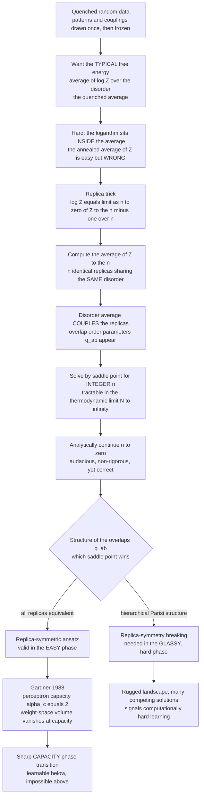

# 🎲 The Replica Method and Neural Network Capacity

> [!abstract] TL;DR
> The **replica method** is a heuristic spin-glass technique for computing the *typical* behaviour of a system whose parameters are random and fixed (**quenched disorder** — random data, random couplings). It sidesteps the intractable **quenched average** $\langle \log Z \rangle$ with an audacious trick: instead of one system, average over $n$ *identical replicas* sharing the same disorder — compute $\langle Z^n \rangle$ for integer $n$, then analytically continue to $n \to 0$. Mathematically dubious yet miraculously correct, it let physicists derive exact typical-case learning results long before mathematicians could prove them — most famously **Gardner's** result that a perceptron with $N$ weights stores about $2N$ random patterns (a sharp **capacity phase transition**), plus exact generalization curves. Whether the solution is **replica-symmetric** or needs **replica-symmetry breaking** flags easy versus computationally hard (glassy) learning, and the sibling **cavity method** turns the same analysis into practical **message-passing** algorithms.

---

## Intuition

**Analogy — FIRST.** You want to know how a *typical* student scores on a *random* exam — averaged over every possible random exam paper. But the quantity you actually need is the average of the **logarithm** of the score (log-partition functions and free energies are logs), and the logarithm is a nightmare: it tangles every random exam question together so you cannot integrate them one at a time.

Here is the devious trick. Instead of one student, imagine $n$ **identical copies** — *replicas* — of the same student sitting the *same* random exam. Multiply their $n$ scores together and average *that* product over random exams. Averaging a product of $n$ copies is enormously easier than averaging a logarithm, because the copies only "talk to each other" through the shared random exam. Do the easy calculation for whole numbers $n = 1, 2, 3, \dots$, get a clean formula in $n$, and then — audaciously — set the number of copies to **zero**, using the identity that $\log(\text{score}) = \lim_{n\to 0}\frac{\text{score}^{\,n} - 1}{n}$. This is the **replica trick**: pass through $n$ imaginary copies to compute something about a single real system. It is not rigorous — nobody "has" zero copies of a student — yet it repeatedly gives the *exactly correct* answer, and with it physicists computed the precise storage capacity of neural networks and the typical difficulty of learning problems decades before mathematicians could prove those numbers.

---

## How It Works

### Core Mechanics

**1. The quenched-disorder problem — what we are actually solving.** In statistical mechanics a system is summarised by its partition function $Z = \sum_{\text{states}} e^{-\beta E}$ and its free energy $F = -\tfrac{1}{\beta}\log Z$ (see `[[Partition_Functions_and_Free_Energy_in_ML]]`). In a *learning* problem the "energy" depends on the **data**, which is random but **fixed** once drawn — the physicist's word is **quenched** (frozen in, as opposed to *annealed* variables that fluctuate freely). We do not care about one particular dataset; we want the **typical** free energy, generalization error, or capacity, averaged over the data distribution. That means we need the **quenched average**
$$ \langle \log Z \rangle_{\text{disorder}} \, , $$
where $\langle \cdot \rangle$ averages over the random data. The tempting shortcut — the **annealed average** $\log \langle Z \rangle$ — is *easier* but *wrong*: it lets the disorder equilibrate with the system, describing a different (and usually far too optimistic) physics. The whole difficulty is that the logarithm sits *inside* the average, so the disorder does not factorise.

**2. The replica trick — the mathematical device.** The replica method computes $\langle \log Z\rangle$ using the elementary identity
$$ \log Z \;=\; \lim_{n \to 0} \frac{Z^{\,n} - 1}{n}, \qquad\Longrightarrow\qquad \langle \log Z\rangle \;=\; \lim_{n\to 0}\frac{\langle Z^{\,n}\rangle - 1}{n}. $$
Now $Z^{\,n}$ for **integer** $n$ is just the partition function of $n$ **independent replicas** of the system, all sharing the *same* quenched disorder:
$$ Z^{\,n} \;=\; \sum_{\text{state}_1}\cdots\sum_{\text{state}_n} \exp\!\Big[-\beta \textstyle\sum_{a=1}^{n} E(\text{state}_a)\Big]. $$
When we average $\langle Z^{\,n}\rangle$ over the disorder (typically a Gaussian integral), the disorder integrates out and **couples the replicas together** — the different copies $a, b$ start to interact through **overlap order parameters** $q_{ab} = \frac{1}{N}\sum_i s_i^a s_i^b$ (how aligned replica $a$ and replica $b$ are). This coupled $n$-replica system is tractable by a **saddle-point (mean-field) evaluation** in the thermodynamic limit $N \to \infty$. Finally — the audacious step — we take the clean function of integer $n$ and **analytically continue** it to real $n$, then let $n \to 0$. Extending a formula defined on the integers down to zero is exactly the kind of move that complex analysis makes rigorous for nice functions (see `[[Holomorphic_Functions]]`), but here it is applied on faith. Non-rigorous, yet correct.

**3. Replica symmetry and its breaking — the structure of the answer.** Everything hinges on the *structure* of the overlap matrix $q_{ab}$ at the saddle point:
- **Replica-symmetric (RS) ansatz:** assume all replicas are equivalent, $q_{ab} = q$ for every $a \neq b$. This is the simplest guess and it is *correct in "easy" phases* — where the free-energy landscape has essentially one basin. It gives the right capacity for the perceptron and the right generalization curves for simple learners.
- **Replica-symmetry breaking (RSB — Parisi):** in **glassy** phases the RS answer produces *nonsense* — most tellingly a **negative entropy**, which is impossible for discrete variables. Giorgio Parisi's fix (1979–80) is a beautiful **hierarchical** structure among the replicas: group them into blocks, then blocks-of-blocks, so $q_{ab}$ takes a nested (ultrametric) form. This **replica-symmetry-breaking** ansatz gives the correct answer in hard, rugged landscapes and won Parisi the 2021 Nobel Prize.

The punchline for learning: **RS vs RSB is a diagnostic**. An RS solution signals an *easy* learning phase (a smooth loss landscape, efficient learning); the onset of RSB signals a **glassy, computationally hard** phase with exponentially many competing solutions — precisely the physics of spin glasses (developed in the sibling *Spin_Glasses_and_the_Energy_Landscape_of_Networks*).

**4. Gardner's calculation — the crown jewel.** In 1988 **Elizabeth Gardner** applied the replica method not to a fixed model but to the **space of weights itself**. She asked: for a perceptron with $N$ weights required to correctly classify $P = \alpha N$ random input–output patterns, what is the **volume of weight-space** consistent with *all* the constraints? This **Gardner volume** shrinks as each new pattern carves away a slab of weight-space; the typical volume, computed via replicas, **vanishes** at a critical load. The result is the celebrated **storage capacity**
$$ \boxed{\;\alpha_c = 2\;} \qquad \text{(patterns per weight, random labels).} $$
Below $\alpha_c = 2$ a solution almost surely exists; above it, almost surely none does — a **sharp phase transition** in learnability, mirroring **Cover's** 1965 counting theorem from a completely different (geometric) route. Gardner's framework generalises effortlessly: it predicts how capacity changes with a required **margin** (robust storage lowers capacity), with the **learning rule**, and with **pattern statistics** — founding the entire statistical mechanics of neural-network capacity.

**5. Generalization curves — beyond storage.** The same machinery computes exact **learning curves**: the typical generalization error $\varepsilon_g(\alpha)$ as a function of the number of examples per parameter. The **Seung–Sompolinsky–Tishby** programme (1992) derived these for perceptrons and committee machines, sometimes revealing sharp transitions or plateaus invisible to worst-case theory. This **typical-case** theory of generalization is often far tighter and more realistic than **worst-case** VC/PAC bounds, because it predicts what happens on *typical* data rather than for an adversary (this contrast is the theme of the sibling *Statistical_Mechanics_of_Generalization_and_Scaling_Laws*).

**6. The cavity method and message passing — theory becomes algorithm.** The **cavity method** (Mézard–Parisi–Virasoro) reaches the *same* results by a more probabilistic argument — remove ("cavity out") one variable, ask how the rest respond, and self-consistently add it back — with no replicas or $n \to 0$ at all. Its great bonus: the cavity equations *are* **belief propagation**, and their high-dimensional version is **Approximate Message Passing (AMP)** — turning the analysis directly into practical inference **algorithms** (foreshadowed in the sibling *Belief_Propagation_and_the_Cavity_Method*).

**7. From heuristic to theorem, and the modern revival.** For decades the replica method was a physicist's oracle with no proof. That has changed: **Guerra** and **Talagrand** rigorously proved the Sherrington–Kirkpatrick free energy (the Parisi formula), and a wave of rigorous high-dimensional statistics has confirmed replica predictions. Meanwhile the method has been *revived* for modern ML — analysing high-dimensional regression and classification, **random-feature** and kernel models, **double descent**, Bayesian inference thresholds, and even aspects of deep networks (via Gaussian-equivalence). Physics tools once dismissed as hand-waving are now a central analytical engine of learning theory. Related mean-field pictures of wide nets appear in the sibling *Mean_Field_Theory_of_Neural_Networks*, and the whole family of learnability jumps in *Phase_Transitions_in_Learning_and_Inference*.

### Flow / Architecture



---

## Key Concepts

**Secondary (intuition-level).** To learn how a typical student does on a random exam you need the *average of a logarithm*, which is horrible. Trick: imagine several identical copies of the student taking the same exam, multiply their scores, average that (easy), then pretend the number of copies drops to zero. This "replica trick" magically gives the log-average. Physicists used it to prove a neural network with $N$ knobs can memorise only about $2N$ random facts before it saturates — cross that line and learning suddenly becomes impossible.

**Undergraduate (mechanics-level).** Quenched vs annealed disorder; why we need $\langle \log Z\rangle$ (the free energy) and not $\log\langle Z\rangle$; the identity $\log Z = \lim_{n\to 0}(Z^n - 1)/n$; $Z^n$ as $n$ non-interacting replicas that become coupled *after* the Gaussian disorder average; the overlap order parameter $q_{ab} = \frac1N\sum_i s_i^a s_i^b$; saddle-point evaluation in the limit $N\to\infty$; analytic continuation $n\to 0$; the replica-symmetric ansatz $q_{ab}=q$; Gardner's storage capacity $\alpha_c = 2$ for random labels and its agreement with **Cover's counting theorem**; the shrinking Gardner volume of feasible weights.

**Graduate (structure-level).** The Parisi hierarchical **RSB** scheme and ultrametricity of pure states; the negative-entropy pathology that signals RS instability (the **de Almeida–Thouless line**); the Sherrington–Kirkpatrick spin glass as the parent model and the **Parisi formula** for its free energy (rigorised by **Guerra**'s interpolation and **Talagrand**'s proof); Gardner's order-parameter equations for capacity, robust storage at margin $\kappa$ and $\alpha_c(\kappa)$; **Seung–Sompolinsky–Tishby** learning curves and typical-case vs VC/PAC worst-case theory; the **cavity method** as an alternative derivation yielding **belief propagation / AMP** with rigorous **state-evolution**; modern applications — Gaussian-equivalence for random features, the replica calculus of **double descent**, and inference **phase transitions** (compressed sensing, low-rank matrix estimation, community detection) with their information-theoretic vs algorithmic thresholds.

---

## Python Demo

```python
# Perceptron storage capacity: Gardner's alpha_c = 2 made visible.
# (a) EMPIRICAL: for N inputs, draw P random +/-1 patterns with random +/-1 labels and
#     ASK whether a linear separator (weight vector) exists -- i.e. is the pattern set
#     LINEARLY SEPARABLE / learnable? We hunt for weights with the perceptron algorithm.
#     Sweep the load alpha = P/N and record the FRACTION of random pattern-sets that are
#     separable. It drops SHARPLY through 1/2 near the critical capacity, and the drop
#     SHARPENS as N grows (the thermodynamic limit).
# (b) THEORY: overlay Cover's exact counting-theorem curve and the replica/Gardner
#     prediction alpha_c = 2 (patterns per weight for random labels).
import numpy as np
import matplotlib.pyplot as plt
from math import comb

rng = np.random.default_rng(0)

# ------------------------------------------------------------------
# (a) EMPIRICAL separability test via the (batch) perceptron algorithm.
#     Homogeneous separation through the origin: seek w with y_mu (w . x_mu) > 0 for ALL mu.
#     The perceptron convergence theorem guarantees it finds such a w iff one exists.
# ------------------------------------------------------------------
def is_separable(X, y, max_passes=300):
    w = np.zeros(X.shape[1])
    for _ in range(max_passes):
        margins = y * (X @ w)              # signed margin of every pattern
        mis = margins <= 0                 # currently misclassified
        if not mis.any():
            return True                    # perfect separation found -> learnable
        w += (y[mis, None] * X[mis]).sum(axis=0)   # batch perceptron update
    return bool(np.all(y * (X @ w) > 0))   # final strict check

def fraction_separable(N, alpha, trials=40):
    P = max(1, int(round(alpha * N)))
    hits = 0
    for _ in range(trials):
        X = rng.choice([-1.0, 1.0], size=(P, N))   # random +/-1 patterns
        y = rng.choice([-1.0, 1.0], size=P)        # random +/-1 labels
        hits += is_separable(X, y)
    return hits / trials

# ------------------------------------------------------------------
# (b) THEORY: Cover's function -- exact fraction of the 2^P labelings of P points in
#     general position in N dims that are linearly separable through the origin:
#         C(P, N) = 2^{1-P} * sum_{k=0}^{N-1} binom(P-1, k)
#     -> equals 1 for P <= N, equals exactly 1/2 at P = 2N  (hence alpha_c = 2).
# ------------------------------------------------------------------
def cover_fraction(N, alpha):
    P = max(1, int(round(alpha * N)))
    if P <= N:
        return 1.0
    s = sum(comb(P - 1, k) for k in range(N))      # exact big-int sum
    return float(s) / float(2 ** (P - 1))

# ------------------------------------------------------------------
# Sweep the load alpha for several N and compare empirical vs Cover.
# ------------------------------------------------------------------
alphas = np.linspace(0.5, 3.5, 16)
Ns = [5, 15, 40]
colors = ["tab:blue", "tab:orange", "tab:green"]

emp = {N: [fraction_separable(N, a) for a in alphas] for N in Ns}
cov = {N: [cover_fraction(N, a) for a in alphas]     for N in Ns}

# Empirical estimate of the crossing point (fraction = 1/2) for the largest N.
big = Ns[-1]
f = np.array(emp[big])
i = np.argmin(np.abs(f - 0.5))
print(f"N = {big}: empirical fraction crosses 1/2 near alpha ~ {alphas[i]:.2f}  (theory: 2.00)")

# ------------------------------------------------------------------
# Plot: the sharp capacity transition, sharpening with N, vs the alpha_c = 2 prediction.
# ------------------------------------------------------------------
fig, ax = plt.subplots(figsize=(8, 5))
for N, c in zip(Ns, colors):
    ax.plot(alphas, emp[N], "o", color=c, ms=6, label=f"empirical  N = {N}")
    ax.plot(alphas, cov[N], "-", color=c, lw=1.8, alpha=0.9, label=f"Cover exact  N = {N}")
ax.axvline(2.0, color="crimson", ls="--", lw=2, label="replica / Gardner  alpha_c = 2")
ax.axhline(0.5, color="gray", ls=":", lw=1)
ax.set_xlabel("load  alpha = P / N   (patterns per weight)")
ax.set_ylabel("fraction of random pattern-sets that are separable")
ax.set_title("Perceptron capacity: a sharp learnability transition at alpha_c = 2")
ax.legend(fontsize=8, ncol=2); ax.set_ylim(-0.03, 1.03)
plt.tight_layout(); plt.savefig("gardner_capacity.png", dpi=120)
```

Running it: for small loads ($\alpha < 2$) almost every random pattern-set is linearly separable (the perceptron always finds weights, fraction $\approx 1$); as $\alpha$ crosses **2**, the fraction plunges through $\tfrac12$ and heads to $0$ — beyond capacity, no weight vector can classify random labels. The empirical points (perceptron search) track **Cover's** exact curve, and the transition **steepens as $N$ grows** from 5 to 40 — a finite-size preview of the true discontinuity in the thermodynamic limit $N\to\infty$. The single number $\alpha_c = 2$, which Gardner extracted from the replica calculation of the weight-space volume, is the crimson line the data snaps to.

---

## Real-World Applications

- **Neural-network capacity and generalization.** The original payoff: exact storage capacity and learning curves for perceptrons, committee machines, and — via random-feature and Gaussian-equivalence extensions — increasingly for deep and kernel models. Capacity as a *fundamental* limit, not an empirical fit.
- **Modern ML phenomena — double descent and the interpolation regime.** The replica calculus of high-dimensional linear/ridge regression reproduces the **double-descent** risk curve, explaining why massively over-parameterised models generalise *past* the interpolation threshold — one of the sharpest successes of physics methods in contemporary learning theory (companion to `[[Scaling_Laws]]`).
- **High-dimensional statistics and inference thresholds.** Compressed sensing, sparse regression, low-rank matrix estimation, and **community detection** all have exact **phase diagrams** — information-theoretic vs algorithmic (hard) thresholds — first predicted by replicas/cavity and later proven rigorously. Physics located the boundaries before statistics could.
- **Error-correcting codes.** The statistical physics of **decoding**: LDPC and turbo codes are analysed as spin systems, with the decoding threshold appearing as a phase transition and belief propagation as the cavity/message-passing algorithm (see `[[Modern_Codes_LDPC_and_Turbo]]`).
- **Constraint satisfaction and optimization.** The **SAT/UNSAT** and colourability thresholds of random constraint-satisfaction problems, and the **clustering (RSB) transitions** that make some regions algorithmically hard, are replica/cavity results that reshaped average-case complexity.
- **Practical inference algorithms.** The cavity method *is* belief propagation; its dense-graph limit is **Approximate Message Passing (AMP)**, deployed for compressed sensing and generalized linear estimation with theoretically exact **state-evolution** guarantees — a rare case of theory handing engineers a turnkey algorithm.

---

## Common Pitfalls

- **Confusing the quenched and annealed averages.** $\log\langle Z\rangle$ (annealed) is *not* $\langle\log Z\rangle$ (quenched). The annealed average lets the disorder equilibrate and is systematically over-optimistic — it can predict "learnable" where the typical instance is not. The replica trick exists precisely to get the *quenched* quantity.
- **Trusting a replica-symmetric answer everywhere.** The RS ansatz is only correct in "easy" phases. Warning signs that it has failed: a **negative entropy** for discrete variables, or crossing the **de Almeida–Thouless line**. In glassy phases you *must* use **RSB**, or the numbers are simply wrong.
- **Taking the $n \to 0$ continuation for granted.** Analytic continuation from integer $n$ is not unique without extra assumptions, and the order of limits ($N\to\infty$ before $n\to 0$) matters. Elegant results have later needed correction; treat the method as an oracle to be *checked*, not a proof.
- **Reading Gardner's $\alpha_c = 2$ as universal.** The value $2$ is for a linear perceptron with *random* labels and no margin. Requiring a robust **margin** $\kappa$ lowers capacity; **correlated** patterns, structured labels, non-linear units, or different learning rules give entirely different $\alpha_c$. (Contrast the Hopfield *auto-associative* capacity $\approx 0.138N$, a different problem — see `[[Hopfield_Networks_and_Associative_Memory]]`.)
- **Perceptron non-convergence near capacity (in the demo).** Right at $\alpha \approx \alpha_c$ a separator may exist but take enormous time to find; a truncated search reports false "non-separable", softening the empirical curve. That is a finite-$N$/finite-compute artefact — the exact Cover curve is the ground truth the data approaches.
- **Expecting worst-case (VC/PAC) bounds to match.** Replica results are **typical-case**. They are usually much *tighter* than distribution-free VC/PAC bounds because they exploit the data distribution — but they say nothing about adversarial inputs. Do not compare the two as if they answered the same question.

---

## Related Concepts

- [[Hopfield_Networks_and_Associative_Memory]] — the auto-associative net whose $\approx 0.138N$ capacity and retrieval/spin-glass/paramagnetic phase diagram were computed by the same replica machinery (Amit–Gutfreund–Sompolinsky).
- [[The_Ising_Model_and_Statistical_Physics]] — the spin system whose *disordered* version (the spin glass) is the parent model the replica method was invented to solve.
- [[Partition_Functions_and_Free_Energy_in_ML]] — the $Z$ and $F = -\tfrac1\beta\log Z$ whose *quenched* average is exactly what the replica trick makes computable.
- [[Free_Energy_Minimization_and_Variational_Principles]] — the free-energy/saddle-point viewpoint the replica calculation evaluates in the thermodynamic limit.
- [[Phase_Transitions_and_Critical_Phenomena]] — the sharp capacity and learnability thresholds are genuine phase transitions in the $N\to\infty$ limit.
- [[Statistical_Mechanics_of_Machine_Learning_Overview]] — the map of the physics-of-learning programme this note sits inside.
- [[Scaling_Laws]] — modern over-parameterised generalization and double descent, phenomena the replica calculus now explains.
- [[Neural_Network_Basics]] — the perceptron and feedforward models whose capacity and generalization are the objects of study.
- [[Logistic_Regression]] — the linear classifier closest in spirit to the perceptron whose separability limit Gardner computed.
- [[Holomorphic_Functions]] — the complex-analytic notion of analytic continuation that the audacious $n\to 0$ limit leans on.
- [[Machine_Learning_in_Computational_Physics]] — the two-way traffic between spin-glass physics and machine learning that this method embodies.
- [[Modern_Codes_LDPC_and_Turbo]] — error-correcting codes analysed as spin systems, decoded by the cavity method's belief propagation.

---

## Review Questions

1. **(Conceptual)** Explain precisely why we need the *quenched* average $\langle \log Z\rangle$ rather than the *annealed* $\log\langle Z\rangle$ for a learning problem, and how the identity $\log Z = \lim_{n\to 0}(Z^n-1)/n$ converts the hard log-average into a tractable $n$-replica calculation. Where does the non-rigour enter?
2. **(Scenario)** You run the replica calculation for a new architecture and, in the low-data regime, the replica-symmetric ansatz yields a **negative entropy**. What does this tell you about the learning phase, what must you do to get the correct answer, and what would you expect to change qualitatively about the difficulty of training in that regime?
3. **(Trade-off / connection)** Gardner's replica calculation gives $\alpha_c = 2$ for a perceptron with random labels; Cover's counting theorem gives the same $2$ geometrically; VC theory gives a distribution-free bound. Compare what each result actually guarantees, why the replica/typical-case number is often much tighter than the VC/worst-case one, and how requiring a robust margin $\kappa$ would move Gardner's capacity.

---

## Sources

- Gardner, E. (1988). "The space of interactions in neural network models." *Journal of Physics A*, 21(1), 257–270. [link](https://doi.org/10.1088/0305-4470/21/1/030)
- Mézard, M., Parisi, G., & Virasoro, M. A. (1987). *Spin Glass Theory and Beyond.* World Scientific. [link](https://doi.org/10.1142/0271)
- Seung, H. S., Sompolinsky, H., & Tishby, N. (1992). "Statistical mechanics of learning from examples." *Physical Review A*, 45(8), 6056–6091. [link](https://doi.org/10.1103/PhysRevA.45.6056)
- Engel, A., & Van den Broeck, C. (2001). *Statistical Mechanics of Learning.* Cambridge University Press. [link](https://doi.org/10.1017/CBO9781139164542)
- Zdeborová, L., & Krzakala, F. (2016). "Statistical physics of inference: thresholds and algorithms." *Advances in Physics*, 65(5), 453–552. [arXiv:1511.02476](https://arxiv.org/abs/1511.02476)

---

#statistical-mechanics #machine-learning #replica-method #perceptron-capacity #gardner
