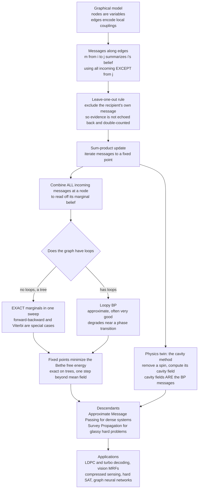

# 📨 Belief Propagation and the Cavity Method

> [!abstract] TL;DR
> **Belief propagation (BP)** computes marginal probabilities on a graphical model by passing **messages** along its edges: each node tells each neighbor its belief based on *all its other* incoming messages — the crucial **"leave-one-out"** trick that stops information from echoing back and being double-counted. On a **tree** the messages give the *exact* marginals in one sweep (the **forward-backward** and **Viterbi** algorithms are special cases); on **loopy** graphs the same rules ("loopy BP") give a surprisingly good *approximation* that degrades near a phase transition. Physicists discovered the identical algorithm as the **cavity method** — remove a spin, compute the effective "cavity field" its neighbors exert — so physics and machine learning independently found the same procedure. Its fixed points minimize the **Bethe free energy** (one correlation-capturing step beyond mean field); it **decodes the LDPC and turbo codes** in every phone and WiFi link; and its descendants — **approximate message passing** and **survey propagation** — solve high-dimensional inference and the hardest random-SAT problems while predicting algorithmic thresholds and prefiguring **graph neural networks**.

---

## Intuition

**Analogy — FIRST.** Imagine a rumor spreading through a social network where everyone is trying to estimate the same hidden truth — say, whether a factory will close. You cannot poll everyone at once; you only ever talk to your immediate friends. So you do the sensible thing: you gather what *each* of your friends currently believes, form your own opinion, and pass it on. But there is one subtle rule that separates wisdom from an echo chamber. When you tell **Alice** what you think, you must base your message on everything you have heard **except what Alice herself told you** — otherwise you would be handing Alice back her own opinion dressed up as independent corroboration, and the two of you would spiral into false confidence by counting the same evidence twice. This **leave-one-out** discipline, repeated round after round of local whispers, lets the whole network converge on a single consistent picture with no central authority ever tallying the votes.

That is **belief propagation**. Turn "friends" into variables on a graph, "opinions" into probability messages, and the "leave-one-out" rule into *exclude the recipient's own message*, and you have the algorithm that computes marginals on graphical models. Physicists, working on **spin glasses**, invented the very same idea under a different name — the **cavity method**: to find how one spin behaves, cut it out of the lattice, look at the "cavity" it leaves, and ask what effective field its now-independent neighbors would push on it. The cavity fields *are* the belief-propagation messages. The same algorithm decodes your phone's error-correcting codes and analyzes the hardest problems in computer science.

---

## How It Works

### Core Mechanics

**1. The setting: a graphical model.** We have a joint distribution over variables $x_1,\dots,x_n$ that **factorizes** according to a graph — a **[[Markov_Random_Fields_and_Undirected_Graphical_Models|Markov random field]]** or, equivalently, a factor graph. For a pairwise model,
$$
p(x) = \frac{1}{Z}\prod_i \phi_i(x_i)\prod_{(i,j)\in E}\psi_{ij}(x_i,x_j),
$$
with node factors $\phi_i$ (local evidence) and edge factors $\psi_{ij}$ (couplings). The Ising model is the canonical case: $\psi_{ij}(x_i,x_j)=e^{J x_i x_j}$, $\phi_i(x_i)=e^{h x_i}$. We want the **marginals** $p(x_i)$ (sum-product) or the **most-probable configuration** $\arg\max_x p(x)$ (max-product / min-sum). The obstacle is always the same: the partition function $Z$ sums over exponentially many states, so brute force dies past a few dozen variables (see `[[Partition_Functions_and_Free_Energy_in_ML]]`).

**2. The message.** BP replaces the global sum with local **messages** on the edges. The message $m_{i\to j}(x_j)$ is, intuitively, "node $i$'s summary of what value $x_j$ should take, given everything $i$ knows *except* what $j$ told it." The **sum-product update rule** is:
$$
m_{i\to j}(x_j)\;\propto\;\sum_{x_i}\,\phi_i(x_i)\,\psi_{ij}(x_i,x_j)\!\!\prod_{k\in\mathcal N(i)\setminus j}\!\! m_{k\to i}(x_i).
$$
Read it left to right: collect **all** incoming messages to $i$ from its neighbors **except $j$** (the leave-one-out), multiply in $i$'s own evidence $\phi_i$, couple through the edge factor $\psi_{ij}$, and marginalize out $x_i$. The exclusion of $j$ is not a nicety — it is the whole point. Including $m_{j\to i}$ would feed $j$'s belief straight back to $j$, double-counting the correlation and producing runaway overconfidence.

**3. Iterate, then read off marginals.** Initialize all messages uniformly and apply the update repeatedly until they stop changing (a **fixed point**). Then the **belief** — BP's estimate of the marginal — is the product of *all* incoming messages times the local evidence:
$$
b_i(x_i)\;\propto\;\phi_i(x_i)\prod_{k\in\mathcal N(i)} m_{k\to i}(x_i).
$$
Purely **local computation** — every node only ever looks at its neighbors — yields **global inference**. For the MAP configuration, replace the sum with a max (**max-product**), or work in log-space with sums replaced by minima (**min-sum**), and back-trace the maximizing states.

**4. EXACT on trees — the guarantee.** On a **tree** (a graph with no loops), BP is not an approximation: it returns the **exact** marginals in a single forward-backward sweep. The reason is that removing any edge splits a tree into two independent subtrees, so a message genuinely summarizes an *independent* body of evidence — there is no other path by which information can sneak back and be counted twice. This makes BP a **dynamic-programming / exact-inference** algorithm, and two of the most famous algorithms in machine learning are special cases: the **forward-backward algorithm** for hidden Markov models (sum-product on a chain) and the **Viterbi algorithm** (max-product on a chain, see `[[Markov_Chains]]`). Trees are the tractable island; everything else is approximation.

**5. LOOPY belief propagation — the approximate workhorse.** Most real models — a pixel grid, an LDPC code's Tanner graph, a social network — have **loops**. Running the tree equations anyway is **"loopy BP."** It is no longer exact and is not even guaranteed to converge, because a loop lets a message circulate and reinforce itself: BP implicitly *assumes the incoming messages are independent*, and loops make them correlated. Yet, remarkably, loopy BP is often **excellent** — whenever the graph is **locally tree-like** (short loops are rare, so correlations decay before they wrap around) and the system is **far from a phase transition**. Near **criticality**, correlations grow long-ranged, the local-tree assumption collapses, multiple fixed points appear, and loopy BP degrades or oscillates. It remains one of the most widely used approximate-inference methods precisely because the failure mode is a *physical* one you can anticipate.

**6. The CAVITY METHOD — the physics twin.** In spin-glass theory (Mézard, Parisi, Virasoro), the **cavity method** computes a disordered system's properties by **removing one spin**, creating a "**cavity**," and asking what effective **cavity field** its neighbors exert on the empty site. The key assumption is that, *in the spin's absence*, its neighbors become approximately **uncorrelated** — exactly the tree-like assumption of BP — so their influences combine independently into a single field. Solving these cavity equations self-consistently *is* running belief propagation: **the cavity fields are the BP messages**. This is why the same object appears twice in this vault — physics reached it through disordered magnets, machine learning through probabilistic inference. The cavity method reproduces the results of the **replica method** (see `[[The_Replica_Method_and_Neural_Network_Capacity]]`) but far more intuitively and, crucially, *algorithmically*: it hands you a procedure you can run, not just an average you can compute.

**7. The BETHE FREE ENERGY — the variational grounding.** BP is not an ad-hoc recipe; **Yedidia, Freeman, and Weiss** (2001) proved its fixed points are **stationary points of the Bethe free energy**, a specific approximation to the true variational free energy that is *exact on trees*. This plants BP firmly in the **free-energy-minimization / variational** picture (see `[[Free_Energy_Minimization_and_Variational_Principles]]` and `[[Variational_Inference_as_Free_Energy_Minimization]]`). Where naive **mean-field** approximates the joint as a fully factorized product and captures only single-node statistics, the **Bethe approximation** keeps the *pairwise* correlations on the edges — one principled step beyond mean field. The generalization to larger clusters is the **Kikuchi / generalized BP** hierarchy. Seeing BP as free-energy descent explains both its accuracy and its failures: it is minimizing an *approximate* free energy that stops being valid when loops matter.

**8. ERROR-CORRECTING CODES — the triumphant application.** Modern **capacity-approaching codes** — **LDPC codes** and **turbo codes** — are **decoded by belief propagation** ("sum-product decoding") on their factor graphs. The received noisy bits are node evidence; the parity-check constraints are factors; BP infers the most probable transmitted codeword. This gets astonishingly close to the **Shannon limit** (see `[[Channel_Capacity_and_the_Noisy_Channel_Theorem]]`) and runs fast enough to sit in **every phone, WiFi radio, and deep-space link** (`[[Modern_Codes_LDPC_and_Turbo]]`). Message passing is, quite literally, what made modern communication possible — a rare case where a "heuristic" approximate algorithm underpins trillions of devices.

**9. Message-passing descendants — the modern family.** BP is the ancestor of a whole lineage:
- **Approximate Message Passing (AMP)** — Donoho, Maleki, Montanari — is BP *simplified for dense, random* systems (compressed sensing, generalized linear models). By tracking Gaussian message *distributions* rather than full messages, AMP becomes cheap and, better, its behavior is described exactly by a low-dimensional **"state evolution"** whose fixed points **match the replica predictions**.
- **Survey Propagation (SP)** extends BP to **glassy** problems with *many* competing solution clusters, adding a message that a variable is "frozen" or "free." SP famously solved **hard random-SAT** instances near the satisfiability threshold — a physics algorithm outperforming classical computer-science solvers.
- **Generalized / Expectation Propagation** push the Bethe idea to larger regions and to continuous, non-Gaussian factors.

**10. Phase transitions and hardness — the theory link.** The **convergence and accuracy of BP relate directly to phase transitions**. In an "easy," replica-symmetric phase, BP has a **unique** fixed point and converges. In a **glassy** phase, BP develops **many** fixed points — many pure states, the signature of **replica-symmetry breaking** (see `[[Spin_Glasses_and_the_Energy_Landscape_of_Networks]]`). The cavity/BP analysis therefore predicts **detectability** and **algorithmic thresholds**: the celebrated **hard phase** of community detection and constraint satisfaction, where a solution exists information-theoretically but no known efficient algorithm finds it, is *located* by BP (see `[[Phase_Transitions_in_Learning_and_Inference]]`). BP is thus simultaneously an **algorithm** and an **analysis tool** for the statistical mechanics of inference.

**11. Graph neural networks — the modern ML tie.** **Graph neural networks (GNNs)** are structurally a *learned* generalization of belief propagation: each layer passes **messages** along edges, aggregates them at nodes, and updates node states — the same computational motif, but with the fixed sum-product rule replaced by trainable neural functions. Understanding GNNs through the BP/cavity lens clarifies both their power (they can *learn* message rules physics had to hand-derive) and their limits (over-smoothing and the difficulty of long-range propagation echo BP's loop pathologies). **Message passing** is the unifying primitive tying coding theory, statistical physics, and modern deep learning on graphs into one thread.

### Flow / Architecture



---

## Key Concepts

**Secondary (intuition-level).** Everyone in a network wants to guess a hidden truth by whispering to their friends. The rule that makes it work: when you message a friend, base it on everything *except* what that friend just told you — otherwise you hand back their own opinion as fake confirmation and both of you overreact. Repeat these local whispers and the whole network settles on one consistent belief, with no leader. That is belief propagation. On a network *without loops* it gives the perfectly correct answer; add loops and it becomes a very good guess that gets shaky when the whole system is on the verge of a dramatic collective flip (a phase transition). Physicists found the identical trick — "remove one magnet, see what field its neighbors leave behind" — and this same algorithm reads the error-correcting codes in your phone.

**Undergraduate (mechanics-level).** A pairwise factorized distribution $p(x)=\tfrac1Z\prod_i\phi_i(x_i)\prod_{(i,j)}\psi_{ij}(x_i,x_j)$; the sum-product message $m_{i\to j}(x_j)\propto\sum_{x_i}\phi_i\psi_{ij}\prod_{k\in\mathcal N(i)\setminus j}m_{k\to i}$; the leave-one-out exclusion of the recipient; beliefs $b_i\propto\phi_i\prod_k m_{k\to i}$; **max-product / min-sum** for MAP; **exactness on trees** with forward-backward (HMM) and Viterbi as special cases; **loopy BP** as the approximate extension, accurate when locally tree-like and far from criticality; the **cavity method** as the physics version (remove a spin, self-consistent cavity field); **LDPC / turbo sum-product decoding** approaching the Shannon limit.

**Graduate (structure-level).** BP fixed points as stationary points of the **Bethe free energy** (Yedidia-Freeman-Weiss), exact on trees and the pairwise-correlation improvement over mean field, generalized by the **Kikuchi/region-graph (GBP)** hierarchy; convergence conditions and message damping; the **replica-symmetric cavity** equations and their **1-step RSB** upgrade (**survey propagation**) for glassy landscapes with clustered solutions; the correspondence between **multiple BP fixed points**, ergodicity breaking, and **replica-symmetry breaking**; **density evolution** for LDPC thresholds and the **BP / MAP / dynamical / condensation** threshold sequence in random CSPs; **AMP** with its Onsager reaction term and rigorous **state evolution** matching replica formulas in high-dimensional GLM estimation, low-rank matrix factorization, and community detection (the **Kesten-Stigum / detectability** threshold and the **hard phase**); and BP as the fixed-rule limit of **learned message passing** in graph neural networks.

---

## Python Demo

```python
# Belief propagation (sum-product) on graphical models, two regimes:
#   (a) TREE  -> BP is EXACT: compare BP marginals to brute-force enumeration.
#   (b) LOOPY 2D Ising grid -> loopy BP is APPROXIMATE: compare its site
#       magnetizations to a Gibbs-sampling (MCMC) "ground truth" as we sweep the
#       coupling J. BP tracks MCMC at weak coupling but DEGRADES near the
#       phase transition (loops matter), overestimating the order.
# We also plot the message-convergence history: fast on the tree, slower/looser
# on the loopy grid near criticality.
import numpy as np
import matplotlib.pyplot as plt
from itertools import product

rng = np.random.default_rng(1)
states = np.array([-1.0, 1.0])                      # spin values, index 0 -> -1, 1 -> +1

# ---------------------------------------------------------------
# Generic sum-product belief propagation on a pairwise Ising MRF.
#   node factor  phi_i(x)   = exp(h * x)
#   edge factor  psi(x_i,x_j) = exp(J * x_i * x_j)
# Messages m[(i,j)] are length-2 vectors over x_j, kept normalized.
# ---------------------------------------------------------------
def belief_propagation(edges, n, J, h, iters=500, tol=1e-11, damping=0.0):
    neigh = [[] for _ in range(n)]
    for (i, j) in edges:
        neigh[i].append(j); neigh[j].append(i)
    psi = np.exp(J * np.outer(states, states))      # 2x2 symmetric edge factor
    phi = np.exp(h * states)                        # length-2 node factor
    msg = {(i, j): np.ones(2) / 2 for i in range(n) for j in neigh[i]}
    history = []
    for _ in range(iters):
        new, delta = {}, 0.0
        for i in range(n):
            for j in neigh[i]:
                prod = phi.copy()                   # local evidence at i ...
                for k in neigh[i]:
                    if k != j:                      # ... times ALL incoming EXCEPT from j
                        prod = prod * msg[(k, i)]
                m = prod @ psi                      # marginalize x_i: result over x_j
                m = m / m.sum()
                if damping > 0:                     # damping stabilizes loopy updates
                    m = damping * msg[(i, j)] + (1 - damping) * m
                    m = m / m.sum()
                new[(i, j)] = m
                delta = max(delta, np.abs(m - msg[(i, j)]).max())
        msg = new
        history.append(delta)
        if delta < tol:
            break
    beliefs = np.zeros((n, 2))
    for i in range(n):
        b = phi.copy()
        for k in neigh[i]:
            b = b * msg[(k, i)]
        beliefs[i] = b / b.sum()
    mag = beliefs[:, 1] - beliefs[:, 0]             # <x_i> = P(+1) - P(-1)
    return mag, np.array(history)

# ---------------------------------------------------------------
# (a) TREE: BP is EXACT. Build a random tree, compare to brute force.
# ---------------------------------------------------------------
def brute_force_mag(edges, n, J, h):
    Z, mag = 0.0, np.zeros(n)
    for cfg in product((0, 1), repeat=n):
        s = states[list(cfg)]
        w = np.exp(J * sum(s[i] * s[j] for (i, j) in edges) + h * s.sum())
        Z += w; mag += w * s
    return mag / Z

n_tree = 12
tree_edges = [(i, int(rng.integers(0, i))) for i in range(1, n_tree)]   # each node -> earlier node = a TREE
Jt, ht = 0.45, 0.2
bp_tree, hist_tree = belief_propagation(tree_edges, n_tree, Jt, ht)
exact_tree = brute_force_mag(tree_edges, n_tree, Jt, ht)
print(f"(a) TREE  max |BP - exact| magnetization error = {np.abs(bp_tree - exact_tree).max():.2e}  (should be ~0)")

# ---------------------------------------------------------------
# (b) LOOPY 2D periodic Ising grid: loopy BP vs Gibbs (MCMC) across J.
#     Small field h breaks symmetry so magnetization is informative.
#     2D Ising critical coupling: J_c = 0.5*ln(1+sqrt(2)) ~ 0.4407.
# ---------------------------------------------------------------
L, hg = 8, 0.10
Jc = 0.5 * np.log(1 + np.sqrt(2))

def grid_edges(L):
    idx = lambda r, c: r * L + c
    E = []
    for r in range(L):
        for c in range(L):
            E.append((idx(r, c), idx(r, (c + 1) % L)))   # periodic horizontal
            E.append((idx(r, c), idx((r + 1) % L, c)))   # periodic vertical
    return E

def gibbs_mean_mag(L, J, h, sweeps=800, burn=300):
    x = rng.choice([-1.0, 1.0], size=(L, L))
    color = (np.indices((L, L)).sum(0)) % 2
    acc, cnt = 0.0, 0
    for sw in range(sweeps):
        for c in (0, 1):
            nb = np.roll(x, 1, 0) + np.roll(x, -1, 0) + np.roll(x, 1, 1) + np.roll(x, -1, 1)
            p_up = 1.0 / (1.0 + np.exp(-2.0 * (J * nb + h)))   # P(x=+1 | neighbors)
            newx = np.where(rng.random((L, L)) < p_up, 1.0, -1.0)
            x[color == c] = newx[color == c]                  # checkerboard Gibbs sweep
        if sw >= burn:
            acc += x.mean(); cnt += 1
    return acc / cnt

Js = np.linspace(0.05, 0.85, 12)
ge = grid_edges(L)
bp_m, mc_m, conv = [], [], []
for J in Js:
    mag, hist = belief_propagation(ge, L * L, J, hg, iters=600, damping=0.5)
    bp_m.append(mag.mean())
    mc_m.append(gibbs_mean_mag(L, J, hg))
    conv.append(hist[-1])
bp_m, mc_m = np.array(bp_m), np.array(mc_m)

# convergence traces at a subcritical and a near-critical coupling
_, hist_sub  = belief_propagation(ge, L * L, 0.20, hg, iters=600, damping=0.5)
_, hist_crit = belief_propagation(ge, L * L, Jc,   hg, iters=600, damping=0.5)

# ---------------------------------------------------------------
# Plots
# ---------------------------------------------------------------
fig, ax = plt.subplots(1, 3, figsize=(16, 4.6))

# (1) Tree: BP marginals vs exact -> points sit on y = x
ax[0].plot([-1, 1], [-1, 1], "k--", lw=1, label="y = x (perfect)")
ax[0].scatter(exact_tree, bp_tree, s=60, color="tab:green", zorder=3)
ax[0].set_xlabel("exact marginal magnetization <x_i>")
ax[0].set_ylabel("BP marginal magnetization <x_i>")
ax[0].set_title("(a) TREE: BP is EXACT")
ax[0].legend(fontsize=8)

# (2) Loopy grid: BP vs MCMC across coupling J, with J_c marked
ax[1].plot(Js, mc_m, "o-", color="tab:blue",   label="Gibbs / MCMC (truth)")
ax[1].plot(Js, bp_m, "s-", color="tab:red",    label="loopy BP (approx.)")
ax[1].axvline(Jc, color="crimson", ls="--", lw=2, label="2D Ising J_c ~ 0.441")
ax[1].set_xlabel("coupling J")
ax[1].set_ylabel("mean magnetization")
ax[1].set_title("(b) LOOPY grid: good at weak J, degrades near J_c")
ax[1].legend(fontsize=8)

# (3) Message convergence: fast on tree, slower/looser near criticality
ax[2].semilogy(hist_tree,           color="tab:green",  label="tree (exact, fast)")
ax[2].semilogy(hist_sub,            color="tab:blue",   label="grid, subcritical J=0.20")
ax[2].semilogy(hist_crit,           color="tab:red",    label="grid, near J_c")
ax[2].set_xlabel("iteration")
ax[2].set_ylabel("max message change")
ax[2].set_title("message convergence")
ax[2].legend(fontsize=8)

plt.tight_layout()
plt.savefig("belief_propagation.png", dpi=120)
```

**What you see.** Panel (a): on the tree every BP marginal lands exactly on the $y=x$ line — the printed error is at machine precision, confirming BP is a *true* exact-inference algorithm on loop-free graphs. Panel (b): on the loopy 2D grid, loopy BP's magnetization hugs the Gibbs/MCMC ground truth at **weak coupling** $J$, then **peels away near $J_c\approx0.44$**, systematically *overestimating* the order — the Bethe approximation ignores the loop-induced fluctuations that suppress ordering near a phase transition. Panel (c): the message-change history plunges quickly to zero on the tree, converges (with damping) at subcritical coupling, and slows and struggles near criticality — the algorithmic fingerprint of correlations growing long enough to wrap around the loops. Loops, and criticality, are exactly where message passing hurts.

---

## Real-World Applications

- **Error-correcting codes (ubiquitous).** **Sum-product decoding** of **LDPC** and **turbo** codes runs BP on the code's factor graph and approaches the Shannon limit — deployed in 5G, WiFi, satellite, hard-drive, and deep-space communication. This is message passing's single largest practical footprint (`[[Modern_Codes_LDPC_and_Turbo]]`, `[[Error_Correcting_Codes_Fundamentals]]`).
- **Computer vision.** **Stereo depth**, **image segmentation**, **denoising**, and **optical flow** are posed as MRF inference and solved with (loopy) max-product / sum-product BP or its TRW variants — the pre-deep-learning backbone of low-level vision, and still a refinement layer on neural outputs.
- **High-dimensional statistics and compressed sensing.** **Approximate Message Passing (AMP)** reconstructs sparse signals and fits generalized linear models with cheap iterations and exact **state-evolution** guarantees, a direct BP descendant used in signal processing and statistics.
- **Constraint satisfaction and combinatorial optimization.** **Survey propagation** solves **hard random-SAT** and graph-coloring instances near their thresholds, and cavity/BP methods analyze the **clustering** transitions that make such problems algorithmically hard.
- **Network science.** **Community detection**, **link prediction**, and **network reconstruction** use BP both as an inference algorithm and to locate the **detectability threshold** below which no algorithm can recover structure.
- **Statistical physics of disordered systems.** The **cavity method** is a standard tool for spin glasses, random optimization, and the statistical mechanics of inference — the same equations, read as physics (`[[Spin_Glasses_and_the_Energy_Landscape_of_Networks]]`).
- **Graph neural networks.** GNNs generalize BP into *learned* message passing, powering molecular property prediction, recommendation, and relational reasoning across modern deep learning on graphs.

---

## Common Pitfalls

- **Trusting loopy BP as if it were exact.** BP is exact *only* on trees. On loopy graphs it can converge to the wrong marginals, oscillate, or diverge. Validate against MCMC or exact inference on small instances, and treat its numbers as approximations — especially near a phase transition.
- **Forgetting the leave-one-out exclusion.** Including the recipient's own message ($m_{j\to i}$ when computing $m_{i\to j}$) reintroduces the very double-counting BP is designed to avoid, producing wildly overconfident, self-reinforcing beliefs. The $\setminus j$ in the update is load-bearing.
- **Expecting convergence near criticality.** Long-range correlations at a phase transition break the local-tree assumption; BP then develops multiple fixed points and often fails to converge. **Damping** the message updates (as in the demo) helps stabilize it but cannot fix a fundamentally multi-fixed-point regime — that multiplicity is *physically* the onset of replica-symmetry breaking, not a numerical bug.
- **Confusing beliefs with the partition function.** The Bethe *beliefs* can be quite accurate even when the **Bethe free energy** estimate of $\log Z$ is not, and vice versa. If you need $Z$ (e.g. for model comparison), remember loopy BP only gives an *approximation* to it, which can even be non-variational (not a bound).
- **Numerical underflow in long chains.** Message products shrink toward zero; always **normalize** messages each step (and work in log-space for max/min-sum). Unnormalized BP silently underflows on large graphs.
- **Reading a single BP fixed point as the whole story.** In glassy phases there are exponentially many fixed points corresponding to many pure states; a single run finds one and misreports the ergodic answer. This is exactly where **survey propagation** and 1-step RSB are needed, not vanilla BP.

---

## Related Concepts

- [[Markov_Random_Fields_and_Undirected_Graphical_Models]] — the factorized graphical models BP does inference on; BP is exact on their tree instances, approximate on loopy grids.
- [[The_Replica_Method_and_Neural_Network_Capacity]] — the cavity method reproduces the replica results algorithmically; multiple BP fixed points signal replica-symmetry breaking.
- [[Spin_Glasses_and_the_Energy_Landscape_of_Networks]] — the disordered systems whose analysis birthed the cavity method and survey propagation.
- [[Phase_Transitions_in_Learning_and_Inference]] — BP convergence and accuracy pinpoint detectability and algorithmic (hard-phase) thresholds.
- [[Free_Energy_Minimization_and_Variational_Principles]] — BP fixed points are stationary points of the Bethe free energy, one correlation-capturing step beyond mean field.
- [[Variational_Inference_as_Free_Energy_Minimization]] — the broader variational-inference program that the Bethe/BP free energy is a specialized, loop-aware member of.
- [[Partition_Functions_and_Free_Energy_in_ML]] — the intractable $Z$ that BP approximates via the Bethe free energy.
- [[The_Ising_Model_and_Statistical_Physics]] — the canonical pairwise model of the demo; its critical coupling is where loopy BP degrades.
- [[Modern_Codes_LDPC_and_Turbo]] — LDPC and turbo codes decoded by sum-product BP, the algorithm's greatest practical success.
- [[Error_Correcting_Codes_Fundamentals]] — the coding-theory setting where BP decoding approaches the Shannon limit.
- [[Channel_Capacity_and_the_Noisy_Channel_Theorem]] — the Shannon limit that BP-decoded codes approach.
- [[Gibbs_Sampling_and_Conditional_Updates]] — the MCMC method used as ground truth for loopy BP in the demo; an alternative approximate-inference engine.
- [[Markov_Chains]] — the chain (a tree) on which BP specializes to forward-backward and Viterbi.
- [[Phase_Transitions_and_Critical_Phenomena]] — the criticality at which the local-tree assumption, and hence loopy BP, breaks down.

---

## Review Questions

1. **(Conceptual)** Explain the "leave-one-out" rule in the sum-product update — why the message $m_{i\to j}$ must exclude $m_{j\to i}$ — and use it to argue precisely *why* BP is exact on a tree but only approximate on a loopy graph. What structural feature of a tree guarantees a message summarizes independent evidence?
2. **(Scenario)** You run loopy BP to compute marginals on a 2D Ising grid and it converges cleanly and accurately at weak coupling, but at strong coupling it oscillates and, when damped into convergence, overestimates the magnetization. Interpret this behavior physically: what is happening to the correlations, why does the Bethe approximation fail here, and what does the appearance of multiple fixed points tell you about the phase of the system?
3. **(Trade-off / connection)** The cavity method and the replica method give the same spin-glass results. Compare them: what does the cavity/BP route offer that replicas do not, why does replica-symmetry breaking correspond to *multiple BP fixed points*, and how does this same structure explain both the failure of vanilla BP on hard random-SAT and the need for survey propagation?

---

## Sources

- Yedidia, J. S., Freeman, W. T., & Weiss, Y. (2005). "Constructing free-energy approximations and generalized belief propagation algorithms." *IEEE Transactions on Information Theory*, 51(7), 2282–2312. [link](https://doi.org/10.1109/TIT.2005.850085)
- Mézard, M., & Montanari, A. (2009). *Information, Physics, and Computation.* Oxford University Press. [link](https://doi.org/10.1093/acprof:oso/9780198570837.001.0001)
- Mézard, M., Parisi, G., & Zecchina, R. (2002). "Analytic and algorithmic solution of random satisfiability problems." *Science*, 297(5582), 812–815. [link](https://doi.org/10.1126/science.1073287)
- Donoho, D. L., Maleki, A., & Montanari, A. (2009). "Message-passing algorithms for compressed sensing." *PNAS*, 106(45), 18914–18919. [link](https://doi.org/10.1073/pnas.0909892106)
- Zdeborová, L., & Krzakala, F. (2016). "Statistical physics of inference: thresholds and algorithms." *Advances in Physics*, 65(5), 453–552. [arXiv:1511.02476](https://arxiv.org/abs/1511.02476)

---

#statistical-mechanics #machine-learning #belief-propagation #cavity-method #message-passing
