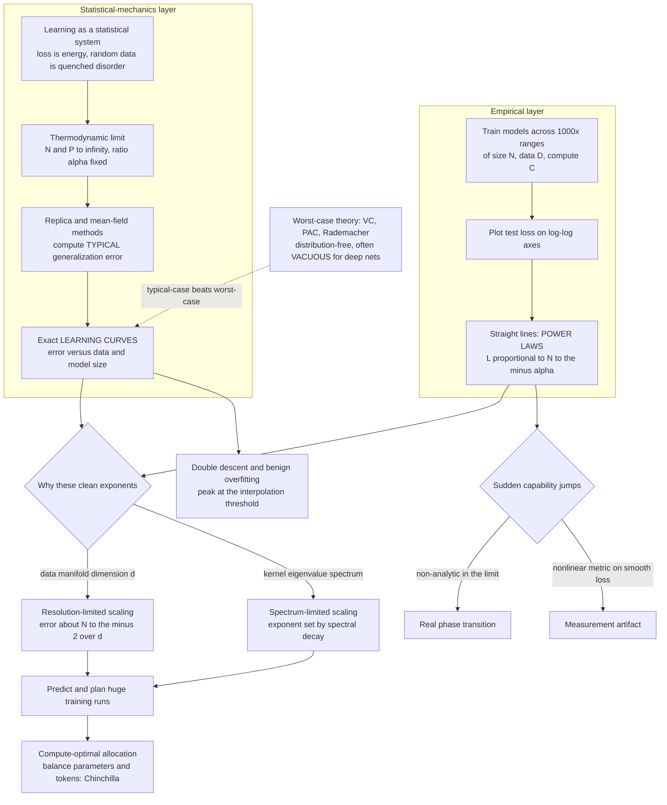

# 📉 Statistical Mechanics of Generalization and Scaling Laws

> [!abstract] TL;DR
> The central question of learning theory is how a model's **test error** (its *generalization*) depends on the amount of **data** $D$, the model **size** $N$, and the **compute** $C$ — the **learning curve**. Classical worst-case theory (VC dimension, PAC, Rademacher) gives *distribution-free* bounds that are famously **vacuous** for deep nets: hugely over-parameterised models "should" overfit but instead generalise beautifully. **Statistical mechanics** takes the opposite stance — compute the **typical** (average-case) error over random data in the **thermodynamic limit** ($N, D \to \infty$ with their ratio fixed) via the **replica** and **mean-field** methods. This yields *exact* learning curves, capacities, and phase transitions where worst-case theory is silent. The lens explains the empirical **neural scaling laws** — test loss falling as clean **power laws** $L \propto N^{-\alpha_N}$, $D^{-\alpha_D}$, $C^{-\alpha_C}$ over *many orders of magnitude* (Kaplan 2020, Hestness 2017) that now guide frontier AI — **derives the exponents** from the data manifold's intrinsic dimension and the kernel's eigen-spectrum (Bahri, Bordelon–Canatar–Pehlevan, Spigler), accounts for **double descent** and **benign overfitting**, powers **compute-optimal** training (Chinchilla), and frames the live debate over whether capabilities **emerge** via phase-transition-like jumps or merely appear to under a nonlinear metric.

---

## Intuition

**Analogy — FIRST.** Thermodynamics never tracks a single atom. It would be hopeless — a litre of gas holds $\sim 10^{22}$ molecules careening chaotically. Yet the *aggregate* obeys a law so clean you can print it on a coffee mug: $PV = nRT$. The microscopic mess washes out; a handful of macroscopic variables (pressure, volume, temperature) capture everything that matters. The trick that makes this work is the **thermodynamic limit** — take the number of particles to infinity, and averages become sharp, exact laws.

Modern AI has stumbled onto the same miracle. Train language models across a *thousandfold* range of sizes and datasets, plot their test loss against parameters or tokens on **log-log axes**, and the points fall along astonishingly straight lines — **power laws** spanning many orders of magnitude. Why should a system with a *trillion* messy, individually-meaningless parameters obey a law as simple as $PV = nRT$? Because it is, mathematically, the *same kind* of system: a huge number of interacting degrees of freedom whose collective behaviour is governed by a few macroscopic quantities. **Statistical mechanics is the science of extracting clean macroscopic regularities from microscopic chaos** — precisely the toolkit for understanding neural scaling laws. Learning curves are the learning system's equation of state.

---

## How It Works

### Core Mechanics

**1. What a learning curve is, and why it is the whole game.** Fix a model class and a training algorithm; draw a training set of $P$ examples from a distribution; measure the **generalization error** $\varepsilon_g$ on fresh data. The **learning curve** $\varepsilon_g(P)$ — error versus training-set size — is the fundamental object of learning theory. Everything practitioners care about is a slice of it: sample complexity (how much data for a target error), data efficiency (how fast the curve falls), and the returns to scale. The parallel curve $\varepsilon_g(N)$ against *model* size, and $\varepsilon_g(C)$ against *compute*, complete the picture.

**2. The statistical-mechanics method — typical-case, computed exactly.** Treat learning as a statistical-mechanical system. The training loss plays the role of an **energy**; the algorithm samples (or minimises) a **Boltzmann distribution** over parameters (see `[[Partition_Functions_and_Free_Energy_in_ML]]`); the random data is **quenched disorder**. We want not the error on one dataset but the **typical** error averaged over the data distribution — the *quenched average* $\langle \varepsilon_g \rangle$. Computing this requires the average of a **log-partition-function**, which is exactly what the **replica method** delivers (see `[[The_Replica_Method_and_Neural_Network_Capacity]]`), while **mean-field / cavity** methods reach the same answers as self-consistent order-parameter equations (see `[[Mean_Field_Theory_of_Neural_Networks]]`). In the **thermodynamic limit** — $N$ parameters and $P$ examples both $\to\infty$ with the load $\alpha = P/N$ *fixed* — fluctuations vanish and the learning curve becomes an **exact function of $\alpha$**. This is the crowning achievement of the physics-of-learning programme: **Seung–Sompolinsky–Tishby** (1992) and **Engel–Van den Broeck** (2001) computed learning curves, capacities, and their **phase transitions** exactly (see `[[Phase_Transitions_in_Learning_and_Inference]]`).

**3. Typical-case vs worst-case — why physics succeeds where classical bounds fail.** Classical learning theory is **distribution-free and worst-case**: VC dimension, PAC bounds, and Rademacher complexity certify performance against an *adversary* choosing the worst data. For a modern deep net with billions of parameters and near-infinite VC dimension, these bounds predict catastrophic overfitting — they are **vacuous**, often exceeding 1 while the true test error is tiny. The statistical-mechanics approach asks a *different, more relevant* question: what is the **expected error on typical data from the actual distribution**? By exploiting the data's structure instead of guarding against an adversary, typical-case theory recovers the phenomena worst-case theory misses entirely — smooth learning curves, **double descent**, and **benign overfitting** (interpolating the training set, including noise, yet still generalising). The gap is not a technicality; it is the reason deep learning "shouldn't" work but does.

**4. Neural scaling laws — the empirical bombshell.** Around 2017–2020, **Hestness et al.** and then **Kaplan et al.** measured the test loss of neural networks (especially **language models**) across enormous ranges and found startling regularity: the loss falls as **power laws** in each resource,
$$ L(N) \approx L_\infty + \Big(\tfrac{N_c}{N}\Big)^{\alpha_N}, \qquad L(D) \approx L_\infty + \Big(\tfrac{D_c}{D}\Big)^{\alpha_D}, \qquad L(C) \propto C^{-\alpha_C}, $$
with exponents like $\alpha_N \approx 0.076$, $\alpha_D \approx 0.095$ for the models they studied — small numbers, but *breathtakingly stable* across seven-plus orders of magnitude of compute. Straight lines on log-log axes, predictable enough to plan multi-million-dollar training runs *before launching them*. These laws are empirical facts crying out for a theory (companion: `[[Scaling_Laws]]`, `[[Scaling_Laws_Paper]]`).

**5. The origin of the exponents — resolution-limited and spectrum-limited scaling.** Statistical mechanics turns empirical laws into *understood* laws by **deriving the exponents** from data and architecture structure. Two complementary pictures dominate:
- **Resolution / data-manifold argument (Sharma–Kaplan; Bahri et al.).** If the target function is smooth and the data lives on a manifold of intrinsic dimension $d$, a model with $N$ parameters tiles the manifold at resolution $\sim N^{-1/d}$; a Lipschitz target then incurs error $\sim N^{-2/d}$ (or $N^{-(2s)/d}$ for a target of smoothness $s$). The exponent is **set by the intrinsic dimension of the data manifold** — high-dimensional data scales slowly, which is exactly why the empirical $\alpha$'s are small.
- **Spectral argument (Bordelon–Canatar–Pehlevan; Spigler–Wyart).** For kernel / random-feature models, if the kernel's eigenvalues follow a power law $\lambda_i \sim i^{-1-2\nu}$ and the target's power in mode $i$ decays likewise, the **learning curve inherits a power law** whose exponent is fixed by the spectral decay. Random-matrix and replica analyses make this exact.

These meet the **variance-limited vs resolution-limited** dichotomy: with plentiful data/parameters the error is limited by *noise variance* (a floor), while in the data-hungry regime it is limited by *resolution* (a power-law descent). Toy models (linear, kernel, random-feature) are solved rigorously; real deep nets on real data remain partly empirical.

**6. Compute-optimal scaling — the practical payoff (Chinchilla).** Given a *fixed compute budget* $C \approx 6\,N\,D$ FLOPs, how should you split it between a bigger model ($N$) and more data ($D$)? Modelling the loss as an additive form $L(N,D) = E + A\,N^{-a} + B\,D^{-b}$ and minimising at fixed $C$ gives a clean allocation: $N^\star \propto C^{\,b/(a+b)}$ and $D^\star \propto C^{\,a/(a+b)}$. **Hoffmann et al.'s Chinchilla** (2022) found that the previous generation of models was badly **undertrained** — parameters and tokens should scale in *roughly equal proportion* ($a \approx b$), so a smaller model trained on more data beats a larger under-fed one at the same cost (see `[[Chinchilla_Paper]]`). Scaling laws thereby become a **predictive engineering tool**: extrapolate performance and allocate resources *before* committing to a run.

**7. Double descent and the interpolation threshold.** The same replica / random-matrix analysis explains **double descent**: as model capacity grows, test error first falls (classical bias-variance), then *spikes* at the **interpolation threshold** where the model has just enough capacity to fit the training set exactly, then falls *again* into the over-parameterised regime — often below the classical minimum. The peak is a genuine variance divergence at the fitting boundary; the second descent is **implicit regularisation** picking the minimum-norm interpolator. Over-parameterisation and benign overfitting are, in this light, ordinary *typical-case phenomena* — a unified physics account of modern generalisation (the loss-geometry side is developed in the sibling [[The_Loss_Landscape_and_Generalization]]).

**8. Emergence — phase transition or mirage?** Some capabilities appear to switch on **suddenly** at scale ("emergent abilities" — sharp jumps reminiscent of phase transitions), while the underlying loss scales *smoothly* as a power law. **Schaeffer et al.** (2023) argued that many "emergent" jumps are **measurement artifacts** of a discontinuous metric (exact-match accuracy) applied to a smoothly-improving loss; switch to a smooth metric and the jump often dissolves. Statistical mechanics supplies the vocabulary to adjudicate: a *true* phase transition is a non-analyticity in the thermodynamic limit, whereas smooth scaling is analytic. The related phenomenon of **grokking** — delayed generalisation, where test accuracy jumps long after the training loss saturates — is an active case study in sudden-versus-smooth capability gains. The broader outlook — where these methods reach next and where they break down — is the theme of the sibling `The_Reach_and_Future_of_Statistical_Mechanics_and_ML`.

### Flow / Architecture



---

## Key Concepts

**Secondary (intuition-level).** Just as a gas of $10^{22}$ jittering atoms obeys the dead-simple law $PV = nRT$, a neural net with a trillion parameters obeys dead-simple **power laws**: make it bigger or feed it more data, and its error drops along a straight line on a log-log plot. Statistical mechanics — the science that finds clean laws for huge messy systems — explains *why*. It computes how well a *typical* model does on *typical* data, which is what actually happens, rather than the pessimistic worst case that old theory (which said big models must overfit) predicted. These laws let engineers forecast how good a model will be *before* spending the money to train it.

**Undergraduate (mechanics-level).** The learning curve $\varepsilon_g(P)$; generalization error as a quenched average over data; the thermodynamic limit $N, P \to \infty$ at fixed load $\alpha = P/N$; typical-case vs worst-case (VC dimension, PAC, Rademacher) and why the latter is vacuous for over-parameterised nets; neural scaling laws $L(N) \approx L_\infty + (N_c/N)^{\alpha_N}$ and analogues in $D$ and $C$; the resolution argument (intrinsic manifold dimension $d$ gives error $\sim N^{-2/d}$); variance-limited vs resolution-limited regimes; the additive loss $L(N,D) = E + A N^{-a} + B D^{-b}$ and the compute-optimal allocation $N^\star \propto C^{b/(a+b)}$, $D^\star \propto C^{a/(a+b)}$ (Chinchilla); double descent and the interpolation threshold; benign overfitting.

**Graduate (structure-level).** The replica computation of typical generalization error and the Seung–Sompolinsky–Tishby learning curves; Gaussian-equivalence and the exact random-matrix analysis of ridge / random-feature / kernel regression (double descent as a variance divergence at $\alpha = 1$); kernel eigenspectra and source/capacity conditions giving power-law learning curves (Bordelon–Canatar–Pehlevan, Spigler–Wyart, Cui et al.); Bahri et al.'s "resolution-limited" vs "variance-limited" exponents and the manifold-dimension origin (Sharma–Kaplan); the analyticity criterion distinguishing genuine phase transitions from smooth scaling, and the Schaeffer critique of emergence as metric-induced; grokking as a delayed-generalization transition; the still-open problem of deriving exponents for real deep nets on real data, the role of data quality/curation, and whether power laws eventually **saturate** as data runs out.

---

## Python Demo

```python
# Statistical mechanics of generalization: POWER-LAW learning/scaling curves.
#
# (a) DATA (resolution-limited) SCALING. Train a parameter-free nearest-neighbour
#     regressor on a smooth target living in d dimensions, for growing dataset size N.
#     Plot TEST MSE vs N on LOG-LOG axes -> a straight-line POWER LAW  error ~ N^{-alpha}.
#     Fit the exponent and compare with the resolution argument alpha = 2/d:
#     nearest-neighbour spacing ~ N^{-1/d}, squared bias of a Lipschitz target ~ N^{-2/d},
#     so HIGHER intrinsic dimension => SHALLOWER scaling (why real LLM exponents are small).
#
# (b) MODEL/DATA (compute-optimal) SCALING. Use the Chinchilla additive loss
#     L(N,D) = E + A*N^{-a} + B*D^{-b}. For a fixed compute budget C ~ N*D, find the
#     optimal split. Plot loss vs model size N for several budgets; the minima form a
#     power-law envelope with N* ~ C^{b/(a+b)}, D* ~ C^{a/(a+b)}.
import numpy as np
import matplotlib.pyplot as plt

rng = np.random.default_rng(0)

# ----------------------------------------------------------------------
# (a) Nearest-neighbour learning curves in d = 1, 2, 3 dimensions.
# ----------------------------------------------------------------------
def target(X):
    # bounded, smooth (Lipschitz) target on [0,1]^d
    return np.sin(2*np.pi*X[:, 0]) * np.cos(2*np.pi*X.mean(axis=1))

def nn_test_mse(d, N, M=3000, trials=4):
    errs = []
    for _ in range(trials):
        Xtr = rng.random((N, d)); ytr = target(Xtr)
        Xte = rng.random((M, d)); yte = target(Xte)
        preds = np.empty(M)
        for s in range(0, M, 500):                      # chunk to bound memory
            e = min(s + 500, M)
            d2 = ((Xte[s:e, None, :] - Xtr[None, :, :]) ** 2).sum(-1)
            preds[s:e] = ytr[d2.argmin(1)]              # 1-NN prediction
        errs.append(np.mean((preds - yte) ** 2))
    return float(np.mean(errs))

Ns = np.unique(np.round(np.geomspace(40, 4000, 12)).astype(int))
dims = [1, 2, 3]
curves, fits = {}, {}
for d in dims:
    mse = np.array([nn_test_mse(d, int(N)) for N in Ns])
    slope, intercept = np.polyfit(np.log(Ns), np.log(mse), 1)   # log-log line fit
    curves[d], fits[d] = mse, (slope, intercept)
    print(f"d={d}:  fitted exponent alpha = {-slope:.2f}   (resolution prediction 2/d = {2/d:.2f})")

# ----------------------------------------------------------------------
# (b) Chinchilla-style compute-optimal allocation.
# ----------------------------------------------------------------------
E, A, B, a, b = 0.40, 400.0, 300.0, 0.34, 0.28          # illustrative loss coefficients
def loss(N, D): return E + A*np.power(N, -a) + B*np.power(D, -b)

Ngrid = np.geomspace(1e2, 1e6, 400)
budgets = [1e7, 1e8, 1e9, 1e10]                          # compute C ~ N*D
opt_N, opt_L = [], []
for C in budgets:
    D = C / Ngrid                                        # tie D to N at fixed budget
    L = loss(Ngrid, D)
    i = np.argmin(L)
    opt_N.append(Ngrid[i]); opt_L.append(L[i])
alpha_opt = b / (a + b)                                  # predicted N* ~ C^{alpha_opt}
print(f"\ncompute-optimal exponent  N* ~ C^{alpha_opt:.2f}  (roughly balanced tokens vs params)")

# ----------------------------------------------------------------------
# Plot both panels.
# ----------------------------------------------------------------------
fig, (axL, axR) = plt.subplots(1, 2, figsize=(13, 5))

colors = ["tab:blue", "tab:orange", "tab:green"]
for d, c in zip(dims, colors):
    slope, intercept = fits[d]
    axL.loglog(Ns, curves[d], "o", color=c, ms=6,
               label=f"d={d}: fit alpha={-slope:.2f}  (2/d={2/d:.2f})")
    axL.loglog(Ns, np.exp(intercept)*Ns**slope, "-", color=c, lw=1.6, alpha=0.8)
axL.set_xlabel("training set size  N  (log scale)")
axL.set_ylabel("test MSE  (log scale)")
axL.set_title("(a) Power-law learning curves: error ~ N^{-alpha}\nshallower scaling in higher dimension")
axL.legend(fontsize=9); axL.grid(True, which="both", ls=":", alpha=0.4)

for C, c in zip(budgets, ["tab:blue", "tab:orange", "tab:green", "tab:red"]):
    D = C / Ngrid
    axR.loglog(Ngrid, loss(Ngrid, D) - E, "-", color=c, lw=1.6,
               label=f"C = {C:.0e}")
axR.loglog(opt_N, np.array(opt_L) - E, "k--o", lw=2, ms=8,
           label=f"compute-optimal frontier\nN* ~ C^{alpha_opt:.2f}")
axR.set_xlabel("model size  N  (log scale)")
axR.set_ylabel("reducible loss  L - E  (log scale)")
axR.set_title("(b) Compute-optimal trade-off (Chinchilla)\neach budget has an optimal model/data split")
axR.legend(fontsize=9); axR.grid(True, which="both", ls=":", alpha=0.4)

plt.tight_layout(); plt.savefig("generalization_scaling_laws.png", dpi=120)
```

Running it: panel **(a)** shows three clean straight lines on log-log axes — the test error of a nearest-neighbour learner falls as a **power law** $\varepsilon \propto N^{-\alpha}$, and the fitted exponent tracks the **resolution prediction** $\alpha = 2/d$ ($\approx 2$ for $d=1$, $\approx 1$ for $d=2$, $\approx 0.67$ for $d=3$). The physics lesson is stark: **higher intrinsic dimension flattens the curve**, which is exactly why real language models — whose data manifold is enormously high-dimensional — exhibit *small* scaling exponents. Panel **(b)** shows the **compute-optimal** picture: for each compute budget the loss-versus-model-size curve has a minimum (too small a model underfits; too large a model starves for data), and the minima trace a **power-law envelope** $N^\star \propto C^{\,b/(a+b)}$ — the Chinchilla prescription to grow parameters and tokens together.

---

## Real-World Applications

- **Planning frontier training runs.** Scaling laws are an *engineering* instrument: fit $L(N, D, C)$ on a ladder of small, cheap models, then **extrapolate** to forecast the loss of a model 100–1000× larger *before* spending the compute. GPT-4-era development explicitly used scaling-law extrapolation to predict final performance from small proxies.
- **Compute-optimal resource allocation (Chinchilla).** The single most consequential applied result: given a FLOP budget, balance parameters and tokens (`[[Chinchilla_Paper]]`). It redirected the field from ever-larger-but-undertrained models toward smaller models on far more data, changing how essentially every frontier lab spends compute.
- **Data efficiency and sample complexity.** Learning curves quantify *how many examples* buy a target error — informing data-collection budgets, active-learning value, and the diminishing returns of scraping ever more (possibly lower-quality) data.
- **Architecture and data-mixture choices.** Because the exponent is set by data/kernel structure, scaling-law measurement guides which architectures scale better and how to curate/weight data mixtures for the steepest curve.
- **Understanding why deep learning generalises.** The typical-case, replica/random-matrix account of double descent and benign overfitting is the theoretical backbone explaining why over-parameterised nets generalise — a genuine bridge from physics theory to the practice of building large AI systems.
- **Diagnosing emergence and risk.** Framing sudden capability jumps as phase-transition-vs-artifact informs AI-safety forecasting: whether dangerous capabilities might appear abruptly at some scale, or only gradually and predictably (see `[[GPT_Family]]`).

---

## Common Pitfalls

- **Treating VC/PAC bounds as the operative theory.** Worst-case, distribution-free bounds are *vacuous* for over-parameterised deep nets (they predict overfitting that never happens). Use them for adversarial guarantees, not for predicting real learning curves — that is the typical-case regime.
- **Extrapolating a power law past its regime.** Scaling laws are local fits over the measured range. They **bend and saturate** — hitting the irreducible loss $L_\infty$, a variance floor, or the *end of available data*. Naive extrapolation to arbitrarily large scale (or across a regime change like a variance-limited-to-resolution-limited crossover) is unjustified.
- **Ignoring the additive constant $E$/$L_\infty$.** Fitting $\log L$ vs $\log N$ as a pure straight line without subtracting the irreducible loss inflates or deflates the exponent. Always fit the offset form $L = L_\infty + (N_c/N)^{\alpha}$; the pure power law holds only for the *reducible* loss.
- **Confusing model size, data size, and compute exponents.** $\alpha_N$, $\alpha_D$, $\alpha_C$ are distinct and interact through $C \approx 6ND$. Quoting "the" scaling exponent without specifying which resource is held fixed is a common error; compute-optimal exponents differ from single-resource exponents.
- **Reading "emergence" plots naively.** A sharp jump in a *discontinuous* metric (exact-match accuracy, multi-step tasks) can arise from a *smoothly* falling loss — a measurement artifact, not a phase transition (Schaeffer et al.). Re-plot with a smooth metric before claiming a discontinuity.
- **Assuming toy-model exponents transfer.** Exact exponents are derived for linear/kernel/random-feature models on structured data. Real deep nets on real data are only partly captured; the clean $2/d$ or spectral formula is a *guide*, not a guarantee, and data quality/curation can move the exponent substantially.
- **Under-fitting the fit itself.** Estimating exponents from too few, too-close, or too-small models (finite-size effects, noise floors) yields unstable slopes. Span many orders of magnitude and average over seeds — the thermodynamic-limit law only emerges asymptotically.

---

## Related Concepts

- [[The_Replica_Method_and_Neural_Network_Capacity]] — the replica machinery that computes the *typical* generalization error and exact learning curves this note is built on.
- [[Phase_Transitions_in_Learning_and_Inference]] — the sharp learnability and inference thresholds that punctuate learning curves; the lens for the emergence debate.
- [[Mean_Field_Theory_of_Neural_Networks]] — the mean-field / order-parameter route to the same typical-case results, and the infinite-width kernel picture behind spectral scaling.
- [[The_Loss_Landscape_and_Generalization]] — the loss-geometry companion to this note: flat minima, implicit regularization, and the second descent that make over-parameterised nets generalise.
- [[Scaling_Laws]] — the applied ML companion covering the empirical Kaplan/Chinchilla laws and their engineering use.
- [[Scaling_Laws_Paper]] — Kaplan et al.'s original measurement of power-law scaling in language models.
- [[Chinchilla_Paper]] — Hoffmann et al.'s compute-optimal result showing prior models were undertrained.
- [[Phase_Transitions_and_Critical_Phenomena]] — the physics of non-analytic transitions and critical exponents that grounds the "emergence as phase transition" framing.
- [[Classical_Statistical_Mechanics]] — the thermodynamic-limit machinery (ensembles, free energy) that makes typical-case averages sharp.
- [[Minimum_Description_Length_and_Model_Selection]] — the information-theoretic view of generalization and compression that complements the physical one.
- [[Regularization]] — implicit and explicit regularization, the mechanism behind the benign second descent.
- [[KNN]] — nearest-neighbour regression, the parameter-free learner whose resolution-limited $N^{-2/d}$ scaling the demo exhibits.
- [[Criticality_and_Phase_Transitions]] — the complexity-science view of critical points and tipping behaviour that mirrors capability jumps.
- [[Small_World_and_Scale_Free_Networks]] — power-law structure in another domain; a reminder that clean exponents recur across complex systems.
- [[Emergence_and_Self_Organization]] — the general systems-thinking account of emergence the AI debate specialises.

---

## Review Questions

1. **(Conceptual)** Explain why worst-case learning theory (VC dimension, PAC) is *vacuous* for a modern over-parameterised network, yet the statistical-mechanics *typical-case* calculation predicts its behaviour well. What does the thermodynamic limit ($N, P \to \infty$ at fixed $\alpha = P/N$) do to make the learning curve an exact, sharp function?
2. **(Scenario)** You measure a neural scaling law and find a *small* data exponent $\alpha_D \approx 0.09$. Using the resolution-limited argument, what does this imply about the intrinsic dimension of your data manifold, and how would collecting data from a *lower*-dimensional sub-task change the slope? Contrast with the *spectral* (kernel-eigenvalue) explanation of the same exponent.
3. **(Trade-off / connection)** You have a fixed compute budget $C \approx 6ND$ and the additive loss $L(N,D) = E + A N^{-a} + B D^{-b}$. Derive (or argue) the compute-optimal scaling $N^\star \propto C^{b/(a+b)}$, explain what "Chinchilla found models were undertrained" means in terms of $a$ versus $b$, and describe how you would decide whether an apparent *emergent* jump in a downstream benchmark is a real phase transition or a metric artifact.

---

## Sources

- Kaplan, J., McCandlish, S., et al. (2020). "Scaling Laws for Neural Language Models." [arXiv:2001.08361](https://arxiv.org/abs/2001.08361)
- Hoffmann, J., Borgeaud, S., et al. (2022). "Training Compute-Optimal Large Language Models (Chinchilla)." [arXiv:2203.15556](https://arxiv.org/abs/2203.15556)
- Bahri, Y., Dyer, E., Kaplan, J., Lee, J., & Sharma, U. (2021). "Explaining Neural Scaling Laws." [arXiv:2102.06701](https://arxiv.org/abs/2102.06701)
- Canatar, A., Bordelon, B., & Pehlevan, C. (2021). "Spectral bias and task-model alignment explain generalization in kernel regression and infinitely wide neural networks." *Nature Communications*, 12, 2914. [link](https://doi.org/10.1038/s41467-021-23103-1)
- Seung, H. S., Sompolinsky, H., & Tishby, N. (1992). "Statistical mechanics of learning from examples." *Physical Review A*, 45(8), 6056–6091. [link](https://doi.org/10.1103/PhysRevA.45.6056)
- Schaeffer, R., Miranda, B., & Koyejo, S. (2023). "Are Emergent Abilities of Large Language Models a Mirage?" [arXiv:2304.15004](https://arxiv.org/abs/2304.15004)

---

#statistical-mechanics #machine-learning #scaling-laws #generalization #neural-scaling
