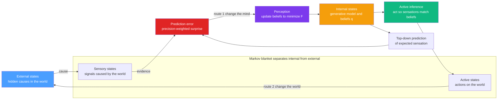

# 🧠 The Free-Energy Principle and the Bayesian Brain

> [!abstract] TL;DR
> The **Free-Energy Principle (FEP)**, due to Karl Friston, is the boldest extrapolation of this vault's central object — **variational free energy** (the very same $F = \langle E\rangle - TS$ that is the negative [[Variational_Inference_the_ELBO_and_VAEs|ELBO]] of machine-learning inference) — into a would-be theory of life and mind. Its claim: any system that *persists* must act as if it minimizes free energy, a computable **upper bound on "surprise"** (the negative log-evidence of its senses under its own model). **Perception** minimizes it by updating beliefs — the **Bayesian brain**, implemented neurally as **predictive coding** where only prediction errors flow upward. **Action** minimizes the same quantity by changing the world so sensations match predictions — **active inference**. It unifies thermodynamics, Bayesian inference, and neuroscience under one imperative, and though genuinely controversial (attacked as unfalsifiable), it has produced influential, testable models of perception, action, and psychiatric disorders.

---

## Intuition

**Analogy — FIRST.** A living thing is a small pocket of stubborn order in a universe hell-bent on disorder. Think of a candle flame: it holds a crisp, recognizable shape for hours even though it is nothing but hot gas that the second law "should" instantly blur into the surrounding air. A cell, a body, a brain does the same trick but far better and far longer — it keeps its internal states (temperature, pH, glucose, blood pressure) inside a narrow, viable band while everything around it decays toward equilibrium. To be blurred into equilibrium *is* death. So the price of staying alive is refusing to be spread out — refusing to visit the vast majority of physically possible states.

Now flip that thermodynamic statement into the language of *inference*. The states an organism must keep visiting are exactly the states it *expects* to occupy; the states it must avoid are the *surprising*, improbable, un-modeled ones (a fish out of water, a body at 45 °C). So "resist the second law and stay alive" becomes "**do not be surprised by your own sensations.**" Friston's audacious claim is that everything brains and bodies do — perceiving, acting, learning, attending, regulating — is in service of this one imperative: minimize surprise, formalized as minimizing a **variational free energy** that upper-bounds it. Perception tunes your internal model so it explains the senses; action changes the world so the senses match your model. It is the *same* free-energy minimization that physics uses to find equilibrium, promoted to a principle of biology and cognition.

---

## How It Works

### Core mechanics

Let $s$ be sensory data and $\vartheta$ the hidden causes out in the world. A self-preserving system "should" minimize **surprise** (surprisal), the negative log model-evidence

$$
\mathcal{S}(s) \;=\; -\ln p(s) \;=\; -\ln \int p(s,\vartheta)\,d\vartheta .
$$

Rare, out-of-bounds sensory states have high surprise; the states an organism expects to occupy have low surprise. Averaged over time, surprise is just the **entropy** of the organism's sensory states — keeping it low *is* maintaining order against dissipation. But $p(s)$ requires marginalizing over every possible cause — an intractable **partition function**, exactly the $Z$ that haunts every energy-based model in this vault (see **[[The_Boltzmann_Distribution_in_Learning]]** and **[[Partition_Functions_and_Free_Energy_in_ML]]**).

The escape is the **variational trick** that underlies all of probabilistic ML. Introduce an internal *recognition density* $q(\vartheta)$ — the brain's current beliefs — and define **variational free energy**:

$$
F \;=\; \underbrace{\mathbb{E}_{q}\!\left[\ln q(\vartheta) - \ln p(s,\vartheta)\right]}_{\text{computable from beliefs and senses}}
\;=\; \underbrace{D_{\mathrm{KL}}\!\big(q(\vartheta)\,\|\,p(\vartheta\mid s)\big)}_{\ge 0,\ \text{the inference gap}}
\;+\; \underbrace{\big(-\ln p(s)\big)}_{\text{surprise}} .
$$

Because the [[Relative_Entropy_and_Cross_Entropy|KL divergence]] is non-negative, $F$ is an **upper bound on surprise**. Minimizing $F$ over $q$ therefore does two jobs at once: it drives $q(\vartheta)$ toward the true posterior $p(\vartheta\mid s)$ (**Bayesian perception**) and it squeezes down the surprise bound itself (**self-evidencing** — the organism gathers evidence for its own model of itself). This is *identically* the ELBO with a sign flip, $F = -\text{ELBO}$: the brain, a VAE, and a Boltzmann machine minimize the same object. An equivalent split makes the trade-off physical:

$$
F \;=\; \underbrace{-\,\mathbb{E}_{q}\!\left[\ln p(s\mid \vartheta)\right]}_{\text{accuracy: fit the senses (energy)}}
\;+\; \underbrace{D_{\mathrm{KL}}\!\big(q(\vartheta)\,\|\,p(\vartheta)\big)}_{\text{complexity: stay near priors (entropy cost)}} .
$$

**Perception as inference — the Bayesian brain.** Your brain never touches the world; sealed in the skull it receives only *effects* and must infer *causes*. So it runs a **generative model** and inverts it — the "Bayesian brain" hypothesis, Helmholtz's *unconscious inference* made formal. Perception is a "controlled hallucination" reined in by sensory evidence.

**Predictive coding — the neural implementation.** Under a Gaussian (Laplace) approximation, $F$ collapses into a sum of **precision-weighted squared prediction errors**. The cortex is hypothesized to descend it by hierarchical message passing: higher levels send **predictions** downward, lower levels send only the **prediction errors** (the surprising residuals) upward, and the hierarchy adjusts until the errors are "explained away." Each error is scaled by its **precision** (inverse variance) — the theory's mechanistic account of **attention**. This is a biologically plausible approximation to hierarchical Bayes, with strong ties to deep learning (predictive-coding schemes that approximate backprop).

**Active inference — the action half.** There are two ways to shrink a prediction error: change the *belief* to fit the world (perception), or change the *world* to fit the belief (**action**). Motor commands are treated as *predictions about proprioception* that reflex arcs fulfil — behavior as self-fulfilling prophecy. Which actions? Policies are selected to minimize **expected free energy** $G$, which splits into **epistemic value** (information gain, curiosity, exploration) plus **pragmatic value** (reaching preferred outcomes, where goals are encoded as priors). This is a first-principles account of the explore–exploit trade-off and the tightest bridge from the FEP to [[Reinforcement_Learning|reinforcement learning]] and world-model agents.

**The Markov blanket — the formal boundary.** What is the "thing" that does all this? A **Markov blanket** — a set of *sensory* and *active* states that render an organism's **internal** states conditionally independent of **external** states. It is the statistical membrane that separates agent from environment and defines the boundary across which free energy is minimized. In the strong FEP it is offered as the formal criterion for what counts as a self-organizing "thing" persisting in a non-equilibrium steady state — a claim that is as contested as it is ambitious.

### The perception–action loop across the Markov blanket



---

## Key Concepts

### Secondary Level

- **Life is a pocket of order.** A candle flame or a cell holds its shape against a universe that wants to blur it away. Staying alive means staying in the narrow set of states you expect to be in.
- **Surprise is the enemy.** A fish expects water; a body expects ~37 °C. Big surprises mean something is wrong and the order is breaking down. So the brain works to *not be surprised*.
- **The brain guesses, then checks.** It predicts what it is about to sense and only pays attention to the mistakes — the surprising bits.
- **Two ways to be less surprised.** Update your mind to match the world (**perception**), or change the world to match your mind (**action** — reaching for the cup makes your prediction "hand on cup" come true).
- **Attention = turning up the volume** on the signals the brain trusts, and down on the noisy ones.

### Undergraduate Level

- **Free energy bounds surprise.** $F = D_{\mathrm{KL}}(q\,\|\,p(\vartheta\mid s)) - \ln p(s) \ge -\ln p(s)$. Minimizing $F$ over beliefs both improves the belief and tightens the surprise bound.
- **Accuracy vs complexity.** $F = \text{(prediction error)} + \text{(divergence from priors)}$; good perception explains the senses without straying far from prior expectations — that is why it generalizes rather than memorizing noise.
- **Predictive coding.** Under Gaussians, $F$ becomes precision-weighted squared error. Top-down predictions and bottom-up errors implement gradient descent on $F$ (Rao & Ballard; Bogacz tutorial).
- **Precision = attention.** Errors are weighted by inverse variance; where the brain expects reliable evidence, those errors dominate the belief update (demonstrated in the code below).
- **Active inference.** Action minimizes the same $F$ by changing sensory input instead of beliefs; motor control is prediction fulfilment.
- **Bayesian brain.** Perception is posterior inference; predictive coding is a message-passing approximation to Bayes' rule (see [[Bayesian_Models_of_Cognition]]).

### Graduate Level

- **Variational free energy = negative ELBO = physical free energy in form.** The identical object appears in variational inference, in the $F=-kT\ln Z$ of statistical mechanics, and in the FEP. The Laplace approximation turns it into the predictive-coding update rules as generalized gradient descent on precision-weighted error — the theme developed in **[[Free_Energy_Minimization_and_Variational_Principles]]** and **Variational_Inference_as_Free_Energy_Minimization**.
- **Markov blanket & self-organization (the strong FEP).** Any system holding a statistical boundary (internal, external, and blanket = sensory + active states) that persists in a non-equilibrium steady state must, on average, minimize the free energy of its sensory states — a variational reading of homeostasis and dissipative structures that locally resist the second law by exporting entropy.
- **Expected free energy and policy selection.** Policies minimize $G = \text{risk} + \text{ambiguity}$, equivalently $-(\text{epistemic} + \text{pragmatic value})$; preferences are log-priors over outcomes, unifying planning, exploration, and control as one inference problem. The message-passing that solves it is kin to **Belief_Propagation_and_the_Cavity_Method**.
- **Relation to the vault's threads.** The FEP is the deepest reach of variational free energy: it ties **thermodynamics** (non-equilibrium steady states, resisting dissipation) to **Bayesian inference** (the ELBO) to **machine learning** (VAEs, predictive-coding approximations of backprop, active inference as model-based RL). It is a candidate "unifying principle" for adaptive systems — the note **The_Reach_and_Future_of_Statistical_Mechanics_and_ML** places it among the frontier claims.
- **The honest caveat.** Distinguish the falsifiable **process theory** (predictive coding, active inference as concrete, testable models) from the near-tautological **normative principle** (free-energy minimization for *all* persisting systems), whose assumptions about Markov blankets and steady states are actively disputed.

---

## Python Demo

A minimal **predictive-coding / active-inference agent** in `numpy` + `matplotlib`. The generative model has one hidden state $x$ observed as $y = x + \text{noise}$, with a prior $\mathcal{N}(\mu_p, 1/\Pi_p)$ and sensory precision $\Pi_s$. Under the Laplace approximation the variational free energy is a sum of precision-weighted squared prediction errors:

$$F(\mu) = \tfrac{1}{2}\,\Pi_s\,(y-\mu)^2 + \tfrac{1}{2}\,\Pi_p\,(\mu-\mu_p)^2 .$$

**Panel 1 (perception + attention):** descend $F$ in the belief $\mu$ by gradient descent — it converges to the analytic **precision-weighted posterior**, i.e. Bayesian inference emerges from free-energy minimization. Running it at two sensory precisions shows **precision (attention)** deciding *how far the belief moves toward the evidence*. **Panel 2:** free energy and the precision-weighted prediction error fall to a floor. **Panel 3 (active inference):** the agent holds a *preferred* observation fixed and **acts** on the world until sensations match it — it makes its own prediction come true.

```python
# The Free-Energy Principle: perception and action as free-energy minimization.
# numpy + matplotlib only.
#
# Generative model of one hidden state x, observed as y = x + sensory noise:
#   prior      N(mu_p, 1/Pi_p)   -- what the agent expects before seeing data
#   likelihood N(x,    1/Pi_s)   -- how precise (trustworthy) the senses are
# Laplace/Gaussian approximation => variational free energy is a sum of
# PRECISION-WEIGHTED squared prediction errors:
#   F(mu) = 0.5*Pi_s*(y - mu)^2 + 0.5*Pi_p*(mu - mu_p)^2
# PERCEPTION  minimizes F by gradient descent on the belief mu (approx. Bayes).
# ATTENTION   = sensory precision Pi_s: it sets how far the belief moves.
# ACTION      minimizes the SAME F by changing the world so sensations fit belief.

import numpy as np
import matplotlib.pyplot as plt

rng = np.random.default_rng(0)

Pi_p   = 1.0                              # prior precision (fixed)
mu_p   = 0.0                              # prior mean: agent expects 0 a priori
x_true = 3.0                              # hidden state of the world
y_obs  = x_true + rng.normal(0, 0.4)      # one noisy sensory sample
lr, T  = 0.04, 300

def posterior_mean(Pi_s):
    # analytic Bayesian posterior mean = precision-weighted average
    return (Pi_s * y_obs + Pi_p * mu_p) / (Pi_s + Pi_p)

def perceive(Pi_s):
    """Gradient descent on F w.r.t. belief mu -> Bayesian posterior."""
    mu = mu_p
    mus, Fs, errs = [], [], []
    for _ in range(T):
        eps_s = y_obs - mu                        # sensory prediction error
        eps_p = mu - mu_p                         # prior prediction error
        dF = -Pi_s * eps_s + Pi_p * eps_p         # gradient of F
        mu -= lr * dF                             # descend the free energy
        mus.append(mu)
        Fs.append(0.5 * Pi_s * eps_s**2 + 0.5 * Pi_p * eps_p**2)
        errs.append(abs(Pi_s * (y_obs - mu)))     # precision-weighted residual
    return np.array(mus), np.array(Fs), np.array(errs)

# ATTENTION: two sensory precisions -> two different belief endpoints.
mu_hi, F_hi, err_hi = perceive(Pi_s=6.0)   # high precision: attend the senses
mu_lo, F_lo, err_lo = perceive(Pi_s=0.5)   # low precision:  attend the prior

# ACTIVE INFERENCE: fix a preferred observation and ACT to fulfil it.
mu_goal, x_world, gain, Pi_a = 3.0, 0.0, 0.05, 6.0
x_hist, a_hist, F_act = [], [], []
for _ in range(T):
    y   = x_world + rng.normal(0, 0.08)    # noisy proprioceptive observation
    err = mu_goal - y                      # error vs preferred state
    a   = gain * Pi_a * err                # action cancels precision-weighted error
    x_world += a                           # action changes the world -> new sensation
    x_hist.append(x_world); a_hist.append(a)
    F_act.append(0.5 * Pi_a * (mu_goal - x_world) ** 2)

# ---- plots -----------------------------------------------------------------
fig, ax = plt.subplots(1, 3, figsize=(14, 4.3))

ax[0].axhline(x_true, color="gray",    ls="--", lw=1.4, label="hidden state x")
ax[0].axhline(y_obs,  color="#4a9eff", ls=":",  lw=1.2, label="noisy observation y")
ax[0].axhline(mu_p,   color="black",   ls="-.", lw=0.8, label="prior mean")
ax[0].plot(mu_hi, color="#7c3aed", lw=2, label="belief, high precision")
ax[0].plot(mu_lo, color="#e07a24", lw=2, label="belief, low precision")
ax[0].axhline(posterior_mean(6.0), color="#7c3aed", ls="-", lw=0.7)
ax[0].axhline(posterior_mean(0.5), color="#e07a24", ls="-", lw=0.7)
ax[0].set_title("Perception: descend F -> posterior\n(precision = attention)")
ax[0].set_xlabel("inference step"); ax[0].set_ylabel("belief mu")
ax[0].legend(fontsize=7); ax[0].grid(alpha=0.3)

ax[1].plot(F_hi,    color="#7c3aed", lw=2,          label="F (high precision)")
ax[1].plot(F_lo,    color="#e07a24", lw=2,          label="F (low precision)")
ax[1].plot(err_hi,  color="#e02424", lw=1.2, ls="--", label="weighted error (hi)")
ax[1].set_yscale("log")
ax[1].set_title("Free energy and prediction error fall to a floor")
ax[1].set_xlabel("inference step"); ax[1].set_ylabel("value (log scale)")
ax[1].legend(fontsize=7); ax[1].grid(alpha=0.3)

ax[2].axhline(mu_goal, color="gray", ls="--", lw=1.4, label="preferred state (goal)")
ax[2].plot(x_hist, color="#10b981", lw=2, label="observation via action")
ax[2].plot(a_hist, color="#f59e0b", lw=1.2, label="action a")
ax[2].set_title("Active inference: act so the\nworld matches the prediction")
ax[2].set_xlabel("time step"); ax[2].set_ylabel("value")
ax[2].legend(fontsize=7); ax[2].grid(alpha=0.3)

plt.tight_layout()
plt.savefig("free_energy_bayesian_brain.png", dpi=120)
plt.show()

print(f"observation y = {y_obs:.3f}")
print(f"high-precision belief -> {mu_hi[-1]:.3f}  (posterior {posterior_mean(6.0):.3f})")
print(f"low-precision  belief -> {mu_lo[-1]:.3f}  (posterior {posterior_mean(0.5):.3f})")
print(f"active-inference world -> {x_hist[-1]:.3f}  (goal {mu_goal:.3f})")
```

**What to notice.** In Panel 1 both beliefs start at the prior ($0$) and climb, but the **high-precision** agent (purple) settles close to the noisy evidence while the **low-precision** agent (orange) barely leaves the prior — each lands exactly on its analytic **precision-weighted posterior**. Precision *is* attention: it decides how much the senses get to move your mind, which is why over-strong or attenuated precision is a mechanistic story for hallucination and autism. Panel 2 shows free energy and the weighted prediction error decaying to a floor (prior and evidence genuinely disagree, so some surprise is irreducible). Panel 3 is the other route entirely: the agent never revises its goal — its **action** (orange) drives the world state (green) until the observation reaches the preferred value. Same free energy, two ways down: change your mind, or change the world.

---

## Real-World Applications

- **Generative ML and self-supervision.** The FEP's objective *is* the variational free energy behind [[Variational_Autoencoders|VAEs]] and latent-variable models; "predict the next token / masked patch" objectives are minimize-surprise in disguise. Predictive-coding networks are studied as a biologically plausible alternative to backpropagation.
- **Active-inference agents and robotics.** Active inference fuses state-estimation and control into one free-energy-minimizing controller; its expected-free-energy planner supplies principled curiosity, connecting to [[Reinforcement_Learning|RL]], world models, and intrinsic-motivation exploration.
- **Computational psychiatry.** Aberrant-precision models give mechanistic accounts of hallucinations and delusions (over-strong priors), autism (over-precise sensory evidence / attenuated priors), and dopaminergic symptoms (dopamine as a precision signal) — psychiatric conditions recast as disorders of inference (see [[Psychiatric_Disorders_and_Neurobiology]]).
- **Attention, perception, and sensorimotor control.** Precision-weighting models attention ([[Attention_and_Executive_Function]]); motor commands as fulfilled proprioceptive predictions give the active-inference reading of the reflex arc and cerebellar control ([[Sensorimotor_Integration_and_Feedback]]).
- **Interoception, homeostasis, and emotion.** Interoceptive-inference accounts recast emotion and bodily regulation as the brain predicting its internal milieu; allostasis is prediction-driven physiological control — the tightest link back to the thermodynamic "resist dissipation" origin of the principle.

---

## Common Pitfalls

- **Confusing "prediction error" with a conscious mistake.** It is a low-level, largely unconscious mismatch between expected and received neural activity, not an error of judgment you can introspect.
- **The dark-room objection.** If minimizing surprise were everything, an organism should seek a silent, dark, stimulus-free room forever. The reply: creatures carry strong *priors to explore, eat, and seek novelty*, and expected free energy contains an epistemic (information-gain) term — so a dark room is itself wildly surprising relative to what a living thing expects.
- **Treating the strong FEP as a falsifiable empirical claim.** Critics argue the grand principle is a near-tautological *normative/mathematical framework* that can retro-fit almost any behavior and predicts little specifically. Keep the falsifiable **process theory** (predictive coding) distinct from the unfalsifiable **normative principle** (free energy for all persisting systems).
- **Equating variational free energy with thermodynamic free energy.** They share the $F = \langle E\rangle - TS$ form and a deep analogy via non-equilibrium steady states, but the variational quantity is an *information-theoretic* bound on surprise, not literal joules — a formal correspondence, not an identity.
- **Reading precision as a free knob.** Precision-weighting has real content (it explains attention *and* pathology); tuning it to fit any datum without independent constraint is precisely how the framework earns its "unfalsifiable" reputation.
- **Assuming predictions are high-level "beliefs."** Most predictions are implicit statistical regularities at every level — edge orientations, timing, social context — not sentences you could state.

---

## Related Concepts

**Statistical-mechanics-and-ML siblings (this vault):**
- [[Free_Energy_Minimization_and_Variational_Principles]] — the variational free energy $F=\langle E\rangle - TS$ that the FEP promotes to a theory of mind; the mathematical parent of this note.
- [[The_Boltzmann_Distribution_in_Learning]] — the shared engine $p\propto e^{-E}$; "surprise" $-\ln p(s)$ is its energy, and its normalizer is the intractable object free energy sidesteps.
- [[Partition_Functions_and_Free_Energy_in_ML]] — why $p(s)$ (the evidence) is intractable, forcing the variational bound the FEP relies on.
- [[Energy_Based_Models]] — the brain-as-inference-engine is an energy-based model whose energy is prediction error.
- [[Boltzmann_Machines_and_RBMs]] — historical realization of free-energy-minimizing neural networks.
- [[Statistical_Mechanics_of_Machine_Learning_Overview]] — the vault's map placing the FEP among the free-energy threads.

**Information-theory and inference foundations (verified):**
- [[The_Free_Energy_Principle_and_Active_Inference]] — the Information-Theory companion note; read alongside this one for the information-theoretic and expected-free-energy derivations.
- [[Variational_Inference_the_ELBO_and_VAEs]] — variational free energy = negative ELBO; the brain and a VAE minimize the identical object.
- [[Relative_Entropy_and_Cross_Entropy]] — the KL divergence that makes $F$ an upper bound on surprise and forms the complexity term.

**Cognitive science, neuroscience, and philosophy of mind (verified):**
- [[Predictive_Processing_and_Free_Energy]] — the Cognitive-Science treatment: predictive coding, precision-as-attention, controlled hallucination.
- [[Bayesian_Models_of_Cognition]] — the Bayesian-brain hypothesis that predictive coding approximates with neural message passing.
- [[Theories_of_Perception]] — Helmholtz's "unconscious inference," the ancestor of perception-as-prediction.
- [[Attention_and_Executive_Function]] — attention as precision-weighting of prediction errors.
- [[Psychiatric_Disorders_and_Neurobiology]] — aberrant-precision accounts of schizophrenia, autism, and depression as inference disorders.
- [[Sensorimotor_Integration_and_Feedback]] — active inference in the motor system: commands as fulfilled proprioceptive predictions.
- [[Reinforcement_Learning]] — expected-free-energy minimization recovers reward-seeking plus an intrinsic exploration bonus.
- [[Consciousness_and_the_Hard_Problem]] — where the "controlled hallucination" view meets debates about phenomenal experience.
- [[The_Mind_Body_Problem]] — the FEP as a naturalistic, inference-first stance on how mind relates to physical process.

---

## Review Questions

### Secondary
1. Using the candle-flame / living-cell picture, explain why "staying alive" translates into "don't be surprised by your senses." Give one everyday example of reducing surprise by *changing your mind* and one by *changing the world*.

### Undergraduate
2. Starting from $F = \mathbb{E}_q[\ln q(\vartheta) - \ln p(s,\vartheta)]$, show that variational free energy is an upper bound on surprise $-\ln p(s)$, and explain why minimizing it over $q$ yields the Bayesian posterior rather than merely memorizing the sensory input. Using the demo, describe how **precision** decides where between prior and evidence the belief lands.

### Graduate
3. The FEP claims to unify thermodynamics, Bayesian inference, and neuroscience through one object — variational free energy. State precisely (a) how it equals the negative ELBO of machine-learning inference, (b) what role the **Markov blanket** plays in defining the system that minimizes it, and (c) one respect in which the strong Free-Energy Principle is criticized as unfalsifiable, distinguishing it from the falsifiable predictive-coding process theory.

---

## Sources

- Friston, K. (2010). "The free-energy principle: a unified brain theory?" *Nature Reviews Neuroscience*, 11(2), 127–138.
- Friston, K., FitzGerald, T., Rigoli, F., Schwartenbeck, P., & Pezzulo, G. (2017). "Active inference: a process theory." *Neural Computation*, 29(1), 1–49.
- Bogacz, R. (2017). "A tutorial on the free-energy framework for modelling perception and learning." *Journal of Mathematical Psychology*, 76, 198–211. (Basis for the predictive-coding gradient-descent demo.)
- Buckley, C. L., Kim, C. S., McGregor, S., & Seth, A. K. (2017). "The free energy principle for action and perception: A mathematical review." *Journal of Mathematical Psychology*, 81, 55–79.
- Parr, T., Pezzulo, G., & Friston, K. J. (2022). *Active Inference: The Free Energy Principle in Mind, Brain, and Behavior.* MIT Press.
- Colombo, M., & Wright, C. (2021). "First principles in the life sciences: the free-energy principle, organicism, and mechanism." *Synthese*, 198, 3463–3488. (Critique of the FEP's scope and falsifiability.)

---

#statistical-mechanics #machine-learning #free-energy-principle #active-inference #predictive-coding
