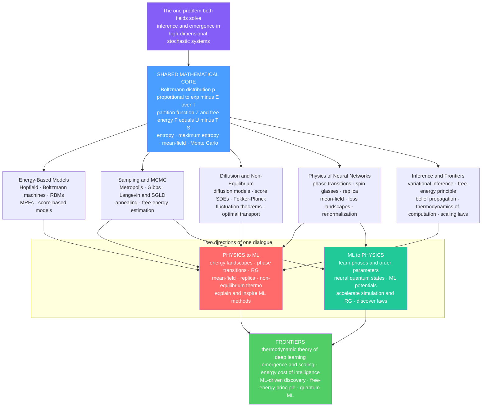

# ♻️ The Reach and Future of Statistical Mechanics and ML

> [!abstract] TL;DR
> This is the **capstone** of the vault. Its claim: statistical mechanics and machine learning keep rediscovering the *same mathematics* — **energy and loss, temperature and noise, free energy and the ELBO, partition functions and normalizers, phase transitions and generalization jumps** — because both confront one universal problem: **inference and emergence in high-dimensional stochastic systems**. That deep correspondence gave ML its most physics-native models (**energy-based models**, **Boltzmann machines**, and the **diffusion models derived directly from non-equilibrium thermodynamics** that power modern generative AI), its sampling algorithms (**MCMC, Langevin, annealing**), and its deepest theory (**spin-glass loss landscapes, the replica method, mean-field signal propagation and the edge of chaos, and the statistical mechanics of generalization and neural scaling laws**). The dialogue runs **both ways**: ML now reciprocally transforms physics (**neural quantum states, ML potentials, learned renormalization**). Ranging from *rigorous identities* to *suggestive-but-contested metaphors* (renormalization-as-deep-learning, the free-energy principle) and reaching toward the **thermodynamic cost of intelligence itself**, this century-spanning, two-way conversation between the physics of many interacting parts and the science of learning is one of the most productive and consequential interfaces in modern science.

---

## Intuition

**Analogy — FIRST.** Two great sciences were born a century apart to answer utterly different questions. One asked: *how does heat flow through matter?* — and became **statistical mechanics**, the physics that extracts orderly laws of temperature and pressure from the blind churning of $10^{23}$ atoms. The other asked: *how does a machine learn from data?* — and became **machine learning**, the science of extracting a generalizing function from a churning sea of millions of noisily-nudged weights. Neither field planned to meet the other. Yet they keep discovering, to mutual astonishment, that **they speak the same language**.

A loss *is* an energy. Training *is* cooling. A generative model *is* a diffusing gas run in reverse. A deep network's failure modes *are* a spin glass's frustrated valleys. None of this was designed; it is *convergent evolution of mathematics*. Both fields confront the same universal problem — **extracting order and inference from high-dimensional randomness** — so they keep reinventing each other's tools, and every hard question in one field has a century-old (or a brand-new) answer waiting in the other. This ongoing dialogue between physics and machine learning may be one of the **most productive conversations in modern science**, and this note is its map: everything the vault has built, pulled onto one page and pointed at the horizon.

---

## How It Works

### The synthesis: one core, five domains, two directions

Strip the vault down to its skeleton and the whole architecture is a single claim with a single reason. Both statistical mechanics and probabilistic ML are, at bottom, about **probability distributions over high-dimensional configurations**. The moment you write *either* one as $p(x) \propto e^{-E(x)/T}$, the *entire toolkit transfers* — and everything else in the vault is the working-out of that transfer.

**1. The shared mathematical core.** The engine is the **Boltzmann (Gibbs) distribution**, developed in [[The_Boltzmann_Distribution_in_Learning]]: $p(x) = \tfrac{1}{Z}e^{-E(x)/T}$. From it radiate the partition function and free energy ([[Partition_Functions_and_Free_Energy_in_ML]]), the maximum-entropy justification that makes the exponential form *inevitable* rather than arbitrary ([[Maximum_Entropy_and_Exponential_Families]]), the free-energy variational principle ([[Free_Energy_Minimization_and_Variational_Principles]]), and **temperature as a universal knob** for exploration, regularization, and annealing ([[Temperature_and_Annealing_in_Learning]]). The dictionary — **energy $\leftrightarrow$ loss, temperature $\leftrightarrow$ noise, free energy $\leftrightarrow$ negative ELBO, partition function $\leftrightarrow$ normalizer, phase transition $\leftrightarrow$ generalization jump** — is not coincidence; it is *structural identity*, laid out in the [[Statistical_Mechanics_of_Machine_Learning_Overview]].

**2. Energy-based models — the distribution *is* the model.** Give a network an **energy** and $p(x)\propto e^{-E(x)}$ becomes a likelihood: [[Energy_Based_Models]], the [[Hopfield_Networks_and_Associative_Memory]] that inspired modern attention, the [[Boltzmann_Machines_and_RBMs]] that are literally spin systems, the [[Markov_Random_Fields_and_Undirected_Graphical_Models]] that *are* Gibbs distributions, the [[Contrastive_Divergence_and_EBM_Training]] trick for sidestepping $Z$, and the [[Score_Matching_and_Score_Based_Models]] that dodge $Z$ entirely by learning $\nabla_x \log p$.

**3. Sampling and MCMC — living with an intractable $Z$.** When the normalizer cannot be computed, you can still *draw samples*: [[MCMC_Sampling_in_Machine_Learning]], the [[Metropolis_Hastings_and_Detailed_Balance]] foundation, [[Gibbs_Sampling_and_Conditional_Updates]], gradient-driven [[Langevin_Dynamics_and_SGLD]], the optimization face of cooling in [[Simulated_Annealing_and_Global_Optimization]], and the physicists' ledger for the free energy itself in [[Free_Energy_Estimation_and_Thermodynamic_Integration]].

**4. Diffusion and non-equilibrium — the crown jewel.** Generative AI's most powerful family was derived *directly* from non-equilibrium statistical mechanics: [[Diffusion_Models_as_Non_Equilibrium_Thermodynamics]], [[The_Forward_and_Reverse_Diffusion_Process]] (heating then controlled cooling), the [[Score_SDEs_and_Probability_Flow]] unification, [[The_Fokker_Planck_Equation_in_Generative_Modeling]] that governs the evolving density, the [[Fluctuation_Theorems_and_the_Jarzynski_Equality]] that quantify irreversible work, and the [[Optimal_Transport_and_Schrodinger_Bridges]] view of moving one distribution onto another.

**5. Physics of neural networks — the deepest theory.** Disordered-systems physics explains *why deep learning works*: [[Phase_Transitions_in_Learning_and_Inference]], the [[Spin_Glasses_and_the_Energy_Landscape_of_Networks]] that model rugged loss surfaces, [[The_Replica_Method_and_Neural_Network_Capacity]] (Gardner's perceptron capacity), and the [[Mean_Field_Theory_of_Neural_Networks]] behind signal propagation and the edge of chaos. The section's still-to-come companions — **The_Loss_Landscape_and_Generalization** and **Renormalization_and_Deep_Learning** — carry the story into generalization and coarse-graining.

**6. Inference and frontiers — this section.** The bridge closes on inference and the horizon: **Variational_Inference_as_Free_Energy_Minimization** (the ELBO *is* negative variational free energy), **The_Free_Energy_Principle_and_the_Bayesian_Brain**, **Belief_Propagation_and_the_Cavity_Method** (message passing from spin glasses), **Thermodynamics_of_Computation_and_the_Landauer_Principle** (the physical cost of a bit), and **Statistical_Mechanics_of_Generalization_and_Scaling_Laws** (typical-case theory and why loss falls as a power law) — companions this capstone synthesizes.

### The two directions of one dialogue

The bridge is a **genuine two-way street**, and its power comes from carrying traffic in both directions:

- **Physics $\to$ ML.** Energy landscapes, phase transitions, the renormalization group, mean-field theory, the replica trick, MCMC, and non-equilibrium thermodynamics *explain, analyze, and inspire* ML methods — from Hopfield nets to diffusion models to the theory of deep learning. Physics is the source of both the **models** and the **understanding**.
- **ML $\to$ Physics.** Machine learning now *accelerates and transforms* physics — classifying phases of matter and discovering order parameters, representing quantum wavefunctions as **neural quantum states**, learning interatomic **ML potentials** for molecular dynamics, speeding up Monte Carlo and even *learning* renormalization, and mining data for physical laws. See [[Machine_Learning_in_Computational_Physics]] and the sibling capstone [[The_Reach_and_Future_of_Computational_Physics]].

### The map of the whole correspondence



### The biggest successes, in one breath

The correspondence is not decorative — it *delivered*. **Diffusion models**, generative AI's crown jewel, are non-equilibrium stat mech made practical. The **theory of deep learning** — mean-field signal propagation and the edge of chaos, the neural tangent kernel, spin-glass loss landscapes, double descent, and neural scaling laws — is physics explaining why deep learning works at all. **Hopfield networks** seeded modern attention. The **statistical mechanics of generalization** succeeds with typical-case theory exactly where worst-case bounds fail. And **MCMC/sampling** is everywhere from Bayesian inference to lattice QCD. These are concrete payoffs, not analogies.

---

## Key Concepts

### Secondary Level

- **Two sciences, one language.** Physics learned to predict heat and phase changes from jiggling atoms; machine learning learns to predict from data. Astonishingly, they use the *same math* — a loss is treated exactly like an energy, and "temperature" means randomness in both.
- **Training is cooling.** Start hot and jittery so the system explores everywhere; slowly cool so it settles into the best answer. That is *simulated annealing* in physics and, in spirit, how learning finds good solutions.
- **Generating is un-diffusing.** Modern image generators (like the ones behind AI art) work by adding noise to data until it becomes static, then *learning to run the movie backwards*. That backwards run is literally borrowed from the physics of how gases spread out.
- **The conversation goes both ways.** Physics handed machine learning some of its best ideas; now machine learning hands physics faster ways to simulate atoms, materials, and quantum systems.

### Undergraduate Level

- **One core object.** $p(x)\propto e^{-E(x)/T}$ read left-to-right is thermal physics; set $E=-\log p_\text{model}$ and it is a probabilistic ML model. The **partition function** $Z=\sum_x e^{-E(x)/T}$ is the shared, intractable normalizer that almost all the difficulty lives inside.
- **Free energy is the objective both minimize.** $F = \langle E\rangle - T S$ trades fit against uncertainty; the **ELBO** of variational inference is exactly *negative variational free energy*, with a data-fit (energy) term and an entropy/regularization term.
- **The dictionary is structural, not loose.** Softmax *is* a Boltzmann distribution over negative logits; an RBM *is* a spin system; an MRF *is* a Gibbs distribution; MLE at $T=1$ *is* energy minimization. Treat these as identities and theorems transfer.
- **Sampling replaces the impossible sum.** Metropolis, Gibbs, and Langevin — built for the Ising model — draw samples without ever computing $Z$, and are the workhorses of Bayesian ML and energy-based generation.
- **Phase transitions are learning transitions.** As a control parameter (data size, model width, noise, memory load) crosses a threshold, behavior can change *sharply* — perfect recall to forgetting, or an emergent ability switching on. This is the ML face of a physical phase transition.

### Graduate Level

- **Disordered-systems physics is the right theory of learning.** The **replica method** and the **cavity method** compute *typical-case* generalization error and storage capacity (Gardner's $\alpha_c \approx 2$ for the perceptron; Amit–Gutfreund–Sompolinsky for Hopfield), succeeding where worst-case VC bounds are vacuous. Loss landscapes inherit **spin-glass** structure: exponentially many minima of comparable quality, which is why SGD reliably finds *good* ones.
- **Mean-field signal propagation and the edge of chaos.** Mean-field theory of random deep nets predicts an order-to-chaos transition in forward/backward signal propagation; trainability lives at the critical boundary, and the neural tangent kernel linearizes the infinite-width limit.
- **Diffusion as non-equilibrium thermodynamics — a rigorous identity.** Sohl-Dickstein et al. derived diffusion models *explicitly* from non-equilibrium stat mech; the forward process is a variance-schedule OU flow, the reverse is governed by the time-reversed SDE whose drift is the **score**, and the deterministic **probability-flow ODE** shares its marginals. Jarzynski-style relations connect the training objective to irreversible work.
- **Renormalization and depth — a *contested* analogy.** The proposal that deep learning implements a renormalization-group coarse-graining is *suggestive and partly formalizable* (for hierarchical/Ising-like data) but **not a proven identity** in general — a caution about metaphor versus mechanism.
- **The thermodynamics of computation and of learning.** The **Landauer bound** ($k_B T \ln 2$ per bit erased) sets a floor on the energy cost of irreversible computation; the frontier asks whether a genuine *thermodynamic theory of the deep network* — and thermodynamic/neuromorphic hardware near the Landauer limit — can make intelligence energetically efficient.

---

## Python Demo

A single **synthesizing dashboard**: four panels that put the physics–ML dictionary in one view. **(A)** the shared core — the Boltzmann distribution $p\propto e^{-E/T}$ at several temperatures. **(B)** generative = non-equilibrium diffusion — a forward process smears two data modes into a Gaussian, and *annealed Langevin* (reverse diffusion) regenerates them from noise using the analytic score. **(C)** a learning **phase transition** — the order parameter of a mean-field system jumps as a control parameter crosses a critical value, the shared signature of memory retrieval, generalization, and emergence. **(D)** the **free-energy trade-off** $F = U - T S$ — the *same* system's landscape developing a double well as it cools, the energy-versus-entropy ledger that variational inference calls the ELBO.

```python
# CAPSTONE dashboard: the statistical-mechanics <-> ML dictionary in one figure.
#   (A) Boltzmann core     p(x) ∝ exp(-E/T)           energy<->loss, T<->noise
#   (B) diffusion          forward smear + reverse (annealed Langevin) regenerate
#   (C) phase transition   order parameter |m| vs control parameter T
#   (D) free energy         F = U - T*S develops a double well (same system as C)
# Requires: numpy, matplotlib
import numpy as np
import matplotlib.pyplot as plt

rng = np.random.default_rng(0)

# ================================================================
# (A) THE SHARED CORE: Boltzmann distribution at several temperatures
#     Asymmetric double well; lowering T concentrates probability
#     onto the deepest (low-loss / most-probable) state.
# ================================================================
def energy(x):
    return (x**2 - 1.0)**2 + 0.30 * x        # left well is deeper

xg = np.linspace(-2.2, 2.2, 1000)
dx = xg[1] - xg[0]
Eg = energy(xg)

def boltzmann(E, T):
    a = -E / T
    a -= a.max()                              # stability; Z absorbs the shift
    w = np.exp(a)
    return w / (w.sum() * dx)                  # normalizer = partition function Z

temps_A = [2.0, 0.6, 0.20, 0.07]

# ================================================================
# (B) GENERATIVE = NON-EQUILIBRIUM DIFFUSION
#     Data = 2-mode Gaussian mixture. FORWARD: convolve with N(0, s^2)
#     (heating) -> single blob. REVERSE: annealed Langevin using the
#     ANALYTIC score of the noised mixture regenerates the two modes.
# ================================================================
mu = np.array([-2.0, 2.0]); wt = np.array([0.5, 0.5]); s0 = 0.30   # data std
def mixture_density(x, var):
    d = np.zeros_like(x)
    for m, w in zip(mu, wt):
        d += w * np.exp(-0.5*(x-m)**2/var) / np.sqrt(2*np.pi*var)
    return d

def score(x, var):
    # d/dx log q(x), q = sum_i w_i N(x; mu_i, var)  (stable log-sum form)
    a = -0.5*(x[None, :]-mu[:, None])**2/var          # (2, N)
    a -= a.max(axis=0, keepdims=True)
    g = wt[:, None]*np.exp(a)
    den = g.sum(axis=0)
    num = (g*(mu[:, None]-x[None, :])/var).sum(axis=0)
    return num/den

# reverse: annealed Langevin over a decreasing noise ladder
sigmas = np.geomspace(3.0, 0.10, 12)
walk = rng.normal(0.0, 3.0, size=6000)                # start from pure noise
for sig in sigmas:
    var = s0**2 + sig**2
    eps = 0.03 * sig**2                                # step scales with noise
    for _ in range(60):
        walk = walk + 0.5*eps*score(walk, var) + np.sqrt(eps)*rng.normal(size=walk.size)

# ================================================================
# (C) & (D) MEAN-FIELD SYSTEM: order parameter and free energy
#     Self-consistency m = tanh(m/T)  ->  critical T_c = 1.
#     Free energy per spin  F(m) = -0.5*m^2 - T*S(m),  S = binary entropy.
# ================================================================
def bin_entropy(m):
    m = np.clip(m, -0.999, 0.999)
    p, q = (1+m)/2, (1-m)/2
    return -(p*np.log(p) + q*np.log(q))

Ts = np.linspace(0.05, 2.0, 200)
m_star = np.empty_like(Ts)
for i, T in enumerate(Ts):
    m = 0.9
    for _ in range(400):
        m = np.tanh(m / T)
    m_star[i] = abs(m)

mg = np.linspace(-0.98, 0.98, 400)
Ts_F = [0.5, 1.0, 1.6]

# ================================================================
# PLOT: the four-panel dictionary dashboard
# ================================================================
fig, ax = plt.subplots(2, 2, figsize=(13.5, 10))
fig.suptitle("The statistical-mechanics <-> machine-learning dictionary, in one view",
             fontsize=14, fontweight="bold")

# --- A: Boltzmann core ---
axA = ax[0, 0]
for T in temps_A:
    axA.plot(xg, boltzmann(Eg, T), lw=2, label=f"T = {T}")
axA.set_title("A. Shared core: p(x) ∝ exp(-E/T)\n"
              "energy<->loss, temperature<->noise")
axA.set_xlabel("state x  (= configuration / sample)")
axA.set_ylabel("probability density"); axA.legend(fontsize=8)

# --- B: diffusion forward + reverse ---
axB = ax[0, 1]
for sig, ls in [(0.0, "-"), (1.0, "--"), (3.0, ":")]:
    var = s0**2 + sig**2
    axB.plot(xg, mixture_density(xg, var), ls, color="#495057", lw=1.8,
             label=f"forward, noise σ={sig:g}")
axB.hist(walk, bins=80, density=True, color="#69db7c", alpha=0.8,
         edgecolor="none", label="reverse-generated")
axB.set_title("B. Generative = non-equilibrium diffusion\n"
              "forward smears; reverse (Langevin) regenerates")
axB.set_xlabel("x"); axB.set_ylabel("density"); axB.legend(fontsize=8)

# --- C: learning phase transition ---
axC = ax[1, 0]
axC.plot(Ts, m_star, color="#1c7ed6", lw=2.5)
axC.axvline(1.0, color="crimson", ls="--", lw=1.3, label="critical point T_c = 1")
axC.fill_between(Ts, 0, m_star, where=(Ts < 1.0), color="#1c7ed6", alpha=0.12)
axC.set_title("C. Learning phase transition\n"
              "order parameter jumps at a critical control value")
axC.set_xlabel("control parameter T  (noise / temperature)")
axC.set_ylabel("order parameter |m|  (retrieval / order)")
axC.legend(fontsize=8)

# --- D: free-energy trade-off (same system as C) ---
axD = ax[1, 1]
for T in Ts_F:
    F = -0.5*mg**2 - T*bin_entropy(mg)
    axD.plot(mg, F - F.min(), lw=2, label=f"T = {T}")
axD.set_title("D. Free energy F = U - T·S  (= -ELBO)\n"
              "double well below T_c: order beats entropy")
axD.set_xlabel("order parameter m")
axD.set_ylabel("free energy F(m) - min")
axD.legend(fontsize=8)

plt.tight_layout(rect=[0, 0, 1, 0.95])
plt.savefig("statmech_ml_capstone.png", dpi=130)
print("Saved figure to statmech_ml_capstone.png")

# --- print the dictionary the figure illustrates ---
print("\nThe physics-ML dictionary (one row per panel-theme):")
for phys, ml in [("energy E(x)", "loss / negative log-probability"),
                 ("temperature T", "noise / regularization / softmax temp"),
                 ("partition function Z", "normalizing constant"),
                 ("free energy F = U - T*S", "negative ELBO"),
                 ("phase transition", "generalization / emergence jump"),
                 ("annealing / cooling", "optimization schedule"),
                 ("reverse diffusion", "score-based generation")]:
    print(f"  {phys:26s} <->  {ml}")
```

Running it: panel **A** shows the Boltzmann curve broaden at high $T$ (high entropy, uncertain) and collapse onto the deeper well at low $T$ (confident, low-loss) — the shared engine. Panel **B** shows the two data modes smeared into a single Gaussian by the *forward* process, while the green histogram — samples *reverse-diffused from pure noise* by annealed Langevin — cleanly regenerates both modes: **generation is controlled un-diffusion**. Panels **C** and **D** are the *same* mean-field system: the free energy $F=U-TS$ develops a **double well** as it cools below $T_c=1$ (D), and the resulting order parameter $|m|$ **jumps** from zero to nonzero exactly there (C) — a phase transition that is simultaneously the picture of memory retrieval switching on, the ELBO's energy-versus-entropy trade-off, and an emergent ability appearing. Four panels, one dictionary.

---

## Real-World Applications

The correspondence is load-bearing across the full sweep of modern AI and computational science:

- **Generative AI (the crown jewel).** Diffusion and score-based models — Stable Diffusion, DALL·E, Sora-style video, and molecule/protein generators — are non-equilibrium thermodynamics turned into product. Forward "add noise" and reverse "denoise" are heating and controlled cooling; sampling is Langevin dynamics. See [[Diffusion_Models_as_Non_Equilibrium_Thermodynamics]] and [[Diffusion_Models]].
- **Sampling and Bayesian inference everywhere.** MCMC (Metropolis, Gibbs, Hamiltonian Monte Carlo, Langevin/SGLD) — invented for physics simulation — is the engine of probabilistic programming (Stan, PyMC, NumPyro), Bayesian deep learning, and lattice field theory. See [[MCMC_Sampling_in_Machine_Learning]] and [[The_Metropolis_Algorithm_and_MCMC]].
- **Energy-based and self-supervised learning.** Hopfield/attention, (restricted) Boltzmann machines, MRFs, and modern EBMs define a probability by an energy; contrastive and JEPA-style objectives inherit the energy view. See [[Energy_Based_Models]] and [[Hopfield_Networks_and_Associative_Memory]].
- **The physics-of-deep-learning theory that guides practice.** Mean-field initialization schemes, edge-of-chaos trainability, the neural tangent kernel, spin-glass explanations of why SGD finds good minima, double descent, and **neural scaling laws** that forecast the payoff of more compute and data. See [[Mean_Field_Theory_of_Neural_Networks]], [[The_Replica_Method_and_Neural_Network_Capacity]], and [[Scaling_Laws]].
- **Optimization by annealing.** Simulated and quantum annealing for VLSI placement, scheduling, and combinatorial problems; SGD read as noisy (finite-temperature) dynamics. See [[Simulated_Annealing_and_Global_Optimization]] and [[SGD_and_Variants]].
- **ML for physics (the reverse direction).** Neural-network interatomic potentials, phase-of-matter classifiers, **neural quantum states**, normalizing-flow lattice samplers, and learned renormalization now accelerate simulation and discovery. See [[Machine_Learning_in_Computational_Physics]] and [[Quantum_Machine_Learning]].

---

## Common Pitfalls

- **Mistaking a rigorous identity for a loose metaphor — and vice versa.** Some correspondences are *exact*: softmax **is** a Boltzmann distribution, an RBM **is** a spin system, the ELBO **is** negative variational free energy, and diffusion models **are** non-equilibrium thermodynamics (Sohl-Dickstein's derivation is explicit). Others are *suggestive metaphors, not identities*: "deep learning **is** renormalization" is contested and only partly formalizable; the **free-energy principle** as a theory of all life and cognition is controversial and arguably hard to falsify. The single most important skill is telling *which is which* — what is **proven**, what is a **useful heuristic**, and what is **speculative**.
- **Physics envy and the over-stretched analogy.** Not every learning-curve kink is a true phase transition (genuine ones need a non-analyticity in the thermodynamic limit — check the finite-size scaling before invoking criticality). Not every network is usefully a spin glass. Borrowing physics vocabulary can *feel* like explanation while adding nothing; a spherical-cow simplification that ignores the mechanism is worse than honest ignorance. Mistaking **metaphor for mechanism** is the field's occupational hazard.
- **Ignoring the partition function $Z$.** In energy-based models $Z$ is genuinely intractable; "just normalize it" fails, and the *entire* toolkit of contrastive divergence, score matching, and noise-contrastive estimation exists precisely to *avoid* computing it. See [[Contrastive_Divergence_and_EBM_Training]] and [[Score_Matching_and_Score_Based_Models]].
- **Confusing the several "temperatures."** Physical temperature, SGD's effective noise temperature, the softmax/sampling temperature, and a diffusion noise level are related but *not interchangeable* — always state which control parameter you mean.
- **Assuming equilibrium.** Training and diffusion sampling are usually **non-equilibrium**; equilibrium (Boltzmann) intuition can mislead about transients, mixing time, mode collapse, and irreversibility. See [[Fluctuation_Theorems_and_the_Jarzynski_Equality]].
- **Sign and factor bookkeeping.** Free energy is *minimized* while log-likelihood is *maximized*; a dropped minus sign or a stray factor of $T$ silently inverts the objective.
- **Forgetting the limits of the bridge.** The correspondence is a *lens and a toolkit*, not a complete theory of intelligence. It illuminates enormously, but a real theory must still be built, validated, and — where the physics is only heuristic — eventually made rigorous.

---

## Related Concepts

**The vault's opening bookend**
- [[Statistical_Mechanics_of_Machine_Learning_Overview]] — the opening statement of the whole program this capstone now closes.

**01 · Foundations of the correspondence**
- [[The_Boltzmann_Distribution_in_Learning]] — the shared engine $p\propto e^{-E/T}$ every later note reuses.
- [[Partition_Functions_and_Free_Energy_in_ML]] — the intractable $Z$ and the free-energy objective.
- [[Maximum_Entropy_and_Exponential_Families]] — why the exponential form is inevitable; Jaynes' inference view.
- [[Free_Energy_Minimization_and_Variational_Principles]] — minimizing $F=U-TS$ as the master principle.
- [[Temperature_and_Annealing_in_Learning]] — the universal knob for exploration and regularization.

**02 · Energy-based models and Boltzmann machines**
- [[Energy_Based_Models]] — the distribution defined by an energy.
- [[Hopfield_Networks_and_Associative_Memory]] — the spin system that seeded modern attention.
- [[Boltzmann_Machines_and_RBMs]] — networks that are literally spin systems.
- [[Markov_Random_Fields_and_Undirected_Graphical_Models]] — MRFs as Gibbs distributions.
- [[Contrastive_Divergence_and_EBM_Training]] — training around the intractable $Z$.
- [[Score_Matching_and_Score_Based_Models]] — dodging $Z$ by learning the score.

**03 · Sampling, MCMC, and Monte Carlo**
- [[MCMC_Sampling_in_Machine_Learning]] — sampling when $Z$ is out of reach.
- [[Metropolis_Hastings_and_Detailed_Balance]] — the foundational acceptance rule.
- [[Gibbs_Sampling_and_Conditional_Updates]] — coordinate-wise conditional sampling.
- [[Langevin_Dynamics_and_SGLD]] — gradient-plus-noise sampling; the diffusion connection.
- [[Simulated_Annealing_and_Global_Optimization]] — cooling as optimization.
- [[Free_Energy_Estimation_and_Thermodynamic_Integration]] — measuring the free energy itself.

**04 · Diffusion and non-equilibrium**
- [[Diffusion_Models_as_Non_Equilibrium_Thermodynamics]] — the crown-jewel derivation.
- [[The_Forward_and_Reverse_Diffusion_Process]] — heating then controlled cooling.
- [[Score_SDEs_and_Probability_Flow]] — the unifying SDE/ODE view.
- [[The_Fokker_Planck_Equation_in_Generative_Modeling]] — the density's equation of motion.
- [[Fluctuation_Theorems_and_the_Jarzynski_Equality]] — irreversible work and non-equilibrium identities.
- [[Optimal_Transport_and_Schrodinger_Bridges]] — moving one distribution onto another.

**05 · Phase transitions and learning dynamics**
- [[Phase_Transitions_in_Learning_and_Inference]] — sharp qualitative changes in learning.
- [[Spin_Glasses_and_the_Energy_Landscape_of_Networks]] — the rugged loss surface.
- [[The_Replica_Method_and_Neural_Network_Capacity]] — Gardner capacity and typical-case theory.
- [[Mean_Field_Theory_of_Neural_Networks]] — signal propagation and the edge of chaos.

**Cross-vault — the physics being borrowed**
- [[Classical_Statistical_Mechanics]] — the canonical ensemble, $Z$, and $F=-kT\ln Z$ this vault reuses.
- [[Entropy_and_Second_Law]] — the entropy term in free energy and the arrow diffusion exploits.
- [[Thermodynamic_Potentials]] — free energy as the quantity actually minimized, mirrored by the ELBO.
- [[Phase_Transitions_and_Critical_Phenomena]] — the physics face of learning/generalization transitions.
- [[Renormalization_and_RG]] — coarse-graining that illuminates (contested-ly) depth in deep nets.
- [[The_Ising_Model_and_Statistical_Physics]] — the spin system that *is* a Boltzmann machine.
- [[Stochastic_Differential_Equations_and_Langevin]] — Langevin dynamics = score-based sampling.

**Cross-vault — information, inference, and the reverse direction**
- [[Maximum_Entropy_Principle]] — Jaynes' derivation of the Boltzmann form as pure inference.
- [[Entropy_in_Thermodynamics_and_Statistical_Mechanics]] — the shared entropy concept.
- [[Variational_Inference_the_ELBO_and_VAEs]] — the ELBO as negative variational free energy.
- [[The_Free_Energy_Principle_and_Active_Inference]] — free-energy minimization for brains and agents.
- [[Landauer_Principle_and_Thermodynamics_of_Computation]] — the physical cost of a bit; the energy of intelligence.
- [[Machine_Learning_in_Computational_Physics]] — the ML $\to$ physics direction of the bridge.
- [[The_Reach_and_Future_of_Computational_Physics]] — the sibling capstone on simulation as the third pillar.
- [[Quantum_Machine_Learning]] — where learning meets quantum simulation.
- [[Scaling_Laws]] — the empirical power laws a statistical mechanics of learning aims to explain.
- [[Transformer_Architecture]] — modern attention with roots in associative memory.

**Cross-vault — emergence and complexity**
- [[Criticality_and_Phase_Transitions]] — criticality as a systems-level lens on learning.
- [[Emergence_and_Self_Organization]] — order from many interacting parts, in physics and in models.
- [[Dissipative_Structures_and_Nonequilibrium]] — order emerging from non-equilibrium driving, as in training and diffusion.

*Companions still to come in this section (referenced above in prose): Variational_Inference_as_Free_Energy_Minimization, The_Free_Energy_Principle_and_the_Bayesian_Brain, Belief_Propagation_and_the_Cavity_Method, Thermodynamics_of_Computation_and_the_Landauer_Principle, Statistical_Mechanics_of_Generalization_and_Scaling_Laws, and in section 05, The_Loss_Landscape_and_Generalization and Renormalization_and_Deep_Learning.*

---

## Review Questions

### Secondary
1. In your own words, explain why "training a machine learning model is like cooling something down." What is the "hot" phase good for, and what does the "cold" phase give you?
2. AI image generators are said to work by "adding noise, then learning to run the movie backwards." Using the diffusion idea, describe what the forward and backward steps do and why the backward one is the creative act.

### Undergraduate
3. Write the Boltzmann distribution and give, term by term, its machine-learning translation (energy, temperature, partition function, free energy). Why is the partition function the hard part in *both* fields, and name two ML techniques that exist purely to avoid computing it.
4. Free energy is $F=\langle E\rangle - T S$ and the ELBO is its negative. Identify which term pushes a model to *fit the data* and which pushes it toward *uncertainty/simplicity*, and explain how the demo's panel D shows this trade-off resolving as temperature drops.
5. Give one example of the bridge running **physics $\to$ ML** and one running **ML $\to$ physics**, stating precisely what is transferred in each direction.

### Graduate
6. Diffusion models are called "non-equilibrium thermodynamics" and this is presented as a *rigorous identity*, whereas "deep learning is renormalization" is presented as a *contested metaphor*. Explain what makes the first a genuine derivation and the second only suggestive, and describe what evidence would be needed to promote the renormalization claim to an identity.
7. The perceptron's storage capacity ($\alpha_c\approx 2$) and the *typical* generalization error of learning machines are computed with the **replica** and **cavity** methods. Explain conceptually why a *disordered-systems* technique is the right tool for typical-case learning, and why worst-case (VC-style) bounds often fail to capture what actually happens.
8. Take a position on the frontier: which will matter more for the next decade of AI — a *thermodynamic theory of the deep network* that explains emergence and scaling, or the *thermodynamic cost of learning* driving energy-efficient (neuromorphic/thermodynamic) hardware near the Landauer limit? Justify your choice and name one concrete open problem it must solve.

---

## Sources

- Bahri, Y., Kadmon, J., Pennington, J., Schoenholz, S. S., Sohl-Dickstein, J., & Ganguli, S. (2020). "Statistical Mechanics of Deep Learning." *Annual Review of Condensed Matter Physics*, 11, 501–528. — [doi.org/10.1146/annurev-conmatphys-031119-050745](https://doi.org/10.1146/annurev-conmatphys-031119-050745)
- Mehta, P., Bukov, M., Wang, C.-H., Day, A. G. R., Richardson, C., Fisher, C. K., & Schwab, D. J. (2019). "A high-bias, low-variance introduction to Machine Learning for physicists." *Physics Reports*, 810, 1–124. — [doi.org/10.1016/j.physrep.2019.03.001](https://doi.org/10.1016/j.physrep.2019.03.001)
- Sohl-Dickstein, J., Weiss, E. A., Maheswaranathan, N., & Ganguli, S. (2015). "Deep Unsupervised Learning using Nonequilibrium Thermodynamics." *ICML*. — [arxiv.org/abs/1503.03585](https://arxiv.org/abs/1503.03585)
- Carleo, G., Cirac, I., Cranmer, K., Daudet, L., Schuld, M., Tishby, N., Vogt-Maranto, L., & Zdeborová, L. (2019). "Machine learning and the physical sciences." *Reviews of Modern Physics*, 91, 045002. — [doi.org/10.1103/RevModPhys.91.045002](https://doi.org/10.1103/RevModPhys.91.045002)
- Engel, A., & Van den Broeck, C. (2001). *Statistical Mechanics of Learning*. Cambridge University Press.

---

#statistical-mechanics #machine-learning #energy-based-models #interdisciplinary #capstone
