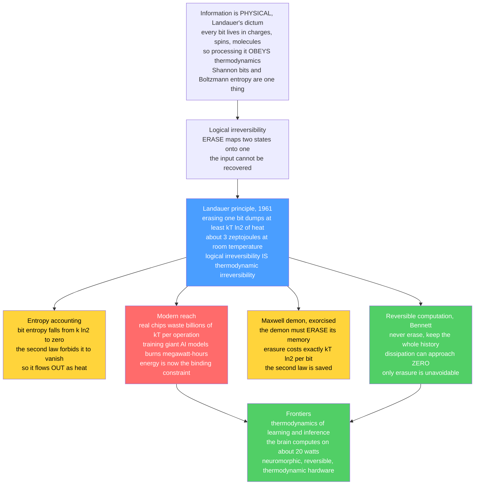

# 🔥 Thermodynamics of Computation and the Landauer Principle

> [!abstract] TL;DR
> Here is a fact that sounds like a joke and is a theorem: **forgetting costs energy.** Not metaphorically — *physically*. Every time a computer **erases** one bit of information (maps two possible states onto one certain state), it must dump at least $k_BT\ln 2$ of heat into its surroundings — about **3 zeptojoules** at room temperature — set by nothing but the temperature and Boltzmann's constant. This is **Landauer's principle** (Rolf Landauer, 1961), and its deep content is that **information is physical**: a bit is always stored in charges, spins, or molecules, so processing it obeys thermodynamics, and *logical irreversibility* (erasure) **is** *thermodynamic irreversibility* (entropy production). The corollaries are startling. **Reversible computation** (Bennett) never erases, so it can in principle dissipate *nothing* — only erasure is unavoidable. **Maxwell's demon** is exorcised: the demon must eventually erase its memory, and that erasure pays exactly the second-law debt it seemed to dodge. The bound is not just theory — it was **measured** (Bérut et al., 2012, a colloidal bit in a double-well trap). And it matters more than ever: real chips waste *billions* of $k_BT$ per operation, while **training a giant AI model burns megawatt-hours**, making the thermodynamic cost of learning a defining constraint — against which the **brain's ~20 watts** looks miraculous and drives the search for neuromorphic, reversible, and thermodynamic computing hardware. Landauer's limit is the ultimate floor beneath all computation; the vast gap above it is where the physics of information meets the real cost of intelligence.

---

## Intuition

**Analogy — the ledger you cannot un-write for free.** Imagine a scrupulous accountant keeping a ledger in pencil. Writing a new entry from a blank line is cheap — the paper was empty, and afterward it holds one definite value. But now the boss says *"erase that column and start fresh."* To guarantee the column reads *blank* afterward — no matter what messy numbers were there before — the accountant must physically rub out every possible prior state and force them all to the same clean result. Erasing is the act that **destroys distinctions**: many possible "before"s are crushed into a single certain "after." And crushing possibilities is exactly what the second law of thermodynamics charges you for. The lost distinctions do not vanish into nothing — they are exhaled into the room as a tiny puff of **heat**.

That is Landauer's principle in a sentence: **the thermodynamically expensive step is not computing, it is *forgetting*.** A single bit that could be either 0 or 1 carries $k_B\ln 2$ of entropy; erase it to a known 0 and that entropy has to *go somewhere* (the second law forbids entropy from simply disappearing), so it is expelled to the environment as at least $k_BT\ln 2$ of heat. Turn the analogy around and a second miracle appears: if you *never* erase — if you keep every intermediate scribble and every prior column — you never crush any distinctions, and in principle you can compute for **free**. The price of cheap computation is a perfect memory of everything you ever did. This single idea — that information is physical, that logic and heat are the same subject — reaches from the resolution of a 150-year-old paradox to the electricity bill of a modern data center training a trillion-parameter model.

---

## How It Works

### Core Mechanics

**1. Information is physical (Landauer's dictum).** There is no such thing as a disembodied bit. Every bit of information is *always* encoded in the state of some **physical** system — the charge on a capacitor, the magnetization of a domain, the position of a molecule, a spin up or down. Therefore any operation that reads, copies, or erases information is a physical process obeying the laws of thermodynamics. This is the founding move of the **thermodynamics of computation**: it dissolves the imagined boundary between abstract information theory and physics. Shannon's *bit* and Boltzmann's *entropy* turn out to be the same quantity measured in different units ($1\text{ bit} = k_B\ln 2$ of thermodynamic entropy), and the vault's recurring characters — entropy, free energy, the partition function — reappear as the accountants of *computation itself*.

**2. Landauer's principle — the cost of erasure.** In 1961 Rolf Landauer proved the landmark result: **erasing one bit of information requires dissipating at least $k_BT\ln 2$ of energy as heat**, where $T$ is the temperature of the environment and $k_B$ is Boltzmann's constant. At room temperature ($T\approx 300$ K) this floor is

$$
E_{\min} = k_B T \ln 2 \approx (1.38\times10^{-23}\,\text{J/K})(300\,\text{K})(0.693) \approx 2.9\times10^{-21}\,\text{J} \approx 3\ \text{zeptojoules}.
$$

Erasing $N$ bits costs at least $N\,k_BT\ln 2$. The bound applies specifically to **logically irreversible** operations — those that map two or more distinct inputs onto the same output, so the input cannot be recovered from the output. `ERASE` (reset to 0) is the canonical example: both "was 0" and "was 1" become "is 0." So is `AND` (three of four input pairs give 0). The claim is razor-sharp: *logical irreversibility forces thermodynamic irreversibility.*

**3. Why erasure costs — the entropy accounting.** Follow the entropy. A bit that is equally likely to be 0 or 1 has **Shannon entropy** $H = \log 2$ (one bit), i.e. thermodynamic entropy $S = k_B\ln 2$. After erasure it is *certainly* 0: entropy $S = 0$. The bit's entropy has therefore dropped by $\Delta S_{\text{bit}} = -k_B\ln 2$. But the **second law** forbids the *total* entropy of an isolated system from decreasing. The bit's lost entropy cannot evaporate — it must be **exported to the environment**, and the minimum way to export entropy $\lvert\Delta S_{\text{bit}}\rvert$ into a bath at temperature $T$ is to dump heat $Q = T\lvert\Delta S_{\text{bit}}\rvert = k_BT\ln 2$. That heat is the second law collecting its due. Notice what this argument does *not* charge for: a logically **reversible** step (a permutation of states) leaves the bit's entropy unchanged, so it demands *no* minimum heat. **Erasure is the costly step; computation per se is not.**

**4. Reversible computation (Bennett's escape).** If only erasure is expensive, can you compute *without* erasing? Charles Bennett (1973) and the **Fredkin–Toffoli** reversible gates showed: **yes, in principle.** A logically reversible computation makes every step a bijection — no information is ever destroyed, every intermediate is invertible — so by Landauer's own accounting it can be run with **arbitrarily little** dissipation, approaching zero as it is run slowly enough. The catch is a **space–energy trade-off**: to avoid erasing, you must *keep* the entire history of intermediate results (Bennett's trick is to compute the answer, copy it out reversibly, then run the computation *backward* to clean up the scratch work without erasing). You may compute for free only if you never forget — and remembering everything has its own cost in space and eventual reset. This is the theoretical basis of **reversible** and **adiabatic** computing, and it is why quantum computation, whose gates are *unitary* (hence reversible) by construction, is a natural home for these ideas — see [[Quantum_Gates_and_Circuits]].

**5. Maxwell's demon, resolved.** For 150 years, **Maxwell's demon** haunted the second law. Maxwell imagined a tiny intelligent being operating a trapdoor between two gas chambers, letting fast molecules through one way and slow ones the other, thereby sorting hot from cold and *decreasing* entropy — apparently for free, using only *information* about molecular speeds. Szilárd (1929) sharpened it to a one-molecule engine that extracts $k_BT\ln 2$ of work per bit of information. The resolution, completed by **Landauer and Bennett**, is beautiful: the demon has a **memory**, and to operate in a cycle it must eventually **erase** that memory to make room for the next measurement. Erasing each bit of acquired information costs *exactly* $k_BT\ln 2$ — precisely cancelling the work the demon extracted. The demon does not violate the second law; it *pays for its knowledge on the way out.* Information is revealed as a genuine **thermodynamic resource**, convertible to work but only against a matching entropic debt (the deeper accounting is the subject of [[Maxwell_Demon_and_the_Physics_of_Information]]).

**6. It was measured.** Landauer's bound is not a philosopher's fable — it is a measured law of nature. **Bérut et al. (2012, *Nature*)** trapped a single colloidal micro-particle in a **double-well** optical potential (the two wells = the two bit states) and physically **erased** it by lowering the barrier and tilting both wells toward one side, resetting the bit to a known value. Tracking the particle's trajectory and computing the dissipated heat, they confirmed that the average heat approaches the **$k_BT\ln 2$ floor** in the slow (quasi-static) limit and *exceeds* it when erasure is done faster. Later experiments (nanomagnets, single electrons, feedback traps) have reconfirmed it. The zeptojoule is real.

**7. The finite-time surcharge (the Jarzynski link).** The $k_BT\ln 2$ figure is the **quasi-static minimum** — achievable only in the limit of infinitely slow erasure. Erase *faster* and you dissipate **more**: the excess is irreversible **dissipated work** $\langle W_{\text{diss}}\rangle = \langle Q\rangle - k_BT\ln 2 \ge 0$, which grows as the protocol speeds up (roughly as $1/\tau$ for a duration-$\tau$ protocol, from thermodynamic-length / optimal-transport arguments). This is exactly the non-equilibrium bookkeeping of the fluctuation theorems: the average heat of erasure obeys $\langle Q\rangle \ge k_BT\ln 2$ as a corollary of the same Jensen-on-a-convex-exponential argument that gives $\langle W\rangle \ge \Delta F$, and individual erasure trajectories *fluctuate* above and below the bound with Crooks-quantified odds (see [[Fluctuation_Theorems_and_the_Jarzynski_Equality]]). The Landauer bound is the reversible floor; finite-time computing pays a surcharge on top of it.

**8. The modern reach — the energy cost of learning.** Real computers dissipate not zeptojoules but **billions of $k_BT$ per logic operation** — perhaps $10^{4}$–$10^{6}$ times the Landauer floor for a modern transistor switch, and far more once you count the whole system. The gap is enormous, and for most of computing history nobody cared, because energy was cheap relative to speed. That era is over. **Data centers** now consume a growing share of global electricity for power *and* cooling; **training a single large language model** can burn **megawatt-hours** and thousands of gallons of water, with a carbon footprint that is now a first-class engineering and ethical concern. The thermodynamic cost of computation — long a theorist's curiosity about an unreachable floor — has become a **defining constraint on the frontier of AI**. Landauer sets the ultimate limit; the vast, wasteful gap above it is the target of every efficiency effort in the field (quantization, pruning, distillation, better silicon — see [[Quantization]] and [[Pruning]] for the model-side of that push).

### Flow / Architecture



---

## Key Concepts

### Secondary Level

- **Forgetting costs energy.** Erasing information — making a bit *definitely* 0 no matter what it was — always releases a little heat. Remembering is cheap; *forgetting* is what the universe charges for.
- **Information is physical.** A bit is never just an idea; it is a real thing (a charge, a magnet, a molecule's position). So the rules of heat and energy apply to it.
- **The Landauer floor.** The minimum heat to erase one bit is tiny — about 3 zeptojoules at room temperature — but it can never be zero. Erase a billion bits and the cost adds up.
- **You could compute for free — if you never erased.** In principle a computer that keeps every scrap of its work (never throwing anything away) could run with almost no energy. The problem is it would need a perfect, ever-growing memory.
- **Why it matters now.** Real computers waste *millions* of times more than the floor, and training big AI models uses enormous amounts of electricity — so the physics of the energy cost of computing suddenly matters a lot.

### Undergraduate Level

- **Landauer's principle.** $Q_{\min} = k_B T \ln 2$ per erased bit; $N$ bits cost $N k_B T \ln 2$. The bound scales *linearly* with absolute temperature $T$.
- **Logical vs thermodynamic irreversibility.** A logically irreversible gate (non-invertible: `ERASE`, `AND`, `OR`) merges states and *must* dissipate $\ge k_BT\ln 2$ per bit lost; a logically reversible gate (a bijection) has *no* such lower bound.
- **The entropy argument.** Erasure drops the bit's entropy by $\Delta S = -k_B\ln 2$ (from $S=k_B\ln 2$ at $p=\tfrac12$ to $S=0$); by the second law this must be expelled as heat $Q \ge T\lvert\Delta S\rvert = k_BT\ln 2$.
- **Reversible computing (Bennett).** Keep the history $\Rightarrow$ never erase $\Rightarrow$ dissipation $\to 0$ in the slow limit. Fredkin and Toffoli gates are universal *reversible* gates. Trade-off: unbounded scratch memory unless uncomputed.
- **Szilárd engine & Maxwell's demon.** One bit of information about a molecule can be converted to $k_BT\ln 2$ of work; the demon's memory-erasure repays exactly this, rescuing the second law.
- **Real vs ideal.** Landauer's floor $\sim 3$ zJ vs a real CMOS switch $\sim 10^{-16}$–$10^{-15}$ J: a gap of $10^4$–$10^6$. Energy, not the Landauer limit, is what actually bounds today's chips.

### Graduate Level

- **Stochastic-thermodynamics derivation.** Model a bit as a colloidal particle in a double-well potential under overdamped Langevin dynamics. The erasure protocol (lower barrier → tilt → raise barrier) drives the phase-space distribution from bimodal to unimodal; the average heat obeys $\langle Q\rangle = T\Delta S_{\text{sys}} + \langle W_{\text{diss}}\rangle \ge k_BT\ln 2$, with equality only quasi-statically. This is the *same* machinery as [[Fluctuation_Theorems_and_the_Jarzynski_Equality]].
- **Landauer as an integral fluctuation theorem.** The generalized Jarzynski/Sagawa–Ueda relations for feedback-controlled systems give $\langle e^{-\beta(W-\Delta F) - I}\rangle = 1$, where $I$ is the mutual information gained by measurement; Landauer's bound and the demon's resolution both fall out as corollaries $\langle W\rangle \ge \Delta F - k_BT\langle I\rangle$.
- **Finite-time bounds and thermodynamic length.** Minimum dissipation for erasure in duration $\tau$ scales as $\langle W_{\text{diss}}\rangle \gtrsim \mathcal{L}^2/\tau$, where $\mathcal{L}$ is the thermodynamic length of the protocol path (a Riemannian metric on the space of distributions); optimal-transport / Wasserstein bounds sharpen this. Fast erasure is expensive in a quantitatively controlled way.
- **Thermodynamics of prediction and inference.** Still, Sivak, Bell & Crooks (2012) showed that a system predicting its environment must dissipate at least the *non-predictive* (instantaneous but non-useful) information it retains — an *inefficiency* bound tying learning to dissipation. This extends stochastic thermodynamics to **the cost of learning, sampling, and inference**: how much heat must be produced to update a model, draw a sample, or erase a memory.
- **Landauer meets the partition function.** The reversible work of erasure is a **free-energy difference** between the two-state and one-state ensembles, $\Delta F = -k_BT\ln(Z_{\text{after}}/Z_{\text{before}})$ — the same intractable $\log Z$ that governs energy-based ML (see [[Partition_Functions_and_Free_Energy_in_ML]]). The thermodynamics of computation and the thermodynamics of learning share one currency: free energy.
- **Quantum and information-theoretic refinements.** Landauer's bound generalizes to quantum systems via the change in von Neumann entropy; tighter, system-specific versions (Reeb–Wolf equality) express the exact heat as a relative entropy between the actual and ideal final states, quantifying *how far above* the floor a given implementation lands.

---

## Python Demo

```python
# Landauer's principle: the minimum heat cost of ERASURE, and the finite-time surcharge.
#
# We visualise four things:
#   (A) a bit as a particle in a DOUBLE-WELL potential (two states) vs the MERGED
#       single well it is reset to (one state) -- erasure crushes 2 states into 1;
#   (B) the bit's ENTROPY dropping from k ln2 to 0 as erasure proceeds, and the
#       cumulative MINIMUM heat rising to exactly kT ln2;
#   (C) the Landauer floor  Q_min = N * kB * T * ln2  vs TEMPERATURE, for N = 1,2,4,8 bits;
#   (D) REVERSIBLE (no-erasure, ~0 cost) vs IRREVERSIBLE erasure done at finite speed:
#       heat  Q(tau) = kT ln2 + excess/tau  ->  approaches the bound only for slow protocols
#       (the extra dissipation is the Jarzynski / fluctuation-theorem surcharge).
import numpy as np
import matplotlib.pyplot as plt

kB   = 1.380649e-23        # Boltzmann constant [J/K]
ln2  = np.log(2.0)
T    = 300.0               # room temperature [K]
E_LANDAUER = kB * T * ln2  # ~2.9e-21 J = ~2.9 zeptojoules
print(f"Landauer floor at {T:.0f} K:  kB*T*ln2 = {E_LANDAUER:.3e} J = {E_LANDAUER*1e21:.2f} zJ")

# ------------------------------------------------------------------
# (A) double-well (two bit states) vs merged single well (erased)
# ------------------------------------------------------------------
x = np.linspace(-2.2, 2.2, 400)
U_double = 4.0 * (x**2 - 1.0)**2                 # wells at x = -1 (bit 0) and +1 (bit 1)
U_single = 4.0 * (x - 1.0)**2                    # single well at x = +1 (reset state)

# ------------------------------------------------------------------
# (B) entropy of the bit vs erasure progress f in [0,1]
#     p = P(target state) goes 1/2 -> 1 ; S = -kB[p ln p + (1-p) ln(1-p)]
# ------------------------------------------------------------------
f = np.linspace(0.0, 1.0, 200)
p = 0.5 + 0.5 * f                                # 0.5 (unknown bit) -> 1.0 (erased)
def bit_entropy(p):                              # in units of kB (nats)
    p = np.clip(p, 1e-12, 1 - 1e-12)
    return -(p*np.log(p) + (1-p)*np.log(1-p))
S_over_kB   = bit_entropy(p)                      # ln2 -> 0
S_start     = bit_entropy(np.array([0.5]))[0]     # = ln2
Q_min_cum   = kB * T * (S_start - S_over_kB)       # cumulative minimum heat expelled [J]

# ------------------------------------------------------------------
# (C) Landauer floor vs temperature for N bits
# ------------------------------------------------------------------
Temps = np.linspace(1.0, 400.0, 300)
N_bits = [1, 2, 4, 8]

# ------------------------------------------------------------------
# (D) finite-time erasure: Q(tau) = kT ln2 + excess/tau  (in units of kT ln2)
#     reversible no-erasure operation costs ~0
# ------------------------------------------------------------------
tau = np.linspace(0.05, 5.0, 300)                # protocol duration (arb. units)
excess = 0.9                                     # thermodynamic-length surcharge constant
Q_irrev = 1.0 + excess / tau                     # in units of kT ln2 ; -> 1 as tau -> inf
Q_rev   = np.zeros_like(tau)                      # reversible (no bit erased) -> ~0

# ------------------------------- plots -------------------------------
fig, ax = plt.subplots(2, 2, figsize=(13, 10))

# (A) potentials
ax[0, 0].plot(x, U_double, color="steelblue", lw=2.5, label="double well: TWO states (bit 0 / bit 1)")
ax[0, 0].plot(x, U_single, color="crimson",  lw=2.5, ls="--", label="merged well: ONE state (erased -> 0... here +1)")
ax[0, 0].annotate("bit 0", (-1, 0.3), ha="center", color="steelblue", fontsize=10)
ax[0, 0].annotate("bit 1", ( 1, 0.3), ha="center", color="steelblue", fontsize=10)
ax[0, 0].set(title="(A) Erasure crushes TWO states into ONE (2 -> 1)",
             xlabel="particle position x (the physical bit)", ylabel="potential energy U(x)",
             ylim=(-0.5, 8))
ax[0, 0].legend(fontsize=8)

# (B) entropy drop + cumulative minimum heat
ax[0, 1].plot(f, S_over_kB, color="darkorange", lw=2.5, label="bit entropy  S / kB  (nats)")
ax[0, 1].axhline(ln2, color="gray", ls=":", lw=1.5)
ax[0, 1].text(0.02, ln2 + 0.02, "ln 2", color="gray", fontsize=9)
axB = ax[0, 1].twinx()
axB.plot(f, Q_min_cum * 1e21, color="seagreen", lw=2.5, label="cumulative min heat [zJ]")
axB.axhline(E_LANDAUER * 1e21, color="seagreen", ls="--", lw=1.5)
axB.text(0.05, E_LANDAUER*1e21*1.03, "kT ln2 floor", color="seagreen", fontsize=8)
ax[0, 1].set(title="(B) Entropy falls ln2 -> 0 ; heat rises to kT ln2",
             xlabel="erasure progress  f", ylabel="entropy S / kB")
axB.set_ylabel("min heat expelled [zJ]", color="seagreen")
ax[0, 1].legend(loc="upper right", fontsize=8)

# (C) Landauer floor vs temperature for N bits
for N in N_bits:
    ax[1, 0].plot(Temps, N * kB * Temps * ln2 * 1e21, lw=2, label=f"N = {N} bit(s)")
ax[1, 0].axvline(T, color="black", ls=":", lw=1.2)
ax[1, 0].scatter([T], [E_LANDAUER * 1e21], color="black", zorder=5)
ax[1, 0].annotate(f"1 bit @ 300K\n~{E_LANDAUER*1e21:.1f} zJ",
                  (T, E_LANDAUER*1e21), textcoords="offset points", xytext=(8, 10), fontsize=8)
ax[1, 0].set(title="(C) Landauer floor  Q = N kB T ln2  (linear in T)",
             xlabel="temperature T [K]", ylabel="minimum erasure heat [zJ]")
ax[1, 0].legend(fontsize=8)

# (D) reversible vs irreversible, finite-time surcharge
ax[1, 1].plot(tau, Q_irrev, color="crimson", lw=2.5, label="IRREVERSIBLE erasure  Q(tau) = kT ln2 + excess/tau")
ax[1, 1].plot(tau, Q_rev,   color="seagreen", lw=2.5, label="REVERSIBLE op (no erasure) ~ 0")
ax[1, 1].axhline(1.0, color="black", ls="--", lw=1.8, label="Landauer bound  kT ln2")
ax[1, 1].fill_between(tau, 1.0, Q_irrev, color="crimson", alpha=0.12)
ax[1, 1].text(2.5, 1.5, "surcharge = dissipated work\n(Jarzynski / fluctuation view)",
              color="crimson", fontsize=8)
ax[1, 1].set(title="(D) Faster erasure dissipates MORE ; only reversible ops are free",
             xlabel="protocol duration  tau (slow -> fast is right -> left)",
             ylabel="heat  Q  (units of kT ln2)", ylim=(-0.2, 4))
ax[1, 1].legend(fontsize=8, loc="upper right")

plt.tight_layout()
plt.savefig("landauer_principle.png", dpi=110)
print("saved landauer_principle.png")
```

**What it shows.** Panel **(A)** draws the physical picture behind the Bérut experiment: a bit is a particle in a **double-well** potential (two stable states, 0 and 1), and *erasing* it means deforming the landscape into a **single well** so that, whatever the particle's history, it ends in one definite state — two possibilities crushed into one. Panel **(B)** is the entropy accounting made visible: as erasure proceeds the bit's **entropy falls from $\ln 2$ to $0$** (orange), and the **cumulative minimum heat** the second law forces into the bath **rises to exactly $k_BT\ln 2 \approx 2.9$ zJ** (green). Panel **(C)** plots the **Landauer floor** $Q = N k_BT\ln 2$ against temperature: it is strictly **linear in $T$**, passes through $\sim 3$ zJ for one bit at 300 K, and multiplies by $N$ for $N$ bits — the ultimate, unavoidable price list of forgetting. Panel **(D)** contrasts the two regimes: a **reversible** operation that erases nothing costs essentially **zero** (green), while **irreversible** erasure done at finite speed pays a **surcharge above the bound** that grows as the protocol is rushed (red, $\propto 1/\tau$) and shrinks to the floor only in the slow, quasi-static limit — the exact **dissipated-work** penalty of the fluctuation-theorem view. The Landauer bound is the reversible floor; every real computer lives far above the red curve.

---

## Real-World Applications

- **The energy wall of chip design.** As transistors shrank, engineers hit a **power/heat wall** long before the Landauer floor — leakage and switching energy, not fundamental physics, limit today's silicon. But the floor sets the *ultimate* target and motivates **adiabatic (energy-recovery) logic**, **reversible circuits**, and sub-threshold design. The relevant hardware picture lives in [[Quantum_Gates_and_Circuits]] (unitary = reversible) and the broader computer-architecture power story.
- **The carbon and water cost of AI.** Training frontier models consumes **megawatt-hours** of electricity and large volumes of cooling water, with a measurable carbon footprint; inference at scale (billions of queries) adds a continuous energy tax. This has made **efficiency a first-class objective** — the model-compression toolkit ([[Quantization]], [[Pruning]], [[Knowledge_Distillation]], [[Mixed_Precision_Training]]) exists partly to shrink the *thermodynamic* cost of learning and serving, even though all of it sits far above Landauer.
- **Neuromorphic and in-memory computing.** The **brain computes on ~20 watts** — still far above the Landauer floor, but *orders of magnitude* more efficient per operation than digital hardware. This benchmark drives **neuromorphic**, **analog**, and **in-memory** computing (memristor crossbars, spiking hardware) that compute *where the data lives*, avoiding the energy of shuttling bits — the biological efficiency story is grounded in [[Neural_Biophysics_and_Information]].
- **Thermodynamic and probabilistic computing.** A new class of hardware proposes to compute by *letting physics do the work* — systems that **relax to equilibrium** to sample or optimize (Boltzmann/Ising machines, probabilistic "p-bit" hardware, thermodynamic computers). These aim to approach physical efficiency limits by making the *thermodynamics of sampling* the computation itself, connecting directly to [[Partition_Functions_and_Free_Energy_in_ML]] and energy-based models.
- **Molecular and biological information processing.** DNA computing, molecular ratchets, and cellular signaling all process information at the $k_BT$ scale where Landauer's principle is *practically* felt, not just fundamentally true — biology is the existence proof that computation near the thermodynamic floor is possible.
- **Foundations of the physics–information bridge.** Landauer's principle is the keystone linking information theory to thermodynamics, underpinning modern **stochastic thermodynamics**, the resolution of Maxwell's demon, and quantum-information energetics — see [[Landauer_Principle_and_Thermodynamics_of_Computation]] and [[Maxwell_Demon_and_the_Physics_of_Information]].

---

## Common Pitfalls

- **Thinking computation itself costs energy.** It doesn't — *erasure* does. Logically reversible operations (permutations of states) have **no** thermodynamic lower bound on dissipation. The bound bites only when you **destroy information** (reset, overwrite, `AND`/`OR`, discard scratch memory). Blaming "computation" for heat obscures where the cost actually lives.
- **Confusing the Landauer floor with real chip energy.** The $\sim 3$ zJ figure is the *fundamental minimum*. Real transistors dissipate $10^4$–$10^6$ times more, so quoting Landauer to explain a data center's power bill is a category error — today's inefficiency is *engineering* (leakage, resistance, overhead), and the Landauer limit is a distant floor, not the operative constraint.
- **Believing reversible computing is free in practice.** Bennett's result is an *in-principle* statement requiring quasi-static speed and unbounded scratch memory (which must eventually be reset, incurring its own cost). Finite-time reversible computing still dissipates; the space–energy and speed–energy trade-offs are real. "Zero-energy computing" is an idealized limit, not a product.
- **Reading Maxwell's demon as a second-law loophole.** The demon extracts work from information but **must erase its memory**, paying back exactly $k_BT\ln 2$ per bit. The books always balance; information is a resource with a matching entropic cost, not a free lunch. Any "demon" that seems to win has hidden its erasure step.
- **Ignoring temperature dependence.** The floor is $k_BT\ln 2$ — **linear in $T$**. Erasure is cheaper cold and costlier hot; this is why cooling matters and why the same bit-reset in a hot data center costs (fundamentally) more than in a cold one. Dropping the $T$ turns a physical law into a wrong constant.
- **Over-claiming a "thermodynamic theory of deep learning."** The thermodynamics of learning and inference is a real, active frontier (prediction bounds, dissipation–inference trade-offs), but it does *not* yet give tight, usable energy bounds for training a specific network. Treat the Landauer connection as a **floor and a framing**, not a formula that predicts your GPU's wattage.

---

## Related Concepts

- [[Landauer_Principle_and_Thermodynamics_of_Computation]] — the Information-Theory-vault companion (reversed basename): same principle told from Shannon-entropy and physics-of-information angles; this note is the ML/learning-focused deep dive.
- [[Maxwell_Demon_and_the_Physics_of_Information]] — the paradox Landauer's principle resolves; information as a thermodynamic resource whose erasure pays the second-law debt.
- [[Fluctuation_Theorems_and_the_Jarzynski_Equality]] — the non-equilibrium bookkeeping in which $\langle Q\rangle \ge k_BT\ln 2$ is a corollary; finite-time erasure's surcharge is dissipated work.
- [[Entropy_and_Second_Law]] — the law that forbids the bit's lost entropy from vanishing, forcing it out as heat.
- [[Laws_of_Thermodynamics]] — the first and second laws that set the energy and entropy accounting of erasure.
- [[Thermodynamic_Potentials]] — the Helmholtz free energy whose *difference* between two-state and one-state ensembles is the reversible work of erasure.
- [[Classical_Statistical_Mechanics]] — the canonical ensemble and Boltzmann weights behind the double-well bit and its entropy.
- [[Partition_Functions_and_Free_Energy_in_ML]] — the shared currency: erasure work is a $\log Z$ difference, the same intractable quantity governing energy-based learning.
- [[Entropy_in_Thermodynamics_and_Statistical_Mechanics]] — the identification $1\text{ bit} = k_B\ln 2$ that makes information and thermodynamic entropy one quantity.
- [[Entropy_and_Information_Content]] — Shannon entropy of the bit, whose drop under erasure is the thing being paid for.
- [[The_Boltzmann_Distribution_in_Learning]] — the $e^{-E/kT}$ weighting underlying both equilibrium states of the erased bit and energy-based models.
- [[Free_Energy_Minimization_and_Variational_Principles]] — free-energy as the optimizable objective linking erasure cost, inference, and learning.
- [[Temperature_and_Annealing_in_Learning]] — the temperature $T$ that scales the Landauer floor and controls annealing/sampling schedules.
- [[Maximum_Entropy_and_Exponential_Families]] — the entropy-maximization logic behind the equal-probability bit ($H=\log 2$) that erasure destroys.
- [[Diffusion_Models_as_Non_Equilibrium_Thermodynamics]] — a non-equilibrium ML process whose dissipation obeys the same fluctuation-theorem accounting as finite-time erasure.
- [[Statistical_Mechanics_of_Machine_Learning_Overview]] — the map of the whole vault into which the thermodynamics of computation slots as the physical-cost frontier.
- [[Neural_Biophysics_and_Information]] — the brain's ~20-watt efficiency, the biological benchmark that inspires neuromorphic hardware.
- [[Quantum_Gates_and_Circuits]] — unitary gates are reversible by construction, the natural setting for Bennett-style near-zero-dissipation computation.

---

## Review Questions

**Secondary.** Using the pencil-and-ledger analogy, explain *why erasing* a column costs energy while *writing into a blank* one is cheap, and what "the lost distinctions are exhaled as heat" means physically. In one sentence, what surprising thing could you do with zero energy if you were willing *never to forget anything*?

**Undergraduate.** (a) State Landauer's principle quantitatively and compute the minimum heat to erase one bit at 300 K. (b) Give the entropy argument: how much does a maximally-uncertain bit's entropy change on erasure, and why does the second law turn that into a minimum heat? (c) Explain why a logically *reversible* gate has no such lower bound, and what practical price Bennett's reversible-computing scheme pays instead. (d) Explain how memory erasure rescues the second law from Maxwell's demon.

**Graduate.** (a) Sketch the stochastic-thermodynamics derivation of Landauer's bound for a colloidal bit in a double-well potential, and identify where $\langle Q\rangle \ge k_BT\ln 2$ becomes an equality. (b) State how the generalized (Sagawa–Ueda) fluctuation theorem with a mutual-information term $I$ yields *both* Landauer's bound and the demon's resolution as corollaries. (c) Explain the finite-time surcharge $\langle W_{\text{diss}}\rangle \gtrsim \mathcal{L}^2/\tau$ and connect it to the exponential-average / thermodynamic-length view from [[Fluctuation_Theorems_and_the_Jarzynski_Equality]]. (d) In what precise sense is the reversible work of erasure a free-energy difference $-k_BT\ln(Z_{\text{after}}/Z_{\text{before}})$, and why does that make the *thermodynamics of computation* and the *thermodynamics of learning* share a single currency? Relate your answer to why the vault's forthcoming *Statistical_Mechanics_of_Generalization_and_Scaling_Laws* and *The_Reach_and_Future_of_Statistical_Mechanics_and_ML* treat the energy cost of learning as a defining constraint.

---

## Sources

- Landauer, R. (1961). "Irreversibility and Heat Generation in the Computing Process." *IBM Journal of Research and Development*, 5(3), 183–191. [ieee/ibm](https://ieeexplore.ieee.org/document/5392446)
- Bennett, C. H. (1982). "The Thermodynamics of Computation — a Review." *International Journal of Theoretical Physics*, 21(12), 905–940. [springer](https://link.springer.com/article/10.1007/BF02084158)
- Bérut, A., Arakelyan, A., Petrosyan, A., Ciliberto, S., Dillenschneider, R., & Lutz, E. (2012). "Experimental Verification of Landauer's Principle Linking Information and Thermodynamics." *Nature*, 483, 187–189. [nature.com](https://www.nature.com/articles/nature10872)
- Sagawa, T., & Ueda, M. (2010). "Generalized Jarzynski Equality under Nonequilibrium Feedback Control." *Physical Review Letters*, 104, 090602. [arXiv:0907.4914](https://arxiv.org/abs/0907.4914)
- Still, S., Sivak, D. A., Bell, A. J., & Crooks, G. E. (2012). "Thermodynamics of Prediction." *Physical Review Letters*, 109, 120604. [arXiv:1203.3271](https://arxiv.org/abs/1203.3271)
- Parrondo, J. M. R., Horowitz, J. M., & Sagawa, T. (2015). "Thermodynamics of Information." *Nature Physics*, 11, 131–139. [nature.com](https://www.nature.com/articles/nphys3230)

---

#statistical-mechanics #machine-learning #landauer-principle #thermodynamics-of-computation #energy-efficiency
