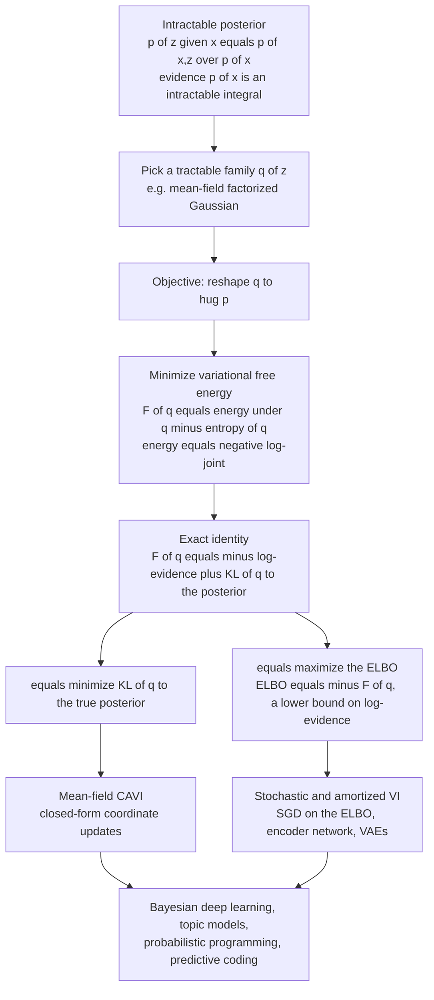

# 🌡️ Variational Inference as Free Energy Minimization

> [!abstract] TL;DR
> **Variational inference (VI)** turns intractable Bayesian inference into **optimization**: instead of computing a posterior $p(z\mid x)=p(x,z)/p(x)$ whose evidence $p(x)$ is an impossible integral, it picks a tractable distribution $q(z)$ from a chosen family and *reshapes* $q$ until it hugs the true posterior. Seen through statistical mechanics this is exactly **free-energy minimization**: the variational free energy $F[q]=\langle E\rangle_q - H[q]$ (energy under $q$ minus entropy of $q$, with energy $E(z)=-\log p(x,z)$) equals the **negative ELBO** and decomposes as $F[q]=-\log p(x) + \mathrm{KL}\big(q(z)\,\|\,p(z\mid x)\big)$. Because $\log p(x)$ is fixed, **minimizing free energy = minimizing KL to the posterior = maximizing the ELBO** (a lower bound on the log-evidence) — one triple-equivalent objective. Mean-field factorization gives tractable closed-form updates (at the price of *underestimating* variance, since reverse-KL is mode-seeking), and stochastic/amortized VI scales it to VAEs, Bayesian deep learning, topic models, and probabilistic programming — while the same objective underlies EM and the free-energy principle of the brain.

---

## Intuition

**Analogy — approximate the beach instead of counting the sand.** Computing an exact posterior is often like trying to count every grain of sand on a beach: the "true answer" is a sum over so many configurations that you could never finish. Bayesian inference hides that sum inside the **evidence** $p(x)=\int p(x,z)\,dz$ — a single normalizing integral that is almost always intractable. So we stop trying to *count*. Instead we bring a simple, manageable stand-in — a smooth tarp we can stretch and pin — and we **reshape the stand-in to hug the true landscape as closely as possible**. The impossible *integration* problem becomes a solvable *optimization* problem: "which settings of my simple distribution make it look most like the thing I cannot compute?"

Physicists have done exactly this for a century under a different name. A system at temperature $T$ does not visit every microstate to find equilibrium; it settles where the **free energy** $F=\langle E\rangle - T H$ is lowest, and you can *approximate* that intractable equilibrium by minimizing $F$ over a tractable family of trial distributions. **Variational inference and free-energy minimization are the same idea in two vocabularies.** The machine-learner's "approximate posterior $q$" is the physicist's "trial distribution"; the machine-learner's "maximize the ELBO" is the physicist's "minimize the free energy"; and the gap you can never fully close is, in both languages, a **KL divergence**. See the physics-first companion [[Free_Energy_Minimization_and_Variational_Principles]] for the equilibrium derivation of the very same bound.

---

## How It Works

### Core mechanics

**1. The problem: inference is an intractable integral.** Given a model $p(x,z)$ (observed $x$, latent $z$), Bayesian inference wants the posterior
$$p(z\mid x)=\frac{p(x,z)}{p(x)},\qquad p(x)=\int p(x,z)\,dz .$$
The denominator $p(x)$ — the **evidence** or, in physics language, the **partition function** — is a sum/integral over all latent configurations and is generally intractable (see [[Partition_Functions_and_Free_Energy_in_ML]] for the $Z\leftrightarrow$ evidence dictionary). Without it we cannot normalize, so we cannot compute the posterior directly.

**2. The move: replace integration with optimization.** Choose a tractable family $\mathcal{Q}$ (e.g. factorized Gaussians) and search for the member $q(z)\in\mathcal{Q}$ closest to the posterior. "Closest" here means smallest **reverse KL divergence** $\mathrm{KL}\big(q\,\|\,p(z\mid x)\big)$. Inference is now a search over a handful of variational parameters — fast, deterministic, and gradient-friendly.

**3. The statistical-mechanics reading: this is free-energy minimization.** Define the **energy** of a latent configuration as the negative log-joint, $E(z)=-\log p(x,z)$ (this is precisely the energy of an [[Energy_Based_Models|energy-based model]], with the posterior as its [[The_Boltzmann_Distribution_in_Learning|Boltzmann distribution]]). The **variational free energy** of a trial $q$ is
$$F[q]=\langle E\rangle_q - H[q]=\underbrace{-\,\mathbb{E}_q[\log p(x,z)]}_{\text{energy}} \;-\; \underbrace{\big(-\mathbb{E}_q[\log q(z)]\big)}_{\text{entropy}} = \mathbb{E}_q\!\left[\log\frac{q(z)}{p(x,z)}\right].$$
Minimizing $F[q]$ over $q$ approximates the true (Boltzmann) posterior — inference **as** free-energy minimization, at temperature $T=1$.

**4. The key identity — free energy, KL, and the ELBO are one thing.** Insert $p(x,z)=p(z\mid x)\,p(x)$ into $F[q]$:
$$\boxed{\,F[q]=-\log p(x)+\mathrm{KL}\big(q(z)\,\|\,p(z\mid x)\big)\,}$$
Since $\mathrm{KL}\ge 0$ (Gibbs' inequality, a consequence of [[Jensen_and_Inequalities|Jensen's inequality]]) and the log-evidence $\log p(x)$ does **not** depend on $q$:
$$\min_q F[q]\;\Longleftrightarrow\;\min_q \mathrm{KL}\big(q\,\|\,p(z\mid x)\big)\;\Longleftrightarrow\;\max_q \mathrm{ELBO}(q),\qquad \mathrm{ELBO}(q)\equiv -F[q].$$
So the **Evidence Lower BOund** is exactly the negative variational free energy, and
$$\log p(x)=\underbrace{\mathrm{ELBO}(q)}_{\text{maximize this}}+\underbrace{\mathrm{KL}\big(q\,\|\,p(z\mid x)\big)}_{\ge 0}\;\ge\;\mathrm{ELBO}(q).$$
Maximizing the ELBO tightens a **lower bound on the log-evidence** while simultaneously shrinking the KL to the posterior — one objective, three names. (This mirrors the physics identity $F[q]=T\,\mathrm{KL}(q\,\|\,p)-T\log Z$ derived in [[Free_Energy_Minimization_and_Variational_Principles]].)

**5. The ELBO's two readable forms.** Splitting the joint two ways gives the objectives used in practice:
$$\mathrm{ELBO}(q)=\mathbb{E}_q[\log p(x,z)]+H[q]=\underbrace{\mathbb{E}_q[\log p(x\mid z)]}_{\text{reconstruction / fit}}-\underbrace{\mathrm{KL}\big(q(z)\,\|\,p(z)\big)}_{\text{regularization / rate}}.$$
The first is the "energy plus entropy" (free-energy) form; the second is the "**reconstruction minus regularization**" form that is literally the [[Variational_Autoencoders|VAE]] loss.

**6. Mean-field variational inference (CAVI).** The classic tractable family restricts $q$ to a **factorized** product $q(z)=\prod_i q_i(z_i)$. Minimizing $F[q]$ one factor at a time yields **coordinate-ascent VI (CAVI)**: each optimal factor is $\log q_i^\star(z_i)=\mathbb{E}_{q_{-i}}[\log p(x,z)]+\text{const}$ — every unit sees only the **mean field** of the others. For conjugate exponential-family models these updates are closed-form. This is the same mean-field mathematics as the Ising model and the mean-field theory of deep nets (foreshadowing the sibling *Mean_Field_Theory_of_Neural_Networks*), and it is the deterministic cousin of [[Gibbs_Sampling_and_Conditional_Updates|Gibbs sampling]] — CAVI updates *distributions* where Gibbs updates *samples*.

**7. The KL asymmetry and its bias.** VI minimizes the **reverse** KL $\mathrm{KL}(q\,\|\,p)$, not the forward $\mathrm{KL}(p\,\|\,q)$. Reverse-KL is **mode-seeking / zero-forcing**: $q$ is penalized wherever it puts mass that $p$ does not, so it latches onto **one** mode and **underestimates variance**. Forward-KL (used by expectation propagation) is mass-covering; $\alpha$-divergences interpolate between them. This asymmetry — a *choice of which free energy you bound* — is why variational posteriors are systematically **overconfident**. See [[Relative_Entropy_and_Cross_Entropy]] for the KL machinery.

**8. Stochastic and amortized VI — scaling to modern ML.** Three innovations scaled VI: **stochastic VI** (Hoffman et al., 2013 — minibatch [[Gradient_Descent|SGD]] on the ELBO for huge datasets); **black-box VI** (Ranganath et al., 2014 — Monte-Carlo gradient estimates that work for *any* model); and **amortized VI / the VAE** (Kingma & Welling, 2014 — an inference *network* (encoder) predicts $q$'s parameters from each datapoint, with the reparameterization trick enabling low-variance gradients). The ELBO becomes the training loss of deep generative models.

### The physics-ML dictionary

| Statistical mechanics | Machine-learning inference |
|---|---|
| Variational free energy $F[q]$ | Negative ELBO, $-\mathrm{ELBO}(q)$ |
| Energy $E(z)=-\log p(x,z)$ | Negative log-joint |
| Entropy $H[q]$ | Entropy of the variational posterior $q$ |
| Boltzmann distribution $p\propto e^{-E}$ | True posterior $p(z\mid x)$ |
| Partition function $Z$ | Evidence $p(x)$ |
| True free energy $-\log Z$ (at $T=1$) | Negative log-evidence $-\log p(x)$ (fixed) |
| Temperature $T$ | $T=1$ in Bayes; a knob in $\beta$-VAE and tempering |
| Mean-field trial distribution | Mean-field variational family $\prod_i q_i$ |

### Flow / architecture



---

## Key Concepts

**Secondary (build the picture).**
- **Inference as optimization**: rather than *computing* an impossible posterior, *approximate* it with a simple distribution $q$ and reshape $q$ to fit — trading an intractable integral for a solvable optimization.
- **Free energy = fit minus spread**: the objective balances explaining the data (low energy) against staying humble (high entropy); the same $F=\langle E\rangle - H$ that physics minimizes at equilibrium.
- **ELBO as the score you push up**: maximizing the ELBO makes $q$ hug the true posterior; it is a lower bound you tighten, equal to the log-evidence only when $q$ is perfect.

**Undergraduate (make it precise).**
- **The evidence problem**: $p(x)=\int p(x,z)\,dz$ is intractable; VI sidesteps it entirely because $\log p(x)$ is constant in $q$.
- **The triple identity**: $F[q]=-\log p(x)+\mathrm{KL}(q\,\|\,p(z\mid x))=-\mathrm{ELBO}(q)$, so minimizing free energy, minimizing reverse-KL, and maximizing the ELBO are one optimization.
- **Two ELBO forms**: energy-plus-entropy $\mathbb{E}_q[\log p(x,z)]+H[q]$, and reconstruction-minus-regularization $\mathbb{E}_q[\log p(x\mid z)]-\mathrm{KL}(q(z)\,\|\,p(z))$.
- **Mean-field / CAVI**: factorize $q=\prod_i q_i$ and coordinate-ascend; each optimal factor is $\log q_i^\star=\mathbb{E}_{q_{-i}}[\log p(x,z)]+\text{const}$.

**Graduate (the machinery and its reach).**
- **Reverse-KL geometry**: $\mathrm{KL}(q\,\|\,p)$ is mode-seeking and variance-underestimating; contrast expectation propagation (forward-KL, mass-covering) and $\alpha$-divergence VI (a tunable interpolation).
- **Black-box and reparameterized VI**: score-function (REINFORCE) estimators for arbitrary models; the reparameterization trick $z=\mu+\sigma\odot\epsilon$ for low-variance pathwise gradients (the VAE engine).
- **EM as free-energy minimization (Neal & Hinton, 1998)**: the E-step maximizes $-F$ over $q$, the M-step over parameters — alternating minimization of the *same* free-energy functional.
- **VI vs MCMC**: VI is fast, deterministic, biased, and returns a bound; [[MCMC_Sampling_in_Machine_Learning|MCMC]] is asymptotically exact but slower — hybrids include VI-initialized MCMC and normalizing-flow VI for richer $q$.
- **The free-energy principle**: Friston casts perception and action as variational free-energy minimization; predictive coding implements VI in cortex (foreshadowing *The_Free_Energy_Principle_and_the_Bayesian_Brain*), and message-passing methods such as *Belief_Propagation_and_the_Cavity_Method* solve the same fixed-point equations on graphs.

---

## Python Demo

```python
# Variational inference AS free-energy minimization, from scratch (numpy + matplotlib).
#
# Target "posterior" p(z): a strongly CORRELATED 2D Gaussian standing in for an
# intractable posterior. We approximate it with a MEAN-FIELD (factorized, diagonal)
# Gaussian q(z) = q1(z1) * q2(z2) and MAXIMIZE the ELBO = -F[q] (equivalently minimize
# the variational free energy = minimize reverse-KL(q || p)) by gradient ascent.
#
# (a) The ELBO rises monotonically and q converges to hug the target's centre.
# (b) The MEAN-FIELD LIMITATION: a factorized q cannot capture correlation, so it
#     UNDERESTIMATES each marginal variance by exactly a factor (1 - rho^2) -- the
#     characteristic mode-seeking bias of reverse-KL variational inference. The ELBO
#     therefore stalls BELOW the log-evidence (here 0): the residual gap IS the KL
#     that the mean-field family can never close.
import numpy as np
import matplotlib.pyplot as plt

rng = np.random.default_rng(0)

# ----- Target: correlated 2D Gaussian posterior (treated as normalized: log Z = 0) -----
mu_p    = np.array([1.0, -1.0])
s1, s2  = 1.0, 1.5
rho     = 0.85                                   # strong correlation the mean-field q must miss
Sigma_p = np.array([[s1**2,       rho*s1*s2],
                    [rho*s1*s2,   s2**2   ]])
Lam_p   = np.linalg.inv(Sigma_p)                 # precision matrix (the "energy" curvature)
logdet_Sigma_p = np.linalg.slogdet(Sigma_p)[1]

def kl_meanfield(m, s2v):
    """Analytic KL(q || p) for q = N(m, diag(s2v)) vs p = N(mu_p, Sigma_p)."""
    diff = m - mu_p
    tr   = np.sum(np.diag(Lam_p) * s2v)          # tr(Lam_p @ diag(s2v))
    quad = diff @ Lam_p @ diff
    return 0.5 * (tr + quad - 2 + logdet_Sigma_p - np.sum(np.log(s2v)))

# ----- Gradient ascent on the ELBO (= -F[q]).  Parametrize s_i = exp(u_i) > 0. -----
m = np.array([-2.0, 2.0])                        # start far from the target
u = np.log(np.array([2.0, 2.0]))                 # start too wide
lr, iters = 0.02, 500
elbo_hist = []

for t in range(iters):
    s2v = np.exp(2 * u)
    elbo_hist.append(-kl_meanfield(m, s2v))      # ELBO = -F[q] = -KL (log-evidence = 0)
    # analytic gradients of KL (ascend ELBO => descend KL)
    grad_m = Lam_p @ (m - mu_p)                  # dKL/dm
    grad_u = s2v * np.diag(Lam_p) - 1.0          # dKL/du_i, using ds2/du = 2 s2
    m = m - lr * grad_m
    u = u - lr * grad_u

s2_fit  = np.exp(2 * u)
std_fit = np.sqrt(s2_fit)

# Optimal mean-field variances are 1 / diag(precision) -> underestimate the true marginals.
std_true      = np.sqrt(np.diag(Sigma_p))                 # true marginal std devs
std_mf_optimal = np.sqrt(1.0 / np.diag(Lam_p))            # = std_true * sqrt(1 - rho^2)

print(f"fitted mean      : {m.round(3)}   (target {mu_p})")
print(f"fitted marg. std : {std_fit.round(3)}")
print(f"true  marg. std  : {std_true.round(3)}")
print(f"underestimation  : q_std / true_std = {(std_fit/std_true).round(3)}  "
      f"(theory sqrt(1-rho^2) = {np.sqrt(1-rho**2):.3f})")
print(f"final ELBO       : {elbo_hist[-1]:.4f}  (log-evidence = 0; residual gap = KL "
      f"mean-field cannot close = {kl_meanfield(m, s2_fit):.4f})")

# ----- Plots -----
def gauss2d(grid_x, grid_y, mean, cov):
    pos = np.dstack((grid_x, grid_y))
    inv, det = np.linalg.inv(cov), np.linalg.det(cov)
    d = pos - mean
    quad = np.einsum('...i,ij,...j->...', d, inv, d)
    return np.exp(-0.5 * quad) / (2 * np.pi * np.sqrt(det))

fig, ax = plt.subplots(2, 2, figsize=(12, 9))

# (a1) ELBO increases and stalls below the log-evidence
ax[0, 0].plot(elbo_hist, color="black", lw=2)
ax[0, 0].axhline(0.0, ls="--", color="crimson", label="log-evidence (ELBO ceiling)")
ax[0, 0].set_title("(a) ELBO rises via gradient ascent = free energy falls")
ax[0, 0].set_xlabel("iteration"); ax[0, 0].set_ylabel("ELBO = -F[q]")
ax[0, 0].legend(fontsize=8)

# (a2/b) contours: correlated target vs axis-aligned mean-field q
gx, gy = np.meshgrid(np.linspace(-2, 4, 200), np.linspace(-5, 3, 200))
ax[0, 1].contour(gx, gy, gauss2d(gx, gy, mu_p, Sigma_p), levels=6, cmap="Reds")
ax[0, 1].contour(gx, gy, gauss2d(gx, gy, m, np.diag(s2_fit)), levels=6, cmap="Blues")
ax[0, 1].plot(*mu_p, "r*", ms=14, label="target p (correlated)")
ax[0, 1].plot(*m, "bx", ms=10, label="fitted q (mean-field)")
ax[0, 1].set_title("(b) Mean-field q is axis-aligned -> ignores correlation")
ax[0, 1].set_xlabel("z1"); ax[0, 1].set_ylabel("z2"); ax[0, 1].legend(fontsize=8)

# (b1) marginal for z1: q is too narrow
zz = np.linspace(-3, 5, 400)
ax[1, 0].plot(zz, np.exp(-0.5*((zz-mu_p[0])/std_true[0])**2)/(std_true[0]*np.sqrt(2*np.pi)),
              color="crimson", lw=2, label="true marginal p(z1)")
ax[1, 0].plot(zz, np.exp(-0.5*((zz-m[0])/std_fit[0])**2)/(std_fit[0]*np.sqrt(2*np.pi)),
              "--", color="navy", lw=2, label="fitted q(z1)")
ax[1, 0].set_title("(b) Reverse-KL is mode-seeking: q(z1) too narrow")
ax[1, 0].set_xlabel("z1"); ax[1, 0].set_ylabel("density"); ax[1, 0].legend(fontsize=8)

# (b2) variance underestimation bar chart
xb = np.arange(2)
ax[1, 1].bar(xb - 0.2, std_true, 0.4, label="true marginal std", color="crimson")
ax[1, 1].bar(xb + 0.2, std_fit, 0.4, label="mean-field q std", color="navy")
ax[1, 1].set_xticks(xb); ax[1, 1].set_xticklabels(["z1", "z2"])
ax[1, 1].set_title(f"(b) Underestimation factor ~ sqrt(1-rho^2) = {np.sqrt(1-rho**2):.2f}")
ax[1, 1].set_ylabel("standard deviation"); ax[1, 1].legend(fontsize=8)

plt.tight_layout()
plt.savefig("variational_inference_free_energy.png", dpi=110)
print("\nSaved: variational_inference_free_energy.png")
```

**What the output shows.** Panel (a) is variational inference doing its job: gradient ascent drives the **ELBO up monotonically** (equivalently, the variational free energy down) while $q$'s mean marches onto the target — *inference reduced to optimization*. But the ELBO **stalls strictly below** the log-evidence line: the residual gap is exactly the $\mathrm{KL}$ the mean-field family cannot close. Panel (b) exposes why. The fitted $q$ is **axis-aligned** and sits *inside* the tilted target contours; its marginals are visibly **too narrow**, and the bar chart confirms each standard deviation is shrunk by exactly $\sqrt{1-\rho^2}\approx 0.53$ — the analytic mean-field result and the signature **overconfidence** of reverse-KL variational inference.

---

## Real-World Applications

- **Variational autoencoders and deep generative models** — the flagship. A VAE trains by maximizing the ELBO per datapoint: an encoder amortizes $q(z\mid x)$, the decoder gives $p(x\mid z)$, and the loss is reconstruction minus $\mathrm{KL}(q\,\|\,p(z))$. See [[Variational_Autoencoders]] and [[VAE]]; the $\beta$-VAE variant is literally a temperature knob on the free-energy trade-off.
- **Bayesian deep learning / uncertainty** — mean-field VI over network weights (Bayes-by-Backprop) yields fast, if overconfident, posterior uncertainty for Bayesian neural networks where MCMC is hopeless.
- **Topic models** — variational LDA fits per-document topic mixtures by CAVI, the method that made topic modeling scale to web corpora.
- **Probabilistic programming** — automatic differentiation VI (ADVI in Stan, guides in Pyro/NumPyro) makes VI a one-line default inference engine for arbitrary models.
- **Inference at scale where MCMC is too slow** — recommender systems, genomics, and streaming settings use stochastic VI to fit models with millions of latent variables on minibatches.
- **Neuroscience** — predictive coding and active inference model perception as variational free-energy minimization, tying this objective to the [[The_Free_Energy_Principle_and_Active_Inference|free-energy principle]] of the brain.
- **Related generative training** — [[Diffusion_Models_as_Non_Equilibrium_Thermodynamics|diffusion models]] are also trained by a (variational) ELBO on the data likelihood, a close cousin of the VAE objective.

---

## Common Pitfalls

- **Reporting variational uncertainty as if it were exact.** Reverse-KL is mode-seeking; VI **underestimates variance** and can miss modes entirely (the demo's $\sqrt{1-\rho^2}$ shrinkage). Treat variational posterior variances as lower bounds on true uncertainty, not the truth.
- **Believing the minimizing $q$ equals the posterior.** The bound $F[q]\ge -\log p(x)$ holds for any $q$, but equality requires $p(z\mid x)\in\mathcal{Q}$. A mean-field family generally cannot represent a correlated posterior, so you get the *closest member*, and the ELBO stalls below the evidence — that gap is real, not a bug.
- **Sign and direction bookkeeping.** The ELBO is *minus* the free energy, and VI uses the *reverse* $\mathrm{KL}(q\,\|\,p)$ — swapping either turns a lower bound on $\log p(x)$ into nonsense or changes mode-seeking into mass-covering behavior.
- **CAVI local optima.** Coordinate-ascent on the mean-field free energy has multiple fixed points (symmetry breaking); naive initialization can land in a poor one. Use random restarts or an annealed (tempered) schedule.
- **High-variance black-box gradients.** Score-function (REINFORCE) ELBO estimators are unbiased but noisy; without control variates or the reparameterization trick, training is slow or unstable.
- **Posterior collapse in VAEs.** With a powerful decoder the model can ignore $z$ entirely, driving $\mathrm{KL}(q(z\mid x)\,\|\,p(z))\to 0$ — an energy-entropy imbalance in the free-energy objective, mitigated by KL annealing or a $\beta<1$ weight.

---

## Related Concepts

- [[Free_Energy_Minimization_and_Variational_Principles]] — the physics-first derivation of the same variational bound $F[q]=T\,\mathrm{KL}(q\,\|\,p)-T\log Z$; the equilibrium view this note reads as inference.
- [[Variational_Inference_the_ELBO_and_VAEs]] — the information-theory companion; identical objective, presented from the ELBO / coding side rather than the free-energy side.
- [[Partition_Functions_and_Free_Energy_in_ML]] — the evidence $p(x)$ as a partition function $Z$; why $-\log Z$ is the intractable constant VI never needs to compute.
- [[The_Boltzmann_Distribution_in_Learning]] — the target posterior as a Boltzmann distribution with energy $E(z)=-\log p(x,z)$.
- [[Relative_Entropy_and_Cross_Entropy]] — the KL divergence whose non-negativity *is* the variational bound and whose asymmetry causes mode-seeking.
- [[Maximum_Entropy_and_Exponential_Families]] — conjugate exponential-family structure that makes mean-field CAVI updates closed-form; the dual max-entropy view.
- [[Energy_Based_Models]] — negative log-joint as energy; VI approximates the intractable normalizer of an EBM posterior.
- [[Boltzmann_Machines_and_RBMs]] — mean-field inference and the free-energy functional in an undirected energy model.
- [[MCMC_Sampling_in_Machine_Learning]] — the asymptotically exact but slower alternative; the accuracy-vs-speed trade-off against VI.
- [[Gibbs_Sampling_and_Conditional_Updates]] — the sampling analogue of CAVI; conditional updates of samples vs conditional updates of distributions.
- [[Variational_Autoencoders]] — amortized VI: an encoder network predicts $q$, trained by maximizing the ELBO.
- [[VAE]] — the generative-modeling view of the same reconstruction-minus-KL loss.
- [[The_Free_Energy_Principle_and_Active_Inference]] — Friston's extrapolation of variational free-energy minimization to perception, action, and the brain.
- [[Bayesian_Statistics]] — the posterior $p(z\mid x)$ that VI approximates and the evidence it sidesteps.
- [[Gradient_Descent]] — how the ELBO is maximized in stochastic and amortized VI.
- [[Jensen_and_Inequalities]] — Jensen's inequality underlies both $\mathrm{KL}\ge 0$ and the direct ELBO derivation.
- [[Diffusion_Models_as_Non_Equilibrium_Thermodynamics]] — another ELBO-trained generative model; a non-equilibrium cousin of the VAE objective.

---

## Review Questions

1. **(Secondary)** Why can we not usually compute a Bayesian posterior directly, and what does variational inference do instead? Explain, using the beach-and-sand analogy, how an impossible *integration* becomes a solvable *optimization*.
2. **(Undergraduate)** Starting from $F[q]=\mathbb{E}_q[\log(q(z)/p(x,z))]$, derive the identity $F[q]=-\log p(x)+\mathrm{KL}(q\,\|\,p(z\mid x))$. Use it to explain precisely why "minimizing variational free energy," "minimizing $\mathrm{KL}(q\,\|\,p(z\mid x))$," and "maximizing the ELBO" are three names for one optimization, and where the intractable evidence $\log p(x)$ goes.
3. **(Undergraduate → Graduate)** Write the ELBO in its reconstruction-minus-regularization form and map each term to a VAE component. In the physics dictionary, which term is the energy and which is the entropy, and what plays the role of temperature in a $\beta$-VAE?
4. **(Graduate)** You approximate a strongly correlated 2D Gaussian posterior with a mean-field Gaussian $q$. Predict the fitted marginal variances relative to the truth and prove the $\sqrt{1-\rho^2}$ shrinkage. Explain *why* the direction of the KL divergence — a choice of which free energy you bound — produces this overconfidence, and how expectation propagation (forward-KL) would differ.
5. **(Graduate, scenario)** For a model with tens of millions of latent variables and a hard real-time budget, argue when you would choose stochastic/amortized VI over MCMC, what accuracy you sacrifice, and how a hybrid (e.g. normalizing-flow VI or VI-initialized MCMC) could recover some of it.

---

## Sources

- Blei, D. M., Kucukelbir, A., & McAuliffe, J. D. (2017). *Variational Inference: A Review for Statisticians.* Journal of the American Statistical Association, 112(518), 859-877. [arXiv:1601.00670](https://arxiv.org/abs/1601.00670)
- Kingma, D. P., & Welling, M. (2014). *Auto-Encoding Variational Bayes.* ICLR. [arXiv:1312.6114](https://arxiv.org/abs/1312.6114)
- Hoffman, M. D., Blei, D. M., Wang, C., & Paisley, J. (2013). *Stochastic Variational Inference.* Journal of Machine Learning Research, 14, 1303-1347.
- Neal, R. M., & Hinton, G. E. (1998). *A View of the EM Algorithm that Justifies Incremental, Sparse, and Other Variants.* In *Learning in Graphical Models* (pp. 355-368). Springer.
- Bishop, C. M. (2006). *Pattern Recognition and Machine Learning*, Ch. 10 (Approximate Inference). Springer. — mean-field VI and the correlated-Gaussian variance underestimation.
- MacKay, D. J. C. (2003). *Information Theory, Inference, and Learning Algorithms*, Ch. 33 (Variational Methods). Cambridge University Press. [Free online](https://www.inference.org.uk/mackay/itila/)

---

#statistical-mechanics #machine-learning #variational-inference #free-energy #ELBO
