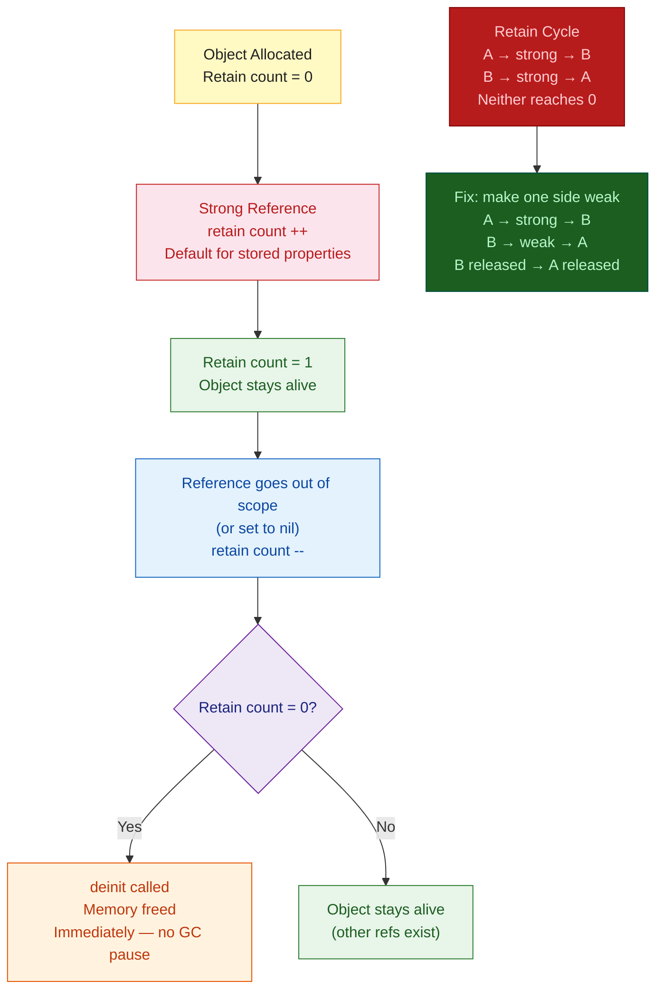

# Swift ARC — Automatic Reference Counting

> [!abstract] TL;DR
> ARC (Automatic Reference Counting) is Swift's memory management model. The compiler inserts `retain` (increment count) and `release` (decrement count) calls automatically — no garbage collector, no stop-the-world pauses. An object is freed the instant its reference count drops to zero. The central pitfall is **retain cycles**: two objects each holding a `strong` reference to the other, preventing either from ever reaching count zero. Fix with `weak` (optional, zeroed on dealloc) or `unowned` (non-optional, crashes if accessed after dealloc) references. Closures capture `self` strongly by default, requiring `[weak self]` capture lists in delegate patterns.

---

## Intuition

**Analogy:** Imagine every object in memory is a whiteboard covered in sticky notes — one sticky note per reference that points to it. ARC is a librarian who counts the sticky notes. When the last sticky note is removed (reference count = 0), the librarian erases the whiteboard immediately. A **retain cycle** is two whiteboards that each have a sticky note pointing to each other — neither whiteboard's sticky count ever reaches zero, so neither gets erased, even if no one else in the room cares about them. `weak` references use pencil instead of sticky notes — they don't count.

---

## How It Works



---

## Reference Counting in Practice

```swift
class Dog {
    let name: String
    init(name: String) {
        self.name = name
        print("🐶 \(name) allocated")    // retain count hits 1
    }
    deinit {
        print("💀 \(name) deallocated")  // called exactly when count hits 0
    }
}

// Demonstrate reference counting
var dog1: Dog? = Dog(name: "Rex")    // count = 1 → "🐶 Rex allocated"
var dog2 = dog1                       // count = 2 (both point to same object)
dog1 = nil                            // count = 1 (dog2 still holds reference)
dog2 = nil                            // count = 0 → "💀 Rex deallocated"

// Value types (struct/enum) do NOT use ARC — they are copied
struct Point { var x: Int; var y: Int }
var p1 = Point(x: 0, y: 0)
var p2 = p1                  // full copy — independent values, no reference counting
```

---

## Retain Cycles — The Central Pitfall

### Class-to-Class Cycle

```swift
class Owner {
    let name: String
    var pet: Pet?                  // strong reference to Pet

    init(name: String) { self.name = name }
    deinit { print("\(name) Owner deallocated") }
}

class Pet {
    let name: String
    var owner: Owner?              // strong reference to Owner — CYCLE!

    init(name: String) { self.name = name }
    deinit { print("\(name) Pet deallocated") }
}

// Create cycle
var owner: Owner? = Owner(name: "Alice")
var pet:   Pet?   = Pet(name: "Whiskers")
owner!.pet   = pet           // Owner → strong → Pet
pet!.owner   = owner         // Pet   → strong → Owner (CYCLE)

owner = nil                  // Owner retain count: still 1 (Pet holds it)
pet   = nil                  // Pet retain count: still 1 (Owner holds it)
// NEITHER deinit is called — memory leak!
```

**Fix with `weak`:**

```swift
class Pet {
    let name: String
    weak var owner: Owner?         // weak: doesn't increment retain count
                                   // automatically set to nil when Owner deallocates

    init(name: String) { self.name = name }
    deinit { print("\(name) Pet deallocated") }
}

// Now:
owner = nil   // Owner count: 1→0 → deallocated → "Alice Owner deallocated"
              // weak owner in Pet is zeroed automatically
pet   = nil   // Pet count: 1→0 → deallocated → "Whiskers Pet deallocated"
```

---

## weak vs unowned

```swift
class BankAccount {
    let owner: Customer          // owner always outlives account — safe for unowned
    var balance: Double

    init(owner: Customer, balance: Double) {
        self.owner   = owner
        self.balance = balance
    }
}

class Customer {
    let name: String
    var account: BankAccount?    // may be nil

    init(name: String) { self.name = name }
}

// unowned: non-optional, assumes referenced object outlives self
// Use when you KNOW the referenced object is never nil when accessed
class CreditCard {
    let number: String
    unowned let customer: Customer  // card ALWAYS has a customer; customer outlives card

    init(number: String, customer: Customer) {
        self.number   = number
        self.customer = customer
    }
}

// weak: optional, automatically set to nil on dealloc
// Use when referenced object may be nil during self's lifetime
class NetworkTask {
    weak var delegate: NetworkDelegate?  // delegate may be deallocated before task finishes

    func complete(data: Data) {
        delegate?.task(self, didReceive: data)  // safe: optional chaining
    }
}
```

| | `weak` | `unowned` |
|---|---|---|
| Type | Optional (`T?`) | Non-optional (`T`) |
| Nil on dealloc | Automatically zeroed | NOT zeroed — dangling pointer |
| Access after dealloc | Safe (returns nil) | Crash |
| Use when | Delegate may be nil | Object always outlives self |

---

## Capture Lists in Closures

Closures capture `self` **strongly** by default — the most common source of retain cycles in Swift:

```swift
class ViewController {
    var name = "Main"
    var onComplete: (() -> Void)?

    func setup() {
        // BAD — strong capture of self: ViewController → closure → ViewController (cycle)
        onComplete = {
            print(self.name)  // self is captured strongly
        }
    }

    func setupFixed() {
        // GOOD — weak capture breaks the cycle
        onComplete = { [weak self] in
            guard let self else { return }  // re-bind as non-optional
            print(self.name)
        }
    }

    // Async context — [weak self] still required
    func loadData() {
        Task { [weak self] in
            guard let self else { return }
            let data = try await fetchData()
            self.display(data)
        }
    }
}
```

**Capture list rules of thumb:**
- In closures stored as properties → always `[weak self]`
- In `Task { }` bodies → `[weak self]` if the Task may outlive `self`
- In trailing closures on value-returning functions → usually fine (closure not stored)
- In `DispatchQueue.async { }` → `[weak self]` unless you need self to stay alive

---

## Common Retain Cycle Patterns

```swift
// 1. Timer — Timer holds its target strongly
class MyVC: UIViewController {
    var timer: Timer?

    override func viewDidLoad() {
        // BAD: Timer → strong → MyVC; MyVC → strong → Timer
        timer = Timer.scheduledTimer(withTimeInterval: 1.0, repeats: true) { [weak self] _ in
            self?.updateUI()   // [weak self] breaks the cycle
        }
    }

    deinit { timer?.invalidate() }
}

// 2. Notification center
class Store {
    init() {
        // BAD without [weak self]
        NotificationCenter.default.addObserver(forName: .NSManagedObjectContextDidSave,
                                                object: nil,
                                                queue: .main) { [weak self] _ in
            self?.refresh()
        }
    }
}

// 3. Delegate pattern — standard fix
protocol DataSourceDelegate: AnyObject {}  // AnyObject restricts to class types

class DataSource {
    weak var delegate: DataSourceDelegate?  // weak prevents cycle
}
```

---

## Memory Debugging with Instruments

```swift
// In code — check if deinit is called (debug aid)
deinit {
    print("\(type(of: self)) deallocated")
}

// Xcode Instruments — Leaks tool
// Product → Profile (Cmd+I) → Leaks instrument
// Shows objects that were allocated and never deallocated
// Click on a leak to see the reference graph

// Xcode Memory Graph Debugger (easier)
// Debug → Memory Graph Debugger (Cmd+Ctrl+Shift+B) while app runs
// Shows live object graph — look for cycles with purple exclamation marks

// Debug Memory Graph from command line
leaks <pid>
```

---

## ARC in Concurrency (Swift 6)

```swift
// Actors manage their own isolation — ARC still applies
actor Cache {
    private var store: [String: Data] = [:]

    func get(key: String) -> Data? { store[key] }
    func set(key: String, value: Data) { store[key] = value }

    // Closures inside actors are isolated — no weak self needed for actor's own state
    func update(key: String) async {
        let data = await fetchRemote(key: key)
        store[key] = data   // safe: actor-isolated, no weak needed
    }
}

// Sendable structs don't have retain cycles — they're copied
// @Sendable closures passed to actors cannot capture non-Sendable reference types
```

---

## Common Pitfalls

- **`unowned` when you should use `weak`** — if the referenced object is deallocated before the closure runs, `unowned` causes a crash. Use `weak` when in doubt — the optional unwrap is safer than a crash.
- **`[weak self]` not enough without `guard let`** — `self?.method()` silently does nothing if `self` is nil. If you need multiple accesses, use `guard let self` to rebind.
- **Capturing in `escaping` vs `non-escaping`** — `@autoclosure` and non-`@escaping` closures don't create retain cycles because they don't outlive the function call. Only `@escaping` closures (stored or async) need capture lists.
- **Reference cycles with `[unowned self]` in async Tasks** — if a `Task` outlives the object, `unowned self` crashes when the task resumes after deallocation. Always prefer `[weak self]` in `Task` bodies.
- **Not invalidating Timer** — a `Timer` with a target holds the target alive. Call `timer.invalidate()` in `deinit` (or better, use the block-based Timer API with `[weak self]`).

---

## Review Questions

1. What is the difference between ARC and a garbage collector? Give one practical consequence for app responsiveness.
2. You have `class A { var b: B? }` and `class B { var a: A? }`. Both are instantiated and connected. Why are neither ever freed, and how do you fix it?
3. When should you use `unowned` instead of `weak`, and what can go wrong if you use `unowned` incorrectly?
4. Why do closures stored as properties require `[weak self]` capture lists, while closures passed as immediate arguments usually do not?

---

#Swift #ARC #MemoryManagement #RetainCycle #WeakReference #Instruments
