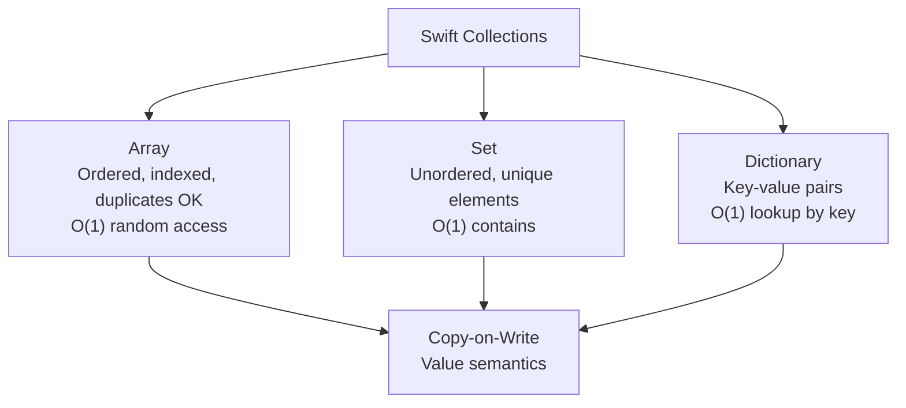

# Swift Collections

> [!abstract] TL;DR
> Swift's three collection types — `Array`, `Set`, and `Dictionary` — are all **value types** with copy-on-write (COW) semantics: assignment copies the logical value, but the underlying buffer is shared until mutation. This makes them safe to pass around without hidden aliasing. All three are generic and support the full functional toolkit: `map`, `filter`, `reduce`, `compactMap`, `flatMap`.

---

## Array

### Basic Operations

```swift
var fruits: [String] = ["apple", "banana", "cherry"]
// or: var fruits = ["apple", "banana", "cherry"]

fruits.append("date")                    // ["apple", "banana", "cherry", "date"]
fruits.insert("avocado", at: 1)         // insert at index
fruits.remove(at: 0)                     // removes "apple"
fruits.removeLast()                      // removes "date"
print(fruits.count, fruits.isEmpty)      // 2  false

// Safe subscripting with indices.contains
let idx = 5
if fruits.indices.contains(idx) {
    print(fruits[idx])
}

// Slices — O(1), share buffer with original
let slice = fruits[0..<2]               // ArraySlice<String>
```

### Functional Operations

```swift
let numbers = [1, 2, 3, 4, 5, 6, 7, 8, 9, 10]

// map — transform each element
let doubled = numbers.map { $0 * 2 }           // [2, 4, 6, ..., 20]

// filter — keep elements matching predicate
let evens = numbers.filter { $0 % 2 == 0 }     // [2, 4, 6, 8, 10]

// reduce — fold to single value
let sum = numbers.reduce(0, +)                  // 55
let product = numbers.reduce(1) { $0 * $1 }    // 3628800

// compactMap — map + unwrap optionals (removes nils)
let strings = ["1", "two", "3", "four", "5"]
let ints = strings.compactMap { Int($0) }       // [1, 3, 5]

// flatMap — flatten one level of nesting
let nested = [[1, 2], [3, 4], [5, 6]]
let flat = nested.flatMap { $0 }                // [1, 2, 3, 4, 5, 6]

// Chaining
let result = numbers
    .filter { $0 % 2 == 0 }
    .map { $0 * $0 }
    .reduce(0, +)    // 4+16+36+64+100 = 220

// sorted and sort
let sorted = fruits.sorted()                    // new array
var mutable = [3, 1, 4, 1, 5]
mutable.sort()                                  // in-place

// contains
numbers.contains(5)                             // true
numbers.contains(where: { $0 > 8 })           // true
```

---

## Set

Unordered collection of **unique** elements. Elements must conform to `Hashable`.

```swift
var set1: Set<Int> = [1, 2, 3, 4, 5]
var set2: Set<Int> = [3, 4, 5, 6, 7]

set1.insert(6)
set1.remove(1)
set1.contains(3)       // true — O(1) lookup

// Set operations
set1.union(set2)             // {2, 3, 4, 5, 6, 7}
set1.intersection(set2)      // {3, 4, 5, 6}
set1.subtracting(set2)       // {2}
set1.symmetricDifference(set2) // elements in one but not both

// Membership testing — much faster than Array.contains
let allowedIDs: Set<String> = ["admin", "moderator", "user"]
allowedIDs.contains("admin")   // O(1) vs O(n) for Array
```

---

## Dictionary

Key-value pairs. Keys must be `Hashable`. Subscript access returns `Optional`.

```swift
var scores: [String: Int] = ["Alice": 95, "Bob": 82]

// Reading — returns Optional
let aliceScore = scores["Alice"]         // Int? = 95
let carolScore = scores["Carol"]         // nil

// Default value subscript — avoids optional
let carolSafe = scores["Carol", default: 0]    // 0 (no crash)

// Inserting and updating
scores["Carol"] = 88
scores.updateValue(90, forKey: "Alice")  // returns old value: Optional(95)

// Removing
scores["Bob"] = nil                      // removes Bob
scores.removeValue(forKey: "Carol")      // returns removed value

// Iteration
for (name, score) in scores {
    print("\(name): \(score)")
}

// Functional on dictionary values
let passingScores = scores.filter { $0.value >= 90 }
let doubled = scores.mapValues { $0 * 2 }
```

---

## Value Semantics and Copy-on-Write

```swift
var a = [1, 2, 3]
var b = a           // logically copies, but shares buffer

b.append(4)         // COW: buffer is copied NOW for `b`
                    // `a` is still [1, 2, 3]
print(a)            // [1, 2, 3]
print(b)            // [1, 2, 3, 4]
```

COW means: **zero cost until mutation**. Passing large arrays to functions is O(1) unless the function mutates.

---

## Collection Cheat Sheet



| Operation | Array | Set | Dictionary |
|---|---|---|---|
| `contains` | O(n) | O(1) | O(1) by key |
| `append`/`insert` | O(1) amortized | O(1) | O(1) |
| `remove` | O(n) | O(1) | O(1) |
| Ordered | Yes | No | No (insertion order in Swift 5.7+) |

---

## Common Pitfalls

1. **Out-of-bounds crash** — `array[5]` on a 3-element array crashes at runtime. Always check `indices.contains(idx)` or use `first`/`last`.
2. **Dictionary subscript returns Optional** — `dict["key"]` is `T?`; forgetting to unwrap causes compile error or runtime nil propagation.
3. **Mutating a collection while iterating** — modifying an array inside a `for-in` loop is undefined behavior; iterate over a copy or use `indices`.
4. **`compactMap` vs `flatMap` confusion** — `compactMap` removes nils from a `T?` sequence; `flatMap` flattens a `[[T]]` sequence. On `Optional`, `flatMap` chains optional-returning transforms.
5. **Set hashing changes** — if a custom `Hashable` type's hash value changes after insertion (mutable fields), the set is corrupted. Keep hashed fields immutable (`let`).

---

## Review Questions

1. **What is copy-on-write and why does it make Swift value-type collections efficient?**
   *Answer: COW delays the actual copy until mutation. Multiple variables can share the same underlying buffer without cost until one of them mutates — at that point only the mutating copy creates a new buffer. This makes passing large arrays as function arguments O(1).*

2. **You need to check frequently whether a user ID is in a set of 10,000 allowed IDs. Should you use `Array` or `Set`?**
   *Answer: `Set` — `contains` is O(1) hashing vs O(n) linear scan for `Array`.*

3. **What does `compactMap` do that plain `map` does not?**
   *Answer: `compactMap` both transforms and filters — it applies a transform returning `T?` and discards all `nil` results, returning `[T]`. `map` preserves nils as `Optional<T>` in the output.*

#Swift #SwiftUI #Collections #Array #Dictionary #Set
