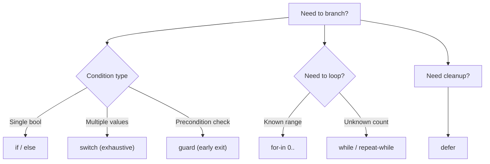

# Swift Control Flow

> [!abstract] TL;DR
> Swift's control flow is exhaustive and expression-rich. The `switch` statement is the standout: it has no implicit fallthrough, supports value binding, `where` clauses, and tuple matching. `guard` enables clean early-exit patterns. Range operators (`..<`, `...`) make loop bounds expressive. `defer` runs cleanup code regardless of how scope exits.

---

## `if` / `else`

Standard — but in Swift 5.9, `if` and `switch` are **expressions**:

```swift
let temperature = 22

// Statement form
if temperature > 30 {
    print("Hot")
} else if temperature > 15 {
    print("Comfortable")
} else {
    print("Cold")
}

// Expression form (Swift 5.9+) — can be assigned directly
let description = if temperature > 30 { "Hot" }
                  else if temperature > 15 { "Comfortable" }
                  else { "Cold" }
```

---

## `switch` — Swift's Most Powerful Statement

Swift `switch` is **exhaustive** (must cover all cases or include `default`) and has **no implicit fallthrough** between cases.

```swift
let direction = "north"

switch direction {
case "north":
    print("Go north")
case "south", "east", "west":   // multiple patterns per case
    print("Go elsewhere")
default:
    print("Unknown direction")
}
```

**Value binding** — capture matched values:

```swift
let point = (2, -1)

switch point {
case (0, 0):
    print("Origin")
case (let x, 0):
    print("On x-axis at \(x)")
case (0, let y):
    print("On y-axis at \(y)")
case (let x, let y) where x == y:
    print("On diagonal: (\(x), \(y))")
case (let x, let y):
    print("Point (\(x), \(y))")
}
```

**`where` clause** — adds a condition to a case:

```swift
let score = 88

switch score {
case 90...100:
    print("A")
case 80..<90 where score % 2 == 0:
    print("B (even)")
case 80..<90:
    print("B")
default:
    print("Below B")
}
```

**Explicit `fallthrough`** — opt-in when needed:

```swift
switch value {
case 1:
    print("One")
    fallthrough          // explicitly falls to next case
case 2:
    print("One or Two")
default:
    break
}
```

---

## Ranges and `for-in`

```swift
// Half-open range: 0, 1, 2, ..., 9
for i in 0..<10 {
    print(i)
}

// Closed range: 1, 2, 3, 4, 5
for i in 1...5 {
    print(i)
}

// Stride — non-unit steps
for i in stride(from: 0, to: 20, by: 5) { // 0, 5, 10, 15
    print(i)
}

// Ignore loop variable
for _ in 0..<3 {
    print("repeat")
}

// Enumerate for index + value
let fruits = ["apple", "banana", "cherry"]
for (index, fruit) in fruits.enumerated() {
    print("\(index): \(fruit)")
}
```

---

## `while` and `repeat-while`

```swift
var n = 1
while n < 100 {
    n *= 2
}
// n = 128

// repeat-while: body executes at least once (like do-while in C)
repeat {
    n /= 2
} while n > 10
```

---

## `guard` — Early Exit Pattern

`guard` enforces preconditions. The `else` branch **must** exit scope (`return`, `throw`, `break`, `continue`, or `fatalError`). Bound variables are available after the guard:

```swift
func processUser(id: String?, age: Int?) {
    guard let id = id, !id.isEmpty else {
        print("Invalid ID")
        return
    }
    guard let age = age, age >= 18 else {
        print("Must be 18+")
        return
    }
    // id and age are both non-optional here
    print("Processing user \(id), age \(age)")
}
```

**Multi-binding** — bind multiple optionals in one `guard let`:

```swift
guard let x = optX, let y = optY, x > 0 else { return }
```

---

## Labeled Statements

Labels allow breaking or continuing outer loops from nested code:

```swift
outerLoop: for i in 0..<5 {
    for j in 0..<5 {
        if i == 2 && j == 3 {
            break outerLoop      // exits both loops
        }
        print("(\(i), \(j))")
    }
}
```

---

## `defer` — Cleanup on Scope Exit

`defer` runs its block when the **current scope exits**, regardless of how (normal return, early return, throw):

```swift
func readFile(path: String) throws -> String {
    let handle = try FileHandle(forReadingAtPath: path)!
    defer {
        handle.closeFile()    // guaranteed to run even if we throw below
    }
    let data = handle.readDataToEndOfFile()
    guard let content = String(data: data, encoding: .utf8) else {
        throw DecodingError.invalidData   // defer still runs
    }
    return content
}
```

Multiple `defer` blocks execute in **LIFO** order (last-in, first-out).

---

## Control Flow Decision Map



---

## Common Pitfalls

1. **Forgetting `default` in switch** — Swift requires exhaustiveness; missing cases are compile errors for enums, required `default` for open types.
2. **`guard` without exit** — the `else` block must transfer control; omitting `return`/`throw` is a compile error.
3. **Off-by-one with ranges** — `0..<count` excludes `count`; `0...count` includes it. Mixing them up is a common index error.
4. **`defer` in loops** — each loop iteration registers a new `defer`; they fire at the end of each iteration's scope, not the loop's scope.
5. **`fallthrough` skips pattern matching** — `fallthrough` does not re-evaluate the next case's pattern; it unconditionally executes the next case body.

---

## Review Questions

1. **What are three ways Swift's `switch` is more powerful than C/Java's `switch`?**
   *Answer: No implicit fallthrough (cases don't bleed through); value binding (`case let x where x > 0`); tuple pattern matching covering multiple dimensions in one statement.*

2. **You have deeply nested optional unwrapping. How does `guard let` clean this up?**
   *Answer: `guard let` unwraps all required values at the top of the function in one multi-binding statement, exits early if any are nil, and leaves the rest of the function unindented and working with non-optional values.*

3. **In what order do multiple `defer` blocks execute, and why?**
   *Answer: LIFO — last registered defer runs first. This mirrors a stack-based cleanup model (like C++ destructors), ensuring resources opened last are closed first.*

#Swift #SwiftUI #ControlFlow #Switch #Guard
