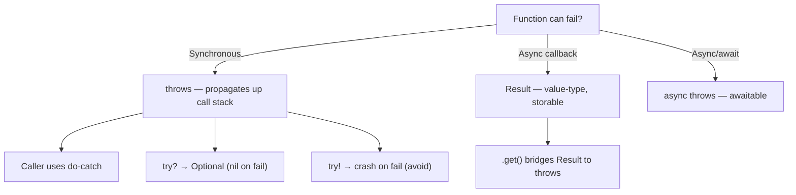

# Swift Error Handling

> [!abstract] TL;DR
> Swift's error handling is throw-based and type-safe. Functions declare `throws` in their signature; callers must use `try` at every call site — making error propagation explicit and visible. `Result<Success, Failure>` is the value-type alternative for async/deferred contexts. Swift 6 adds **typed throws** so you know the exact error type at compile time. `defer` ensures cleanup regardless of how a function exits.

---

## The `Error` Protocol

Any type can represent an error by conforming to `Error`:

```swift
enum NetworkError: Error {
    case invalidURL
    case serverError(statusCode: Int)
    case decodingFailed(underlying: Error)
    case timeout
}

enum ValidationError: Error, LocalizedError {
    case emptyField(name: String)
    case outOfRange(value: Int, min: Int, max: Int)

    var errorDescription: String? {
        switch self {
        case .emptyField(let name): return "\(name) cannot be empty"
        case .outOfRange(let v, let mn, let mx): return "\(v) must be between \(mn) and \(mx)"
        }
    }
}
```

---

## `throw`, `throws`, `try`

```swift
func fetchUser(id: Int) throws -> User {
    guard id > 0 else {
        throw ValidationError.outOfRange(value: id, min: 1, max: Int.max)
    }
    guard let url = URL(string: "https://api.example.com/users/\(id)") else {
        throw NetworkError.invalidURL
    }
    // ... network call ...
    return user
}
```

**Calling a throwing function**:

```swift
// do-catch — handle the error here
do {
    let user = try fetchUser(id: 42)
    print("Got user: \(user.name)")
} catch ValidationError.outOfRange(let v, _, _) {
    print("Bad ID: \(v)")
} catch NetworkError.serverError(let code) {
    print("Server returned \(code)")
} catch {
    // catch-all; `error` is the thrown value
    print("Unexpected: \(error)")
}

// try? — converts to Optional (nil on failure)
let user = try? fetchUser(id: -1)   // User? = nil

// try! — crashes on failure (use only when failure is truly impossible)
let config = try! loadBundledConfig()
```

---

## Propagating vs Handling

A `throws` function can **propagate** errors upward by not catching:

```swift
func processOrder(userID: Int) throws {
    let user = try fetchUser(id: userID)      // propagates if throws
    let orders = try loadOrders(for: user)    // propagates
    try submitOrders(orders)                  // propagates
}
```

The call chain: `processOrder` → `fetchUser` → network → error bubbles up to whoever calls `processOrder`. The compiler enforces that every `throws` site is either caught or re-propagated.

---

## `Result<Success, Failure>`

`Result` is an enum that wraps either a success value or an error — ideal for callbacks and storing outcomes:

```swift
enum Result<Success, Failure: Error> {
    case success(Success)
    case failure(Failure)
}

func parseJSON(_ data: Data) -> Result<User, NetworkError> {
    do {
        let user = try JSONDecoder().decode(User.self, from: data)
        return .success(user)
    } catch {
        return .failure(.decodingFailed(underlying: error))
    }
}

// Using Result
switch parseJSON(data) {
case .success(let user):
    print("Parsed: \(user.name)")
case .failure(let error):
    print("Failed: \(error)")
}

// Result → throwing
let user = try parseJSON(data).get()   // throws on failure
```

---

## Typed Throws (Swift 6)

Before Swift 6, `throws` was untyped — callers received `any Error`. Swift 6 adds `throws(SpecificError)`:

```swift
// Swift 6 typed throws
func loadConfig() throws(ConfigError) -> Config {
    // can only throw ConfigError, not any arbitrary Error
}

// Caller knows the exact type — no generic catch needed
do {
    let config = try loadConfig()
} catch {
    // `error` is inferred as ConfigError — full switch is exhaustive
    switch error {
    case .fileMissing: ...
    case .malformed: ...
    }
}
```

---

## `defer` for Cleanup

`defer` blocks run when the current scope exits — normal return, early return, or throw:

```swift
func withTemporaryFile(body: (URL) throws -> Void) throws {
    let tempURL = FileManager.default.temporaryDirectory.appendingPathComponent(UUID().uuidString)
    FileManager.default.createFile(atPath: tempURL.path, contents: nil)

    defer {
        try? FileManager.default.removeItem(at: tempURL)   // always runs
    }

    try body(tempURL)   // even if this throws, defer runs
}
```

**LIFO order** for multiple defers:

```swift
defer { print("3") }
defer { print("2") }
defer { print("1") }
// Prints: 1, 2, 3 on scope exit
```

---

## Error Handling Decision Flow



---

## Common Pitfalls

1. **`try!` in production code** — this is an assertion that error is impossible; if wrong, it crashes with no recovery. Limit to test/example code.
2. **Swallowing errors with `try?`** — silently discards error information. Log or report before discarding.
3. **`defer` with `try`** — code inside `defer` can throw, but the error is silently discarded (cannot propagate). Use `try?` inside `defer`.
4. **Over-generalizing error types** — `throws` without typed throws means callers handle `any Error` weakly. Use domain-specific enums for structured error handling.
5. **`catch` ordering** — Swift matches catches top-to-bottom; a catch-all `catch { }` before specific catches makes those specific catches unreachable.

---

## Review Questions

1. **What is the difference between `try`, `try?`, and `try!`? When is each appropriate?**
   *Answer: `try` — must be inside `do-catch` or in a `throws` function (propagates); `try?` — converts throw to nil (use when failure is expected and you don't need the error); `try!` — crashes on throw (use only when failure is provably impossible, e.g., well-known constant data).*

2. **How does `Result<Success, Failure>` complement `throws`? When is `Result` preferable?**
   *Answer: `Result` is a value — it can be stored in a property, returned from a non-throwing function, or passed in a callback. `throws` requires `try` at every call site and only works synchronously or with `async throws`. Use `Result` for completion handlers, stored outcomes, or when composing results without calling code.*

3. **What does typed throws in Swift 6 change for callers?**
   *Answer: The catch clause's `error` is inferred as the declared type rather than `any Error`. A `switch` over the specific enum is exhaustive — the compiler ensures all cases are covered, preventing silent handling gaps.*

#Swift #SwiftUI #ErrorHandling #Result #throws
