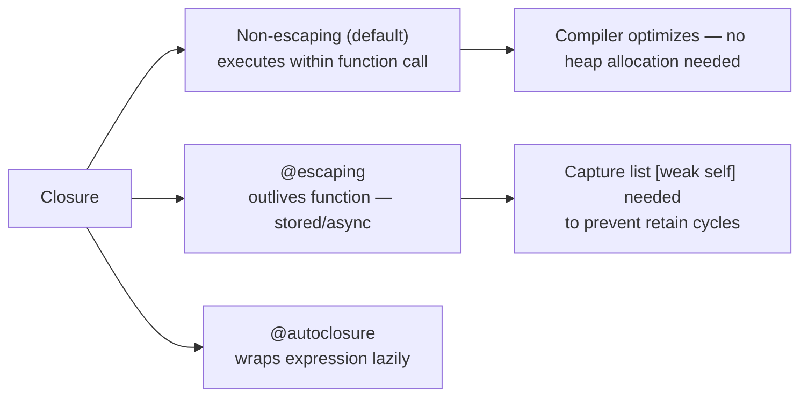

# Swift Functions and Closures

> [!abstract] TL;DR
> Swift functions are first-class values with expressive argument labels, default parameters, and in-out mutation. Closures are anonymous function literals with powerful shorthand syntax. `@escaping` marks closures that outlive the call site; `@autoclosure` wraps expressions lazily. Closures capture surrounding scope by reference — `[weak self]` is essential when capturing `self` in a class.

---

## Function Declaration

```swift
func greet(person name: String, from city: String = "Unknown") -> String {
    return "Hello \(name) from \(city)!"
}

// Call site uses argument labels
greet(person: "Alice", from: "London")    // "Hello Alice from London!"
greet(person: "Bob")                       // uses default: "Hello Bob from Unknown!"
```

**Argument label vs parameter name**:
- Argument label — used at call site (external)
- Parameter name — used inside the function body (internal)
- Use `_` to suppress the label: `func add(_ a: Int, _ b: Int) -> Int`

---

## Variadic and In-Out Parameters

```swift
// Variadic — receives [Double] inside the function
func average(_ values: Double...) -> Double {
    values.isEmpty ? 0 : values.reduce(0, +) / Double(values.count)
}
average(1, 2, 3, 4, 5)   // 3.0

// in-out — mutates the caller's variable directly
func swapValues<T>(_ a: inout T, _ b: inout T) {
    let temp = a
    a = b
    b = temp
}
var x = 10, y = 20
swapValues(&x, &y)    // & marks in-out argument
// x = 20, y = 10
```

---

## Functions as First-Class Values

```swift
func double(_ n: Int) -> Int { n * 2 }
func triple(_ n: Int) -> Int { n * 3 }

// Store in variable
var transform: (Int) -> Int = double
transform(5)    // 10
transform = triple
transform(5)    // 15

// Pass as argument
func apply(_ value: Int, using f: (Int) -> Int) -> Int {
    f(value)
}
apply(4, using: double)   // 8

// Return from function
func multiplier(by factor: Int) -> (Int) -> Int {
    return { $0 * factor }   // returns a closure
}
let times3 = multiplier(by: 3)
times3(7)   // 21
```

---

## Closure Syntax Progression

```swift
let numbers = [3, 1, 4, 1, 5, 9, 2, 6]

// Full closure syntax
let sorted1 = numbers.sorted(by: { (a: Int, b: Int) -> Bool in
    return a < b
})

// Type inference — compiler infers parameter types
let sorted2 = numbers.sorted(by: { a, b in a < b })

// Implicit return — single-expression closures
let sorted3 = numbers.sorted(by: { a, b in a < b })

// Shorthand argument names
let sorted4 = numbers.sorted(by: { $0 < $1 })

// Trailing closure — last argument moves outside parentheses
let sorted5 = numbers.sorted { $0 < $1 }

// Operator function — concisest form
let sorted6 = numbers.sorted(by: <)
```

---

## Capturing Values

Closures **capture** variables from their surrounding scope by reference (for reference types) or by value (semantics depend on type):

```swift
func makeCounter() -> () -> Int {
    var count = 0
    return {
        count += 1     // captures `count` — shared reference
        return count
    }
}

let counter = makeCounter()
counter()   // 1
counter()   // 2
counter()   // 3
```

**Capture list** — control capture semantics, break retain cycles:

```swift
class ViewModel {
    var value = 0

    func startUpdating() {
        Timer.scheduledTimer(withTimeInterval: 1, repeats: true) { [weak self] _ in
            guard let self else { return }   // self might be nil if VM deallocated
            self.value += 1
        }
    }
}
```

---

## `@escaping` Closures

By default, closures passed as function parameters are **non-escaping** — they execute before the function returns. Mark `@escaping` when a closure outlives the function call (stored, called asynchronously):

```swift
class NetworkManager {
    var pendingCallbacks: [(Data) -> Void] = []

    func fetch(url: URL, completion: @escaping (Data) -> Void) {
        // closure stored — escapes the function's scope
        pendingCallbacks.append(completion)
        URLSession.shared.dataTask(with: url) { data, _, _ in
            if let data { completion(data) }
        }.resume()
    }
}
```

`@escaping` requires explicit `self.` inside the closure body — a deliberate reminder that you're capturing self.

---

## `@autoclosure`

Wraps an expression in a closure automatically — enables lazy evaluation and cleaner call sites:

```swift
func assert(_ condition: @autoclosure () -> Bool, message: String) {
    if !condition() {   // evaluated only if needed
        fatalError(message)
    }
}

assert(expensiveCheck(), message: "Check failed")
// expensiveCheck() is not called if asserts are disabled
```

---

## Closure Type Summary



---

## Common Pitfalls

1. **Retain cycles with `self` in `@escaping` closures** — always use `[weak self]` in class methods storing closures.
2. **Forgetting `@escaping`** — storing a non-escaping closure in a property is a compile error; Swift forces you to annotate.
3. **Overusing trailing closure syntax** — with multiple closure arguments, trailing syntax can obscure which argument is which; use labeled form for clarity.
4. **In-out and concurrency** — `inout` parameters cannot be captured by concurrently executing closures (Swift 6 strictness catches this).
5. **`$0` in nested closures** — shorthand names refer to the innermost closure; in nested closures, use named parameters to avoid confusion.

---

## Review Questions

1. **What is the difference between a non-escaping and an `@escaping` closure? When does the compiler require `@escaping`?**
   *Answer: Non-escaping closures execute within the function's call frame and can be optimized on the stack. `@escaping` is required when the closure is stored (in a property or array) or passed to an async operation that outlives the current call.*

2. **Explain how a closure captures a value type (`Int`) vs a reference type (`class` instance).**
   *Answer: For value types, the closure captures a copy of the variable's storage. Mutations inside the closure affect that captured copy (which may be heap-allocated to extend lifetime). For reference types, the closure captures a strong reference to the object — same object, increments retain count.*

3. **What does `@autoclosure` enable and why is it useful?**
   *Answer: It wraps the argument expression in a closure, deferring evaluation. This enables lazy evaluation (the expression runs only if/when the closure is called) while keeping the call site clean — no explicit `{ }` braces needed.*

#Swift #SwiftUI #Functions #Closures #FunctionalProgramming
