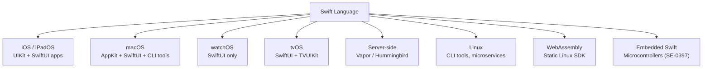

# Swift Overview

> [!abstract] TL;DR
> Swift is Apple's compiled, statically-typed language introduced in 2014 to replace Objective-C. Its two key differentiators are **optionals** (compiler-enforced nil safety) and **ARC** (Automatic Reference Counting — deterministic memory management without a GC pause). Swift is protocol-oriented, expression-rich, and runs on iOS, macOS, watchOS, tvOS, and Linux.

---

## Swift vs Objective-C

| Feature | Swift | Objective-C |
|---|---|---|
| Type system | Static, inferred | Static but looser (`id` type) |
| Nil safety | Compiler-enforced optionals | Any pointer can be nil silently |
| Syntax | Modern, concise | Verbose, C-derived with `[]` messaging |
| Memory | ARC (same model) | ARC (same model) |
| Runtime | Swift runtime + ObjC runtime | ObjC runtime |
| Interop | Full bidirectional interop | — |
| Open source | Yes (swift.org) | No |
| Generics | Full, sound | Lightweight (no type constraints) |

Swift **compiles to native machine code** via LLVM — no interpreter or bytecode VM. The Swift runtime is small and ships with the OS (iOS 12.2+/macOS 10.14.4+).

---

## ARC — Automatic Reference Counting

Swift's memory model is ARC, not garbage collection. ARC is **deterministic**: objects are freed the instant their reference count drops to zero — no GC pauses, no stop-the-world.

```swift
class Dog {
    let name: String
    init(name: String) {
        self.name = name
        print("\(name) allocated")
    }
    deinit {
        print("\(name) deallocated")   // called immediately when count hits 0
    }
}

var dog1: Dog? = Dog(name: "Rex")   // count = 1
var dog2 = dog1                      // count = 2
dog1 = nil                           // count = 1
dog2 = nil                           // count = 0 → deinit called immediately
```

**Strong reference cycle** — the classic ARC pitfall:

```swift
class Owner {
    var pet: Pet?
}

class Pet {
    weak var owner: Owner?   // `weak` breaks the cycle; owner becomes nil when Owner deallocates
}
```

Use `weak` (optional, zeroed on dealloc) or `unowned` (non-optional, crashes if accessed after dealloc) to break cycles.

---

## The Swift Evolution Process

Swift is governed by [Swift Evolution](https://github.com/apple/swift-evolution). Changes go through:
1. **Pitch** — informal discussion on forums
2. **Proposal (SE-XXXX)** — written specification
3. **Review** — community feedback period
4. **Core Team decision** — accepted/rejected/revised

Notable proposals: SE-0296 (async/await), SE-0306 (actors), SE-0352 (implicitly opened existentials), SE-0401 (Swift Testing).

---

## Xcode and Toolchain Setup

```bash
# macOS — install Xcode from App Store, then command-line tools:
xcode-select --install

# Check Swift version
swift --version

# Open REPL (interactive playground in terminal)
swift

# Linux / Windows — download toolchain from swift.org
# or use the Official Docker image:
docker run --rm -it swift:latest swift
```

**Swift Playgrounds** (iPad/macOS app) — live execution, no Xcode project required. Ideal for learning and prototyping.

---

## Swift Package Manager (SPM)

SPM is the official build system and dependency manager, built into Swift since 3.0.

```bash
# Create a new library package
swift package init --name MyLib --type library

# Create a new executable
swift package init --name MyCLI --type executable

swift build          # compile
swift test           # run tests
swift run            # build + run executable
```

The manifest is `Package.swift` — a Swift file itself:

```swift
// swift-tools-version: 5.9
import PackageDescription

let package = Package(
    name: "MyLib",
    platforms: [.macOS(.v13), .iOS(.v16)],
    products: [
        .library(name: "MyLib", targets: ["MyLib"]),
    ],
    dependencies: [
        .package(url: "https://github.com/apple/swift-argument-parser", from: "1.3.0"),
    ],
    targets: [
        .target(name: "MyLib", dependencies: [
            .product(name: "ArgumentParser", package: "swift-argument-parser")
        ]),
        .testTarget(name: "MyLibTests", dependencies: ["MyLib"]),
    ]
)
```

---

## Swift Use Cases



**Server-side Swift**: Vapor (most mature), Hummingbird (lightweight). Both use `async`/`await` and share the same SPM ecosystem.

---

## Common Pitfalls

1. **Force-unwrapping optionals** (`!`) without checking nil — causes runtime crash. Prefer `if let` or `guard let`.
2. **Strong reference cycles** in closures — `[weak self]` capture lists are mandatory in most delegate/callback patterns.
3. **Struct mutability** — methods that mutate a struct must be marked `mutating`; passing a struct to a non-`inout` parameter copies it.
4. **Missing `@MainActor`** when updating UI from async code — UI updates must occur on the main thread.
5. **`unowned` over `weak`** when the referenced object's lifetime is shorter — use `unowned` only when you are certain the reference outlives the closure.

---

## Review Questions

1. **How does ARC differ from a garbage collector, and what practical consequence does this have for UI responsiveness?**
   *Answer: ARC frees memory synchronously when the reference count hits zero — no GC pause. A GC may defer collection, causing unpredictable frame drops; ARC is deterministic and frame-safe.*

2. **You have two classes that reference each other. Both are allocated but neither is ever freed. What is the problem and how do you fix it?**
   *Answer: A strong reference cycle. One side should use `weak var` (or `unowned`) so the reference doesn't increment the retain count, allowing deallocation.*

3. **What is the role of `Package.swift` and what tool processes it?**
   *Answer: `Package.swift` is the SPM manifest describing targets, products, and external dependencies. `swift build`/`swift test`/`swift run` all read it via the Swift Package Manager build system.*

#Swift #SwiftUI #ARC #Xcode #SPM
