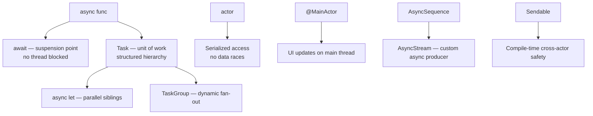

# Swift Concurrency

> [!abstract] TL;DR
> Swift 5.5 introduced structured concurrency: `async`/`await` replaces callback hell with linear, readable async code. `Task` and `TaskGroup` manage units of async work. **Actors** are reference types with built-in data isolation — the compiler prevents data races at the source. `@MainActor` ensures UI updates happen on the main thread. Swift 6 enforces strict concurrency checking, making data-race freedom a compile-time guarantee.

---

## `async`/`await` Basics

```swift
// Async function — suspends without blocking a thread
func fetchUser(id: Int) async throws -> User {
    let url = URL(string: "https://api.example.com/users/\(id)")!
    let (data, response) = try await URLSession.shared.data(from: url)
    guard (response as? HTTPURLResponse)?.statusCode == 200 else {
        throw NetworkError.serverError
    }
    return try JSONDecoder().decode(User.self, from: data)
}

// Calling from async context
func loadProfile() async {
    do {
        let user = try await fetchUser(id: 42)
        print("Loaded: \(user.name)")
    } catch {
        print("Failed: \(error)")
    }
}
```

**`await` marks suspension points** — the function may suspend here and resume on any thread. No thread is blocked during suspension.

---

## `Task` — Async Work Unit

```swift
// Bridging sync → async (e.g., from a button action)
Button("Load") {
    Task {
        await loadProfile()     // spawns unstructured async task
    }
}

// Task with priority
Task(priority: .userInitiated) {
    await heavyComputation()
}

// Detached task — inherits no task-local values, no actor context
Task.detached {
    await backgroundWork()
}

// Cancellation
let task = Task {
    for i in 0..<1000 {
        try Task.checkCancellation()   // throws if cancelled
        await processItem(i)
    }
}
task.cancel()
```

---

## `async let` — Parallel Async Work

```swift
func loadDashboard() async throws -> Dashboard {
    // Both fetches start simultaneously — not sequentially
    async let users = fetchUsers()
    async let posts = fetchPosts()
    async let stats = fetchStats()

    // Await all three — suspends until all complete
    return Dashboard(
        users: try await users,
        posts: try await posts,
        stats: try await stats
    )
}
// vs. sequential: 3 awaits in series would take 3x longer
```

---

## `TaskGroup` — Dynamic Parallelism

```swift
func processAll(_ ids: [Int]) async throws -> [Result] {
    try await withThrowingTaskGroup(of: Result.self) { group in
        for id in ids {
            group.addTask {
                try await processItem(id)
            }
        }
        // Collect results as they complete
        var results: [Result] = []
        for try await result in group {
            results.append(result)
        }
        return results
    }
}
```

---

## Actors — Data Isolation

An `actor` is a reference type that serializes access to its mutable state — only one piece of code can access an actor's state at a time:

```swift
actor BankAccount {
    private var balance: Double = 0

    func deposit(_ amount: Double) {
        balance += amount
    }

    func withdraw(_ amount: Double) throws {
        guard balance >= amount else { throw BankError.insufficientFunds }
        balance -= amount
    }

    var currentBalance: Double { balance }
}

let account = BankAccount()
// Must use await to call actor methods from outside
await account.deposit(100)
let bal = await account.currentBalance
```

The compiler **enforces** that shared mutable state in actors is only accessed through the actor's serialized execution context.

---

## `@MainActor` — UI Thread Safety

```swift
// Marks a type/function to always run on the main thread
@MainActor
class ViewModel: ObservableObject {
    @Published var title = ""
    @Published var isLoading = false

    func loadData() async {
        isLoading = true
        defer { isLoading = false }

        // This runs on a background thread
        let data = await Task.detached { await fetchData() }.value

        // Back on MainActor — safe to update @Published
        title = data.title
    }
}

// Hop to main actor from anywhere
await MainActor.run {
    updateUI()
}
```

---

## `AsyncSequence` and `AsyncStream`

```swift
// Consuming an AsyncSequence
for try await line in URL(string: "https://api.example.com/stream")!.lines {
    print(line)
}

// Creating custom AsyncStream
func countdown(from n: Int) -> AsyncStream<Int> {
    AsyncStream { continuation in
        Task {
            for i in stride(from: n, through: 0, by: -1) {
                continuation.yield(i)
                try? await Task.sleep(for: .seconds(1))
            }
            continuation.finish()
        }
    }
}

for await count in countdown(from: 5) {
    print(count)   // 5, 4, 3, 2, 1, 0
}
```

---

## `Sendable` — Safe Across Concurrency Domains

```swift
// Sendable = safe to pass across actor boundaries / task contexts
struct User: Sendable {   // all stored properties must also be Sendable
    let id: Int
    let name: String
}

// Non-Sendable class — mutable shared state
class Cache {
    var items: [String: Any] = [:]
    // NOT Sendable — Swift 6 will warn if sent across actors
}

// @unchecked Sendable — you promise thread safety (use NSLock etc)
final class ThreadSafeCache: @unchecked Sendable {
    private var items: [String: Any] = [:]
    private let lock = NSLock()
}
```

---

## Concurrency Model Diagram



---

## Common Pitfalls

1. **`Task { }` inside SwiftUI body** — use `.task { }` modifier instead; it cancels automatically when the view disappears.
2. **Capturing mutable state in detached tasks** — `Task.detached` doesn't inherit the actor context; mutable state access from it is a data race.
3. **`await` inside `withTaskGroup` after all tasks added** — only `await group.next()` or `for await` works after `addTask`. Awaiting something else suspends the group unexpectedly.
4. **Actor reentrancy** — while an actor's method is suspended at an `await`, another caller can enter. State may have changed when execution resumes. Design around this.
5. **Ignoring `Task.checkCancellation()`** — long-running task loops should periodically check for cancellation; otherwise `.cancel()` has no effect until the task naturally ends.

---

## Review Questions

1. **How does `async let` achieve parallelism, and how does it differ from sequential `await`?**
   *Answer: `async let` starts the async work immediately without waiting. The actual value is only needed (and awaited) when used later. Sequential `await` statements run one after another; `async let` statements overlap their execution.*

2. **What problem do actors solve, and how does the compiler enforce their invariants?**
   *Answer: Actors prevent data races on mutable shared state by serializing all access through the actor's executor. The compiler enforces that all mutable actor properties can only be accessed from within the actor (or via `await` from outside), preventing concurrent writes.*

3. **What is `Sendable` and why is it important in Swift 6?**
   *Answer: `Sendable` marks types safe to pass across concurrency domains (actors, tasks). In Swift 6 strict mode, passing a non-Sendable type across an actor boundary is a compile error, not just a warning — making data-race freedom a compile-time guarantee rather than a runtime hope.*

#Swift #SwiftUI #Concurrency #AsyncAwait #Actors #Sendable
