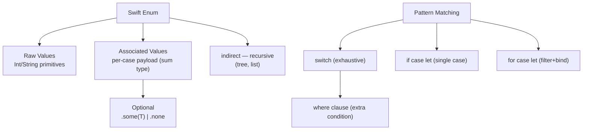

# Swift Enums and Pattern Matching

> [!abstract] TL;DR
> Swift enums are **first-class types** — far more powerful than C/Java enums. They can carry **associated values** per case (making them algebraic sum types), conform to protocols, have methods and computed properties, and even be recursive (`indirect`). Pattern matching with `switch`, `if case let`, and `for case let` makes exhaustive handling of enum states elegant and safe.

---

## Basic Enums and Raw Values

```swift
// Simple enum
enum Direction {
    case north, south, east, west
}

// Raw value enum — each case maps to a primitive
enum Planet: Int {
    case mercury = 1, venus, earth, mars   // venus=2, earth=3, mars=4
}
Planet(rawValue: 3)    // Optional(.earth)
Planet.mars.rawValue   // 4

// String raw values
enum HTTPMethod: String {
    case get = "GET", post = "POST", put = "PUT", delete = "DELETE"
}
HTTPMethod.post.rawValue    // "POST"
HTTPMethod(rawValue: "GET") // Optional(.get)
```

---

## Associated Values — Algebraic Sum Types

Each case can carry different data:

```swift
enum NetworkResult {
    case success(Data, statusCode: Int)
    case failure(Error)
    case loading(progress: Double)
    case cancelled
}

// Pattern match associated values
func handle(_ result: NetworkResult) {
    switch result {
    case .success(let data, statusCode: let code) where code == 200:
        print("OK: \(data.count) bytes")
    case .success(_, statusCode: let code):
        print("Non-200: \(code)")
    case .failure(let error):
        print("Error: \(error)")
    case .loading(let progress):
        print("Loading: \(Int(progress * 100))%")
    case .cancelled:
        print("Cancelled")
    }
}
```

---

## `Optional` is an Enum

Swift's `Optional<T>` is literally:

```swift
enum Optional<Wrapped> {
    case some(Wrapped)
    case none
}

// These are equivalent:
let a: Int? = 42
let b: Optional<Int> = .some(42)
let c: Int? = nil
let d: Optional<Int> = .none

// Direct pattern match on Optional
if case .some(let value) = a {
    print(value)   // 42
}
```

---

## Recursive Enums — `indirect`

`indirect` allows an enum case to reference the same enum type (enables tree/list structures):

```swift
indirect enum BinaryTree<T> {
    case leaf(T)
    case node(BinaryTree<T>, BinaryTree<T>)
}

let tree = BinaryTree.node(
    .node(.leaf(1), .leaf(2)),
    .leaf(3)
)

func sum(_ tree: BinaryTree<Int>) -> Int {
    switch tree {
    case .leaf(let value): return value
    case .node(let left, let right): return sum(left) + sum(right)
    }
}
sum(tree)   // 6
```

---

## Exhaustive Pattern Matching

```swift
// Multiple patterns per case
let grade = 88
switch grade {
case 90...100:          print("A")
case 80..<90:           print("B")
case 70..<80:           print("C")
case 0..<70:            print("F")
default:                print("Invalid")
}

// Tuple matching
let point = (1, -1)
switch point {
case (0, 0):            print("Origin")
case (let x, 0):        print("x-axis: \(x)")
case (0, let y):        print("y-axis: \(y)")
case (let x, let y) where x > 0 && y > 0: print("Q1")
case (let x, let y):    print("Other: \(x), \(y)")
}
```

---

## `if case let` and `for case let`

For when you only care about one case — no full switch needed:

```swift
let result: NetworkResult = .success(Data(), statusCode: 200)

// if case let — pattern match without switch
if case .success(let data, statusCode: let code) = result, code == 200 {
    print("Success: \(data.count) bytes")
}

// for case let — filter and bind in one pass
let results: [NetworkResult] = [.success(Data(), statusCode: 200), .failure(URLError(.timedOut)), .cancelled]

for case .failure(let error) in results {
    print("Failed with: \(error)")   // only failure cases reach here
}

// Compact — use ~ operator or case in while
while case .loading(let p) = fetchStatus(), p < 1.0 {
    waitForProgress()
}
```

---

## Enums with Methods and Properties

```swift
enum Coin {
    case penny, nickel, dime, quarter

    var value: Int {
        switch self {
        case .penny:   return 1
        case .nickel:  return 5
        case .dime:    return 10
        case .quarter: return 25
        }
    }

    static var allCases: [Coin] { [.penny, .nickel, .dime, .quarter] }
}

Coin.dime.value   // 10
Coin.allCases.map(\.value).reduce(0, +)  // 41
```

Enums can also conform to `CaseIterable` for automatic `allCases`.

---

## Enum Pattern Map



---

## Common Pitfalls

1. **Non-exhaustive switch** — adding a new case to an enum breaks all switch statements that don't have `default`. Mark library enums `@frozen` to prevent this.
2. **Confusing raw values and associated values** — an enum can have one or the other, not both. Raw values are the same type for all cases; associated values differ per case.
3. **`indirect` on non-recursive cases** — only cases that recursively reference the enum need `indirect`. Putting it on the whole enum adds indirection to all cases.
4. **`CaseIterable` with associated values** — `CaseIterable` synthesis fails if any case has associated values (can't enumerate them). Implement `allCases` manually.
5. **Pattern order in switch** — Swift evaluates patterns top-to-bottom; a broad pattern before a specific one can shadow the specific case (compiler warns, but only for some cases).

---

## Review Questions

1. **What makes Swift enums algebraic sum types? How does this differ from C/Java enums?**
   *Answer: Swift enum cases can carry different associated data — the enum is literally the sum (union) of all possible case types. C/Java enums are just named integers; they can't carry per-case payloads.*

2. **Why is `indirect` needed for recursive enum cases?**
   *Answer: Without `indirect`, the compiler cannot compute the enum's size (it would be infinite — enum contains itself). `indirect` wraps the recursive case in a heap pointer (known, fixed size), breaking the recursion.*

3. **When would you use `if case let` instead of `switch`?**
   *Answer: When you only care about one specific case and don't need to handle others. `if case let` is concise and avoids the verbosity of a full switch with a `default:` or empty cases.*

#Swift #SwiftUI #Enums #PatternMatching #AssociatedValues
