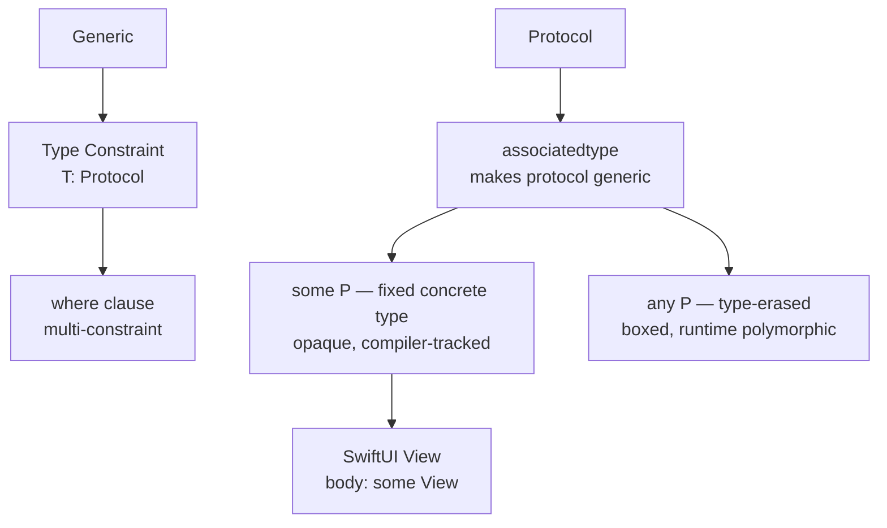

# Swift Generics

> [!abstract] TL;DR
> Swift generics enable type-safe code reuse without sacrificing performance. Type constraints (`where T: Comparable`) restrict what types can be used. Protocol associated types let protocols work with arbitrary type parameters. `some T` (opaque type, introduced SE-0244) hides the concrete type from the caller while preserving type identity for the compiler — used throughout SwiftUI. `any T` (existential) erases the type at the cost of an indirection layer.

---

## Generic Functions and Types

```swift
// Generic function — T is inferred from arguments
func swapValues<T>(_ a: inout T, _ b: inout T) {
    let temp = a; a = b; b = temp
}
var x = 10, y = 20
swapValues(&x, &y)   // T inferred as Int

// Generic type — Stack<Element>
struct Stack<Element> {
    private var items: [Element] = []

    mutating func push(_ item: Element) { items.append(item) }
    mutating func pop() -> Element? { items.popLast() }
    var top: Element? { items.last }
    var isEmpty: Bool { items.isEmpty }
}

var intStack = Stack<Int>()
intStack.push(1); intStack.push(2)
intStack.pop()   // Optional(2)
```

---

## Type Constraints

```swift
// Single constraint
func findMax<T: Comparable>(_ arr: [T]) -> T? {
    arr.max()
}
findMax([3, 1, 4, 1, 5])    // Optional(5)
findMax(["banana", "apple"]) // Optional("banana")

// Multiple constraints with where clause
func merge<T>(_ a: [T], _ b: [T]) -> [T] where T: Equatable & Hashable {
    Array(Set(a + b))
}

// Constraint on associated type
func printFirst<C: Collection>(_ collection: C) where C.Element: CustomStringConvertible {
    if let first = collection.first {
        print(first.description)
    }
}
```

---

## Associated Types in Protocols

Associated types make protocols generic:

```swift
protocol Container {
    associatedtype Item
    var count: Int { get }
    mutating func append(_ item: Item)
    subscript(i: Int) -> Item { get }
}

struct IntContainer: Container {
    typealias Item = Int    // explicit; often inferred
    private var items: [Int] = []

    var count: Int { items.count }
    mutating func append(_ item: Int) { items.append(item) }
    subscript(i: Int) -> Int { items[i] }
}

// Generic function with associated type constraint
func allItemsMatch<C1: Container, C2: Container>(_ c1: C1, _ c2: C2) -> Bool
    where C1.Item == C2.Item, C1.Item: Equatable {
    guard c1.count == c2.count else { return false }
    return (0..<c1.count).allSatisfy { c1[$0] == c2[$0] }
}
```

---

## `some` — Opaque Return Types

`some Protocol` means "some specific concrete type that conforms to Protocol" — the compiler knows the exact type, the caller does not:

```swift
// Without some — the return type reveals internal implementation
func makeSorter() -> BubbleSorter<Int> { ... }  // exposes internals

// With some — caller only knows it's Sortable
func makeSorter() -> some Sortable { BubbleSorter<Int>() }

// SwiftUI's View is built on this
struct ContentView: View {
    var body: some View {        // compiler knows exact type; caller doesn't
        Text("Hello, World!")
    }
}
```

**Key rule**: all return paths must return the **same** concrete type.

---

## `any` — Existential Types

`any Protocol` erases the concrete type at runtime — the value is boxed in a container with a type metadata pointer:

```swift
// Existential box — runtime polymorphism, heap allocation
let shapes: [any Drawable] = [Circle(...), Rectangle(...), Triangle(...)]

// Heterogeneous — different concrete types, but same protocol
for shape in shapes {
    shape.draw()   // dynamic dispatch through existential
}
```

**`some` vs `any`**:

| | `some P` | `any P` |
|---|---|---|
| Type known at compile time | Yes (by compiler) | No (boxed) |
| Performance | Direct dispatch / inlined | Extra indirection, possible heap alloc |
| Heterogeneous collection | No | Yes |
| Use in SwiftUI View body | Required | Works but avoid |
| Primary use | Return types, parameters | Collections, stored properties needing heterogeneity |

---

## Generic Type Erasure Pattern

When you need to store `some Protocol` values of different concrete types, build a type-erased wrapper:

```swift
// AnyView in SwiftUI is a type-erased View
struct AnyAnimal {
    private let _sound: () -> String
    init<A: Animal>(_ animal: A) {
        _sound = animal.makeSound
    }
    func makeSound() -> String { _sound() }
}
```

---

## Generics and Protocols Map



---

## Common Pitfalls

1. **Using `any` when `some` suffices** — `any` has runtime overhead; `some` allows the compiler to optimize. Prefer `some` for single-type return values.
2. **Protocol with `Self` or associated type as `any`** — until Swift 5.7, protocols with associated types couldn't be used directly as `any P`. Even now, operations like `==` on `any Equatable` are restricted.
3. **All branches must return same type with `some`** — returning different concrete types in different branches of an `if` is a compile error. Use `@ViewBuilder` in SwiftUI or `AnyView` for heterogeneous view trees.
4. **Over-constraining generics** — adding too many `where` clauses makes functions inflexible; check if a protocol extension would be cleaner.
5. **`typealias` in associated types** — usually inferred; explicit `typealias Item = Int` is only needed when inference is ambiguous.

---

## Review Questions

1. **What is the difference between `some Comparable` and `any Comparable` as a return type?**
   *Answer: `some Comparable` means the function always returns the same specific concrete type (known to compiler, opaque to caller) — allows direct dispatch and optimization. `any Comparable` wraps the value in an existential box at runtime — heterogeneous, but incurs indirection overhead and has restricted operations (e.g., `==` between two `any Comparable` values is not directly possible).*

2. **Why does SwiftUI use `some View` for `body` instead of `any View`?**
   *Answer: SwiftUI's diffing algorithm relies on knowing the exact static type tree at compile time to generate efficient identity-based updates. `some View` preserves type identity; `any View` erases it, forcing a full type comparison at runtime and breaking SwiftUI's structural identity.*

3. **What is an associated type and how does it differ from a generic parameter?**
   *Answer: An associated type is a placeholder type defined inside a protocol — each conforming type chooses the concrete type for it. A generic parameter is defined at the use site (function/type declaration). Associated types let protocols express "this type works with some other type" without specifying it upfront.*

#Swift #SwiftUI #Generics #OpaqueTypes #Existentials #AssociatedTypes
