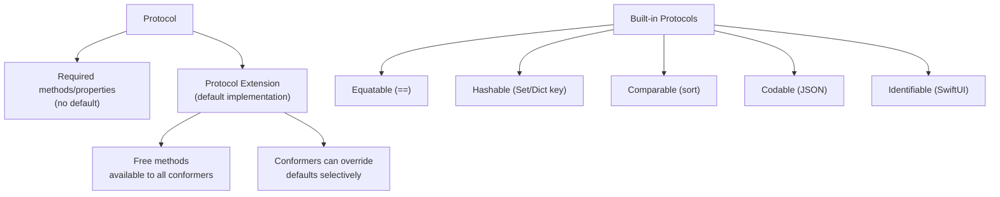

# Swift Protocols and Extensions

> [!abstract] TL;DR
> Swift is a **protocol-oriented language** (POP) — protocols with default implementations via extensions replace classical inheritance for most use cases. Any type (struct, class, enum, even extensions of other types) can conform to a protocol. Key built-in protocols: `Equatable`, `Comparable`, `Hashable`, `Codable`, `Identifiable`. Extensions let you add methods to any type — including types you don't own (retroactive conformance).

---

## Protocol Definition and Conformance

```swift
protocol Drawable {
    var color: String { get }       // read-only requirement
    var lineWidth: Double { get set } // read-write requirement
    func draw() -> String
    func area() -> Double
}

struct Circle: Drawable {
    var color: String
    var lineWidth: Double
    let radius: Double

    func draw() -> String { "Drawing circle r=\(radius)" }
    func area() -> Double { Double.pi * radius * radius }
}

// Protocol as type — polymorphic container
let shapes: [any Drawable] = [Circle(color: "red", lineWidth: 1, radius: 5)]
for shape in shapes { print(shape.draw()) }
```

---

## Protocol Inheritance

```swift
protocol Shape: Drawable {
    var vertices: Int { get }
}

protocol AnimatableShape: Shape {
    func animate(duration: TimeInterval)
}
```

Protocols form **inheritance hierarchies** just like classes, but a type can conform to any number of protocols (multiple conformance).

---

## Protocol Extensions — Default Implementations

Protocol extensions provide default behavior without forcing conformers to implement everything:

```swift
protocol Greetable {
    var name: String { get }
    func greeting() -> String
}

extension Greetable {
    // Default implementation — conformers can override
    func greeting() -> String {
        "Hello, I'm \(name)"
    }

    // Extra methods available to all conformers — "free"
    func formalGreeting() -> String {
        "Good day. My name is \(name)."
    }
}

struct Person: Greetable {
    let name: String
    // greeting() not implemented — uses default
}

struct Robot: Greetable {
    let name: String
    func greeting() -> String { "BEEP BOOP I AM \(name.uppercased())" }  // override
}
```

---

## Essential Standard Library Protocols

```swift
// Equatable — enables == and !=
struct Point: Equatable {
    var x, y: Double
    // Compiler auto-synthesizes == for structs with Equatable stored properties
}
Point(x: 1, y: 2) == Point(x: 1, y: 2)   // true

// Comparable — enables <, >, <=, >= and sort()
struct Version: Comparable {
    let major, minor, patch: Int
    static func < (lhs: Version, rhs: Version) -> Bool {
        (lhs.major, lhs.minor, lhs.patch) < (rhs.major, rhs.minor, rhs.patch)
    }
}

// Hashable — enables use as Dictionary key or Set member
struct UserID: Hashable {
    let value: UUID   // UUID is Hashable — synthesized automatically
}

// Identifiable — required by SwiftUI List/ForEach
struct Task: Identifiable {
    let id: UUID = UUID()
    var title: String
}

// CustomStringConvertible — controls print() output
struct Color: CustomStringConvertible {
    let r, g, b: UInt8
    var description: String { "rgb(\(r), \(g), \(b))" }
}
```

---

## `Codable` — Serialization Protocol

`Codable = Encodable & Decodable`. Enables JSON/plist encoding with zero boilerplate for simple types:

```swift
struct User: Codable {
    let id: Int
    let name: String
    let email: String
}

// Encoding to JSON
let user = User(id: 1, name: "Alice", email: "alice@example.com")
let encoder = JSONEncoder()
encoder.keyEncodingStrategy = .convertToSnakeCase
let data = try encoder.encode(user)
// {"id":1,"name":"Alice","email":"alice@example.com"}

// Decoding from JSON
let decoder = JSONDecoder()
decoder.keyDecodingStrategy = .convertFromSnakeCase
let decoded = try decoder.decode(User.self, from: data)

// Custom CodingKeys — rename fields
struct APIResponse: Codable {
    let userID: Int
    let firstName: String

    enum CodingKeys: String, CodingKey {
        case userID = "user_id"
        case firstName = "first_name"
    }
}
```

---

## Extensions on Existing Types

Extensions add functionality to **any** type — including types from other modules:

```swift
extension String {
    var isValidEmail: Bool {
        contains("@") && contains(".")
    }

    func trimmed() -> String {
        trimmingCharacters(in: .whitespacesAndNewlines)
    }
}

extension Array where Element: Numeric {
    var sum: Element { reduce(0, +) }
}

extension Int {
    func times(_ action: () -> Void) {
        for _ in 0..<self { action() }
    }
}
3.times { print("Hello") }    // prints 3 times
```

---

## Protocol Conformance Map



---

## Common Pitfalls

1. **Protocol default vs conformance override dispatch** — if a method is NOT in the protocol requirement but added in an extension, calling it through a protocol-typed variable uses the extension default, not the conforming type's override. This is **static dispatch**, not dynamic.
2. **`Self` in protocols** — `protocol P { func copy() -> Self }` makes `P` non-directly usable as `any P` (existential); use `some P` or generics.
3. **Retroactive conformance conflicts** — two libraries adding the same protocol conformance to the same type creates a conflict. Use wrapper types instead.
4. **`Equatable` on class types** — auto-synthesis compares stored properties; for classes, you usually want identity (`===`) — implement `==` manually.
5. **`Codable` with optionals** — optional properties are omitted from JSON output, not encoded as `null`. Use `encodeIfPresent`/`decodeIfPresent` patterns in custom `encode(to:)`.

---

## Review Questions

1. **What is protocol-oriented programming and how do protocol extensions enable it?**
   *Answer: POP means structuring code around protocols (interfaces + default behavior) rather than class inheritance trees. Protocol extensions provide default implementations — a struct or enum can gain rich behavior without a base class, eliminating the "diamond inheritance" and reference semantics issues.*

2. **What is the difference between adding a method in a protocol requirement vs adding it only in a protocol extension?**
   *Answer: A requirement is dynamically dispatched — the conforming type's implementation is called even through a protocol-typed variable. An extension-only method is statically dispatched — calling through `any Protocol` always uses the extension's version regardless of the concrete type.*

3. **How does `Codable` handle mismatched JSON key names?**
   *Answer: Use `CodingKeys` enum to map Swift property names to JSON keys. Alternatively, use `JSONDecoder.keyDecodingStrategy = .convertFromSnakeCase` for automatic `snake_case` to `camelCase` conversion.*

#Swift #SwiftUI #Protocols #Extensions #Codable #POP
