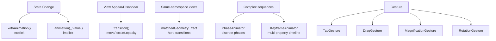

# SwiftUI Animations and Gestures

> [!abstract] TL;DR
> SwiftUI animations are driven by state changes — wrap state mutations in `withAnimation {}` and SwiftUI interpolates the difference. Spring animations, `matchedGeometryEffect`, and `transition` modifiers handle most use cases. `PhaseAnimator` cycles through discrete phases; `KeyframeAnimator` (iOS 17+) orchestrates multi-property keyframe sequences. Gestures are composable and declared via the `Gesture` protocol.

---

## `withAnimation` — Animating State Changes

```swift
struct AnimationDemo: View {
    @State private var isExpanded = false

    var body: some View {
        VStack {
            Rectangle()
                .fill(.blue)
                .frame(height: isExpanded ? 200 : 100)
                .animation(.spring(response: 0.4, dampingFraction: 0.7), value: isExpanded)

            Button("Toggle") {
                withAnimation(.easeInOut(duration: 0.3)) {
                    isExpanded.toggle()
                }
            }
        }
    }
}
```

**Implicit animation** (`.animation(_:value:)`) — fires whenever `value` changes.
**Explicit animation** (`withAnimation {}`) — animates all animatable changes inside the block.

---

## Animation Types

```swift
.easeIn(duration: 0.3)         // slow start, fast end
.easeOut(duration: 0.3)        // fast start, slow end
.easeInOut(duration: 0.3)      // slow start and end
.linear(duration: 0.5)         // constant speed

// Spring — physics-based, feels natural
.spring(response: 0.4, dampingFraction: 0.8)
// response: how quickly it reaches target (lower = faster)
// dampingFraction: 1.0 = no bounce, <1.0 = oscillates

// iOS 17+ spring shorthand
.snappy      // fast spring with minimal bounce
.bouncy      // spring with visible bounce
.smooth      // smooth deceleration

// Repeat
.easeInOut(duration: 0.5).repeatForever(autoreverses: true)
.easeInOut(duration: 0.3).repeatCount(3, autoreverses: false)
```

---

## Transitions — Appear/Disappear Animations

```swift
struct ConditionalView: View {
    @State private var showDetail = false

    var body: some View {
        VStack {
            if showDetail {
                DetailCard()
                    .transition(.asymmetric(
                        insertion: .move(edge: .bottom).combined(with: .opacity),
                        removal: .scale.combined(with: .opacity)
                    ))
            }
            Button("Toggle") {
                withAnimation(.spring()) { showDetail.toggle() }
            }
        }
    }
}

// Custom transition using ViewModifier
extension AnyTransition {
    static var blurReplace: AnyTransition {
        .modifier(
            active: BlurModifier(blur: 20, opacity: 0),
            identity: BlurModifier(blur: 0, opacity: 1)
        )
    }
}
```

---

## `matchedGeometryEffect` — Hero Transitions

Creates smooth transitions between views in different parts of the hierarchy:

```swift
struct HeroTransitionView: View {
    @Namespace private var heroNamespace
    @State private var isExpanded = false

    var body: some View {
        if isExpanded {
            // Expanded card
            VStack {
                Image("photo")
                    .resizable()
                    .matchedGeometryEffect(id: "photo", in: heroNamespace)
                    .frame(height: 300)
                Text("Detail View")
            }
            .onTapGesture { withAnimation(.spring()) { isExpanded = false } }
        } else {
            // Thumbnail
            Image("photo")
                .resizable()
                .frame(width: 80, height: 80)
                .matchedGeometryEffect(id: "photo", in: heroNamespace)
                .onTapGesture { withAnimation(.spring()) { isExpanded = true } }
        }
    }
}
```

---

## `PhaseAnimator` — Multi-Phase Sequences (iOS 17+)

```swift
enum BouncePhase: CaseIterable {
    case initial, rise, fall
}

struct BouncingBall: View {
    var body: some View {
        PhaseAnimator(BouncePhase.allCases) { phase in
            Circle()
                .fill(.red)
                .frame(width: 50)
                .offset(y: phase == .rise ? -100 : phase == .fall ? 0 : 0)
                .scaleEffect(phase == .fall ? 1.2 : 1.0)
        } animation: { phase in
            switch phase {
            case .initial: .easeIn(duration: 0.3)
            case .rise:    .easeOut(duration: 0.4)
            case .fall:    .spring(dampingFraction: 0.5)
            }
        }
    }
}
```

---

## `KeyframeAnimator` (iOS 17+)

Animate multiple properties with timeline precision:

```swift
struct KeyframeDemo: View {
    @State private var trigger = false

    var body: some View {
        Star()
            .keyframeAnimator(initialValue: AnimationValues(), trigger: trigger) { content, values in
                content
                    .scaleEffect(values.scale)
                    .rotationEffect(values.rotation)
                    .offset(y: values.offsetY)
            } keyframes: { _ in
                KeyframeTrack(\.scale) {
                    LinearKeyframe(1.0, duration: 0.1)
                    SpringKeyframe(1.5, duration: 0.2)
                    LinearKeyframe(1.0, duration: 0.3)
                }
                KeyframeTrack(\.rotation) {
                    LinearKeyframe(.zero, duration: 0.2)
                    LinearKeyframe(.degrees(360), duration: 0.4)
                }
            }
    }
}

struct AnimationValues {
    var scale = 1.0
    var rotation: Angle = .zero
    var offsetY = 0.0
}
```

---

## Gestures

```swift
struct GestureView: View {
    @State private var offset = CGSize.zero
    @State private var scale = 1.0
    @GestureState private var isDragging = false

    var body: some View {
        Circle()
            .fill(isDragging ? .orange : .blue)
            .frame(width: 100)
            .scaleEffect(scale)
            .offset(offset)
            // DragGesture
            .gesture(
                DragGesture()
                    .updating($isDragging) { _, state, _ in state = true }
                    .onChanged { value in offset = value.translation }
                    .onEnded { _ in withAnimation(.spring()) { offset = .zero } }
            )
            // MagnificationGesture (pinch)
            .gesture(
                MagnificationGesture()
                    .onChanged { scale = $0 }
                    .onEnded { _ in withAnimation { scale = 1.0 } }
            )
    }
}
```

**`@GestureState`** — automatically resets to initial value when gesture ends.

---

## Animation Architecture



---

## Common Pitfalls

1. **`withAnimation` not animating** — only animatable properties (frame, opacity, color, offset) respond. Non-animatable changes (view identity, `@State` object changes) require `.id()` tricks or `@Namespace`.
2. **`matchedGeometryEffect` with wrong namespace** — both views must use the same `@Namespace` instance; creating it in different views breaks the effect.
3. **Transition without `withAnimation`** — transitions on `if/else` don't animate unless state change is wrapped in `withAnimation`.
4. **`@GestureState` not resetting** — if using `updating(_:body:)`, the value resets automatically when gesture ends; don't manually reset it.
5. **Combining gestures** — use `.simultaneously`, `.sequenced`, or `.exclusively` for multi-gesture views; overlapping gesture recognizers cancel each other silently.

---

## Review Questions

1. **What is the difference between implicit and explicit animations in SwiftUI?**
   *Answer: Implicit animations (`.animation(_:value:)` modifier) fire whenever the specified value changes — applied per-view. Explicit animations (`withAnimation {}`) animate all animatable changes that occur within the closure — applied globally to the state mutation.*

2. **What problem does `matchedGeometryEffect` solve?**
   *Answer: It creates smooth "hero" transitions between the same logical element appearing in two different view hierarchy positions. Without it, the element would disappear from one location and appear in another. With it, SwiftUI interpolates its frame between the two positions.*

3. **What does `@GestureState` add over a regular `@State` in a gesture handler?**
   *Answer: `@GestureState` automatically resets to its initial value when the gesture ends (without any manual cleanup in `onEnded`). This is ideal for transient states like "is dragging" or "current drag offset" that should snap back.*

#Swift #SwiftUI #Animations #Gestures #Transitions #matchedGeometryEffect
