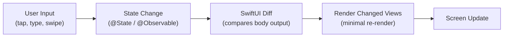

# SwiftUI Fundamentals

> [!abstract] TL;DR
> SwiftUI is Apple's declarative UI framework (iOS 13+/macOS 10.15+). You describe **what** the UI should look like given the current state — SwiftUI re-renders automatically when state changes. `View` is a protocol with a `body` computed property. `@State` is local mutable state; `@Binding` is a two-way reference to a parent's `@State`. The framework replaces UIKit's imperative "find view, mutate it" model.

---

## Declarative vs UIKit Imperative

| UIKit (Imperative) | SwiftUI (Declarative) |
|---|---|
| Create view → find it → mutate it | Describe view for given state |
| `label.text = "Hello"` | `Text(message)` re-evaluates automatically |
| Manual layout with frames/constraints | Composable modifiers and stacks |
| `viewDidLoad`, `viewWillAppear` | `.onAppear`, `.task` modifiers |
| Target-action, delegates | `@State`, bindings, closures |

---

## The `View` Protocol

Every UI element in SwiftUI is a `View` — a struct with a `body` property:

```swift
import SwiftUI

struct GreetingView: View {
    let name: String

    var body: some View {
        VStack(spacing: 12) {
            Text("Hello, \(name)!")
                .font(.largeTitle)
                .fontWeight(.bold)
                .foregroundStyle(.primary)

            Text("Welcome to SwiftUI")
                .font(.subheadline)
                .foregroundStyle(.secondary)
        }
        .padding()
    }
}
```

`body` returns `some View` — an opaque type. The compiler knows the exact type; callers don't need to.

---

## View Modifiers — Chaining

Modifiers return a new view wrapping the original. They stack up:

```swift
Text("Hello")
    .font(.title)
    .foregroundStyle(.white)
    .padding()
    .background(.blue)
    .clipShape(RoundedRectangle(cornerRadius: 12))
    .shadow(radius: 4)
```

**Order matters** — `.padding().background(.blue)` pads first then fills background; `.background(.blue).padding()` fills then pads outside.

---

## `@State` — Local Mutable State

`@State` is a property wrapper that stores value-type state inside a view. When it changes, SwiftUI re-renders the `body`:

```swift
struct CounterView: View {
    @State private var count = 0       // owned by this view

    var body: some View {
        VStack {
            Text("Count: \(count)")
                .font(.title)

            HStack {
                Button("Decrement") { count -= 1 }
                Button("Increment") { count += 1 }
            }
            .buttonStyle(.borderedProminent)
        }
    }
}
```

`@State` is always `private` — it's an implementation detail of the view.

---

## `@Binding` — Two-Way Connection

`@Binding` gives a child view read-write access to a parent's `@State` without owning the data:

```swift
struct ToggleRow: View {
    let label: String
    @Binding var isOn: Bool          // reference to parent's state

    var body: some View {
        Toggle(label, isOn: $isOn)   // $ creates the Binding<Bool>
    }
}

struct SettingsView: View {
    @State private var notifications = true
    @State private var darkMode = false

    var body: some View {
        Form {
            ToggleRow(label: "Notifications", isOn: $notifications)
            ToggleRow(label: "Dark Mode",     isOn: $darkMode)
        }
    }
}
```

The `$` prefix on a `@State` property extracts a `Binding<T>` — a two-way reference.

---

## App Structure: `@main`, `Scene`, `WindowGroup`

```swift
@main
struct MyApp: App {
    var body: some Scene {
        WindowGroup {
            ContentView()       // root view
        }
        // On macOS/iPad: multiple windows supported
    }
}

// For document-based apps
@main
struct DocumentApp: App {
    var body: some Scene {
        DocumentGroup(newDocument: TextDocument()) { config in
            ContentView(document: config.$document)
        }
    }
}
```

---

## Previews

```swift
// iOS 17+ macro syntax
#Preview {
    CounterView()
}

// With environment / dark mode
#Preview("Dark Mode") {
    CounterView()
        .preferredColorScheme(.dark)
}

// Pre-iOS 17 — PreviewProvider
struct CounterView_Previews: PreviewProvider {
    static var previews: some View {
        CounterView()
    }
}
```

---

## SwiftUI Render Cycle



SwiftUI does **not** re-render the entire hierarchy — it diffs the view tree and updates only what changed.

---

## Common Pitfalls

1. **Mutating `@State` from outside the view** — `@State` is private to the view; expose changes via `@Binding` or a shared `@Observable` model.
2. **Heavy computation in `body`** — `body` is called frequently; move expensive operations to `@State` initializers or view model methods.
3. **Incorrect modifier order** — `.padding().background()` ≠ `.background().padding()`. Background fills the padded area in the first case.
4. **`@State` with reference types** — `@State` works best with value types. For class objects, use `@StateObject` (pre-iOS 17) or `@State` with `@Observable` classes (iOS 17+).
5. **Missing `private` on `@State`** — always mark `@State` properties `private`; they should never be set from outside.

---

## Review Questions

1. **What is the fundamental shift in mental model between UIKit and SwiftUI?**
   *Answer: UIKit is imperative — you create views and imperatively mutate them. SwiftUI is declarative — you describe the view for a given state and the framework handles re-rendering. You never "find and update" a label; you change state and SwiftUI recomputes body.*

2. **What is the difference between `@State` and `@Binding`?**
   *Answer: `@State` owns the storage — the view creates and owns the value. `@Binding` is a reference to state owned elsewhere (typically a parent's `@State`). Changing a `@Binding` changes the original value in the parent.*

3. **Why does modifier order matter in SwiftUI?**
   *Answer: Each modifier wraps the view in a new view. `.padding()` adds space around the view; `.background(.blue)` fills the view's frame with blue. `Text.padding().background(.blue)` makes a blue box that includes the padding; `Text.background(.blue).padding()` makes a blue box that excludes the padding.*

#Swift #SwiftUI #Declarative #View #State #Binding
