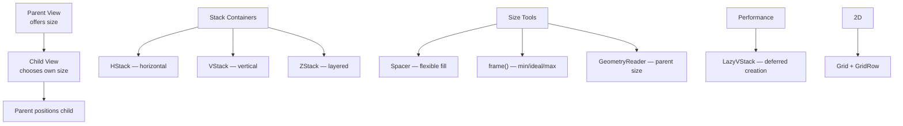

# SwiftUI Layout

> [!abstract] TL;DR
> SwiftUI layout is a three-step negotiation: parent offers size → child chooses its size → parent positions the child. Stacks (HStack/VStack/ZStack) compose views linearly or layered. `Spacer` fills flexible space. `GeometryReader` provides the parent's size for dynamic layouts. `LazyVStack`/`LazyHStack` defer view creation; `Grid` enables two-dimensional table layouts. Custom `Layout` protocol enables fully bespoke algorithms.

---

## Stack Containers

```swift
// HStack — horizontal arrangement
HStack(alignment: .center, spacing: 16) {
    Image(systemName: "star.fill")
        .foregroundStyle(.yellow)
    Text("Favorite")
    Spacer()    // pushes content to edges
    Text("5.0")
}
.padding(.horizontal)

// VStack — vertical arrangement
VStack(alignment: .leading, spacing: 8) {
    Text("Title")
        .font(.headline)
    Text("Subtitle")
        .font(.subheadline)
        .foregroundStyle(.secondary)
}

// ZStack — depth layering (back to front)
ZStack(alignment: .bottomTrailing) {
    Image("background")
        .resizable()
        .aspectRatio(contentMode: .fill)
    Text("Caption")
        .padding(8)
        .background(.black.opacity(0.6))
        .foregroundStyle(.white)
        .padding(16)
}
```

---

## Spacing and Sizing Modifiers

```swift
Text("Hello")
    .frame(width: 200, height: 50)              // fixed size
    .frame(maxWidth: .infinity)                 // fills available width
    .frame(minWidth: 100, idealWidth: 200, maxWidth: 300)  // flexible bounds
    .padding()                                  // default 16pt on all sides
    .padding(.horizontal, 20)                   // 20pt left/right only
    .padding(.top, 8)
    .background(.blue)
    .clipShape(Capsule())
```

**`Spacer`** — fills all available space in the stack axis:

```swift
HStack {
    Text("Left")
    Spacer()        // pushes Right to the trailing edge
    Text("Right")
}
```

---

## Layout Priority

When space is constrained, SwiftUI shrinks views with lower priority first:

```swift
HStack {
    Text("Long title that might truncate")
        .layoutPriority(1)    // this view keeps its size
    Spacer()
    Text("$9.99")
        .layoutPriority(0)    // default — shrinks first
}
```

---

## `GeometryReader` — Size-Aware Layouts

`GeometryReader` provides a `GeometryProxy` with `size` and `safeAreaInsets`:

```swift
GeometryReader { geometry in
    HStack(spacing: 0) {
        Rectangle()
            .fill(.blue)
            .frame(width: geometry.size.width * 0.7)   // 70% of parent width
        Rectangle()
            .fill(.red)
            .frame(width: geometry.size.width * 0.3)   // 30% of parent width
    }
}
.frame(height: 44)
```

**Use sparingly** — `GeometryReader` takes all available space and can cause layout loops.

---

## Lazy Stacks

`LazyVStack`/`LazyHStack` create child views only when they become visible — essential for long lists inside `ScrollView`:

```swift
ScrollView {
    LazyVStack(alignment: .leading, spacing: 12, pinnedViews: [.sectionHeaders]) {
        ForEach(sections) { section in
            Section {
                ForEach(section.items) { item in
                    ItemRow(item: item)       // created lazily
                }
            } header: {
                SectionHeader(title: section.title)
                    .sticky()                // pinned to scroll view top
            }
        }
    }
}
```

---

## `Grid` — Two-Dimensional Layout (iOS 16+)

```swift
Grid(alignment: .leading, horizontalSpacing: 12, verticalSpacing: 8) {
    GridRow {
        Text("Name").bold()
        Text("Score").bold()
        Text("Rank").bold()
    }
    Divider().gridCellUnsizedAxes(.horizontal)
    ForEach(players) { player in
        GridRow {
            Text(player.name)
            Text("\(player.score)")
            Text("#\(player.rank)")
        }
    }
}
```

---

## `ViewThatFits` (iOS 16+)

Shows the first view that fits in the available space:

```swift
ViewThatFits {
    // Tries horizontal first
    HStack { label; button }
    // Falls back to vertical if HStack doesn't fit
    VStack { label; button }
}
```

---

## Alignment Guides — Fine-Grained Control

```swift
HStack(alignment: .firstTextBaseline) {
    Text("$")
        .font(.title)
    Text("9")
        .font(.system(size: 64, weight: .bold))
    Text(".99")
        .font(.title)
        .alignmentGuide(.firstTextBaseline) { d in
            d[.bottom] - 4    // shift baseline 4pts up
        }
}
```

---

## Custom `Layout` Protocol (iOS 16+)

```swift
struct EqualWidthHStack: Layout {
    func sizeThatFits(proposal: ProposedViewSize, subviews: Subviews, cache: inout ()) -> CGSize {
        let maxWidth = subviews.map { $0.sizeThatFits(proposal).width }.max() ?? 0
        let totalWidth = maxWidth * CGFloat(subviews.count)
        let maxHeight = subviews.map { $0.sizeThatFits(proposal).height }.max() ?? 0
        return CGSize(width: totalWidth, height: maxHeight)
    }

    func placeSubviews(in bounds: CGRect, proposal: ProposedViewSize, subviews: Subviews, cache: inout ()) {
        let itemWidth = bounds.width / CGFloat(subviews.count)
        for (index, subview) in subviews.enumerated() {
            let x = bounds.minX + CGFloat(index) * itemWidth + itemWidth / 2
            subview.place(at: CGPoint(x: x, y: bounds.midY), anchor: .center,
                         proposal: ProposedViewSize(width: itemWidth, height: bounds.height))
        }
    }
}
```

---

## Layout System Overview



---

## Common Pitfalls

1. **`GeometryReader` in VStack** — it takes all available height; wrap in `.frame(height:)` to constrain it.
2. **`Spacer()` in ZStack** — Spacer has no effect in ZStack (no axis concept). Use `.frame(maxWidth/Height: .infinity)` instead.
3. **`LazyVStack` vs `List`** — `LazyVStack` inside `ScrollView` gives more styling control; `List` provides built-in row separators, swipe actions, and selection handling. Choose based on need.
4. **Nested `ScrollView` conflicts** — two scroll views on the same axis compete for gestures. Avoid nesting same-axis scrollable containers.
5. **`frame(maxWidth: .infinity)` in ForEach** — greedy frames in a `VStack` inside a `ScrollView` can cause the scroll view to report infinite content size. Use `.fixedSize()` or bounded frames.

---

## Review Questions

1. **How does SwiftUI's layout negotiation work? Describe the three-step process.**
   *Answer: (1) The parent offers the child a proposed size. (2) The child decides its own size based on its content and the proposal. (3) The parent positions the child within its own bounds. The parent must accept whatever size the child returns.*

2. **When should you use `LazyVStack` vs a regular `VStack`?**
   *Answer: Use `LazyVStack` inside `ScrollView` when the content has many items — it creates views only as they scroll into view, saving memory and render time. Regular `VStack` creates all children immediately, which is fine for small fixed numbers of items.*

3. **What does `layoutPriority` control, and when is it useful?**
   *Answer: It determines which views give up space first when the stack is constrained. Higher priority views resist shrinking. Use it to protect important content (like a title) while allowing less critical content (like a badge) to shrink or truncate.*

#Swift #SwiftUI #Layout #HStack #VStack #GeometryReader #Grid
