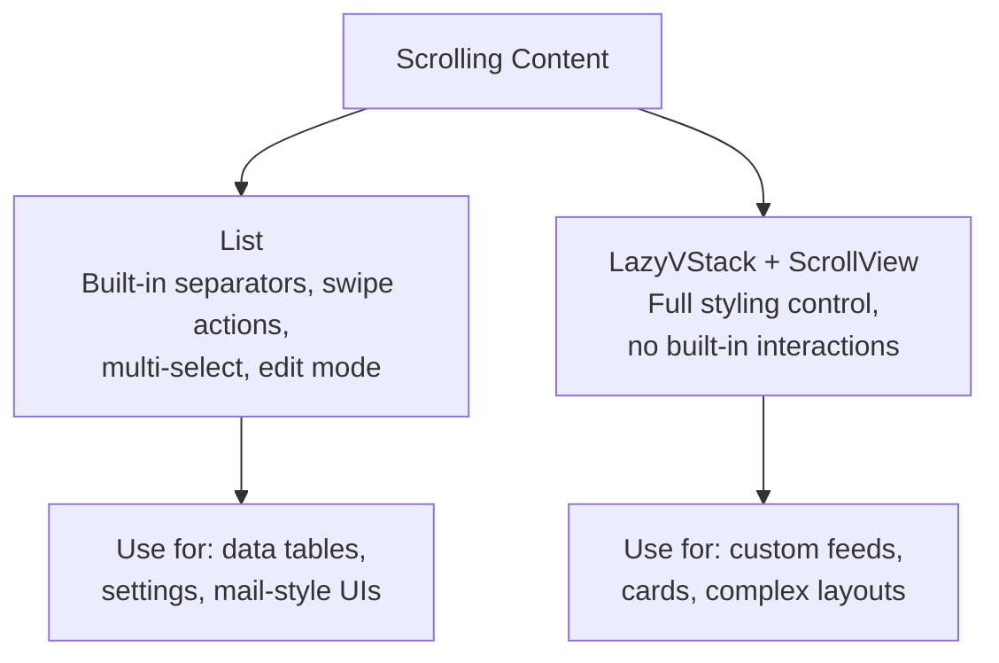

# SwiftUI Lists and Data

> [!abstract] TL;DR
> `List` is SwiftUI's primary scrolling data container — it provides built-in row separators, swipe actions, multi-selection, and `Section` grouping with minimal code. `ForEach` iterates data inside any container. `LazyVGrid`/`LazyHGrid` create grid layouts. The `.searchable` modifier adds a search bar with filtering. For large datasets, always use lazy containers and ensure `Identifiable` conformance.

---

## `List` with `ForEach`

```swift
struct TaskListView: View {
    @State private var tasks: [Task] = Task.samples

    var body: some View {
        List {
            ForEach(tasks) { task in          // Task must be Identifiable
                TaskRow(task: task)
            }
            .onDelete { indexSet in            // swipe-to-delete
                tasks.remove(atOffsets: indexSet)
            }
            .onMove { from, to in              // drag-to-reorder
                tasks.move(fromOffsets: from, toOffset: to)
            }
        }
        .navigationTitle("Tasks")
        .toolbar {
            EditButton()                       // toggles edit mode for move/delete
        }
    }
}
```

---

## `Identifiable` Protocol

ForEach requires either `Identifiable` conformance or an explicit `id:` parameter:

```swift
struct Task: Identifiable {
    let id: UUID = UUID()    // unique stable identifier
    var title: String
    var isDone: Bool
}

// Alternative — use a key path for id
ForEach(tasks, id: \.title) { task in ... }  // fragile if titles aren't unique
```

Always prefer `id: UUID` over string/int IDs that might collide or change.

---

## Sections and Grouping

```swift
List {
    Section("Pending") {
        ForEach(pendingTasks) { TaskRow(task: $0) }
    }

    Section {
        ForEach(completedTasks) { TaskRow(task: $0) }
    } header: {
        HStack {
            Text("Completed")
            Spacer()
            Text("\(completedTasks.count)")
                .foregroundStyle(.secondary)
        }
    } footer: {
        Text("Tap to restore a completed task")
            .font(.caption)
    }
}
.listStyle(.insetGrouped)   // iOS-standard grouped style
```

---

## Swipe Actions (iOS 15+)

```swift
ForEach(tasks) { task in
    TaskRow(task: task)
        .swipeActions(edge: .trailing, allowsFullSwipe: true) {
            Button(role: .destructive) {
                delete(task)
            } label: {
                Label("Delete", systemImage: "trash")
            }
        }
        .swipeActions(edge: .leading) {
            Button {
                pin(task)
            } label: {
                Label("Pin", systemImage: "pin")
            }
            .tint(.yellow)
        }
}
```

---

## Searchable and Filtering

```swift
struct SearchableList: View {
    @State private var searchText = ""
    let allItems: [Item]

    var filteredItems: [Item] {
        searchText.isEmpty ? allItems : allItems.filter {
            $0.name.localizedCaseInsensitiveContains(searchText)
        }
    }

    var body: some View {
        List(filteredItems) { item in
            ItemRow(item: item)
        }
        .searchable(text: $searchText, placement: .navigationBarDrawer, prompt: "Search items")
        .searchSuggestions {
            ForEach(recentSearches, id: \.self) { term in
                Text(term).searchCompletion(term)
            }
        }
    }
}
```

---

## Pull-to-Refresh

```swift
List(items) { item in ItemRow(item: item) }
    .refreshable {
        await viewModel.refresh()    // async action, shows spinner automatically
    }
```

---

## `LazyVGrid` / `LazyHGrid`

```swift
let columns = [
    GridItem(.adaptive(minimum: 150, maximum: 200)),    // as many as fit
    // or:
    GridItem(.flexible()), GridItem(.flexible()),        // two equal columns
    // or:
    GridItem(.fixed(100)), GridItem(.fixed(100))         // two fixed columns
]

ScrollView {
    LazyVGrid(columns: columns, spacing: 16) {
        ForEach(photos) { photo in
            PhotoThumbnail(photo: photo)
                .aspectRatio(1, contentMode: .fill)
                .clipped()
        }
    }
    .padding()
}
```

---

## `ContentUnavailableView` (iOS 17+)

```swift
List(filteredItems) { item in ItemRow(item: item) }
    .overlay {
        if filteredItems.isEmpty {
            ContentUnavailableView.search(text: searchText)
            // or custom:
            // ContentUnavailableView("No Tasks", systemImage: "tray", description: Text("Add a task to get started"))
        }
    }
```

---

## Pagination Pattern

```swift
@Observable
class ItemsViewModel {
    var items: [Item] = []
    var isLoading = false
    private var currentPage = 0

    func loadMore() async {
        guard !isLoading else { return }
        isLoading = true
        defer { isLoading = false }
        let newItems = try? await api.fetchPage(currentPage + 1)
        if let newItems {
            items.append(contentsOf: newItems)
            currentPage += 1
        }
    }
}

List(viewModel.items) { item in
    ItemRow(item: item)
        .task {
            // Trigger load when last item appears
            if item == viewModel.items.last {
                await viewModel.loadMore()
            }
        }
}
```

---

## List vs LazyVStack Comparison



---

## Common Pitfalls

1. **Non-unique IDs in ForEach** — duplicate IDs cause undefined behavior (wrong cells update). Always use stable, unique identifiers (UUID).
2. **`List` inside `ScrollView`** — `List` is itself a scroll view; nesting them breaks layout. Use `LazyVStack` inside `ScrollView` for manual layouts.
3. **Heavy views in `List` rows** — even `List` has some lazy behavior, but complex rows slow scrolling. Defer image loading with `.task` and use `AsyncImage`.
4. **`onDelete` without `ForEach`** — `.onDelete` only works on `ForEach` inside `List`, not on `List` directly.
5. **Filtering inside `body`** — synchronous filter on every render is fine for small datasets but blocks the main thread for large ones. Move filtering to a `@Observable` model with debouncing.

---

## Review Questions

1. **Why must items in `ForEach` be `Identifiable`, and what breaks if IDs are not unique?**
   *Answer: SwiftUI uses IDs to track which rows correspond to which data items across re-renders. Non-unique IDs cause incorrect cell updates — the wrong cell might update, animate, or be deleted when the data changes.*

2. **What is the difference between `List` and `LazyVStack + ScrollView`?**
   *Answer: `List` provides built-in platform UI (separators, swipe actions, selection, edit mode, inset grouped style) with less control over appearance. `LazyVStack + ScrollView` gives full visual control but requires manually implementing features like swipe-to-delete.*

3. **How does `.refreshable` work internally?**
   *Answer: `.refreshable` expects an `async` closure. SwiftUI calls it when the user pulls past the top, shows a platform-standard spinner, and dismisses it when the closure returns. The async boundary means you can `await` network calls directly without callback nesting.*

#Swift #SwiftUI #List #ForEach #LazyVGrid #Search #Identifiable
