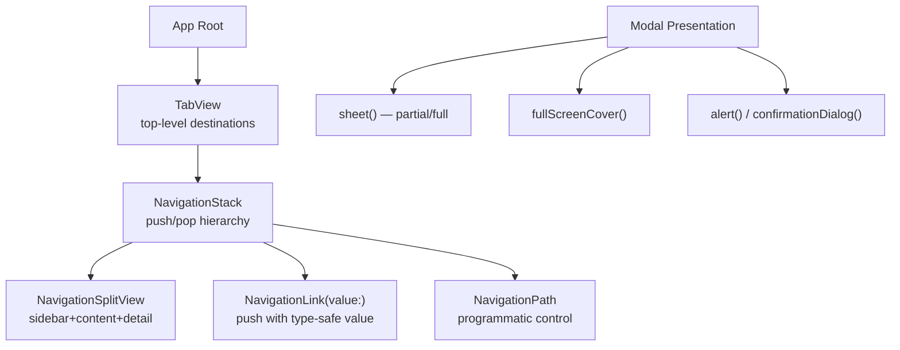

# SwiftUI Navigation

> [!abstract] TL;DR
> iOS 16+ replaced `NavigationView` with `NavigationStack` (type-safe, programmatic navigation via `NavigationPath`). `NavigationSplitView` handles iPad/Mac two-column or three-column layouts. Sheets, full-screen covers, and alerts present modally. `TabView` switches between top-level destinations. Deep linking and state restoration are built into `NavigationPath`.

---

## `NavigationStack` (iOS 16+)

```swift
struct ContentView: View {
    var body: some View {
        NavigationStack {
            List(recipes) { recipe in
                NavigationLink(recipe.name, value: recipe)
            }
            .navigationTitle("Recipes")
            .navigationDestination(for: Recipe.self) { recipe in
                RecipeDetailView(recipe: recipe)
            }
        }
    }
}
```

`NavigationLink(value:)` pushes the associated value onto the stack; `navigationDestination(for:)` maps types to views. Multiple destinations can be registered for different types.

---

## Programmatic Navigation with `NavigationPath`

```swift
struct RootView: View {
    @State private var navigationPath = NavigationPath()

    var body: some View {
        NavigationStack(path: $navigationPath) {
            HomeView()
                .navigationDestination(for: Recipe.self) { RecipeDetailView(recipe: $0) }
                .navigationDestination(for: Category.self) { CategoryView(category: $0) }
        }
        .environment(\.navigationPath, $navigationPath)
    }
}

// Navigate programmatically from anywhere
struct DeepLinkHandler: View {
    @Environment(\.navigationPath) var path

    func openRecipe(_ id: UUID) {
        if let recipe = recipeStore.recipe(for: id) {
            path.wrappedValue.append(recipe)   // push onto stack
        }
    }
}

// Pop to root
navigationPath = NavigationPath()   // clear the stack

// Pop one level
navigationPath.removeLast()
```

---

## `NavigationSplitView` — iPad/Mac Layouts

```swift
struct SidebarApp: View {
    @State private var selectedCategory: Category? = nil
    @State private var selectedItem: Item? = nil

    var body: some View {
        NavigationSplitView {
            // Sidebar — leftmost column
            List(categories, selection: $selectedCategory) { category in
                Text(category.name).tag(category)
            }
            .navigationTitle("Categories")
        } content: {
            // Content — middle column (three-column layout)
            if let category = selectedCategory {
                ItemList(category: category, selection: $selectedItem)
            } else {
                ContentUnavailableView("Select a Category", systemImage: "sidebar.left")
            }
        } detail: {
            // Detail — rightmost/main column
            if let item = selectedItem {
                ItemDetailView(item: item)
            } else {
                ContentUnavailableView("Select an Item", systemImage: "doc.text")
            }
        }
    }
}
```

On iPhone, `NavigationSplitView` collapses to a `NavigationStack` automatically.

---

## Sheets and Full-Screen Covers

```swift
struct ContentView: View {
    @State private var showingSheet = false
    @State private var showingFullScreen = false
    @State private var selectedItem: Item? = nil   // item-driven presentation

    var body: some View {
        VStack {
            Button("Show Sheet") { showingSheet = true }
            Button("Full Screen") { showingFullScreen = true }
        }
        .sheet(isPresented: $showingSheet) {
            SheetView()
                .presentationDetents([.medium, .large])     // iOS 16+ — half-sheet
                .presentationDragIndicator(.visible)
        }
        .fullScreenCover(isPresented: $showingFullScreen) {
            FullScreenView()
        }
        // Item-driven — presents when item is non-nil
        .sheet(item: $selectedItem) { item in
            ItemDetailSheet(item: item)
        }
    }
}
```

---

## Alerts and Confirmation Dialogs

```swift
struct DeleteView: View {
    @State private var showingAlert = false
    @State private var showingConfirmation = false

    var body: some View {
        Button("Delete") { showingAlert = true }
            .alert("Delete Item?", isPresented: $showingAlert) {
                Button("Delete", role: .destructive) { performDelete() }
                Button("Cancel", role: .cancel) { }
            } message: {
                Text("This action cannot be undone.")
            }
            .confirmationDialog("Choose Action", isPresented: $showingConfirmation, titleVisibility: .visible) {
                Button("Save to Photos") { savePhoto() }
                Button("Share") { shareItem() }
                Button("Delete", role: .destructive) { deleteItem() }
                Button("Cancel", role: .cancel) { }
            }
    }
}
```

---

## `TabView`

```swift
struct MainTabView: View {
    @State private var selectedTab = 0

    var body: some View {
        TabView(selection: $selectedTab) {
            HomeView()
                .tabItem {
                    Label("Home", systemImage: "house")
                }
                .tag(0)

            SearchView()
                .tabItem {
                    Label("Search", systemImage: "magnifyingglass")
                }
                .tag(1)

            ProfileView()
                .tabItem {
                    Label("Profile", systemImage: "person")
                }
                .badge(3)    // notification badge
                .tag(2)
        }
    }
}
```

---

## Navigation Architecture Diagram



---

## Common Pitfalls

1. **`NavigationView` is deprecated** — use `NavigationStack` (iOS 16+). `NavigationView` has known layout bugs on iOS 16+.
2. **`NavigationLink(destination:)` without `navigationDestination`** — the old `NavigationLink(destination: SomeView())` eagerly creates destination views. The new value-based API is lazy.
3. **Sheet without `@State` binding** — presenting a sheet without tracking `isPresented` state means it cannot be dismissed programmatically.
4. **Multiple `navigationDestination` for same type** — only the closest ancestor's destination wins. Don't register the same type at multiple levels.
5. **Deep-linking with `NavigationPath`** — `NavigationPath` elements must be `Hashable`. Custom types need to implement `Hashable` for `append()` to work.

---

## Review Questions

1. **What is the advantage of `NavigationLink(value:)` + `navigationDestination(for:)` over the old `NavigationLink(destination:)`?**
   *Answer: The new API lazily creates destination views only when actually navigated to, and separates the "what to navigate to" (data value) from "how to display it" (view construction), enabling programmatic navigation and state restoration.*

2. **How do you programmatically navigate to the root of a `NavigationStack`?**
   *Answer: Set the bound `NavigationPath` to an empty `NavigationPath()`. This clears all pushed views from the stack.*

3. **When would you use `NavigationSplitView` instead of `NavigationStack`?**
   *Answer: On iPad and Mac where there's enough horizontal space for a sidebar+detail column layout. `NavigationSplitView` adapts — it collapses to a `NavigationStack` on compact-width devices (iPhone) automatically.*

#Swift #SwiftUI #Navigation #NavigationStack #TabView #Sheet
