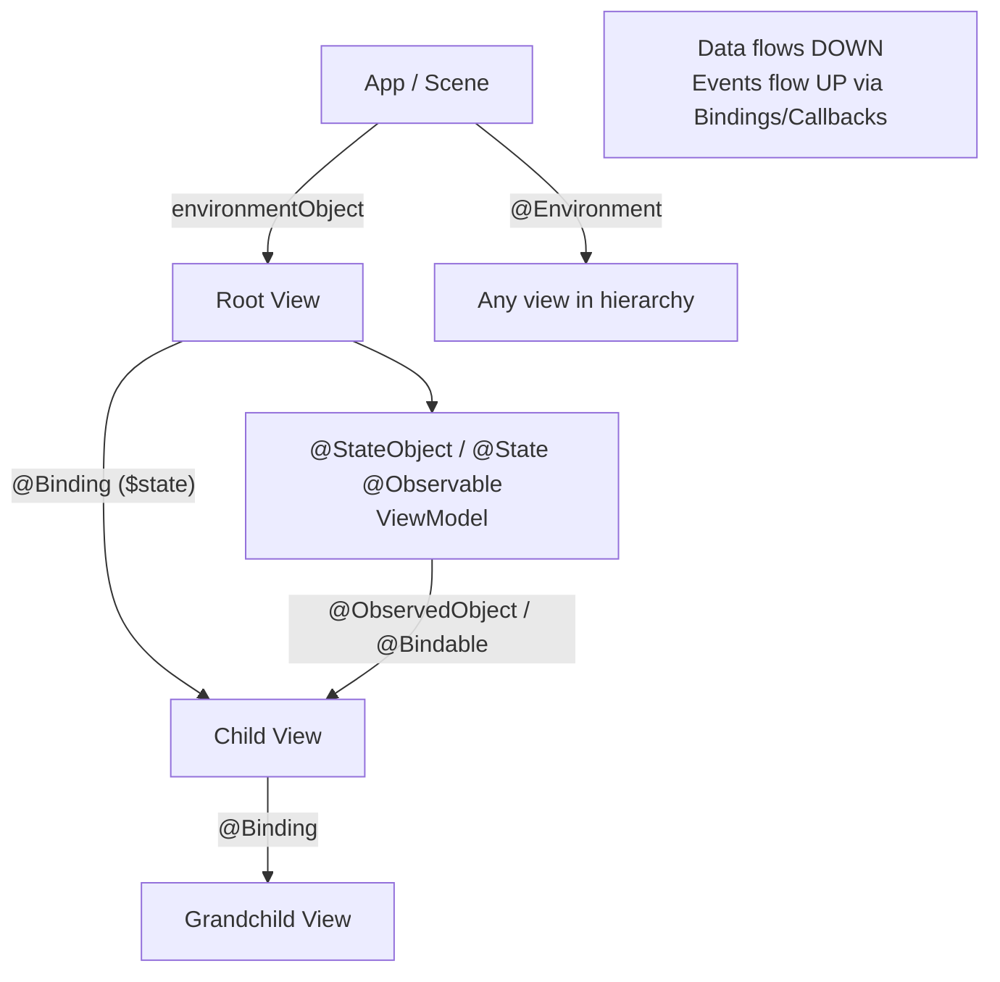

# SwiftUI State and Data Flow

> [!abstract] TL;DR
> SwiftUI has a layered state management system. Local state uses `@State`. Parent-child data sharing uses `@Binding`. Shared object state uses `@StateObject`/`@ObservableObject`/`@Published` (pre-iOS 17) or the new `@Observable` macro + `@Bindable` (iOS 17+). App-wide state uses `@EnvironmentObject` or `@Environment`. The golden rule: **data flows down (via bindings/parameters), events flow up (via bindings/callbacks)**.

---

## `@State` — Local Value State

```swift
struct CheckboxView: View {
    @State private var isChecked = false    // owned by this view

    var body: some View {
        Button {
            isChecked.toggle()
        } label: {
            HStack {
                Image(systemName: isChecked ? "checkmark.square" : "square")
                Text("Accept Terms")
            }
        }
    }
}
```

Use `@State` for: toggle values, text field content, scroll offset, animation triggers — anything ephemeral and view-local.

---

## `@Binding` — Child-Parent Two-Way Link

```swift
struct RatingView: View {
    @Binding var rating: Int    // NOT owned here — passed from parent

    var body: some View {
        HStack {
            ForEach(1...5, id: \.self) { star in
                Image(systemName: star <= rating ? "star.fill" : "star")
                    .onTapGesture { rating = star }
            }
        }
    }
}

struct ProductView: View {
    @State private var userRating = 0

    var body: some View {
        VStack {
            RatingView(rating: $userRating)   // $ extracts Binding<Int>
            Text("Your rating: \(userRating)")
        }
    }
}
```

---

## Pre-iOS 17: `@ObservableObject` + `@StateObject` + `@Published`

```swift
class CartViewModel: ObservableObject {
    @Published var items: [CartItem] = []      // triggers view refresh on change
    @Published var isLoading = false

    func addItem(_ item: CartItem) {
        items.append(item)
    }

    func checkout() async {
        await MainActor.run { isLoading = true }
        defer { Task { await MainActor.run { isLoading = false } } }
        try? await orderService.submit(items)
    }
}

struct CartView: View {
    @StateObject private var viewModel = CartViewModel()  // creates + owns the object

    var body: some View {
        List(viewModel.items) { item in
            ItemRow(item: item)
        }
        .overlay { if viewModel.isLoading { ProgressView() } }
    }
}

// Passing down — use @ObservedObject (does NOT own, does NOT create)
struct ItemDetailView: View {
    @ObservedObject var viewModel: CartViewModel   // receives existing instance
    var body: some View { ... }
}
```

---

## iOS 17+: `@Observable` Macro — The New Way

```swift
import Observation

@Observable
class CartViewModel {
    var items: [CartItem] = []    // no @Published needed — tracked automatically
    var isLoading = false

    func addItem(_ item: CartItem) { items.append(item) }
}

struct CartView: View {
    @State private var viewModel = CartViewModel()   // @State works with @Observable class

    var body: some View {
        List(viewModel.items) { item in
            ItemRow(item: item)
        }
    }
}

// @Bindable — creates bindings to @Observable properties
struct EditItemView: View {
    @Bindable var item: CartItem    // item must be @Observable

    var body: some View {
        TextField("Name", text: $item.name)   // $item.name is a Binding<String>
    }
}
```

`@Observable` is more efficient — only views that read a specific property re-render when that property changes.

---

## `@EnvironmentObject` — Dependency Injection

```swift
// Inject at app root
@main
struct ShopApp: App {
    @StateObject private var cart = CartViewModel()

    var body: some Scene {
        WindowGroup {
            ContentView()
                .environmentObject(cart)   // available to entire hierarchy
        }
    }
}

// Consume anywhere in the hierarchy
struct AddToCartButton: View {
    let product: Product
    @EnvironmentObject var cart: CartViewModel   // retrieved from environment

    var body: some View {
        Button("Add to Cart") {
            cart.addItem(CartItem(product: product))
        }
    }
}
```

**iOS 17+ alternative**: Use `@Environment` with `@Observable` types via custom `EnvironmentKey`.

---

## `@Environment` — System Values

```swift
struct AdaptiveView: View {
    @Environment(\.colorScheme) var colorScheme
    @Environment(\.horizontalSizeClass) var sizeClass
    @Environment(\.dynamicTypeSize) var typeSize

    var body: some View {
        Text("Hello")
            .background(colorScheme == .dark ? Color.black : Color.white)
    }
}

// Custom environment values
struct ThemeKey: EnvironmentKey {
    static let defaultValue: AppTheme = .default
}

extension EnvironmentValues {
    var appTheme: AppTheme {
        get { self[ThemeKey.self] }
        set { self[ThemeKey.self] = newValue }
    }
}
```

---

## Data Flow Hierarchy



---

## State Wrapper Summary

| Wrapper | Ownership | When to use |
|---|---|---|
| `@State` | Owns | Local value types, ephemeral UI state |
| `@Binding` | Reference | Child needs read-write access to parent's state |
| `@StateObject` | Owns | Creates and retains an ObservableObject |
| `@ObservedObject` | Reference | Receives an existing ObservableObject |
| `@Observable` + `@State` | Owns | iOS 17+ class models |
| `@Bindable` | Reference | iOS 17+ two-way bindings to @Observable |
| `@EnvironmentObject` | Reference | App-wide shared models |
| `@Environment` | Reference | System/custom environment values |

---

## Common Pitfalls

1. **`@ObservedObject` without `@StateObject` at the top** — if a parent creates the view model with `@ObservedObject`, it's re-created on every parent refresh. Always use `@StateObject` for the owner.
2. **Missing `.environmentObject()`** — accessing an `@EnvironmentObject` that wasn't injected crashes at runtime with a fatal error.
3. **`@Observable` and `@Published` mixing** — don't use `@Published` inside `@Observable` classes; it's redundant and can cause double-notification.
4. **Binding to non-`@Observable` class properties** — `$viewModel.property` only works if `viewModel` is `@StateObject`/`@ObservedObject` or `@Bindable`. Direct bindings to plain class properties don't trigger updates.
5. **Large `@EnvironmentObject` causing unnecessary re-renders** — split state into smaller objects injected closer to where they're needed.

---

## Review Questions

1. **What is the difference between `@StateObject` and `@ObservedObject`?**
   *Answer: `@StateObject` creates and owns the object — it persists across view re-renders. `@ObservedObject` observes an existing object passed in from outside — it doesn't prevent recreation. Always use `@StateObject` in the view that creates the model.*

2. **How does `@Observable` (iOS 17) differ from `@ObservableObject` in terms of re-render granularity?**
   *Answer: `@ObservableObject` re-renders all views observing the object whenever any `@Published` property changes. `@Observable` tracks which specific properties each view accesses and only re-renders views that read a changed property — much more efficient.*

3. **When would you choose `@EnvironmentObject` over passing a model as an init parameter?**
   *Answer: `@EnvironmentObject` avoids prop drilling — threading a model through many intermediate views that don't use it themselves. Use it for app-wide services (auth, cart, theme) that many distant views need. Use init parameters for local, tightly-coupled dependencies.*

#Swift #SwiftUI #State #DataFlow #Observable #EnvironmentObject
