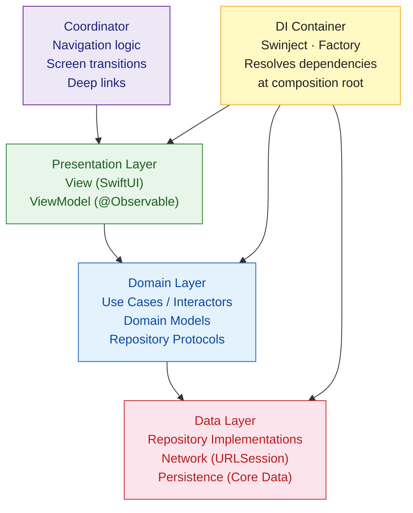

# Swift App Architecture

> [!abstract] TL;DR
> iOS apps need intentional architecture to stay maintainable as they grow. **MVVM** (Model-View-ViewModel) is the SwiftUI-native pattern — the `ViewModel` holds observable state and business logic, the `View` is a pure function of that state. **Clean Architecture** separates the app into concentric layers (Presentation → Domain → Data) with strict dependency rules. The **Coordinator pattern** extracts navigation from views. **Dependency Injection** (via Swinject, Factory, or manual containers) makes code testable by inverting control of dependencies.

---

## Intuition

**Analogy:** An unarchitected iOS app is like a restaurant where the waiter takes the order, cooks the food, manages the inventory, handles payment, and mops the floor. Chaos at scale. Architecture assigns dedicated roles: the View is a menu board (display only), the ViewModel is the order-taker (business logic), the Repository is the kitchen (data access), and the Coordinator is the host (navigation). Each role knows its job and nothing else — substituting or testing one role doesn't require changing any other.

---

## How It Works



---

## MVVM with SwiftUI

MVVM is the recommended pattern for SwiftUI — `@Observable` (iOS 17+) makes the ViewModel automatically drive view updates:

```swift
import SwiftUI
import Observation

// Domain Model — plain struct, no UI dependencies
struct Post: Identifiable, Equatable {
    let id: UUID
    var title: String
    var body: String
}

// ViewModel — @Observable drives SwiftUI reactivity
@Observable
@MainActor
final class PostListViewModel {
    // State — view reacts to changes automatically
    var posts: [Post] = []
    var isLoading     = false
    var errorMessage: String?

    private let repository: PostRepositoryProtocol

    // Dependency injected via initializer
    init(repository: PostRepositoryProtocol) {
        self.repository = repository
    }

    func loadPosts() async {
        isLoading    = true
        errorMessage = nil
        do {
            posts     = try await repository.fetchAll()
        } catch {
            errorMessage = error.localizedDescription
        }
        isLoading = false
    }

    func delete(post: Post) async {
        do {
            try await repository.delete(id: post.id)
            posts.removeAll { $0.id == post.id }
        } catch {
            errorMessage = error.localizedDescription
        }
    }
}

// View — pure function of ViewModel state
struct PostListView: View {
    @State private var viewModel: PostListViewModel

    init(repository: PostRepositoryProtocol) {
        _viewModel = State(wrappedValue: PostListViewModel(repository: repository))
    }

    var body: some View {
        Group {
            if viewModel.isLoading {
                ProgressView()
            } else if let error = viewModel.errorMessage {
                ErrorView(message: error, retry: { Task { await viewModel.loadPosts() } })
            } else {
                List(viewModel.posts) { post in
                    Text(post.title)
                        .swipeActions { Button("Delete", role: .destructive) {
                            Task { await viewModel.delete(post: post) }
                        }}
                }
            }
        }
        .task { await viewModel.loadPosts() }
        .navigationTitle("Posts")
    }
}
```

---

## Clean Architecture Layers

```swift
// ===== Domain Layer — no imports of UIKit, SwiftUI, or Alamofire =====

// Repository Protocol — interface only, no implementation
protocol PostRepositoryProtocol {
    func fetchAll() async throws -> [Post]
    func fetch(id: UUID) async throws -> Post
    func create(title: String, body: String) async throws -> Post
    func delete(id: UUID) async throws
}

// Use Case — orchestrates domain logic
struct FetchRecentPostsUseCase {
    let repository: PostRepositoryProtocol

    func execute(limit: Int = 20) async throws -> [Post] {
        let posts = try await repository.fetchAll()
        return Array(posts.prefix(limit))
    }
}

// ===== Data Layer — implements protocols from Domain =====

final class RemotePostRepository: PostRepositoryProtocol {
    private let apiClient: APIClientProtocol

    init(apiClient: APIClientProtocol) {
        self.apiClient = apiClient
    }

    func fetchAll() async throws -> [Post] {
        let dtos: [PostDTO] = try await apiClient.get("/api/posts")
        return dtos.map { Post(id: $0.id, title: $0.title, body: $0.body) }
    }

    func fetch(id: UUID) async throws -> Post {
        let dto: PostDTO = try await apiClient.get("/api/posts/\(id)")
        return Post(id: dto.id, title: dto.title, body: dto.body)
    }

    func create(title: String, body: String) async throws -> Post {
        let dto: PostDTO = try await apiClient.post("/api/posts", body: ["title": title, "body": body])
        return Post(id: dto.id, title: dto.title, body: dto.body)
    }

    func delete(id: UUID) async throws {
        try await apiClient.delete("/api/posts/\(id)")
    }
}

// For testing — in-memory implementation of the same protocol
final class MockPostRepository: PostRepositoryProtocol {
    var posts: [Post] = []

    func fetchAll()         async throws -> [Post]   { posts }
    func fetch(id: UUID)    async throws -> Post     { posts.first { $0.id == id }! }
    func create(title: String, body: String) async throws -> Post {
        let post = Post(id: UUID(), title: title, body: body)
        posts.append(post)
        return post
    }
    func delete(id: UUID)   async throws { posts.removeAll { $0.id == id } }
}
```

---

## Coordinator Pattern

The Coordinator extracts navigation logic from views, enabling navigation to be unit-tested and reused:

```swift
import SwiftUI

// NavigationPath-based Coordinator (SwiftUI NavigationStack)
enum AppRoute: Hashable {
    case postList
    case postDetail(Post)
    case createPost
    case settings
}

@Observable
@MainActor
final class AppCoordinator {
    var path = NavigationPath()

    func push(_ route: AppRoute) {
        path.append(route)
    }

    func pop() {
        guard !path.isEmpty else { return }
        path.removeLast()
    }

    func popToRoot() {
        path = NavigationPath()
    }
}

// Root view wires routes to views
struct RootView: View {
    @State private var coordinator = AppCoordinator()
    @Environment(DIContainer.self) private var container

    var body: some View {
        NavigationStack(path: $coordinator.path) {
            PostListView(repository: container.postRepository)
                .navigationDestination(for: AppRoute.self) { route in
                    switch route {
                    case .postList:
                        PostListView(repository: container.postRepository)
                    case .postDetail(let post):
                        PostDetailView(post: post)
                    case .createPost:
                        CreatePostView(repository: container.postRepository)
                    case .settings:
                        SettingsView()
                    }
                }
        }
        .environment(coordinator)
    }
}
```

---

## Dependency Injection

### Manual DI Container

```swift
// Simple composition root — no third-party library needed for small apps
@Observable
final class DIContainer {
    static let shared = DIContainer()

    // Network
    lazy var apiClient: APIClientProtocol = URLSessionAPIClient(
        baseURL: URL(string: "https://api.myapp.com")!
    )

    // Repositories
    lazy var postRepository: PostRepositoryProtocol = RemotePostRepository(apiClient: apiClient)
    lazy var userRepository: UserRepositoryProtocol = RemoteUserRepository(apiClient: apiClient)

    // Use Cases
    lazy var fetchRecentPosts = FetchRecentPostsUseCase(repository: postRepository)

    // Swap for testing
    static func testing() -> DIContainer {
        let container = DIContainer()
        container.postRepository = MockPostRepository()  // override
        return container
    }
}

// Inject at app entry point
@main
struct MyApp: App {
    var body: some Scene {
        WindowGroup {
            RootView()
                .environment(DIContainer.shared)
        }
    }
}
```

### Factory (Type-Safe DI Library)

```swift
// Package.swift dependency
.package(url: "https://github.com/hmlongco/Factory.git", from: "2.3.0")

import Factory

// Define container
extension Container {
    var apiClient: Factory<APIClientProtocol> {
        self { URLSessionAPIClient(baseURL: URL(string: "https://api.myapp.com")!) }
            .singleton
    }

    var postRepository: Factory<PostRepositoryProtocol> {
        self { RemotePostRepository(apiClient: self.apiClient()) }
            .singleton
    }
}

// Usage — auto-resolves dependencies
@Observable
final class PostListViewModel {
    @Injected(\.postRepository) private var repository
    var posts: [Post] = []
    // ...
}

// Override in tests
func testPostLoading() async throws {
    Container.shared.postRepository.register { MockPostRepository() }
    // ... test with mock
    Container.shared.reset()   // restore after test
}
```

---

## Architecture Comparison

| Pattern | Complexity | Testability | SwiftUI Fit | Best For |
|---|---|---|---|---|
| **MVC** | Low | Poor (massive VC) | Poor | Prototypes, small screens |
| **MVVM** | Medium | Good | Excellent | Most SwiftUI apps |
| **Clean Architecture** | High | Excellent | Good | Large teams, complex domains |
| **TCA (The Composable Architecture)** | High | Excellent | Good | Predictable state, Redux-style |
| **VIPER** | Very High | Excellent | Poor | Large UIKit codebases |

---

## Common Pitfalls

- **ViewModel importing SwiftUI** — `@Observable` is in `Observation` framework (importable from non-SwiftUI targets). A ViewModel that imports `SwiftUI` cannot be unit-tested without a simulator. Keep ViewModels in a separate target.
- **Massive ViewModel** — moving all app logic into one ViewModel recreates Massive View Controller. Use Use Cases to extract multi-step business operations.
- **Strong reference cycles in coordinators** — coordinators that hold strong references to child coordinators and never release them leak memory. Use arrays of weak references for child coordinators.
- **Forgetting `@MainActor`** — ViewModels that update `@Published` or `@Observable` properties must do so on the main actor. Forgetting `@MainActor` on async functions causes runtime warnings and potential crashes.
- **Over-engineering small apps** — Clean Architecture with 5 layers is overkill for a 3-screen app. Start with MVVM and extract layers when complexity justifies it.

---

## Review Questions

1. In MVVM, which layer owns the navigation logic, and why is that a problem solved by the Coordinator pattern?
2. Why should the Domain layer not import UIKit or SwiftUI? What does this enforce architecturally?
3. Explain the difference between constructor injection and property injection. When would you prefer each?
4. A team uses `DIContainer.shared` throughout the codebase. What problem does this cause in unit tests, and how does Factory solve it?

---

#Swift #Architecture #MVVM #CleanArchitecture #Coordinator #DependencyInjection #Swinject
