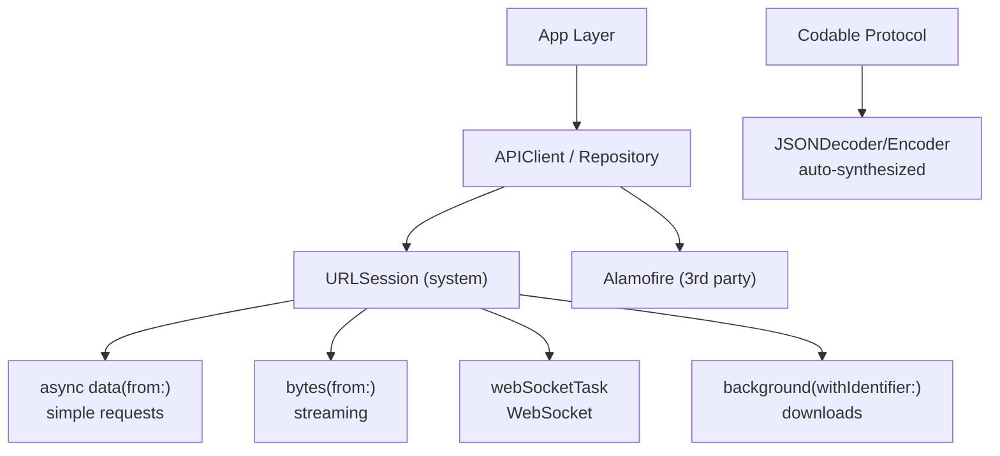

# Swift Networking

> [!abstract] TL;DR
> `URLSession` is the system networking foundation. Its modern async/await API (`data(from:)`, `bytes(from:)`) integrates cleanly with structured concurrency. `Codable` handles JSON decode/encode with zero boilerplate for simple types. Alamofire provides a higher-level API for complex scenarios. `URLSessionWebSocketTask` enables WebSocket connections. Certificate pinning and `URLProtocol` subclassing enable advanced security and testing.

---

## `URLSession` — Modern Async API

```swift
// Simple GET request
struct User: Codable {
    let id: Int
    let name: String
    let email: String
}

func fetchUser(id: Int) async throws -> User {
    let url = URL(string: "https://api.example.com/users/\(id)")!
    let (data, response) = try await URLSession.shared.data(from: url)

    guard let http = response as? HTTPURLResponse,
          (200..<300).contains(http.statusCode) else {
        throw NetworkError.badResponse((response as? HTTPURLResponse)?.statusCode ?? 0)
    }

    return try JSONDecoder().decode(User.self, from: data)
}
```

---

## `URLRequest` — Full Control

```swift
func createPost(title: String, body: String) async throws -> Post {
    var request = URLRequest(url: URL(string: "https://api.example.com/posts")!)
    request.httpMethod = "POST"
    request.setValue("application/json", forHTTPHeaderField: "Content-Type")
    request.setValue("Bearer \(token)", forHTTPHeaderField: "Authorization")
    request.timeoutInterval = 30

    let payload = ["title": title, "body": body]
    request.httpBody = try JSONEncoder().encode(payload)

    let (data, response) = try await URLSession.shared.data(for: request)
    try validateResponse(response)
    return try JSONDecoder().decode(Post.self, from: data)
}
```

---

## JSON Decoding with `Codable`

```swift
// Standard — auto-synthesized
struct Article: Codable {
    let id: UUID
    let title: String
    let publishedAt: Date
    let tags: [String]
}

// Custom date format
let decoder = JSONDecoder()
decoder.dateDecodingStrategy = .iso8601
decoder.keyDecodingStrategy = .convertFromSnakeCase   // "published_at" → publishedAt

let articles = try decoder.decode([Article].self, from: data)

// Nested / complex structures
struct APIResponse<T: Codable>: Codable {
    let data: T
    let meta: Meta
    let errors: [APIError]?
}

// Decode nested response
let response = try decoder.decode(APIResponse<[Article]>.self, from: data)
let articles = response.data
```

---

## Error Handling Pattern

```swift
enum NetworkError: Error {
    case badURL
    case badResponse(Int)
    case decodingError(Error)
    case noConnection
}

struct APIClient {
    private let session: URLSession
    private let decoder: JSONDecoder

    init() {
        let config = URLSessionConfiguration.default
        config.timeoutIntervalForRequest = 30
        config.waitsForConnectivity = true    // waits for network, doesn't fail immediately
        session = URLSession(configuration: config)

        decoder = JSONDecoder()
        decoder.keyDecodingStrategy = .convertFromSnakeCase
        decoder.dateDecodingStrategy = .iso8601
    }

    func fetch<T: Codable>(_ type: T.Type, from url: URL) async throws -> T {
        do {
            let (data, response) = try await session.data(from: url)
            guard let http = response as? HTTPURLResponse else { throw NetworkError.badResponse(0) }
            guard (200..<300).contains(http.statusCode) else { throw NetworkError.badResponse(http.statusCode) }
            return try decoder.decode(T.self, from: data)
        } catch is DecodingError {
            throw NetworkError.decodingError(error)
        }
    }
}
```

---

## Background Downloads

```swift
// Background URLSession — continues when app is suspended
let config = URLSessionConfiguration.background(withIdentifier: "com.myapp.downloads")
config.isDiscretionary = false   // start immediately, don't defer to low-traffic periods
let backgroundSession = URLSession(configuration: config, delegate: delegate, delegateQueue: nil)

let downloadTask = backgroundSession.downloadTask(with: url)
downloadTask.resume()

// In AppDelegate / SceneDelegate
func application(_ application: UIApplication, handleEventsForBackgroundURLSession identifier: String, completionHandler: @escaping () -> Void) {
    backgroundCompletionHandler = completionHandler
}
```

---

## Streaming with `AsyncSequence`

```swift
// Stream response bytes line by line
func streamLines(from url: URL) async throws {
    let (asyncBytes, _) = try await URLSession.shared.bytes(from: url)

    for try await line in asyncBytes.lines {
        // Each line arrives as it streams — Server-Sent Events, NDJSON, etc.
        print(line)
    }
}

// Combine with JSON parsing for streaming APIs
for try await line in asyncBytes.lines {
    if let data = line.data(using: .utf8),
       let event = try? decoder.decode(StreamEvent.self, from: data) {
        await MainActor.run { events.append(event) }
    }
}
```

---

## WebSocket with `URLSessionWebSocketTask`

```swift
class WebSocketClient {
    private var task: URLSessionWebSocketTask?

    func connect(to url: URL) {
        task = URLSession.shared.webSocketTask(with: url)
        task?.resume()
        receive()
    }

    private func receive() {
        task?.receive { [weak self] result in
            switch result {
            case .success(.string(let text)):
                print("Received: \(text)")
                self?.receive()   // recursively queue next receive
            case .success(.data(let data)):
                print("Binary: \(data.count) bytes")
                self?.receive()
            case .failure(let error):
                print("Error: \(error)")
            }
        }
    }

    func send(_ message: String) async throws {
        try await task?.send(.string(message))
    }

    func disconnect() {
        task?.cancel(with: .goingAway, reason: nil)
    }
}
```

---

## Alamofire Overview

```swift
import Alamofire

// GET with Codable response
AF.request("https://api.example.com/users")
    .responseDecodable(of: [User].self) { response in
        switch response.result {
        case .success(let users): print(users)
        case .failure(let error): print(error)
        }
    }

// async/await API
let users = try await AF.request("https://api.example.com/users")
    .serializingDecodable([User].self)
    .value

// Request interceptor — auth header injection + retry
class AuthInterceptor: RequestInterceptor {
    func adapt(_ urlRequest: URLRequest, for session: Session, completion: @escaping (Result<URLRequest, Error>) -> Void) {
        var request = urlRequest
        request.setValue("Bearer \(token)", forHTTPHeaderField: "Authorization")
        completion(.success(request))
    }
}
```

---

## Networking Architecture



---

## Common Pitfalls

1. **Not checking HTTP status code** — `URLSession` doesn't throw for 4xx/5xx responses; only network-level errors throw. Always validate `HTTPURLResponse.statusCode`.
2. **`URLSession.shared` for background downloads** — `URLSession.shared` doesn't support background transfers. Must create a `URLSession` with a background configuration.
3. **Decoding on the main thread** — `JSONDecoder().decode` is CPU-bound; for large responses, decode in a background Task to avoid frame drops.
4. **`waitsForConnectivity`** — if not set, requests fail immediately with no network. Set it to `true` so the session waits for connectivity before failing.
5. **Memory leaks in delegate-based sessions** — `URLSession` retains its delegate strongly. Use a weak delegate reference or invalidate the session when done.

---

## Review Questions

1. **Why doesn't URLSession throw an error for a 404 or 500 HTTP response?**
   *Answer: URLSession only throws for transport-level errors (no network, timeout, TLS failure). The server did respond successfully at the network level. You must inspect `HTTPURLResponse.statusCode` manually and throw a domain-specific error for non-2xx responses.*

2. **How does `bytes(from:)` differ from `data(from:)` for streaming APIs?**
   *Answer: `data(from:)` waits for the full response body before returning. `bytes(from:)` returns an `URLSession.AsyncBytes` — an `AsyncSequence` that lets you read the response incrementally as bytes arrive, suitable for streaming APIs (SSE, NDJSON, LLM completions).*

3. **What is a `RequestInterceptor` in Alamofire and what two capabilities does it provide?**
   *Answer: A `RequestInterceptor` combines `RequestAdapter` (modify requests before sending — inject auth tokens, add headers) and `RequestRetrier` (decide whether to retry a failed request — useful for 401 token refresh flows).*

#Swift #SwiftUI #Networking #URLSession #Codable #Alamofire
