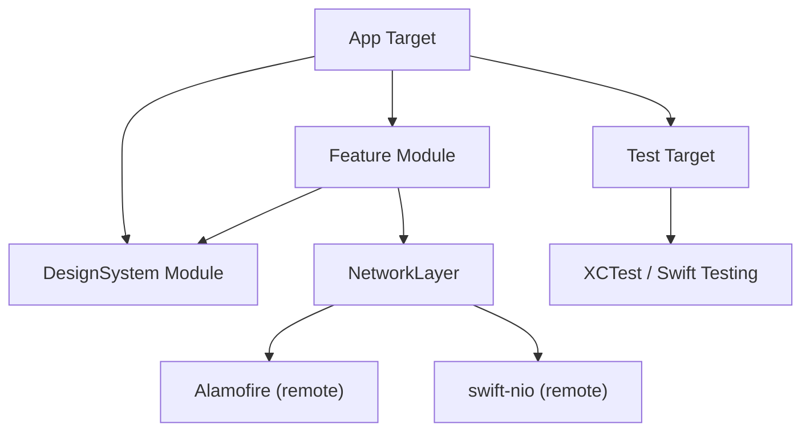

# Swift Package Manager

> [!abstract] TL;DR
> SPM is Swift's official build system and dependency manager, built into the Swift toolchain. It uses a `Package.swift` manifest — itself a Swift file — to describe targets, products, and external dependencies. SPM supports resources (assets, JSON files), plugins (code generation, linting), local packages for modularization, and full Xcode integration. All Apple platform libraries and open-source Swift libraries are available via SPM.

---

## `Package.swift` Manifest

```swift
// swift-tools-version: 5.9
import PackageDescription

let package = Package(
    name: "MyApp",
    platforms: [
        .iOS(.v16),
        .macOS(.v13),
        .watchOS(.v9),
        .tvOS(.v16)
    ],
    products: [
        // .library — used by other packages
        .library(name: "MyLibrary", targets: ["MyLibrary"]),
        // .executable — standalone CLI tool
        .executable(name: "MyCLI", targets: ["MyCLI"]),
    ],
    dependencies: [
        // Remote dependency — from tag
        .package(url: "https://github.com/apple/swift-argument-parser", from: "1.3.0"),
        // Remote — exact version
        .package(url: "https://github.com/vapor/vapor", exact: "4.89.0"),
        // Remote — branch (unstable)
        .package(url: "https://github.com/apple/swift-nio", branch: "main"),
        // Local — relative path (sibling package)
        .package(path: "../SharedModels"),
    ],
    targets: [
        .target(
            name: "MyLibrary",
            dependencies: [
                .product(name: "ArgumentParser", package: "swift-argument-parser"),
            ],
            path: "Sources/MyLibrary",
            resources: [
                .process("Resources"),       // copy resources, process assets
                .copy("Config/default.json") // copy as-is
            ]
        ),
        .executableTarget(
            name: "MyCLI",
            dependencies: ["MyLibrary"]
        ),
        .testTarget(
            name: "MyLibraryTests",
            dependencies: ["MyLibrary"]
        ),
    ]
)
```

---

## CLI Commands

```bash
# Create packages
swift package init --name MyLib --type library      # .library
swift package init --name MyCLI --type executable   # .executable
swift package init --name MyPlugin --type plugin    # build tool plugin

# Build and run
swift build                           # build all targets
swift build -c release                # optimized release build
swift run MyCLI --help                # build + run executable
swift run -c release MyCLI           # run release build

# Testing
swift test                            # run all tests
swift test --filter MyLibraryTests    # filter by test target name
swift test --parallel                 # run tests in parallel

# Package management
swift package resolve                 # resolve dependency graph
swift package update                  # update to latest compatible versions
swift package show-dependencies       # print dependency tree
swift package generate-xcodeproj      # legacy: generate .xcodeproj

# Documentation
swift package generate-documentation  # generate DocC documentation
```

---

## Target Types

| Target | Purpose | Key field |
|---|---|---|
| `.target` | Library — importable by other targets | `sources`, `resources` |
| `.executableTarget` | CLI tool with a `@main` entry point | `sources` |
| `.testTarget` | Unit/integration tests | `dependencies` (test framework) |
| `.binaryTarget` | Pre-compiled XCFramework | `url` + `checksum` or `path` |
| `.plugin` | Build-time code gen or linting | `capability` |
| `.macro` | Swift macros (SE-0382) | `dependencies: [SwiftSyntax]` |

---

## Dependency Versioning

```swift
// Semantic version constraints
.package(url: "...", from: "2.0.0")              // 2.0.0 ..< 3.0.0
.package(url: "...", "2.0.0"..<"2.5.0")          // explicit range
.package(url: "...", exact: "2.3.1")              // pin to exact version
.package(url: "...", .upToNextMajor(from: "1.0")) // <2.0.0

// Branch / revision (for development)
.package(url: "...", branch: "feature/new-api")
.package(url: "...", revision: "abc123def")
```

---

## Local Packages for Modularization

Break a large app into isolated modules:

```
MyApp/
├── Package.swift          # local package manifest
├── Sources/
│   ├── AppFeature/        # main app target
│   ├── AuthFeature/       # auth module
│   ├── NetworkLayer/      # networking module
│   └── DesignSystem/      # UI components
└── Tests/
    └── AuthFeatureTests/
```

```swift
// In Package.swift — all modules in one package
targets: [
    .target(name: "DesignSystem"),
    .target(name: "NetworkLayer"),
    .target(name: "AuthFeature", dependencies: ["NetworkLayer", "DesignSystem"]),
    .target(name: "AppFeature", dependencies: ["AuthFeature", "DesignSystem"]),
]
```

Benefits: incremental compilation, clear dependency graph, testability.

---

## Build Tool Plugins (SPM 5.6+)

```swift
// In Package.swift — declare a plugin
.plugin(
    name: "SwiftGenPlugin",
    capability: .buildTool(),
    dependencies: [.product(name: "swiftgen", package: "SwiftGen")]
)

// Use in a target
.target(name: "MyApp", plugins: [.plugin(name: "SwiftGenPlugin")])
```

Plugins run during the build — for code generation (SwiftGen, Sourcery), linting (SwiftLint), formatting (SwiftFormat).

---

## Xcode Integration

```
File → Add Package Dependencies...
Enter repository URL → choose version rule → Add Package

# Or resolve existing Package.swift in Xcode:
File → Packages → Resolve Package Versions
```

`Package.resolved` (auto-generated) locks the exact resolved versions — commit this file to source control for reproducible builds.

---

## Package Dependency Graph



---

## Common Pitfalls

1. **`swift-tools-version` mismatch** — the version in the first line of `Package.swift` determines which Package API features are available. Using a newer API with an old tools version is a parse error.
2. **`.process` vs `.copy` resources** — `.process` applies platform-appropriate transformations (asset catalog compilation for `.xcassets`); `.copy` copies verbatim. Using `.copy` on `.xcassets` skips compilation.
3. **Circular dependencies** — SPM will report a "cyclic dependency" error. Restructure to break cycles (extract shared code into a common module).
4. **Missing `Package.resolved` in `.gitignore`** — committing `Package.resolved` ensures all developers build with the same dependency versions. Do NOT `.gitignore` it.
5. **`.executableTarget` with multiple `@main`** — only one entry point per executable target. Multiple `@main` types cause a compile error.

---

## Review Questions

1. **What is the difference between a `.target` and a `.product` in `Package.swift`?**
   *Answer: A `.target` is a build unit (a directory of sources). A `.product` is what the package exposes to the outside world — it can bundle one or more targets. Consumers depend on products, not targets directly.*

2. **Why should you commit `Package.resolved` to version control?**
   *Answer: `Package.resolved` locks the exact resolved versions of all transitive dependencies. Without it, `swift package resolve` might pick different patch versions on different machines, causing reproducibility issues.*

3. **What is the benefit of organizing an app as multiple local SPM targets vs. a monolithic target?**
   *Answer: Multiple targets enforce clean module boundaries through access control (internal vs public). They enable incremental compilation (only changed modules rebuild), improve testability (test each module in isolation), and prevent accidental coupling between features.*

#Swift #SwiftUI #SPM #PackageManager #Dependencies
