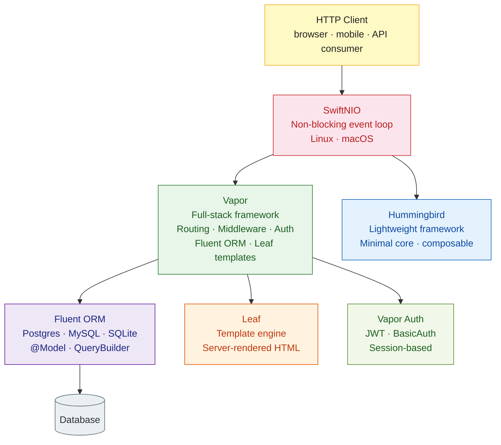

# Swift Server-Side Development

> [!abstract] TL;DR
> Swift runs on Linux and is a capable backend language. **Vapor** is the most mature framework — a full-stack HTTP framework with routing, middleware, Fluent ORM (PostgreSQL, MySQL, SQLite), Leaf templating, and JWT authentication. **Hummingbird** is a lightweight alternative optimized for minimal overhead. Both are built on Apple's SwiftNIO (non-blocking I/O framework) and use Swift's `async`/`await` throughout. Swift's static typing and ARC memory model make it fast and predictable in server contexts.

---

## Intuition

**Analogy:** Vapor is to Swift as Rails is to Ruby — a full-stack, opinionated framework with ORM, templating, authentication, and conventions baked in. Hummingbird is more like Sinatra — a minimal core you extend yourself. Both run on SwiftNIO, which is Swift's equivalent of Node.js's libuv: an event-driven, non-blocking I/O engine that handles thousands of connections on a few threads without blocking.

---

## How It Works



---

## Vapor — Project Setup

```bash
# Install Vapor toolbox
brew install vapor

# Create new project
vapor new HelloAPI --template api
cd HelloAPI

# Run in development
swift run

# Run with hot reload (requires watchman)
vapor run serve --auto-migrate
```

```swift
// Package.swift — Vapor project dependencies
// swift-tools-version: 5.9
import PackageDescription

let package = Package(
    name: "HelloAPI",
    platforms: [.macOS(.v13)],
    dependencies: [
        .package(url: "https://github.com/vapor/vapor.git", from: "4.99.0"),
        .package(url: "https://github.com/vapor/fluent.git", from: "4.9.0"),
        .package(url: "https://github.com/vapor/fluent-postgres-driver.git", from: "2.8.0"),
        .package(url: "https://github.com/vapor/leaf.git", from: "4.3.0"),
        .package(url: "https://github.com/vapor/jwt.git", from: "4.2.2"),
    ],
    targets: [
        .executableTarget(
            name: "App",
            dependencies: [
                .product(name: "Vapor",          package: "vapor"),
                .product(name: "Fluent",         package: "fluent"),
                .product(name: "FluentPostgresDriver", package: "fluent-postgres-driver"),
                .product(name: "Leaf",           package: "leaf"),
                .product(name: "JWT",            package: "jwt"),
            ]
        ),
    ]
)
```

---

## Routing and Controllers

```swift
// Sources/App/routes.swift
import Vapor

func routes(_ app: Application) throws {
    // Simple route
    app.get("hello") { req async -> String in
        "Hello, world!"
    }

    // Route groups
    let api = app.grouped("api", "v1")
    try api.register(collection: PostController())
    try api.register(collection: UserController())
}

// Sources/App/Controllers/PostController.swift
import Vapor
import Fluent

struct PostController: RouteCollection {
    func boot(routes: RoutesBuilder) throws {
        let posts = routes.grouped("posts")
        posts.get(use: index)
        posts.post(use: create)
        posts.group(":postID") { post in
            post.get(use: show)
            post.put(use: update)
            post.delete(use: delete)
        }
    }

    // GET /api/v1/posts
    func index(req: Request) async throws -> [PostDTO] {
        let posts = try await Post.query(on: req.db)
            .with(\.$author)
            .all()
        return posts.map { PostDTO(post: $0) }
    }

    // GET /api/v1/posts/:postID
    func show(req: Request) async throws -> PostDTO {
        guard let post = try await Post.find(req.parameters.get("postID"), on: req.db) else {
            throw Abort(.notFound, reason: "Post not found")
        }
        return PostDTO(post: post)
    }

    // POST /api/v1/posts
    func create(req: Request) async throws -> PostDTO {
        try CreatePostDTO.validate(content: req)
        let dto  = try req.content.decode(CreatePostDTO.self)
        let post = Post(title: dto.title, body: dto.body, authorID: dto.authorID)
        try await post.save(on: req.db)
        return PostDTO(post: post)
    }

    func update(req: Request) async throws -> PostDTO {
        guard let post = try await Post.find(req.parameters.get("postID"), on: req.db) else {
            throw Abort(.notFound)
        }
        let dto = try req.content.decode(UpdatePostDTO.self)
        post.title = dto.title ?? post.title
        post.body  = dto.body  ?? post.body
        try await post.update(on: req.db)
        return PostDTO(post: post)
    }

    func delete(req: Request) async throws -> HTTPStatus {
        guard let post = try await Post.find(req.parameters.get("postID"), on: req.db) else {
            throw Abort(.notFound)
        }
        try await post.delete(on: req.db)
        return .noContent
    }
}
```

---

## Middleware

```swift
// Custom middleware — request logging
struct RequestLoggingMiddleware: AsyncMiddleware {
    func respond(to req: Request, chainingTo next: AsyncResponder) async throws -> Response {
        let start = Date()
        req.logger.info("\(req.method) \(req.url.path)")
        let response = try await next.respond(to: req)
        let duration = Date().timeIntervalSince(start) * 1000
        req.logger.info("Responded \(response.status.code) in \(Int(duration))ms")
        return response
    }
}

// Register in configure.swift
app.middleware.use(RequestLoggingMiddleware())
app.middleware.use(FileMiddleware(publicDirectory: app.directory.publicDirectory))
app.middleware.use(ErrorMiddleware.default(environment: app.environment))
```

---

## Fluent ORM

```swift
// Sources/App/Models/Post.swift
import Fluent
import Vapor

final class Post: Model, Content {
    static let schema = "posts"

    @ID(key: .id)
    var id: UUID?

    @Field(key: "title")
    var title: String

    @Field(key: "body")
    var body: String

    @Parent(key: "author_id")
    var author: User

    @Timestamp(key: "created_at", on: .create)
    var createdAt: Date?

    @Timestamp(key: "updated_at", on: .update)
    var updatedAt: Date?

    init() {}

    init(id: UUID? = nil, title: String, body: String, authorID: User.IDValue) {
        self.id       = id
        self.title    = title
        self.body     = body
        self.$author.id = authorID
    }
}

// Migration
struct CreatePost: AsyncMigration {
    func prepare(on database: Database) async throws {
        try await database.schema("posts")
            .id()
            .field("title",      .string, .required)
            .field("body",       .string, .required)
            .field("author_id",  .uuid, .required, .references("users", "id", onDelete: .cascade))
            .field("created_at", .datetime)
            .field("updated_at", .datetime)
            .create()
    }

    func revert(on database: Database) async throws {
        try await database.schema("posts").delete()
    }
}

// QueryBuilder examples
let allPosts  = try await Post.query(on: db).all()
let published = try await Post.query(on: db)
    .filter(\.$title ~~ "Swift")        // LIKE '%Swift%'
    .sort(\.$createdAt, .descending)
    .limit(20)
    .with(\.$author)
    .all()
```

---

## Leaf Templating

```swift
// configure.swift
app.views.use(.leaf)
```

```html
<!-- Resources/Views/posts/index.leaf -->
<!DOCTYPE html>
<html>
<head><title>Posts</title></head>
<body>
  <h1>Posts</h1>
  #for(post in posts):
    <article>
      <h2>#(post.title)</h2>
      <p>#(post.body)</p>
      <small>By #(post.author.name)</small>
    </article>
  #endfor
</body>
</html>
```

```swift
// Render a Leaf template from a controller
func renderIndex(req: Request) async throws -> View {
    let posts = try await Post.query(on: req.db).with(\.$author).all()
    let context = ["posts": posts]
    return try await req.view.render("posts/index", context)
}
```

---

## Hummingbird — Lightweight Alternative

```swift
// Package.swift dependency
.package(url: "https://github.com/hummingbird-project/hummingbird.git", from: "2.0.0")

// Sources/App/main.swift
import Hummingbird

let router = Router()

router.get("hello") { req, ctx -> String in
    "Hello from Hummingbird!"
}

router.post("echo") { req, ctx -> ByteBuffer in
    try await req.body.collect(upTo: 1024 * 1024)
}

let app = Application(
    router: router,
    configuration: .init(address: .hostname("0.0.0.0", port: 8080))
)

try await app.runService()
```

---

## Vapor vs Hummingbird

| Feature | Vapor | Hummingbird |
|---|---|---|
| Maturity | 4+ years, large community | Newer, actively developed |
| ORM | Fluent (built-in) | Use libraries (ORMKit / raw SQL) |
| Templating | Leaf (built-in) | External |
| Auth | JWT, BasicAuth built-in | Middleware-based |
| Performance | Very good | Slightly faster (less overhead) |
| Bundle size | Larger | Minimal |
| Best for | Full-featured APIs, CRUD apps | Microservices, high-perf proxies |

---

## Common Pitfalls

- **Blocking on non-async code** — calling blocking APIs (e.g., Foundation's `URLSession.dataTask` without `async`) inside a Vapor route blocks the event loop thread and degrades all concurrent requests. Always use `async`/`await` variants.
- **Missing `@Sendable` on closures** — Swift 6 strict concurrency enforces that closures passed to concurrent contexts are `@Sendable`. Vapor's route closures must not capture mutable non-Sendable state.
- **`Content` conformation vs `Codable`** — Vapor's `Content` protocol wraps `Codable` and adds HTTP content-type negotiation. Using plain `Codable` without `Content` won't decode request bodies automatically.
- **Fluent eager loading** — accessing `post.author.name` without `.with(\.$author)` in the query causes a runtime crash (lazy loading is not supported). Always eager load relationships.
- **Database connection pool on Linux** — Fluent defaults to a small pool size. Under load, requests queue waiting for a connection. Set `maxConnectionsPerEventLoop` in `configure.swift`.

---

## Review Questions

1. What is SwiftNIO and why is it important for server-side Swift performance?
2. How does Fluent's `@Parent` property wrapper differ from a plain stored property?
3. A Vapor route handler needs to call a CPU-intensive function. Why should you use `Task.detached` or a custom executor rather than calling it inline?
4. What is the difference between Vapor and Hummingbird in terms of philosophy and use cases?

---

#Swift #Vapor #Hummingbird #ServerSide #Fluent #Leaf #async
