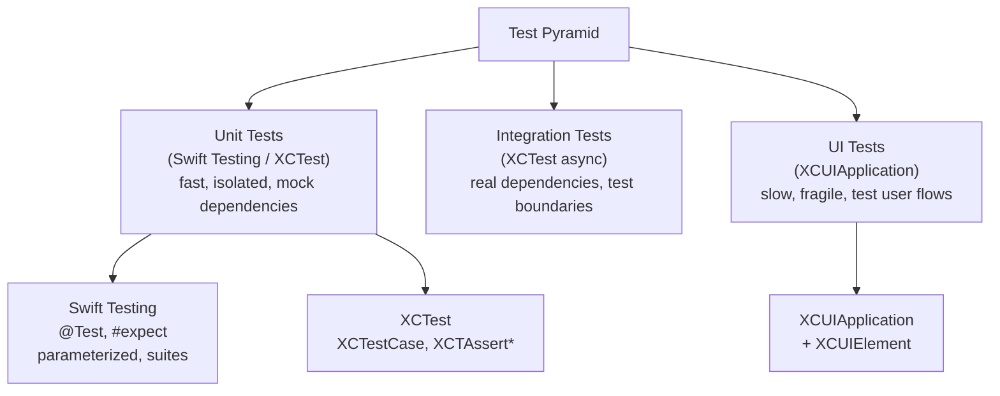

# Swift Testing

> [!abstract] TL;DR
> Swift has two testing frameworks: the mature **XCTest** (all platforms, all iOS versions) and the modern **Swift Testing** (iOS 17+/Xcode 16+, SE-0402). Swift Testing uses macros (`@Test`, `#expect`, `@Suite`) and is more expressive — parameterized tests, structured suites, async support, and better failure messages. Both can coexist in the same test target. Use Swift Testing for new tests; XCTest for UI testing and pre-iOS-17 targets.

---

## Swift Testing Framework (iOS 17+ / Xcode 16)

### Basic Test Structure

```swift
import Testing

@Suite("Task Management Tests")
struct TaskTests {
    // @Test marks a test function — no "test" prefix required
    @Test("Task is created with default values")
    func taskDefaults() {
        let task = Task(title: "Buy groceries")
        #expect(task.isCompleted == false)
        #expect(task.priority == 0)
        #expect(!task.title.isEmpty)
    }

    @Test("Completing a task sets isCompleted flag")
    func completeTask() {
        var task = Task(title: "Clean house")
        task.complete()
        #expect(task.isCompleted)
    }

    @Test("Task throws on empty title")
    func emptyTitleThrows() {
        #expect(throws: ValidationError.emptyField("title")) {
            try Task(validatedTitle: "")
        }
    }
}
```

### `#expect` and `#require`

```swift
// #expect — records failure but continues execution
#expect(result == expectedValue)
#expect(array.count == 5, "Expected 5 items, got \(array.count)")

// #require — throws if fails (stops current test)
let user = try #require(try? fetchUser(id: 1))   // test fails immediately if nil
#expect(user.name == "Alice")

// Negation
#expect(!items.isEmpty)

// Optional unwrapping
#expect(optionalValue != nil)
let value = try #require(optionalValue)    // unwraps or fails
```

### Parameterized Tests

```swift
@Test("Validates email addresses", arguments: [
    ("valid@email.com", true),
    ("invalid-email",  false),
    ("also@invalid",   false),
    ("ok@test.org",    true),
])
func emailValidation(email: String, expectedValid: Bool) {
    #expect(EmailValidator.isValid(email) == expectedValid)
})

// Parameterized with enum cases
@Test("All sort orders produce valid results", arguments: SortOrder.allCases)
func sortOrders(order: SortOrder) {
    let sorted = items.sorted(by: order)
    #expect(sorted.count == items.count)
    #expect(sorted.first != nil)
}
```

### Async Tests

```swift
@Suite
struct NetworkTests {
    @Test("Fetches user successfully")
    func fetchUser() async throws {
        let client = APIClient(session: .mockSession)
        let user = try await client.fetchUser(id: 1)
        #expect(user.name == "Test User")
    }

    @Test("Fetch throws on 404")
    func fetchNotFound() async {
        let client = APIClient(session: .mockSession)
        await #expect(throws: NetworkError.badResponse(404)) {
            try await client.fetchUser(id: 9999)
        }
    }
}
```

### `@MainActor` in Tests

```swift
@Suite
@MainActor   // entire suite runs on main thread
struct ViewModelTests {
    @Test
    func viewModelLoadsData() async {
        let vm = await TaskViewModel()   // created on main actor
        await vm.loadTasks()
        #expect(!vm.tasks.isEmpty)
    }
}
```

---

## XCTest — The Classic Framework

### `XCTestCase` Structure

```swift
import XCTest

final class TaskManagerTests: XCTestCase {

    var sut: TaskManager!   // System Under Test

    override func setUp() {
        super.setUp()
        sut = TaskManager(storage: InMemoryStorage())
    }

    override func tearDown() {
        sut = nil
        super.tearDown()
    }

    func testAddTask() {
        sut.add(Task(title: "Buy milk"))
        XCTAssertEqual(sut.tasks.count, 1)
        XCTAssertEqual(sut.tasks.first?.title, "Buy milk")
    }

    func testRemoveTask() throws {
        let task = Task(title: "To remove")
        sut.add(task)
        try sut.remove(id: task.id)
        XCTAssertTrue(sut.tasks.isEmpty)
    }
}
```

### `XCTestExpectation` for Async (Pre-async/await)

```swift
func testAsyncFetch() {
    let expectation = XCTestExpectation(description: "Fetch completes")

    networkService.fetchData { result in
        XCTAssertNotNil(try? result.get())
        expectation.fulfill()
    }

    wait(for: [expectation], timeout: 5)
}

// Modern async — just use async test method
func testAsyncFetchModern() async throws {
    let data = try await networkService.fetchData()
    XCTAssertFalse(data.isEmpty)
}
```

---

## UI Testing with XCUIApplication

```swift
import XCTest

final class TaskAppUITests: XCTestCase {

    var app: XCUIApplication!

    override func setUpWithError() throws {
        continueAfterFailure = false
        app = XCUIApplication()
        app.launchArguments = ["--ui-testing"]   // flag for test data injection
        app.launch()
    }

    func testAddTask() throws {
        // Tap "Add" button
        app.navigationBars.buttons["Add"].tap()

        // Enter task title
        let titleField = app.textFields["Task Title"]
        titleField.tap()
        titleField.typeText("Buy groceries")

        // Save
        app.buttons["Save"].tap()

        // Assert task appears in list
        XCTAssertTrue(app.staticTexts["Buy groceries"].waitForExistence(timeout: 2))
    }

    func testSwipeToDelete() throws {
        let cell = app.cells.firstMatch
        cell.swipeLeft()
        app.buttons["Delete"].tap()
        XCTAssertFalse(app.cells.firstMatch.exists)
    }
}
```

---

## Test Strategy Diagram



---

## XCTest vs Swift Testing

| Feature | XCTest | Swift Testing |
|---|---|---|
| Minimum OS | All iOS/macOS | iOS 17+ / macOS 14+ |
| Test annotation | `func test...()` prefix | `@Test` |
| Assertion | `XCTAssertEqual(a, b)` | `#expect(a == b)` |
| Failure message | Generic | Shows full expression |
| Parameterized | Manual loops | `arguments:` native |
| Suites | `XCTestCase` class | `@Suite` struct |
| Async | `async throws` method | `async throws` + `@MainActor` |
| UI testing | `XCUIApplication` | Not supported |

---

## Common Pitfalls

1. **`continueAfterFailure = false` in UI tests** — set this in `setUp` for UI tests; otherwise failures in early steps cause confusing errors in later steps.
2. **`waitForExistence` in UI tests** — never assume a UI element is instantly present after an action; always use `waitForExistence(timeout:)`.
3. **Importing the module under test** — use `@testable import MyModule` to access `internal` symbols in tests. `public` symbols are accessible without it.
4. **`#expect` doesn't stop on failure** — use `try #require(...)` when subsequent test steps depend on the value; `#expect` just records the failure and continues.
5. **Async setup in XCTest** — `setUp()` is not async. Use `setUpWithError() async throws` or do async setup inside each test method.

---

## Review Questions

1. **What is the difference between `#expect` and `try #require` in Swift Testing?**
   *Answer: `#expect` evaluates the condition and records a failure if it's false, but execution continues. `try #require` throws if the condition fails (or if an optional is nil), immediately stopping the current test. Use `#require` when subsequent code depends on the value being valid.*

2. **How do parameterized tests in Swift Testing work, and what is their advantage over looping inside a test?**
   *Answer: Swift Testing runs each argument combination as a separate test case — each appears independently in the results. A loop inside a single test method would count as one failure even if multiple iterations fail, and early failures via `require` would abort the remaining iterations.*

3. **When would you use XCTest over Swift Testing?**
   *Answer: Use XCTest for UI testing (`XCUIApplication`), for code targeting iOS 16 or earlier, and for maintaining large existing XCTest suites. Use Swift Testing for new unit and integration tests on iOS 17+ targets.*

#Swift #SwiftUI #Testing #XCTest #SwiftTesting #UITesting
