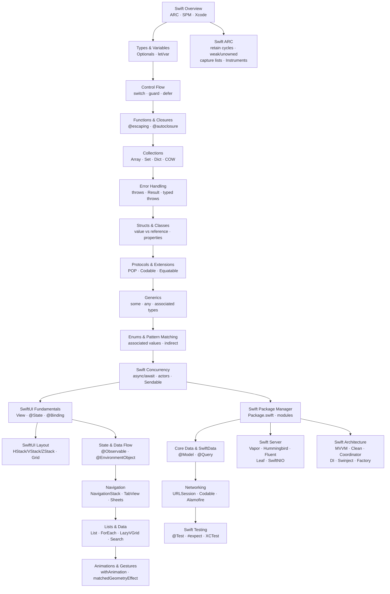

# Swift & SwiftUI — Master Map of Content

> [!abstract] About
> A 24-note knowledge vault covering the Swift language, protocol-oriented programming, SwiftUI declarative UI, the Apple ecosystem toolchain, server-side Swift (Vapor), app architecture patterns (MVVM, Clean Architecture, Coordinator, DI), and ARC memory management in depth. Built around Swift's two key differentiators: **optionals** (compile-time nil safety) and **ARC** (deterministic memory management without GC pauses). All notes include working Swift code, common pitfalls, and review questions.

---

## Knowledge Map

---

## Sections

### 01 — Swift Fundamentals

| Note | Topics | Difficulty |
|---|---|---|
| [[Swift_Overview]] | ARC vs GC, Swift evolution, Xcode, SPM, use cases | Beginner |
| [[Swift_Types_and_Variables]] | optionals, `let`/`var`, type inference, nil coalescing, tuples | Beginner |
| [[Swift_Control_Flow]] | switch exhaustiveness, guard, ranges, defer, labeled statements | Beginner |
| [[Swift_Functions_and_Closures]] | argument labels, `@escaping`, `@autoclosure`, capturing, trailing closure | Intermediate |
| [[Swift_Collections]] | Array/Set/Dictionary, functional ops, copy-on-write | Beginner |
| [[Swift_Error_Handling]] | `throws`/`try`, `Result<T,E>`, typed throws (Swift 6), defer | Intermediate |
| [[Swift_ARC]] | Retain counting, strong/weak/unowned, retain cycles, capture lists, Instruments | Intermediate |

### 02 — OOP and Protocols

| Note | Topics | Difficulty |
|---|---|---|
| [[Swift_Structs_and_Classes]] | value vs reference types, properties, observers, `final` | Intermediate |
| [[Swift_Protocols_and_Extensions]] | POP, protocol extensions, default implementations, Codable, Equatable | Intermediate |
| [[Swift_Generics]] | generics, type constraints, `some` vs `any`, associated types | Advanced |
| [[Swift_Enums_and_Pattern_Matching]] | associated values, `indirect`, `if case let`, `for case let` | Intermediate |
| [[Swift_Concurrency]] | async/await, actors, `@MainActor`, AsyncSequence, Sendable | Advanced |

### 03 — SwiftUI

| Note | Topics | Difficulty |
|---|---|---|
| [[SwiftUI_Fundamentals]] | View protocol, `@State`, `@Binding`, modifiers, `@main` | Beginner |
| [[SwiftUI_Layout]] | stacks, Spacer, GeometryReader, Grid, LazyVStack, custom Layout | Intermediate |
| [[SwiftUI_State_and_Data]] | @Observable, @StateObject, @EnvironmentObject, data flow | Intermediate |
| [[SwiftUI_Navigation]] | NavigationStack, NavigationPath, sheets, TabView, alerts | Intermediate |
| [[SwiftUI_Lists_and_Data]] | List, ForEach, swipe actions, searchable, LazyVGrid | Intermediate |
| [[SwiftUI_Animations_and_Gestures]] | withAnimation, transitions, matchedGeometryEffect, KeyframeAnimator | Intermediate |

### 04 — Ecosystem and Tools

| Note | Topics | Difficulty |
|---|---|---|
| [[Swift_Package_Manager]] | Package.swift, targets, products, plugins, modularization | Intermediate |
| [[Core_Data_and_SwiftData]] | @Model, @Query, NSPersistentContainer, NSFetchRequest, migration | Intermediate |
| [[Swift_Networking]] | URLSession async, Codable, streaming, WebSocket, Alamofire | Intermediate |
| [[Swift_Testing]] | Swift Testing (@Test, #expect), XCTest, parameterized, XCUIApplication | Intermediate |
| [[Swift_Server]] | Vapor routing/middleware, Fluent ORM, Leaf templates, Hummingbird, SwiftNIO | Intermediate |
| [[Swift_Architecture]] | MVVM (@Observable), Clean Architecture layers, Coordinator, DI (Factory, Swinject) | Intermediate |

---

## Learning Paths

### Path A — iOS Developer (12 weeks)

Build production-ready iOS apps from scratch.

1. **Week 1-2** — [[Swift_Overview]] → [[Swift_Types_and_Variables]] → [[Swift_Control_Flow]]
2. **Week 3** — [[Swift_Functions_and_Closures]] → [[Swift_Collections]]
3. **Week 4** — [[Swift_Error_Handling]] → [[Swift_Structs_and_Classes]]
4. **Week 5** — [[Swift_Protocols_and_Extensions]] → [[Swift_Enums_and_Pattern_Matching]]
5. **Week 6** — [[SwiftUI_Fundamentals]] → [[SwiftUI_Layout]]
6. **Week 7** — [[SwiftUI_State_and_Data]] → [[SwiftUI_Navigation]]
7. **Week 8** — [[SwiftUI_Lists_and_Data]] → [[SwiftUI_Animations_and_Gestures]]
8. **Week 9** — [[Swift_Networking]] → [[Core_Data_and_SwiftData]]
9. **Week 10** — [[Swift_Concurrency]]
10. **Week 11** — [[Swift_Package_Manager]] → [[Swift_Testing]]
11. **Week 12** — [[Swift_Generics]] + build a complete app

### Path B — SwiftUI Mastery (6 weeks)

Assumes basic Swift knowledge. Focus on SwiftUI depth.

1. **Week 1** — [[SwiftUI_Fundamentals]] → [[SwiftUI_Layout]]
2. **Week 2** — [[SwiftUI_State_and_Data]] (deep dive on @Observable, @EnvironmentObject)
3. **Week 3** — [[SwiftUI_Navigation]] → [[SwiftUI_Lists_and_Data]]
4. **Week 4** — [[SwiftUI_Animations_and_Gestures]] + custom transitions
5. **Week 5** — [[Core_Data_and_SwiftData]] integrated into SwiftUI
6. **Week 6** — [[Swift_Concurrency]] applied to SwiftUI data loading patterns

### Path C — Server-Side Swift (8 weeks)

Build HTTP APIs and microservices with Swift + Vapor.

1. **Week 1-3** — Complete Section 01 (Swift Fundamentals) + [[Swift_Concurrency]]
2. **Week 4** — [[Swift_Protocols_and_Extensions]] + [[Swift_Generics]]
3. **Week 5** — [[Swift_Package_Manager]] (modular Vapor project structure)
4. **Week 6** — [[Swift_Networking]] (consuming external APIs from Vapor routes)
5. **Week 7** — [[Swift_Error_Handling]] + [[Swift_Testing]] (vapor testing with XCTVapor)
6. **Week 8** — [[Swift_Server]] (Vapor routing, middleware, Fluent ORM, Leaf templates)

---

## Key Concepts Cross-Reference

| Concept | Primary Note | Also in |
|---|---|---|
| ARC / memory management | [[Swift_ARC]] | [[Swift_Overview]], [[Swift_Structs_and_Classes]], [[Swift_Concurrency]] |
| Optionals | [[Swift_Types_and_Variables]] | [[Swift_Error_Handling]], [[SwiftUI_Fundamentals]] |
| `@State` / `@Binding` | [[SwiftUI_Fundamentals]] | [[SwiftUI_State_and_Data]], [[SwiftUI_Lists_and_Data]] |
| `async`/`await` | [[Swift_Concurrency]] | [[Swift_Networking]], [[Swift_Testing]], [[SwiftUI_State_and_Data]] |
| `Codable` | [[Swift_Protocols_and_Extensions]] | [[Swift_Networking]], [[Core_Data_and_SwiftData]] |
| `some` / `any` | [[Swift_Generics]] | [[SwiftUI_Fundamentals]], [[Swift_Protocols_and_Extensions]] |
| Copy-on-write | [[Swift_Collections]] | [[Swift_Structs_and_Classes]] |
| `@Observable` / `@Model` | [[SwiftUI_State_and_Data]] | [[Core_Data_and_SwiftData]], [[Swift_Architecture]] |
| Vapor / Hummingbird | [[Swift_Server]] | [[Swift_Concurrency]], [[Swift_Networking]] |
| MVVM / Clean Architecture | [[Swift_Architecture]] | [[SwiftUI_State_and_Data]], [[Swift_Protocols_and_Extensions]] |
| Retain cycles / weak refs | [[Swift_ARC]] | [[Swift_Functions_and_Closures]], [[Swift_Structs_and_Classes]] |

#Swift #SwiftUI #MOC #Index
