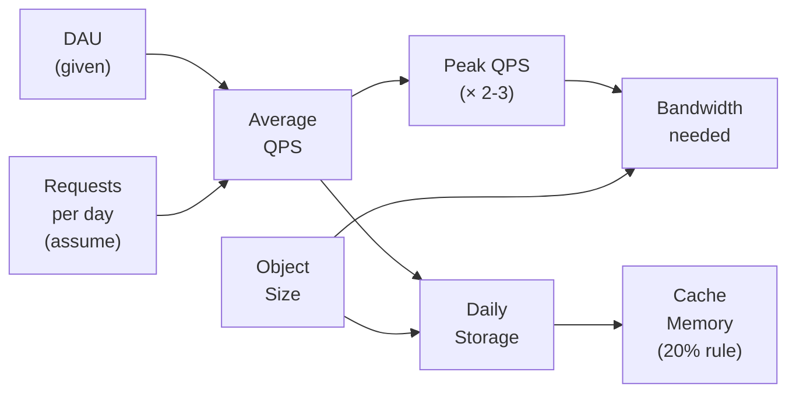

# Calculator Capacity Estimation Reference

> [!abstract] TL;DR
> Your go-to cheat sheet for system design interviews: powers of 2, latency numbers, throughput limits, storage math, and common system scales. Internalize these numbers so estimations feel natural, not forced. The goal is order-of-magnitude accuracy — getting within 10x is perfectly fine.

---

## Intuition — analogy FIRST

A surgeon doesn't look up blood pressure norms mid-operation — they have them memorized because fast, accurate decisions demand it. In a system design interview, fumbling for scale numbers signals inexperience. This reference card is your muscle memory: drill it until the calculations happen in your head while you're still drawing boxes.

The key insight: **all capacity estimation is multiplication**. DAU × requests_per_day / 86,400 = QPS. QPS × object_size = bandwidth. It's unit conversion, not rocket science — but only if you know your base units cold.

---

## How It Works + mermaid

### The Estimation Workflow



---

## Powers of 2 — Quick Reference

> [!info] Memorize this table cold

| Power | Exact Value | Approximate | Name |
|-------|-------------|-------------|------|
| 2^10  | 1,024 | ~1 thousand | 1 KB (kilobyte) |
| 2^20  | 1,048,576 | ~1 million | 1 MB (megabyte) |
| 2^30  | 1,073,741,824 | ~1 billion | 1 GB (gigabyte) |
| 2^40  | ~1.1 × 10^12 | ~1 trillion | 1 TB (terabyte) |
| 2^50  | ~1.1 × 10^15 | ~1 quadrillion | 1 PB (petabyte) |

**Useful derived facts:**
- 1 MB = 1,000 KB = 8,000,000 bits
- 1 Gbps network link = 125 MB/s
- 86,400 seconds in a day (~10^5, good enough for estimation)
- 3.15 × 10^7 seconds in a year (~3 × 10^7)

---

## Time / Latency Numbers

> [!warning] Every engineer should know these numbers by heart (Jeff Dean's famous slide)

| Operation | Latency | Notes |
|-----------|---------|-------|
| L1 cache reference | 1 ns | On-CPU cache |
| L2 cache reference | 4 ns | |
| L3 cache reference | 10 ns | |
| Main memory (RAM) reference | 100 ns | 100x slower than L1 |
| SSD random read | 100 µs (0.1 ms) | |
| HDD seek | 10 ms | 100,000x slower than RAM |
| Read 1 MB from SSD | 1 ms | |
| Read 1 MB from HDD | 20 ms | |
| Intra-datacenter round trip | 0.5 ms | |
| Cross-region (US East to West) | 40 ms | |
| Cross-continent (US to Europe) | 80-150 ms | |
| Packet: California → Netherlands → California | 150 ms | |

**Key take-aways:**
- Memory is ~10,000x faster than disk. Cache everything you can.
- Network within a datacenter is ~0.5 ms. Cross-region is ~40-150 ms.
- If your SLA is p99 < 100 ms and you do a synchronous cross-region call, you've already failed.

---

## Throughput Rules of Thumb

| Component | Approximate Throughput | Notes |
|-----------|----------------------|-------|
| Single API server (commodity) | 10,000 RPS | Stateless HTTP, simple logic |
| MySQL / PostgreSQL writes | 10,000 writes/sec | With indexes, single primary |
| MySQL / PostgreSQL reads | 50,000 reads/sec | With proper indexes + read replicas |
| Redis / Memcached | 100,000–1,000,000 ops/sec | Single node, in-memory |
| Kafka | 100,000–1,000,000 msgs/sec | Per partition, depends on msg size |
| Cassandra writes | 100,000 writes/sec | Tunable consistency |
| Elasticsearch | ~10,000 writes/sec | Indexing throughput per node |
| S3 (AWS) | 3,500 PUTs / 5,500 GETs per prefix/sec | Scale by prefix sharding |

---

## Storage Estimation Examples

> [!example] Work through these until they feel automatic

**Text data:**
| Object | Size | Daily Volume | Daily Storage |
|--------|------|-------------|---------------|
| 1 tweet | 280 chars ≈ 280 B | 500M tweets/day | 500M × 280B = **140 GB/day** |
| 1 SMS | ~160 chars ≈ 160 B | 100B msgs/day (WhatsApp) | 100B × 160B = **16 TB/day** |
| 1 Slack message | ~500 B | 1B msgs/day | 1B × 500B = **500 GB/day** |

**Media data:**
| Object | Size | Daily Volume | Daily Storage |
|--------|------|-------------|---------------|
| 1 photo (compressed) | 300 KB avg | 10M uploads/day (Instagram) | 10M × 300KB = **3 TB/day** |
| 1 short video (1 min) | 50 MB avg | 500K uploads/day | 500K × 50MB = **25 TB/day** |
| 1 4K movie | 30 GB | — | — |
| 1 HD video (2 hr) | 4 GB | — | — |

**Multi-year projection:**
- Daily storage × 365 × years × 1.5 (replication factor) = total storage
- Example: 3 TB/day × 365 × 5 years × 3 replicas = **16.4 PB**

---

## QPS Formula

```
Average QPS = DAU × requests_per_day / 86,400
Peak QPS    = Average QPS × 2 (conservative) or × 3 (aggressive)
```

**Common requests_per_day assumptions (if not given):**
| System type | Reads/day | Writes/day |
|------------|-----------|------------|
| Social feed (Twitter-like) | 100 reads | 1 write |
| E-commerce | 20 reads | 2 writes |
| Messaging (WhatsApp-like) | 40 sends | 40 receives |
| Video streaming (YouTube-like) | 5 views | rare |

---

## Bandwidth Estimation

```
Bandwidth = Peak QPS × Average response size

Example — Twitter feed:
  Peak read QPS = 1,000,000 RPS
  Each feed response = 20 tweets × 280 B = 5,600 B ≈ 6 KB
  Bandwidth = 1,000,000 × 6 KB = 6 GB/s outbound
```

---

## Cache Memory Estimation

**Rule of thumb: cache 20% of the data to handle 80% of the reads (Pareto principle)**

```
Daily read data = read QPS × 86,400 × avg_object_size
Cache memory   = daily read data × 20%

Example — Twitter:
  Read QPS = 350,000, avg tweet = 280 B
  Daily read data = 350,000 × 86,400 × 280B ≈ 8.5 TB
  Cache memory = 8.5 TB × 20% = 1.7 TB

  → Use a Redis cluster with ~20 nodes × 128 GB each = 2.56 TB
```

---

## Common System Scales

> [!info] Memorize these for interviews

| System | DAU | Read QPS | Write QPS | Storage scale |
|--------|-----|----------|-----------|---------------|
| Twitter | 300M | ~350K | ~3.5K | ~85 GB/day (text) |
| YouTube | 2B | ~1M | ~500 | 25 TB/day (video) |
| WhatsApp | 2B | ~1M msgs/day | ~1M msgs/day | 16 TB/day |
| Google Search | — | 60,000/sec | — | Petabytes (index) |
| Instagram | 1B | ~500K | ~10K | 3 TB/day (photos) |
| Netflix | 220M subscribers | ~500K streams | — | — |
| Uber | 130M MAU | — | — | Real-time only |
| Amazon | 300M customers | ~100K | — | — |

---

## Availability Numbers

> [!tip] These come up constantly — memorize the nines

| Availability | Annual downtime | Monthly downtime | Notes |
|-------------|-----------------|------------------|-------|
| 99% (two nines) | 3.65 days | 7.3 hours | Barely acceptable |
| 99.9% (three nines) | 8.77 hours | 43.8 minutes | Standard SaaS target |
| 99.95% | 4.38 hours | 21.9 minutes | |
| 99.99% (four nines) | 52.6 minutes | 4.4 minutes | Enterprise baseline |
| 99.999% (five nines) | 5.26 minutes | 26 seconds | Telecom-grade |
| 99.9999% (six nines) | 31.5 seconds | 2.6 seconds | Extreme (rare) |

See [[Availability_in_Numbers]] for in-depth treatment.

---

## Real-World Systems

**Back-of-envelope examples used in famous interviews:**

**Design URL Shortener (bit.ly):**
- 100M URLs created/day → write QPS = 100M / 86400 ≈ 1,200
- 10:1 read:write → read QPS ≈ 12,000
- Each URL record: 500 bytes. 100M × 365 × 10 years × 500B ≈ 180 TB

**Design Dropbox:**
- 500M users, 1M DAU, each uploads 2 files/day avg 500 KB
- Upload bandwidth = 1M × 2 × 500KB / 86400 ≈ 11.5 GB/s
- 5-year storage = 1M × 2 × 500KB × 365 × 5 ≈ 1.8 PB

---

## Trade-offs (table)

| Estimation choice | Conservative | Aggressive | When to go aggressive |
|------------------|-------------|------------|----------------------|
| Peak multiplier | 2× | 3× | Viral / event-driven systems |
| Replication factor | 2× | 3× | Mission-critical data |
| Cache hit rate | 80% | 95% | Stable, hot data (news feed) |
| DAU/MAU ratio | 30% | 50% | Social apps |
| Growth buffer | 1.5× | 2× | High-growth startups |

---

## When to Use vs Avoid

**When to estimate aggressively:**
- Designing systems that handle viral spikes (Twitter trending, Ticketmaster on-sale)
- Infrastructure provisioning decisions
- Justifying architectural choices (why we need a cache, why we need sharding)

**When estimates are less critical:**
- Prototyping / MVP design
- Internal tools with small, known user bases

**Common interview shortcut:**
When the problem doesn't give scale numbers, assume a "medium internet company": 10M DAU, 1,000 QPS average, and size from there.

---

## Common Pitfalls

> [!danger] Estimation mistakes to avoid
> 1. **Forgetting replication factor** — 1 TB of data × 3 replicas = 3 TB actual storage cost.
> 2. **Confusing bits and bytes** — network bandwidth is in bits/sec, storage is in bytes. 1 Gbps = 125 MB/s.
> 3. **Using monthly instead of daily** — most storage questions ask about daily generation, not monthly.
> 4. **Ignoring metadata** — a photo is 300 KB but you also store thumbnail (30 KB), metadata row (500 B), user association index, etc.
> 5. **Peak vs average confusion** — servers must handle peak load, not average. Design for 3× average.

---

## Related Concepts

- [[_MOC_Introduction|↑ Section MOC]]
- [[Availability_in_Numbers]] — full availability/downtime table
- [[System_Design_Interview_Framework]] — how to use these numbers in an interview
- [[System_Design_Intro]] — foundational system design concepts
- [[Database_Sharding]] — when storage numbers tell you to shard
- [[Caching]] — when read QPS tells you to add cache
- [[Load_Balancers]] — when QPS tells you to scale horizontally
- [[Content_Delivery_Network]] — when bandwidth tells you to add a CDN

---

## Review Questions

1. A new social app has 50M DAU. Each user sends 5 messages/day and reads 50 messages/day. Each message is 2 KB. Calculate: average read QPS, average write QPS, peak read QPS (3× factor), daily storage generated, and how much memory you'd need for a cache with 80% hit rate.

2. You're designing a photo-sharing app. Users upload 5M photos/day. Each original photo is 5 MB. You generate 3 thumbnails (100 KB each) per photo. How much storage do you need for 10 years, including 3-replica redundancy?

3. An API server handles 50,000 RPS. Each request touches the database once. The database can handle 10,000 read queries/sec. What is the minimum read replica count you need? If cache has an 80% hit rate, how many replicas do you need?

---

## Sources

- Jeff Dean's "Numbers Everyone Should Know" (Google I/O 2008)
- Alex Xu, *System Design Interview* Vol. 1 — Chapter 2: Back-of-the-Envelope Estimation
- [Latency Numbers Every Programmer Should Know](https://github.com/sirupsen/napkin-math)
- [napkin.math](https://napkin.math/) — interactive latency calculator

#SystemDesign #Capacity #Estimation #Reference #Beginner
