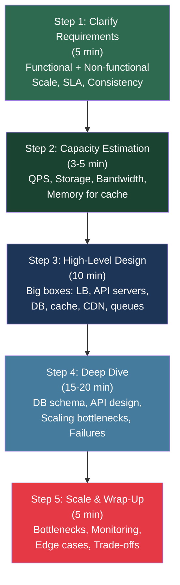

# Compass System Design Interview Framework

> [!abstract] TL;DR
> A 5-step repeatable process for acing any system design interview: Clarify (5 min) → Estimate (3-5 min) → High-Level Design (10 min) → Deep Dive (15-20 min) → Scale & Wrap-Up (5 min). The framework keeps you structured, shows signal to the interviewer, and prevents the two most common failure modes — jumping to solutions and ignoring non-functional requirements.

---

## Intuition — analogy FIRST

Think of a system design interview like building a house with a client standing next to you. An architect who immediately starts pouring a foundation without asking "how many bedrooms?", "what's the budget?", and "is this in an earthquake zone?" will build the wrong house. The interview is your 45-minute architecture session: first understand the constraints, then sketch the floor plan, then work out the structural engineering details.

The interviewer is not just evaluating your technical knowledge — they're watching **how you think** under ambiguity. A junior engineer fixates on code; a senior engineer thinks in systems and trade-offs.

---

## How It Works + mermaid

### The 5-Step Framework

---

### Step 1 — Clarify Requirements (5 min)

Never skip this. Always spend the first 5 minutes asking questions. It signals engineering maturity and prevents wasted effort.

**Functional requirements** — what does the system actually do?
- Identify the 3-5 core features. Reject scope creep: "Let's focus on feed generation and posting. We can add stories/reels later."
- User flows: "A user opens the app, sees their feed, posts a photo, follows another user."

**Non-functional requirements** — how does it do it?
- **Scale:** How many DAU? What is the read/write ratio?
- **Latency SLA:** p99 < 200ms? Real-time or eventual?
- **Availability:** 99.9%? 99.99%? Can the system tolerate brief downtime?
- **Consistency:** Strong (banking) or eventual (social feed)?
- **Geographic distribution:** Single region or global?
- **Data durability:** Can we lose messages, or is every event precious?

> [!tip] Questions to ALWAYS ask
> - What is the scale? (DAU, peak QPS)
> - Read-heavy or write-heavy?
> - Consistency requirements — is eventual OK?
> - Does it need to be globally distributed?
> - What is the single most important feature if we had to ship today?

---

### Step 2 — Capacity Estimation (3-5 min)

Back-of-envelope math shows the interviewer you can reason about scale. Exact precision doesn't matter — order of magnitude does.

**The formula:**
- QPS (average) = DAU × requests_per_day / 86,400
- Peak QPS = average × 2-3
- Storage per day = write QPS × average_object_size × 86,400
- Bandwidth = peak QPS × average_response_size
- Cache memory = 20% of daily read data (80/20 rule)

**Example — Design Twitter:**
- 300M DAU, each user reads 100 tweets/day, writes 1 tweet/day
- Read QPS = 300M × 100 / 86,400 ≈ 350,000 RPS
- Write QPS = 300M × 1 / 86,400 ≈ 3,500 RPS → read:write = 100:1
- Storage: 1 tweet = 280 bytes. 3,500 writes/sec × 86,400 × 280B ≈ 85 GB/day
- 5-year storage: 85 GB × 365 × 5 ≈ 155 TB

See [[Capacity_Estimation_Reference]] for the full cheat sheet.

---

### Step 3 — High-Level Design (10 min)

Draw the big boxes. Don't over-engineer. Walk through each major user flow.

**Standard component checklist:**
- **Clients** (web, mobile, CDN for static assets)
- **DNS + Load Balancer** (L7 for HTTP routing)
- **API Gateway** (auth, rate limiting, routing)
- **Application servers** (stateless, horizontally scalable)
- **Databases** (SQL vs NoSQL — justify the choice)
- **Cache** (Redis/Memcached — what do you cache?)
- **Message Queue** (Kafka/SQS — for async work)
- **CDN** (for static content + media)
- **Object Storage** (S3 for images/video)

**Walk through flows:**
- "When a user posts a photo: client → LB → API server → write to DB, write to S3 for the image, push event to Kafka for async fan-out to followers."
- "When a user reads their feed: client → CDN for static → API server → Redis cache → DB if cache miss."

> [!warning] Don't over-specify here
> At this stage, say "a relational database" not "PostgreSQL 16 with read replicas in us-east-1 using Aurora." Save specifics for the deep dive.

---

### Step 4 — Deep Dive (15-20 min)

The interviewer will typically pick 2-3 areas. **Let them guide you**, but be ready to drive any of:

**DB Schema design:**
- Entity relationships, indexing strategy, foreign keys vs. denormalization
- What queries does the schema need to support efficiently?

**API design:**
- RESTful endpoints or GraphQL? gRPC for internal services?
- Request/response payloads, pagination (cursor vs. offset), versioning

**Scaling bottlenecks:**
- Identify the single biggest hotspot and how you'd address it
- Fan-out problem (celebrity with 10M followers posting a tweet)
- Hot partition problem (all writes going to one DB shard)

**Failure scenarios:**
- What happens if the cache is cold? (thundering herd)
- What happens if the message queue falls behind?
- What happens if a region goes down?

---

### Step 5 — Scale & Wrap-Up (5 min)

Bring it home with a structured closing:

1. **Identify the top 3 bottlenecks** and how you'd resolve each
2. **Monitoring:** what metrics would you alert on? (error rate, latency p99, queue depth)
3. **Failure modes:** single points of failure you haven't addressed yet
4. **Trade-offs you made** and what you'd revisit with more time

---

## Real-World Systems

| System | DAU | Read QPS | Write QPS | Key Design Challenge |
|--------|-----|----------|-----------|----------------------|
| Twitter | 300M | ~350K | ~3.5K | Fan-out to followers at scale |
| YouTube | 2B | ~1M | ~500 | Video transcoding, CDN distribution |
| WhatsApp | 2B | ~1M msgs/day | ~1M msgs/day | Message delivery guarantees |
| Google Search | — | 60K searches/sec | — | Crawling, indexing, ranking |
| Instagram | 1B | ~500K | ~10K | Media storage, feed generation |
| Uber | 130M | — | — | Real-time location matching |

---

## Trade-offs (table)

| Decision Point | Option A | Option B | When to choose A |
|---------------|----------|----------|------------------|
| DB choice | SQL (PostgreSQL) | NoSQL (Cassandra) | Transactions, joins, strong consistency |
| Cache strategy | Read-through | Write-through | Read-heavy workload |
| Sync vs async | Synchronous writes | Async via queue | Availability > consistency |
| Fan-out | Push model | Pull model | Moderate follower counts |
| Sharding key | User ID | Content ID | Isolate user data access patterns |

---

## When to Use vs Avoid

**Use this framework:**
- Every system design interview — it's a process, not an optional overlay
- When whiteboarding new services at work
- When reviewing architecture proposals

**Avoid:**
- Don't apply interview theater to production architecture — real designs need more rigour, SLAs, runbooks, cost analysis

---

## Common Pitfalls

> [!danger] The 6 fatal mistakes
> 1. **Jumping to solution** — start coding/designing before asking a single requirement question. Automatic red flag.
> 2. **Ignoring scale** — designing a Twitter clone for 1,000 users instead of 300M.
> 3. **No non-functional requirements** — building functionally correct but unavailable / inconsistent / slow system.
> 4. **Over-engineering early** — spending 20 minutes on DB schema before the interviewer has seen a high-level diagram.
> 5. **Silence** — not narrating your thinking. Interviewers can't evaluate what they can't hear.
> 6. **No trade-offs** — presenting design as the only solution instead of acknowledging alternatives.

**Anti-pattern to watch:** "I'll use Kafka because Netflix uses Kafka." Always explain *why* Kafka — the durability guarantees, replay capability, high throughput — not just name-drop.

---

## Related Concepts

- [[_MOC_Introduction|↑ Section MOC]]
- [[Capacity_Estimation_Reference]] — the numbers you need to know cold
- [[CAP_Theorem]] — core trade-off that shapes every distributed design decision
- [[System_Design_Intro]] — foundational concepts
- [[Load_Balancers]] — standard component in high-level designs
- [[Caching]] — cache strategy drives read performance
- [[Databases]] — SQL vs NoSQL decision tree
- [[Domain_Name_System]] — DNS role in global traffic routing
- [[Content_Delivery_Network]] — CDN in the high-level diagram

---

## Review Questions

1. You're asked to design Instagram in a 45-minute interview. Walk through what questions you ask in the first 5 minutes and what the resulting functional + non-functional requirements look like.

2. A system has 500M DAU, each user makes 10 API calls per day. Calculate the average QPS and the peak QPS (assume 3x peak factor). How much memory would you need to cache 20% of daily read traffic if each response is 2 KB?

3. During the deep dive phase, the interviewer asks: "What happens when a celebrity with 50M followers posts?" Walk through the fan-out problem and two different architectural approaches to solve it.

---

## Sources

- Alex Xu, *System Design Interview* Vol. 1 & 2 (ByteByteGo)
- Designing Data-Intensive Applications — Martin Kleppmann
- [ByteByteGo Newsletter](https://blog.bytebytego.com/)
- Google's Site Reliability Engineering Book — capacity planning chapters

#SystemDesign #Interview #Framework #Process #Beginner
