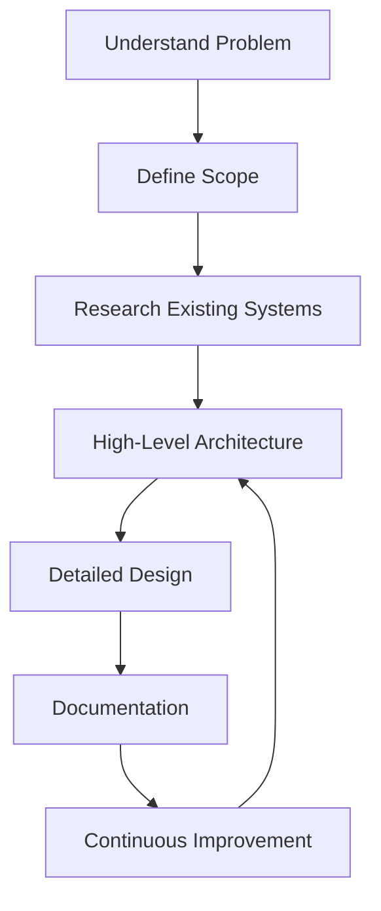

# 📌 System Design — Introduction

> [!abstract] TL;DR
> System design is the structured process of defining the architecture, components, and interactions of a software system to meet functional and non-functional requirements at scale.

## 🧠 What is System Design?
System design is the structured process of **defining the architecture, components, modules, interfaces, interactions, and overall structure** of a software system so that it meets **functional and non-functional requirements**. It acts as a **blueprint** that guides implementation and evolution of software systems.

- Translates high-level requirements into concrete architectures.
- Focuses on big-picture engineering, not just writing code.
- Ensures scalability, reliability, and maintainability.

---

## 🧩 System Design vs Software Design

### System Design
- Focuses on overall architecture and system components.
- Handles scalability, fault tolerance, and distributed systems.

### Software Design
- Focuses on internal structure of software.
- Deals with classes, modules, and code-level patterns.

> System design operates at a **higher level of abstraction** than software design.

---

## 🔍 Why System Design Matters
- Enables systems to **scale** efficiently.
- Helps build **reliable and fault-tolerant** systems.
- Improves **performance and resource utilization**.
- Prevents costly architectural mistakes later.
- Supports evolving business and technical requirements.

---

# 🛠️ How To Approach System Design

## 1) Understand the Problem
- Gather functional and non-functional requirements.
- Identify users and their needs.
- Clarify constraints (latency, security, cost, compliance).

**Links:**  
[[Functional Requirements]]  
[[Non-Functional Requirements]]

---

## 2) Identify the Scope
- Define what is **in-scope** and **out-of-scope**.
- Establish system boundaries.
- Prevent uncontrolled requirement expansion.

**Links:**  
[[System Boundaries]]  
[[Scope Definition]]

---

## 3) Research and Analyze Existing Systems
- Study similar systems and reference architectures.
- Learn from past successes and failures.
- Use findings to guide design trade-offs.

**Links:**  
[[Reference Architecture]]  
[[Trade-offs]]

---

## 4) Create a High-Level Design
- Identify major components and interactions.
- Define data flows and communication paths.
- Draft architecture diagrams.

**Links:**  
[[High-Level Design]]  
[[System Context Diagram]]  
[[Architecture Patterns]]

---

## 5) Refine the Design
- Define APIs and data models.
- Plan scalability and failure handling.
- Address security and performance concerns.
- Iterate based on feedback.

**Links:**  
[[API Design]]  
[[Database Design]]  
[[Scalability]]  
[[Security Considerations]]

---

## 6) Document the Design
- Record architecture decisions.
- Add diagrams and assumptions.
- Maintain clear and accessible documentation.

**Links:**  
[[Design Documentation]]  
[[Architecture Decision Records]]

---

## 7) Monitor and Improve Continuously
- Collect system metrics (latency, throughput, errors).
- Identify bottlenecks.
- Improve design as requirements evolve.

**Links:**  
[[Monitoring]]  
[[Performance Optimization]]  
[[Reliability Engineering]]

---

## 🔁 System Design Flow

Understand Problem  
→ Define Scope  
→ Research Existing Systems  
→ High-Level Architecture  
→ Detailed Design  
→ Documentation  
→ Continuous Improvement



---

## 🧠 Key Properties of Good System Design
- **Scalable**
- **Reliable**
- **Maintainable**
- **Efficient**
- **Secure**

---
# 📘 System Design — Core Concepts & Patterns
#systemdesign #architecture #distributed-systems

Here are several important concepts that play a role in modern system design.

---

## 🔹 Horizontal and Vertical Scaling

### Horizontal Scaling (Scale Out)
- Adds **more nodes/servers** to distribute system load.
- Improves:
  - Performance
  - Reliability
  - Availability
- Common in **cloud environments**.
- Achieved via:
  - Load balancing
  - Sharding (data split across instances)

✅ Handles more requests simultaneously.

---

### Vertical Scaling (Scale Up)
- Adds more resources to a **single server**:
  - CPU
  - Memory
  - Storage
- Achieved by:
  - Hardware upgrade
  - Increasing VM resources

⚠ Limitations:
- Hardware constraints
- Possible downtime
- Scaling limit exists

---

## 🔹 Redundancy and Replication

### Redundancy
- Duplication of:
  - System components
  - Data
- Improves reliability and fault tolerance.

### Replication
- Multiple data copies across nodes.
- Ensures:
  - Availability
  - Fault tolerance
  - Data durability

---

## 🔹 Microservices Architecture

Architecture where an application is split into:

- Small
- Independent
- Loosely coupled services

Each service:
- Handles specific functionality
- Communicates via APIs
- Can be deployed and scaled independently

Benefits:
- Modularity
- Scalability
- Easier maintenance

---

## 🔹 CAP Theorem

A distributed system can guarantee **only two** of:

1. **Consistency**
2. **Availability**
3. **Partition Tolerance**

### Definitions
- **Consistency** → All nodes see same data.
- **Availability** → Every request receives response.
- **Partition Tolerance** → System works despite network failures.

Trade-offs must be chosen.

---

## 🔹 Proxy Servers

A proxy acts as an **intermediary** between client and server.

Uses:
- Load balancing
- Security
- Caching
- Traffic filtering

Benefits:
- Improved performance
- Backend protection
- Traffic distribution

---

## 🔹 Message Queues

Used for **asynchronous communication**.

Characteristics:
- Decouples components
- Stores & forwards messages
- Enables independent scaling

Benefits:
- Reliability
- Fault tolerance
- Scalability

Examples: Kafka, RabbitMQ, SQS.

---

## 🔹 File Systems

Manages storage and organization of files.

Functions:
- File & directory management
- Access control
- Data integrity

Types:
- Local file systems
- Distributed file systems

Trade-offs:
- Performance
- Scalability
- Fault tolerance

---

# 🏗 System Design Architecture & Patterns

---

## 🔹 Two-Phase Commit (2PC)

Distributed transaction protocol ensuring atomicity.

### Phases
1. **Prepare Phase**
   - Participants vote commit/abort.
2. **Commit Phase**
   - Coordinator decides outcome.

Guarantee:
- Either all commit or none.

⚠ Slow and blocking under failures.

---

## 🔹 Replicated Load-Balanced Services (RLBS)

Multiple service instances behind load balancer.

Benefits:
- Higher availability
- Better performance
- Fault tolerance

Mechanisms:
- Replication
- Load balancing

---

## 🔹 CQRS (Command Query Responsibility Segregation)

Separates:
- **Commands** → Modify data
- **Queries** → Read data

Advantages:
- Independent scaling
- Performance optimization
- Flexible data models

---

## 🔹 Saga Pattern

Manages long-running distributed transactions.

Instead of global transaction:
- Uses sequence of **local transactions**.
- Each has a **compensating action**.

If failure occurs:
- Actions rollback in reverse order.

### Example: E-Commerce Saga

Services:
1. Order Service → create/cancel order
2. Inventory Service → reserve/release stock
3. Payment Service → charge/refund

Ensures consistency without distributed locks.

---

## 🔹 Sharded Services

Data split across multiple shards.

Each shard:
- Stores subset of data
- Operates independently

Benefits:
- Better scalability
- Higher throughput

Challenges:
- Complex querying
- Data consistency

---

# 🌍 System Design Examples

---

## 🛒 eCommerce System
Components:
- Web application
- Shopping cart
- Payment system
- Order management
- Warehouse management

Challenges:
- Scalability
- Security
- Availability

---

## 🌐 Content Delivery Network (CDN)

Global servers cache content close to users.

Goals:
- Reduce latency
- Improve performance
- Ensure availability

Challenges:
- Cache management
- Routing
- Security

---

## 👥 Social Networking Platform

Subsystems include:
- Authentication
- Messaging
- News feeds
- Media storage
- Search

Key concerns:
- Massive scale
- Performance
- Data management

---

## 📡 Internet of Things (IoT) System

Components:
- Devices
- Sensors
- Gateways
- Cloud backend

Challenges:
- Device management
- Security
- Data processing
- Scalability

---

# 🧰 Tools & Techniques in System Design

---

## 🔹 Data Flow Diagrams (DFD)

Shows movement of data between:
- Processes
- External entities
- Data stores

Benefits:
- Visual clarity
- Bottleneck identification

Tools: Mermaid.js, Swimm.

---

## 🔹 Architecture Diagrams

Visualize system structure.

Benefits:
- Better communication
- Easier design review
- Issue detection

---

## 🔹 Data Dictionaries

Documentation of system data.

Contains:
- Data types
- Format
- Constraints
- Relationships

Benefits:
- Consistency
- Requirement validation

---

## 🔹 Decision Trees

Visual decision flow.

Used for:
- Logic analysis
- Decision modeling

---

## 🔹 Decision Tables

Tabular decision logic.

Benefits:
- Covers all condition combinations
- Avoids rule conflicts

---

## 🔹 Pseudocode

Language-neutral algorithm description.

Benefits:
- Easy discussion
- Implementation guide

---

## 🔹 Unified Modeling Language (UML)

Standard visual modeling language.

Common diagrams:
- Class diagrams
- Sequence diagrams
- Use case diagrams

Benefits:
- Shared understanding
- Better documentation

---

## 🔹 APIs and Contracts

Define interactions between systems.

### APIs
- Rules & protocols for communication.
- Hide internal implementation.

### Contracts
- Formal behavior specifications.
- Ensure compatibility & correctness.

Benefits:
- Interoperability
- Reliable integration

---

# System Design Template
### (1) FEATURE EXPECTATIONS 5 min

---

```lisp
        (1) Use cases
        (2) Scenarios that will not be covered
        (3) Who will use
        (4) How many will use
        (5) Usage patterns
```

### (2) ESTIMATIONS 5 min

---

```kotlin
        (1) Throughput (QPS for read and write queries)
        (2) Latency expected from the system (for read and write queries)
        (3) Read/Write ratio
        (4) Traffic estimates
                - Write (QPS, Volume of data)
                - Read  (QPS, Volume of data)
        (5) Storage estimates
        (6) Memory estimates
                - If we are using a cache, what is the kind of data we want to store in cache
                - How much RAM and how many machines do we need for us to achieve this ?
                - Amount of data you want to store in disk/ssd
```

### (3) DESIGN GOALS 5 min

---

```javascript
        (1) Latency and Throughput requirements
        (2) Consistency vs Availability  [Weak/strong/eventual => consistency | Failover/replication => availability]
```

### (4) HIGH LEVEL DESIGN 5-10 min

---

```lisp
        (1) APIs for Read/Write scenarios for crucial components
        (2) Database schema
        (3) Basic algorithm
        (4) High level design for Read/Write scenario
```

### (5) DEEP DIVE 15-20 min

---

```sql
        (1) Scaling the algorithm
        (2) Scaling individual components: 
                -> Availability, Consistency and Scale story for each component
                -> Consistency and availability patterns
        (3) Think about the following components, how they would fit in and how it would help
                a) DNS
                b) CDN [Push vs Pull]
                c) Load Balancers [Active-Passive, Active-Active, Layer 4, Layer 7]
                d) Reverse Proxy
                e) Application layer scaling [Microservices, Service Discovery]
                f) DB [RDBMS, NoSQL]
                        > RDBMS 
                            >> Master-slave, Master-master, Federation, Sharding, Denormalization, SQL Tuning
                        > NoSQL
                            >> Key-Value, Wide-Column, Graph, Document
                                Fast-lookups:
                                -------------
                                    >>> RAM  [Bounded size] => Redis, Memcached
                                    >>> AP [Unbounded size] => Cassandra, RIAK, Voldemort
                                    >>> CP [Unbounded size] => HBase, MongoDB, Couchbase, DynamoDB
                g) Caches
                        > Client caching, CDN caching, Webserver caching, Database caching, Application caching, Cache @Query level, Cache @Object level
                        > Eviction policies:
                                >> Cache aside
                                >> Write through
                                >> Write behind
                                >> Refresh ahead
                h) Asynchronism
                        > Message queues
                        > Task queues
                        > Back pressure
                i) Communication
                        > TCP
                        > UDP
                        > REST
                        > RPC
```

### (6) JUSTIFY 5 min

---

```sql
	(1) Throughput of each layer
	(2) Latency caused between each layer
	(3) Overall latency justification
```
---
# 📌 Tags
#scalability #microservices #patterns #distributed #architecture


---
## 🔗 Related Topics
[[Scalability]]  
[[Reliability]]  
[[Distributed Systems]]  
[[Microservices Architecture]]  
[[Load Balancing]]  
[[Caching]]  
[[CAP Theorem]]

---

## Related Concepts

- [[_MOC_Introduction|↑ Section MOC]]
- [[Performance_vs_Scalability]] — how fast a system runs vs how well it handles growth
- [[Latency_vs_Throughput]] — key performance metrics every designer must balance
- [[Availability_vs_Consistency]] — core distributed system trade-off
- [[CAP_Theorem]] — formal theorem on what distributed systems can guarantee
- [[Load_Balancers]] — distributing traffic across multiple servers
- [[Horizontal_Scaling]] — adding more nodes to handle increased load
- [[Microservices]] — splitting systems into independent, deployable services
- [[Caching]] — improving performance by storing frequently accessed data
- [[Message_Queues]] — asynchronous communication between system components
- [[Domain_Name_System]] — translating domain names to IP addresses
- [[Databases]] — persistent data storage patterns and trade-offs

---

## Review Questions

1. A startup's single-server app handles 100 users fine but crashes at 10,000. Which step of the system design process was likely skipped, and what architectural changes would you make retroactively?
2. You're designing a payment processing system from scratch. What trade-offs would you make between consistency and availability, and how does the CAP Theorem guide your technology selection?
3. An e-commerce platform expects a 10x traffic spike during Black Friday. How would you approach the Estimations and Deep Dive phases of the system design template to prepare for this load?

---

## 📚 Sources
- Swimm — System Design Complete Guide  
- Crio — A Comprehensive Guide to System Design
