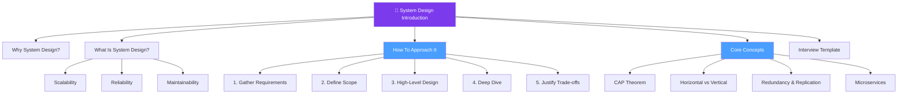

# 📌 Introduction — Map of Content

> [!abstract] What This Section Covers
> This section is the entry point for the entire System Design vault. It establishes the vocabulary, mental models, and structured approach you need before exploring any other section — covering what system design is, why it matters, the properties that define good systems, and the interview framework used throughout the rest of the vault.

## Concept Map

## Learning Path

1. [[System_Design_Intro]] — The complete primer: what system design is, how to approach it, core patterns, and the six-step interview framework

## All Notes at a Glance

| Note | Summary | Difficulty |
|------|---------|------------|
| [[System_Design_Intro]] | End-to-end introduction to system design thinking, vocabulary, patterns, and interview methodology | Beginner |

## Key Questions This Section Answers

- What is system design and how does it differ from software design?
- What are the fundamental non-functional requirements (scalability, reliability, maintainability, performance, security)?
- How do you approach a system design interview in 30–45 minutes?
- What is the difference between horizontal and vertical scaling?
- What does CAP Theorem say, and why does partition tolerance force a trade-off?
- When should you use microservices vs a monolith?
- What is a Saga pattern and why does it replace two-phase commit in distributed systems?

## Related Sections

- [[_MOC_SystemDesign_Master|↑ System Design Master MOC]]
- [[_MOC_PerformanceVsScalability|→ Performance vs Scalability]]
- [[_MOC_AvailabilityVsConsistency|→ Availability vs Consistency]]
- [[_MOC_LoadBalancers|→ Load Balancers]]

#MOC #SystemDesign #Introduction
