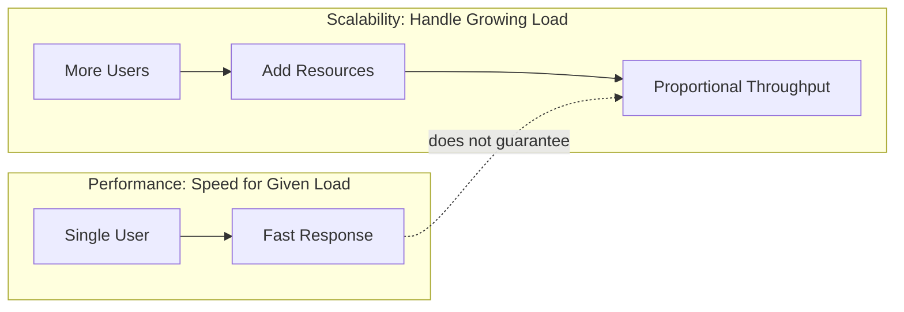

# ⚡ Performance vs Scalability

> [!abstract] TL;DR
> Performance measures how fast a system handles a given workload, while scalability measures how well it maintains that performance as load grows — a fast single-node system is not automatically scalable.

## 🧠 Core Idea

**Performance** and **Scalability** are related but fundamentally different system properties.

> **Performance** = How fast a system handles a **given workload**.  
> **Scalability** = How well a system handles **increasing workload by adding resources**.

---

## 📖 Definitions

### ⚙️ Performance
- Measures **speed and efficiency** of a system.
- Common metrics:
  - Latency (response time)
  - Throughput (requests per second)
  - Resource utilization (CPU, memory, I/O)

> If you have a **performance problem**, your system is slow for a **single user**.

> Performance is about speed
---

### 📈 Scalability
- Ability of a system to **increase performance proportionally** when resources are added.
- Resources may include:
  - More servers
  - More CPU/RAM
  - More database shards

> A service is scalable if **adding resources results in proportional performance gains**.

Scalability also includes handling:
- More concurrent users
- Higher request rates
- Larger datasets

> If you have a **scalability problem**, your system is fast for a **single user** but slow under **heavy load**.

> Scalability is being able to handle large amounts of users/data/traffic.
---

## 🧩 Practical Example

### ❌ Performance Issue
- Single user opens homepage.
- Page loads in 5 seconds.
- Root cause: inefficient database query.

### ❌ Scalability Issue
- Homepage loads in 200ms for one user.
- Under 10,000 users → response time becomes 5 seconds.
- Root cause: architecture not designed for horizontal scaling.

---

## 🏗️ Relationship

```
Good Performance ≠ Good Scalability
But Good Scalability usually requires Good Performance
```

A system can be:
- **High-performance but not scalable** (fast but breaks under load)
- **Scalable but low-performance** (scales, but each node is slow)

The goal is achieving **both**.



---

## 📊 Conceptual Visualization

### Performance Focus
```
Same Resources → Faster Execution
```

### Scalability Focus
```
More Resources → Proportionally More Throughput
```

---

## 🖼️ Diagram Placeholders

Paste images into your Obsidian vault and keep these references:
![[Pasted image 20260215174408.png]]
![[Pasted image 20260215174508.png]]

```
![[Pasted image 20260215174359.png]]
![[load-vs-response-time.png]]
```

---

## ⚖️ Trade-offs

| Aspect | Performance | Scalability |
|--------|------------|-------------|
| Concern | Speed for given load | Handling growing load |
| Typical Fix | Optimize code/queries | Add nodes / distribute load |
| Metrics | Latency, Throughput | Load capacity, Elasticity |
| Scope | Single instance | Distributed system |

---

## 🧠 Why This Matters in System Design

- Early-stage systems focus on **performance tuning**.
- Growth-stage systems require **scalability planning**.
- Large-scale systems must balance **both continuously**.

---

## 🔗 Related Topics

[[Latency vs Throughput]]  
[[Load Balancing]]  
[[Horizontal Scaling]]  
[[Vertical Scaling]]  
[[Caching]]  
[[Capacity Estimation]]  
[[Bottlenecks]]

---

## Related Concepts

- [[_MOC_PerformanceVsScalability|↑ Section MOC]]
- [[Latency_vs_Throughput]] — the two key metrics that define performance
- [[Availability_vs_Consistency]] — the reliability trade-off in distributed systems
- [[Horizontal_Scaling]] — the primary technique for achieving scalability
- [[Load_Balancers]] — distributing requests to enable horizontal scale-out
- [[Caching]] — reducing redundant computation to boost both performance and scalability
- [[Database_Sharding]] — splitting data to scale write throughput
- [[Database_Replication]] — scaling read throughput through data copies

---

## Review Questions

1. Your web app responds in 200ms for one user, but at 1,000 concurrent users it degrades to 8 seconds. Is this a performance or scalability problem? What would you investigate first?
2. A team claims their system is "high performance." What specific metrics would you ask for to validate this claim, and how would you then assess whether it is also scalable?
3. You must improve both performance and scalability for a read-heavy social media feed serving 50 million users. What architectural changes would address both dimensions simultaneously?

---

## 📚 Sources

- Werner Vogels — *A Word on Scalability*  
  https://www.allthingsdistributed.com/2006/03/a_word_on_scalability.html

- Professor Beekums — *Performance vs Scalability*  
  https://blog.professorbeekums.com/performance-vs-scalability/

- Scalability, Availability & Stability Patterns — SlideShare  
  https://www.slideshare.net/slideshow/scalability-availability-stability-patterns/4062682

---

## 🏷️ Tags

```
#SystemDesign #Performance #Scalability #Architecture
```
