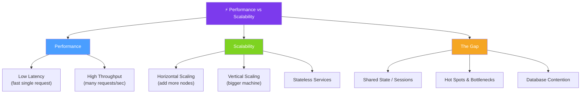

# ⚡ Performance vs Scalability — Map of Content

> [!abstract] What This Section Covers
> Performance means a system is fast for a single user; scalability means it stays fast as the number of users grows. This section unpacks the distinction, explains why a system can be performant but not scalable (and vice versa), and examines the architectural changes that close the gap — including caching, load balancing, and horizontal scaling.

## Concept Map

## Learning Path

1. [[Performance_vs_Scalability]] — Core distinction, causes of the gap, and strategies to achieve both simultaneously

## All Notes at a Glance

| Note | Summary | Difficulty |
|------|---------|------------|
| [[Performance_vs_Scalability]] | Explains the difference between performance and scalability, common bottlenecks, and solutions | Intermediate |

## Key Questions This Section Answers

- What is the precise difference between a "performant" system and a "scalable" system?
- Can a system be fast for one user but slow for many — and why?
- Can a system be scalable but still have high latency per request?
- What architectural patterns (stateless design, caching, sharding) enable both performance and scalability?
- How do shared mutable state and hot spots destroy scalability even in otherwise well-designed systems?
- What metrics do you use to measure whether a system is scaling correctly?

## Related Sections

- [[_MOC_SystemDesign_Master|↑ System Design Master MOC]]
- [[_MOC_Introduction|← Introduction]]
- [[_MOC_LatencyVsThroughput|→ Latency vs Throughput]]
- [[_MOC_LoadBalancers|→ Load Balancers]]
- [[_MOC_Caching|→ Caching]]

#MOC #SystemDesign #PerformanceVsScalability
