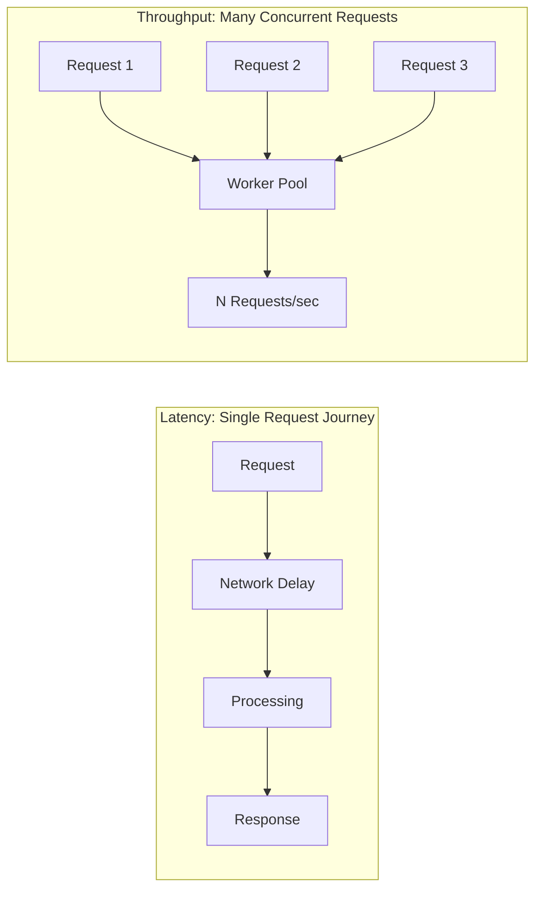

# ⏱️ Latency vs Throughput

> [!abstract] TL;DR
> Latency is the time a single request takes to complete, while throughput is the number of requests a system can process per unit time — good systems maximize throughput while keeping latency acceptable.

## 🧠 Core Idea

**Latency** and **Throughput** are two fundamental performance metrics used to evaluate how a system behaves under load.

> **Latency** = Time taken to process a **single request**.  
> **Throughput** = Number of **requests processed per unit time**.

A well-designed system aims for:

> **Maximum Throughput with Acceptable Latency**

---

```handwritten-ink
{
	"versionAtEmbed": "0.3.4",
	"filepath": "Ink/Writing/2026.2.15 - 22.06pm.writing"
}
```

## 📖 Definitions

### ⏳ Latency
- Measures **response time** of a system.
- Typically measured in milliseconds (ms).
- Includes:
  - Network delay
  - Processing time
  - Queueing time
  - Disk I/O delay

> High latency means users experience slow responses.

---

### 🚀 Throughput
- Measures **work completed per unit time**.
- Common units:
  - Requests per second (RPS)
  - Transactions per second (TPS)
  - Messages per second

> High throughput means the system can handle many requests concurrently.

---

## 🔍 Practical Distinction

| Scenario | Observation | Issue |
|----------|-------------|-------|
| Single user request takes long time | High Latency | Performance problem |
| Many users cause slowdown | Low Throughput | Scalability bottleneck |
| Fast single response + handles many users | Low Latency + High Throughput | Ideal system |

---

## 🧩 Examples

### ❌ High Latency System
- Request takes 3 seconds to respond.
- Root cause: slow database query or remote API call.

### ❌ Low Throughput System
- Each request is fast.
- But system crashes or slows when many users connect.
- Root cause: limited worker threads or unscaled services.

### ✅ Good System
- Responds quickly.
- Handles many concurrent requests efficiently.

---

## ⚖️ Relationship

Reducing Latency → Improves user experience
Increasing Throughput → Improves system capacity
``

Trade-off:
- Optimizing throughput may increase latency due to batching or queueing.
- Optimizing latency may reduce throughput due to resource reservation.



---

## 📊 Conceptual Visualization

### Latency Focus
Single Request → Faster Response

### Throughput Focus

More Requests → More Completed Work per Second

---

## 🖼️ Diagram Placeholders

Add these images into your Obsidian vault:

```
![[latency-vs-throughput-graph.png]]
![[queueing-latency-diagram.png]]
```

---

## 🧠 Why This Matters in System Design

- User-facing systems prioritize **low latency**.
- Batch and data-processing systems prioritize **high throughput**.
- Large-scale systems must balance both based on workload type.

---

## 🔗 Related Topics

[[Performance vs Scalability]]  
[[Load Balancing]]  
[[Caching]]  
[[Queueing Systems]]  
[[Bottlenecks]]  
[[Capacity Estimation]]

---

## Related Concepts

- [[_MOC_LatencyVsThroughput|↑ Section MOC]]
- [[Performance_vs_Scalability]] — broader view of system speed vs growth capacity
- [[Caching]] — the most direct way to reduce latency by avoiding repeated work
- [[Load_Balancers]] — distribute requests to improve both latency and throughput
- [[Message_Queues]] — increase throughput by decoupling producers from consumers
- [[Task_Queues]] — offload work to increase API throughput
- [[Database_Replication]] — scale read throughput by distributing queries across replicas

---

## Review Questions

1. A real-time multiplayer game requires smooth gameplay for players. Would you optimize for low latency or high throughput, and what trade-offs does that choice force on your infrastructure?
2. Your API has 50ms latency per request but processes only 20 requests per second. A competitor achieves 200ms latency but 2,000 RPS. For which use cases is each system better suited?
3. Adding batch processing to your data pipeline reduces latency spikes but lowers per-request throughput. Explain this trade-off and describe a scenario where you would accept it.

---

## 📚 Sources

- CS.fyi — *Latency vs Throughput*  
  https://cs.fyi/guide/latency-vs-throughput

- Cadence Blog — *Understanding Latency vs Throughput*  
  https://community.cadence.com/cadence_blogs_8/b/fv/posts/understanding-latency-vs-throughput

---

## 🏷️ Tags

```
#SystemDesign #Latency #Throughput #Performance
```
