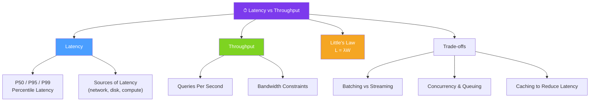

# ⏱ Latency vs Throughput — Map of Content

> [!abstract] What This Section Covers
> Latency is the time a single request takes from start to finish. Throughput is the number of requests a system can handle per unit of time. This section examines why these two metrics often pull in opposite directions, introduces Little's Law as the connecting formula, and covers the practical trade-offs engineers navigate when tuning systems for one versus the other.

## Concept Map

## Learning Path

1. [[Latency_vs_Throughput]] — Definitions, Little's Law, the latency/throughput tension, and design strategies

## All Notes at a Glance

| Note | Summary | Difficulty |
|------|---------|------------|
| [[Latency_vs_Throughput]] | Explains latency and throughput, introduces Little's Law, and covers the fundamental tension between the two | Beginner |

## Key Questions This Section Answers

- What is the difference between latency and throughput?
- Why does optimizing for lower latency sometimes reduce throughput (and vice versa)?
- What is Little's Law (L = λW) and how do you apply it to capacity planning?
- What is the difference between mean latency and P99 latency, and why does P99 matter?
- How does batching increase throughput while increasing individual request latency?
- What are the dominant sources of latency in a distributed system (network RTT, serialization, disk I/O)?
- How do you set latency and throughput targets for a system design interview?

## Related Sections

- [[_MOC_SystemDesign_Master|↑ System Design Master MOC]]
- [[_MOC_Introduction|← Introduction]]
- [[_MOC_PerformanceVsScalability|← Performance vs Scalability]]
- [[_MOC_AvailabilityPatterns|→ Availability Patterns]]

#MOC #SystemDesign #LatencyVsThroughput
