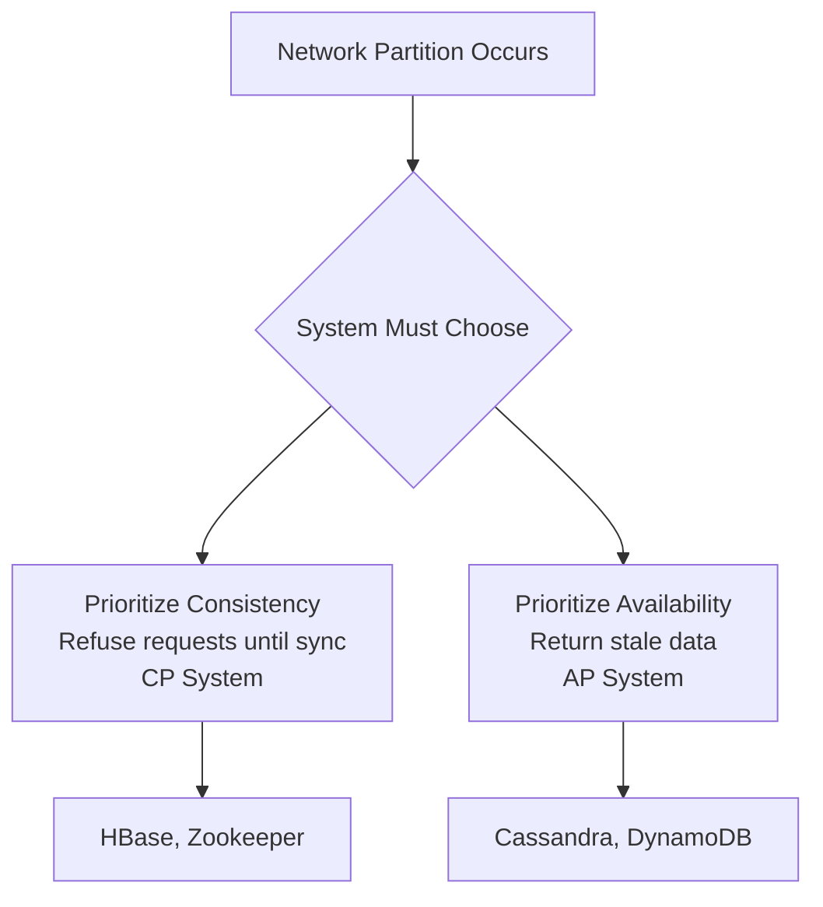

# 🔄 Availability vs Consistency

> [!abstract] TL;DR
> In distributed systems, availability (always responding) and consistency (always showing the latest data) cannot both be fully guaranteed during network failures — the CAP Theorem formalizes this fundamental trade-off.

## 🧠 Core Idea

In distributed systems, **Availability** and **Consistency** are two fundamental but often competing properties.

> **Availability** = The system continues to respond to requests even in the presence of failures.  
> **Consistency** = All clients see the **same data at the same time**.

In real-world distributed systems, improving one often impacts the other.

---

## 📖 Definitions

### 🌐 Availability
- The ability of a system to remain **operational and responsive**.
- Measured as **uptime percentage** (e.g., 99.9%, 99.99%).
- A highly available system:
  - Responds to requests even if some nodes fail.
  - Avoids single points of failure.

> If a system is available, it always returns a response — even if the data might be slightly outdated.

---

### 🧩 Consistency
- Ensures **all users see the same data** at the same time.
- Prevents conflicting or stale reads.
- Critical for:
  - Banking systems
  - Inventory systems
  - Financial transactions

> If a system is consistent, every read reflects the most recent write.

---

## ⚖️ The Trade-off

In distributed systems, it is often impossible to achieve both perfect availability and perfect consistency during network failures.

- Systems prioritizing **Availability** may return **stale data**.
- Systems prioritizing **Consistency** may become **temporarily unavailable**.

This trade-off is formalized by the **CAP Theorem**.

---

## 🧠 CAP Theorem Connection

CAP states that in the presence of a **network partition**, a distributed system must choose between:

- **C** → Consistency  
- **A** → Availability  
- **P** → Partition Tolerance (mandatory in distributed systems)

Since partitions are unavoidable, systems must choose between **Consistency** and **Availability**.

---

## 🧩 System Types

| System Type | Behavior | Examples |
|-------------|----------|----------|
| **CP (Consistent + Partition Tolerant)** | May reject requests during failures to preserve consistency | HBase, Zookeeper |
| **AP (Available + Partition Tolerant)** | Always responds but may return stale data | Cassandra, DynamoDB |
| **CA (Consistent + Available)** | Works only when no partitions occur | Traditional single-node DBs |

---

## 🔍 Practical Example

### Banking System (Consistency Priority)
- Must show correct account balance.
- During network issue → system may deny access.
- **Chooses Consistency over Availability.**

### Social Media Feed (Availability Priority)
- Slightly outdated posts acceptable.
- Must always load feed.
- **Chooses Availability over Consistency.**

---

## Mermaid Diagram



---

## 🖼️ Diagram Placeholder

Add this image to your Obsidian vault:

```
![[availability-vs-consistency-cap.png]]
```

---

## 🧠 Why This Matters in System Design

- Helps decide database technologies.
- Guides replication strategy.
- Determines user experience during failures.
- Critical for defining non-functional requirements.

---

## 🔗 Related Topics

[[CAP Theorem]]  
[[Replication]]  
[[Consensus Algorithms]]  
[[Distributed Systems]]  
[[Fault Tolerance]]  
[[Reliability]]

---

## Related Concepts

- [[_MOC_AvailabilityVsConsistency|↑ Section MOC]]
- [[CAP_Theorem]] — the formal proof that formalizes this trade-off
- [[Consistency_Patterns]] — concrete models (strong, weak, eventual) for data visibility
- [[Replication]] — the mechanism that introduces the consistency vs availability tension
- [[Failover]] — how availability patterns respond to failures
- [[Database_Replication]] — where CP vs AP choices shape database architecture
- [[Databases]] — where the C vs A decision directly influences technology selection

---

## Review Questions

1. You're building an inventory system for an online flash sale. Would you prioritize availability or consistency for stock counts, and how would you mitigate the risks of whichever you sacrifice?
2. After a network partition heals in a CP system, nodes must reconcile diverged state. Describe the reconciliation process and at least two potential issues that could arise.
3. A distributed cache returns stale data 0.1% of the time due to replication lag. Is this a formal consistency violation? Which CAP system type does this represent, and is it acceptable in a user-facing checkout flow?

---

## 📚 Sources

- CAP FAQ — Henry Robinson  
  https://github.com/henryr/cap-faq

- CAP Theorem Revisited — Robert Greiner  
  https://robertgreiner.com/cap-theorem-revisited/

- A Plain English Introduction to CAP — ksat.me  
  http://ksat.me/a-plain-english-introduction-to-cap-theorem

---

## 🏷️ Tags

```
#SystemDesign #CAPTheorem #Availability #Consistency #DistributedSystems
```
